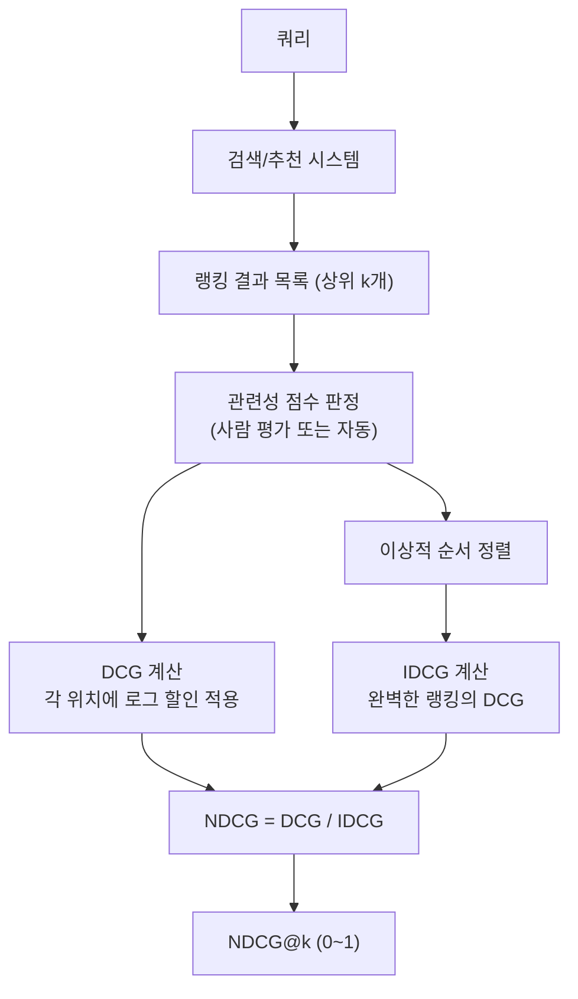

# NDCG (Normalized Discounted Cumulative Gain)

NDCG (Normalized Discounted Cumulative Gain, 정규화 할인 누적 이득)는 정보 검색(Information Retrieval) 및 추천 시스템에서 **랭킹 품질**을 평가하는 지표다. 단순히 관련 문서가 포함되어 있는지를 넘어, **얼마나 높은 위치에** 관련 문서가 랭크되었는지를 측정한다. 검색 엔진, 추천 시스템, RAG 파이프라인 평가의 표준 지표로 널리 사용된다.

## 핵심 아이디어

### 두 가지 핵심 원칙

NDCG는 두 가지 직관적 원칙을 수식화한다:

1. **관련성이 높을수록 좋다**: 관련성(relevance) 점수가 높은 문서가 더 많이 포함될수록 좋다
2. **순위가 높을수록 좋다**: 관련 문서가 결과 목록의 앞쪽에 위치할수록 더 가치 있다 (사용자는 앞부분부터 본다)

### 랭킹 평가가 왜 중요한가

검색 결과에서 첫 번째 위치의 문서는 열 번째 문서보다 훨씬 더 많이 클릭된다. 따라서 "관련 문서를 반환했는가"뿐만 아니라 "관련 문서를 앞에 배치했는가"를 평가해야 한다.

```
시스템 A 결과: [관련★★★, 비관련, 비관련, 관련★, 비관련]
시스템 B 결과: [비관련, 비관련, 관련★★★, 비관련, 관련★]

같은 문서를 반환했지만 시스템 A가 훨씬 우수함 -> NDCG가 이를 포착
```

## 수식과 계산 과정

### 1단계: 누적 이득 (CG, Cumulative Gain)

관련성 점수를 단순 합산한다. 순서를 고려하지 않는다.

$$CG_k = \sum_{i=1}^{k} rel_i$$

여기서 $rel_i$는 위치 $i$에 있는 문서의 관련성 점수다.

### 2단계: 할인 누적 이득 (DCG, Discounted Cumulative Gain)

위치가 뒤로 갈수록 로그 함수로 할인(discount)을 적용한다.

$$DCG_k = \sum_{i=1}^{k} \frac{rel_i}{\log_2(i + 1)}$$

또는 관련성을 지수 형태로 강조하는 변형:

$$DCG_k = \sum_{i=1}^{k} \frac{2^{rel_i} - 1}{\log_2(i + 1)}$$

후자는 관련성이 높은 문서를 더 강하게 보상하며, 검색 엔진 평가에서 더 널리 사용된다.

**위치별 할인 인수:**

| 위치 $i$ | $\log_2(i+1)$ | 할인 계수 |
|---------|--------------|---------|
| 1 | 1.00 | 1.000 |
| 2 | 1.58 | 0.631 |
| 3 | 2.00 | 0.500 |
| 5 | 2.58 | 0.387 |
| 10 | 3.46 | 0.289 |

### 3단계: 이상적 DCG (IDCG, Ideal DCG)

관련성 기준으로 내림차순 정렬한 완벽한 랭킹의 DCG를 계산한다.

$$IDCG_k = \sum_{i=1}^{k} \frac{2^{rel_i^*} - 1}{\log_2(i + 1)}$$

여기서 $rel_i^*$는 이상적 순서(관련성 내림차순)로 배치했을 때 위치 $i$의 관련성 점수다.

### 4단계: 정규화 (Normalization)

$$NDCG_k = \frac{DCG_k}{IDCG_k}$$

NDCG는 항상 [0, 1] 범위이며, 1.0이 완벽한 랭킹이다. 정규화 덕분에 서로 다른 쿼리/시스템 간 비교가 가능해진다.

## 계산 흐름



위 흐름은 단일 쿼리에 대한 NDCG 계산 과정을 보여준다. 실제 평가에서는 수백~수천 개 쿼리에 대해 평균 NDCG를 계산한다.

## 구체적 계산 예시

### 예시: 5개 결과, 관련성 0~3 척도

| 위치 | 실제 관련성 | 이상적 관련성 | DCG 기여 | IDCG 기여 |
|------|------------|-------------|---------|---------|
| 1 | 3 | 3 | (2^3-1)/log2(2) = 7.00 | 7.00 |
| 2 | 2 | 3 | (2^2-1)/log2(3) = 1.89 | (2^3-1)/log2(3) = 4.42 |
| 3 | 3 | 2 | (2^3-1)/log2(4) = 3.50 | (2^2-1)/log2(4) = 1.50 |
| 4 | 0 | 2 | (2^0-1)/log2(5) = 0.00 | (2^2-1)/log2(5) = 1.29 |
| 5 | 1 | 1 | (2^1-1)/log2(6) = 0.39 | (2^1-1)/log2(6) = 0.39 |

$$DCG_5 = 7.00 + 1.89 + 3.50 + 0.00 + 0.39 = 12.78$$
$$IDCG_5 = 7.00 + 4.42 + 1.50 + 1.29 + 0.39 = 14.60$$
$$NDCG_5 = 12.78 / 14.60 = 0.876$$

## 파이썬 구현

```python
import numpy as np
from sklearn.metrics import ndcg_score

# sklearn 사용 (가장 간편)
true_relevance = np.array([[3, 2, 3, 0, 1]])  # 이상적 관련성
scores = np.array([[0.9, 0.7, 0.85, 0.2, 0.5]])  # 시스템 점수

ndcg = ndcg_score(true_relevance, scores, k=5)
print(f"NDCG@5: {ndcg:.4f}")

# 직접 구현
def dcg_at_k(relevances: list[float], k: int) -> float:
    """상위 k개 결과의 DCG를 계산한다."""
    relevances = relevances[:k]
    gains = [(2 ** rel - 1) / np.log2(i + 2) for i, rel in enumerate(relevances)]
    return sum(gains)

def ndcg_at_k(actual: list[float], k: int) -> float:
    """NDCG@k를 계산한다."""
    dcg = dcg_at_k(actual, k)
    ideal = sorted(actual, reverse=True)
    idcg = dcg_at_k(ideal, k)
    if idcg == 0:
        return 0.0
    return dcg / idcg

# 사용 예시
actual_relevance = [3, 2, 3, 0, 1]
print(f"NDCG@5 (직접): {ndcg_at_k(actual_relevance, k=5):.4f}")
print(f"NDCG@3 (직접): {ndcg_at_k(actual_relevance, k=3):.4f}")
```

```python
# 다수 쿼리에 대한 평균 NDCG
def mean_ndcg(
    all_actual: list[list[float]],
    k: int
) -> float:
    """여러 쿼리에 대한 평균 NDCG@k를 계산한다."""
    scores = [ndcg_at_k(actual, k) for actual in all_actual]
    return sum(scores) / len(scores)

queries_results = [
    [3, 2, 1, 0, 0],  # 쿼리 1의 관련성 점수
    [2, 0, 3, 1, 0],  # 쿼리 2의 관련성 점수
    [0, 3, 2, 0, 1],  # 쿼리 3의 관련성 점수
]
print(f"평균 NDCG@5: {mean_ndcg(queries_results, k=5):.4f}")
```

## k 값의 선택

NDCG@k는 상위 k개 결과만을 평가하며, k 선택은 사용 목적에 따라 다르다.

| k 값 | 사용 상황 |
|------|---------|
| @1 | 최상위 결과만 중요 (QA 시스템, 스니펫 생성) |
| @3 | 상위 결과 일부 (음성 검색, 강조 결과) |
| @5 | 첫 페이지 절반 (Web 검색 기본) |
| @10 | 첫 페이지 전체 (검색 엔진 표준 평가) |
| @100 | 전체 랭킹 품질 (학술 평가) |

## 관련 지표와 비교

| 지표 | 측정 내용 | 관련성 척도 | 위치 민감도 |
|------|----------|-----------|-----------|
| Precision@k | 상위 k개 중 관련 비율 | 이진 (0/1) | 없음 |
| Recall@k | 전체 관련 문서 중 상위 k개 포함 비율 | 이진 | 없음 |
| [[mrr-metric\|MRR]] | 첫 번째 관련 문서 위치 | 이진 | 첫 번째만 |
| AP (Average Precision) | 위치별 정밀도 평균 | 이진 | 있음 |
| **NDCG** | 위치 가중 이득의 정규화 | **다등급 (0~n)** | **강함** |

NDCG의 핵심 장점은 **이진(binary)이 아닌 다등급(graded) 관련성**을 처리할 수 있다는 점이다. 검색 결과가 "관련/비관련"이 아니라 "매우 관련/관련/약간 관련/비관련" 같은 등급을 가질 때 NDCG가 적합하다.

## 실무 활용

### RAG 시스템 평가

RAG (Retrieval Augmented Generation) 파이프라인에서 검색 단계를 평가할 때 NDCG를 활용한다.

```python
from ragas.metrics import context_recall, context_precision
# RAG 시스템의 검색 단계 평가

# 커스텀 NDCG 기반 RAG 검색 평가
def evaluate_rag_retrieval(
    queries: list[str],
    retrieved_docs: list[list[str]],
    ground_truth_docs: list[list[str]],
    k: int = 5
) -> float:
    """RAG 검색 단계의 NDCG@k를 계산한다."""
    ndcg_scores = []
    for retrieved, gt in zip(retrieved_docs, ground_truth_docs):
        relevances = [1 if doc in gt else 0 for doc in retrieved[:k]]
        ndcg_scores.append(ndcg_at_k(relevances, k))
    return sum(ndcg_scores) / len(ndcg_scores)
```

### 추천 시스템 평가

[[recommendation-systems-dl|딥러닝 추천 시스템]]에서도 NDCG는 핵심 오프라인 평가 지표다.

```python
# 추천 시스템 평가 예시
def evaluate_recommendations(
    user_actual_items: dict[str, list[str]],  # 사용자별 실제 상호작용 아이템
    user_recommended: dict[str, list[str]],   # 사용자별 추천 아이템
    k: int = 10
) -> float:
    """추천 시스템의 NDCG@k를 계산한다."""
    scores = []
    for user_id, actual in user_actual_items.items():
        recommended = user_recommended.get(user_id, [])
        relevances = [1 if item in actual else 0 for item in recommended[:k]]
        scores.append(ndcg_at_k(relevances, k))
    return sum(scores) / len(scores)
```

### LLM 기반 검색 증강 평가

LLM 출력을 기반으로 검색 품질을 평가하는 현대적 접근:

```python
# LLM 기반 관련성 점수를 활용한 NDCG
# (이진 레이블 대신 LLM이 0~3 관련성 점수를 매김)
from openai import OpenAI

def llm_relevance_score(query: str, document: str) -> int:
    """LLM으로 쿼리-문서 관련성을 0~3 척도로 평가한다."""
    client = OpenAI()
    prompt = f"""다음 쿼리와 문서의 관련성을 0~3 척도로 평가하라.
0: 전혀 관련 없음
1: 약간 관련
2: 관련
3: 매우 관련

쿼리: {query}
문서: {document}

숫자만 출력하라:"""
    response = client.chat.completions.create(
        model="gpt-4o-mini",
        messages=[{"role": "user", "content": prompt}]
    )
    return int(response.choices[0].message.content.strip())
```

## 강점과 한계

### 강점

- **위치 민감**: 관련 문서의 순위를 직접 측정
- **다등급 관련성**: 이진 레이블보다 세밀한 평가 가능
- **정규화**: [0, 1] 범위로 서로 다른 쿼리/시스템 비교 용이
- **사용자 행동 반영**: 로그 할인이 사용자의 상위 결과 선호를 반영
- **표준화**: 검색, 추천, IR 분야의 광범위한 채택

### 한계

- **관련성 레이블 필요**: 다등급 관련성 판정에 인간 평가가 필요
- **k 의존성**: k 선택에 따라 결과가 달라짐
- **위치 외 요인 무시**: 다양성(diversity), 신선도, 개인화 등을 측정하지 않음
- **절대 기준 없음**: NDCG 0.8이 충분히 좋은지 도메인마다 다름

## 관련 문서

- [[mrr-metric]] - 첫 번째 관련 결과 위치 측정 지표
- [[ai-evaluation]] - AI 시스템 평가 방법론
- [[recommendation-systems-dl]] - 딥러닝 추천 시스템
- [[advanced-rag-patterns]] - RAG 파이프라인 고급 패턴
