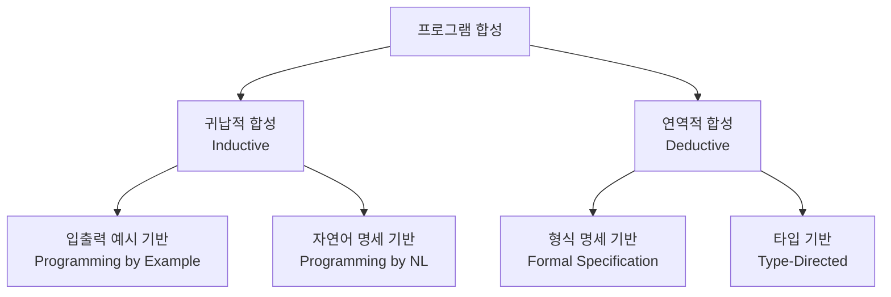
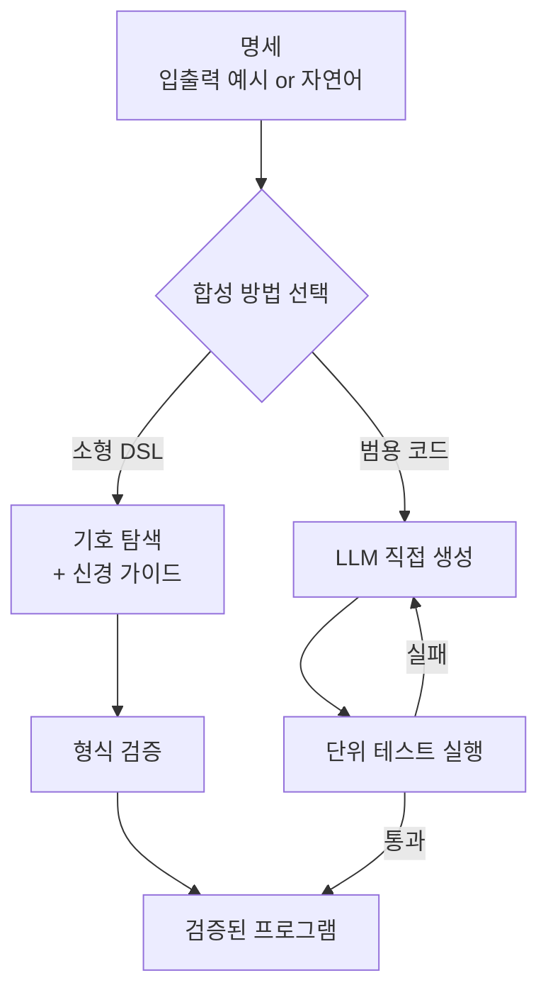

# 신경 프로그램 합성 (Neural Program Synthesis)

## 개념 요약

신경 프로그램 합성(Neural Program Synthesis)은 입출력 예시(input-output examples)나 자연어 명세(natural language specification)로부터 올바른 프로그램을 자동 생성하는 기술이다. 전통적인 기호 탐색(symbolic search) 기반 프로그램 합성에 신경망의 학습 능력을 결합하여, 탐색 공간 축소와 일반화 능력을 개선한다.

대표적인 응용 사례: Excel 수식 자동 생성(FlashFill), SQL 쿼리 생성, 코드 자동 완성, 로봇 시연에서 프로그램 추론.

## 프로그램 합성의 두 패러다임

신경망은 주로 귀납적 합성(Inductive Program Synthesis)에 활용된다. 몇 가지 입출력 쌍으로부터 일반화된 프로그램을 유추하는 것이다.

## 핵심 접근법

### 1. 신경 가이드 탐색 (Neural-Guided Search)

프로그램 공간을 탐색할 때 신경망이 탐색 방향을 안내한다.

- **DeepCoder (Balog et al., 2017)**: LSTM이 입출력 예시를 보고 어떤 DSL(Domain-Specific Language) 함수를 사용할지 확률 예측 → 순위 높은 함수 조합만 탐색
- **RobustFill**: 시퀀스-투-시퀀스 모델로 문자열 변환 프로그램 직접 생성

### 2. 직접 생성 (Direct Generation with LLM)

[[code-generation-llm]]의 발전과 함께 LLM이 프로그램을 직접 생성하는 방식이 주류가 되었다. GPT-4, Claude, Codex 등은 자연어 설명과 예시를 입력받아 코드를 바로 생성한다.

[[transformer-architecture]] 기반 LLM이 수십억 개의 코드 토큰으로 사전학습되어 암묵적으로 프로그램 합성 능력을 획득했다고 볼 수 있다.

### 3. 프로그램 실행 유도 (Execution-Guided)

생성된 프로그램을 실제 실행하고 그 결과를 피드백으로 사용:

- **RLEF (Reinforcement Learning from Execution Feedback)**: 프로그램 실행 결과가 예시와 일치하면 양의 보상
- **Self-debug**: LLM이 실행 오류를 보고 스스로 수정

### 4. DSL 기반 합성

범용 프로그래밍 언어 대신 도메인 특화 언어(DSL)를 타겟으로 설정해 탐색 공간을 크게 줄인다.

- Excel FlashFill: 문자열 조작 DSL
- 데이터 과학: Pandas 연산 시퀀스
- SQL: 관계 대수 표현

## 평가 지표

| 지표 | 설명 |
|------|------|
| 정확도@k | k번 시도 안에 정답 프로그램 생성 확률 |
| 테스트 케이스 통과율 | HumanEval, MBPP 기준 |
| 일반화 성능 | 학습에 없던 입출력 예시에서의 정확도 |

## LLM 시대의 프로그램 합성

LLM 등장 이후 전통적 프로그램 합성의 경계가 흐려졌다:

- 소규모 DSL 합성: 여전히 형식 검증 + 탐색 우위
- 범용 코드 생성: LLM이 사실상 통합
- 복잡한 알고리즘 도출: AlphaCode, o1/o3 모델의 추론 능력이 새 기준

중요한 차이점은 **검증 가능성**이다. 합성된 프로그램은 명세(입출력 예시)에 대해 자동 검증이 가능하지만, LLM의 일반 코드 생성은 반드시 테스트를 통해 검증해야 한다.

## 한계와 과제

- **복합 프로그램**: 여러 함수를 조합하는 복잡한 논리는 여전히 어려움
- **상태 관리**: 루프, 재귀 등 상태 변이를 포함하는 프로그램 합성
- **효율성**: 올바른 프로그램을 합성해도 비효율적인 구현일 수 있음

## 관련 문서

- [[code-generation-llm]] - LLM 기반 코드 생성의 전체 스펙트럼
- [[transformer-architecture]] - 프로그램 합성 LLM의 핵심 구조
- [[reinforcement-learning]] - 실행 피드백 기반 강화학습 접근
