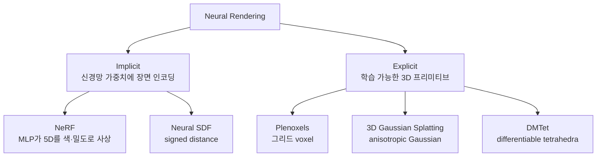

# Neural Rendering

신경망으로 3D 장면을 표현하고 렌더링하는 분야. 전통적 컴퓨터 그래픽스(메시·텍스처·셰이더)가 명시적 기하 표현을 사용했다면, neural rendering은 **장면을 신경망 가중치 자체에 인코딩**하거나 **학습 가능한 3D 프리미티브**로 표현해 사진실측(photorealistic) 결과를 생성한다. NeRF(2020)가 분야의 폭발적 성장을 촉발했고, 3D Gaussian Splatting(2023)이 실시간 렌더링을 가능케 했다.

## 1. 분야의 정의

Neural rendering은 다음 중 하나 이상을 포함한다:

- **3D reconstruction**: 다수 시점 사진에서 3D 형상 복원
- **Novel view synthesis**: 학습되지 않은 새 시점에서의 렌더링
- **Inverse rendering**: 빛·재질·기하를 동시에 추정
- **Differentiable rendering**: 렌더링 과정을 미분 가능하게 만들어 그래디언트 기반 학습 가능
- **Avatar / human / volumetric video**: 동적 객체의 3D 표현

## 2. 두 패러다임 — Implicit vs Explicit

| 패러다임 | 대표 | 장점 | 단점 |
|---------|------|------|------|
| Implicit (NeRF) | MLP가 좌표→색·밀도 함수 | 무한 해상도, 메모리 효율 | 학습·렌더링 느림 |
| Explicit (3DGS) | Gaussian primitive 수백만 개 | 실시간 렌더링 (≥100 fps) | 메모리 큼, 미분 가능성 제한적 |

## 3. NeRF — 분야의 분기점

Mildenhall et al.(UC Berkeley·Google·UCSD, ECCV 2020 Best Paper Honorable Mention).

> "The method represents scenes using a fully-connected neural network that takes a 5D coordinate as input (3D spatial location plus 2D viewing direction) and outputs volume density and view-dependent radiance."
> — matthewtancik.com/nerf

핵심:

- **MLP**: $(x, y, z, \theta, \phi) \rightarrow (r, g, b, \sigma)$ — 위치 + 시점 방향에서 색과 밀도 출력
- **Volumetric rendering**: 카메라 ray를 따라 점 샘플 → 밀도 가중 합산으로 픽셀 색 계산
- **Positional encoding**: 좌표를 고주파 sinusoidal로 인코딩해 세부 표현 가능
- **Per-scene training**: 한 장면당 MLP 하나 학습 (수십 분~몇 시간)

후속: mip-NeRF(다중 해상도), NeRF-W(in-the-wild), Instant-NGP(빠른 학습), Plenoxels(MLP 제거), 등.

## 4. 3D Gaussian Splatting — 실시간 시대

Kerbl, Kopanas, Leimkühler, Drettakis (Inria, SIGGRAPH 2023, ACM TOG).

> "3D Gaussians that preserve desirable properties of continuous volumetric radiance fields ... high-quality real-time (≥ 100 fps) novel-view synthesis at 1080p resolution."
> — Kerbl et al. 2023

핵심:

- **Explicit 표현**: 장면을 수십만~수백만 개 anisotropic 3D Gaussian으로 표현. 각 Gaussian은 위치·공분산·색·불투명도 학습
- **Differentiable rasterization**: 타일 기반 GPU rasterization으로 백워드도 빠름
- **Visibility-aware**: 빈 공간 계산 회피로 효율 극대화
- **NeRF 대비**: 비슷한 화질을 1000배 빠른 추론 속도로 달성

후속: [[4d-gaussian-splatting|4D Gaussian Splatting]](시간축 추가), Dynamic 3DGS, GaussianAvatars, [[3d-gaussian-splatting|3DGS]] 변형 다수.

## 5. 주요 응용

| 응용 | 설명 | 예시 |
|------|------|------|
| **VR/AR 콘텐츠** | 실세계 장면을 immersive 공간으로 | Apple Vision Pro 환경 |
| **디지털 휴먼·아바타** | 몇 장 사진으로 사실적 [[3d-avatar|아바타]] 생성 | Codec Avatars, Gaussian Avatars |
| **영화 VFX·게임** | 전통 워크플로 보완·대체 | Unreal Engine NeRF 통합 |
| **로보틱스 시뮬레이션** | 실제 환경을 학습된 3D로 옮겨 정책 학습 | sim-to-real |
| **문화재 디지털 보존** | 박물관·유적지 3D 아카이빙 | Google Arts & Culture |
| **자율주행** | 도시 환경 reconstruction → simulation | Waymo Block-NeRF |
| **e-commerce** | 제품 360도 view, AR try-on | Amazon, Shopify |

## 6. 생성 모델과의 융합

Neural rendering은 [[diffusion-models|diffusion]]·[[generative-models|generative]] 모델과 결합해 **3D 생성**으로 진화했다.

- **DreamFusion (2022)**: 2D diffusion으로 NeRF를 distill해 텍스트→3D
- **Magic3D / Score Distillation Sampling**: 빠른 텍스트→3D
- **Zero-1-to-3**: 단일 이미지에서 다시점 생성
- **Gaussian Editor / DreamGaussian**: 3DGS + diffusion 결합으로 빠른 생성·편집
- **Video diffusion + Neural rendering**: 시간적 일관성 있는 동영상 생성

## 7. 왜 중요한가 — 실무 관점

- **CAD 외 새로운 콘텐츠 파이프라인**: 사진 몇 장으로 3D 자산 생성, 모델러 의존도 감소
- **VFX·게임 비용**: 환경 캡처 비용을 수십~수백 배 절감하는 사례 등장
- **하드웨어 친화**: 3DGS는 일반 GPU에서 실시간 가능 → 모바일·웹 배포 현실화
- **AI agent 환경**: 로봇·임베디드 AI의 **realistic simulation 환경** 생성 도구로 부상
- **표준화 진행**: glTF Neural Rendering Extension 등 포맷 표준화 논의 [교차검증 필요]

## 8. 한계와 도전

- **메모리**: 큰 장면에서 3DGS는 GB 단위 저장 — streaming·compression 연구 활발
- **편집성**: 학습된 표현은 직관적 편집이 어렵다 (메시 대비) → 시맨틱 편집 연구
- **Dynamic scene**: 정적 장면 대비 시간축 처리는 여전히 어렵다 → [[4d-gaussian-splatting|4D 변형]]
- **물리 일관성**: 빛·재질 분리(inverse rendering)가 잘 안 됨 → 재조명·재질 변경 어려움
- **에너지·환경**: 학습 비용이 NeRF는 여전히 높다, 3DGS도 large scene에선 부담

## 관련 문서

- [[nerf-neural-radiance-fields]] — NeRF 상세
- [[mip-nerf]] — anti-aliasing 후속
- [[gaussian-splatting]] — 3DGS hub
- [[3d-gaussian-splatting]] — 3DGS 상세
- [[3dgs-3d-gaussian-splatting]] — 동일 주제 보충
- [[4d-gaussian-splatting]] — 시간축 확장
- [[3d-avatar]] — 아바타 응용
- [[diffusion-models]] — 3D 생성과의 융합
- [[generative-models]] — 생성 모델 일반론
- [[clip]] — 텍스트-3D 결합에 자주 사용
- [[masked-image-modeling]] — 자기지도 표현 학습
