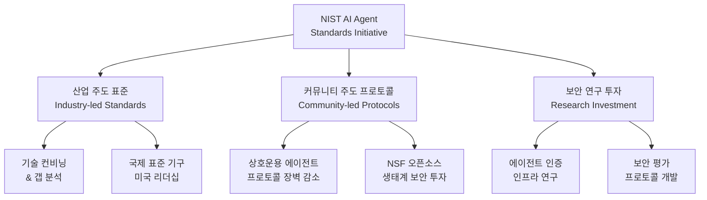
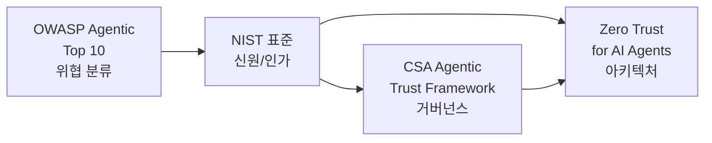

# NIST AI Agent Standards Initiative

## 정의

**NIST AI Agent Standards Initiative**는 2026년 2월 NIST의 Center for AI Standards and Innovation(CAISI)이 발족한 AI 에이전트 표준화 이니셔티브다. 핵심 목표는 자율 AI 에이전트가 **신뢰할 수 있고(trusted), 상호운용 가능하며(interoperable), 안전하게(secure)** 디지털 생태계에서 동작할 수 있도록 하는 것이다.

## 왜 지금 중요한가

상호운용성 표준이 없으면 혁신자들은 "파편화된 생태계와 정체된 채택(fragmented ecosystem and stunted adoption)"에 직면한다. 에이전트가 도구를 호출하고 다른 에이전트와 통신할 때 **누가 이 에이전트인지(identity)**, **무엇을 할 수 있는지(authorization)** 에 대한 표준이 없으면, [[owasp-agentic-top-10|OWASP Agentic Top 10]]의 ASI-03(Identity Abuse)과 ASI-07(Insecure Inter-Agent Communication)이 구조적으로 발생한다.

## 3대 전략 축

### 축 1: 산업 주도 표준 개발

NIST가 기술 컨비닝과 갭 분석을 촉진하여 자발적 가이드라인을 개발한다. NSF를 포함한 부처간 파트너와 협력하며, 국제 표준 기구에서 미국 리더십을 유지하는 것이 목표다.

### 축 2: 커뮤니티 주도 프로토콜

상호운용 가능한 에이전트 프로토콜의 장벽을 식별하고 감소시킨다. NSF는 "Pathways to Enable Secure Open-Source Ecosystems" 프로그램을 통해 오픈소스 에이전트 프로토콜 생태계의 개발과 보안에 투자한다.

### 축 3: 보안 연구 투자

에이전트 인증과 신원 인프라에 대한 기초 연구를 수행하고, 프로토콜 개발과 소비자 비교에 활용할 보안 평가를 개발한다.

## 핵심 초점 영역

### 에이전트 신원과 인가 (Identity & Authorization)

NIST의 Information Technology Laboratory(ITL)가 에이전트 신원과 인가 프레임워크의 개념을 개발 중이다. National Cybersecurity Center of Excellence(NCCoE) 프로젝트가 기업 에이전트 사용 사례에 신원 표준을 적용한다.

핵심 질문:
- 에이전트의 디지털 신원을 어떻게 발급하고 관리하는가?
- 에이전트 간 위임(delegation)의 범위와 만료를 어떻게 규정하는가?
- 비인간 신원(NHI)의 수명주기를 어떻게 자동 관리하는가?

### 보안

CAISI가 AI 에이전트 보안에 관한 Request for Information(RFI)을 발행하여, 위협과 완화에 대한 생태계 관점을 수집한다.

### 산업별 채택

헬스케어, 금융, 교육 분야를 대상으로 한 리스닝 세션이 계획되어, AI 에이전트 채택의 구체적 장벽을 파악한다.

## 타임라인

| 일정 | 내용 |
|---|---|
| 2026년 2월 | 이니셔티브 발족 발표 |
| 2026년 3월 9일 | CAISI AI 에이전트 보안 RFI 마감 |
| 2026년 3월 20일 | 산업별 리스닝 세션 등록 마감 |
| 2026년 4월 2일 | ITL 에이전트 신원/인가 개념 문서 응답 마감 |
| 2026년 4월~ | 산업별 리스닝 세션 진행 |

## 참여 기관

| 기관 | 역할 |
|---|---|
| CAISI | 이니셔티브 총괄, RFI 발행 |
| ITL | 에이전트 신원/인가 개념 개발 |
| NCCoE | 기업 사용 사례 적용 |
| NSF | 오픈소스 프로토콜 보안 투자 |

## 지정학적 맥락

이니셔티브의 배경에는 미-중 AI 표준 경쟁이 있다. 중국이 자체 AI 에이전트 프로토콜과 표준을 빠르게 발전시키는 상황에서, NIST는 글로벌 표준에서의 미국 주도권을 유지하기 위해 선제적으로 움직이고 있다.

## 에이전트 신원 문제의 구체적 과제

NIST 이니셔티브가 해결하려는 에이전트 신원 문제는 인간 사용자 IAM과 근본적으로 다르다:

| 과제 | 인간 IAM | 에이전트 IAM |
|---|---|---|
| 신원 발급 | 수동 온보딩 | 자동 프로비저닝 (수천 에이전트) |
| 수명주기 | 연 단위 | 분/시간 단위 (태스크 기반) |
| 위임 | 명시적 역할 부여 | 에이전트 간 동적 위임 체인 |
| 인증 수단 | 비밀번호/MFA/생체 | 토큰/인증서/API 키 |
| 규모 | 조직당 수천 명 | NHI 대 인간 비율 80:1 이상 |
| 감사 | 인간 행동 로그 | 비결정적 행동의 의도 추적 |

이 차이가 기존 IAM 표준(OAuth 2.0, SAML, OpenID Connect)만으로는 에이전트 환경을 커버할 수 없는 이유다. NIST는 기존 표준을 확장하되, 에이전트 고유의 요구사항(단기 자격증명, 작업 범위 권한, 위임 체인 추적)을 추가하는 방향을 택하고 있다.

## 다른 프레임워크와의 관계

NIST 표준은 **위협을 분류하는 OWASP**, **아키텍처를 규정하는 [[zero-trust-ai-agents|Zero Trust]]**, **거버넌스를 정의하는 CSA** 사이에서 **공식 표준**의 역할을 수행한다.

## 대표 자료

- [NIST 발표: AI Agent Standards Initiative](https://www.nist.gov/news-events/news/2026/02/announcing-ai-agent-standards-initiative-interoperable-and-secure)
- [NIST CAISI AI Agent Standards Initiative](https://www.nist.gov/caisi/ai-agent-standards-initiative)
- [JD Supra: NIST Launches AI Agent Standards](https://www.jdsupra.com/legalnews/nist-launches-ai-agent-standards-5596856/)

## 관련 문서

- [[owasp-agentic-top-10]] - NIST가 표준화하려는 위협의 분류 체계
- [[zero-trust-ai-agents]] - NIST 신원/인가 표준이 적용되는 아키텍처
- [[cisco-defenseclaw]] - NIST 표준을 구현하는 오픈소스 도구
- [[mcp-server-cards]] - 에이전트 프로토콜 상호운용성의 구체 사례
