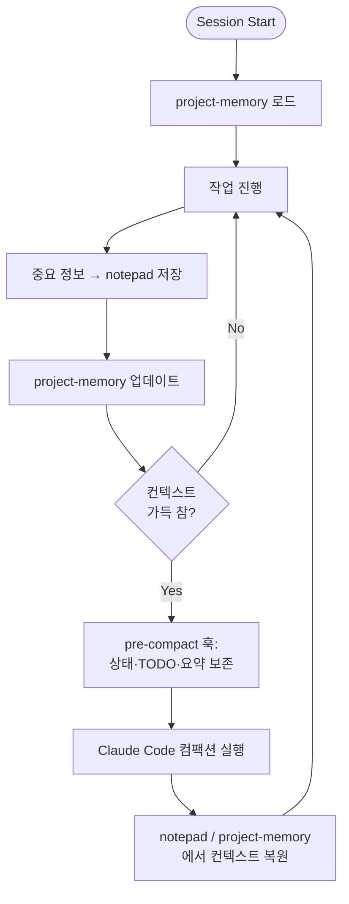

# OMC Hook System

> [[claude-code|Claude Code]]의 라이프사이클 이벤트에 Node.js 스크립트를 붙여 오케스트레이션, 상태 관리, 키워드 감지를 구현.

## 훅이란

**훅(Hook)**은 Claude Code가 발생시키는 라이프사이클 이벤트에 자동 반응하는 스크립트다. 사용자가 프롬프트를 제출하거나, 툴이 실행되거나, 세션이 시작/종료될 때 OMC 훅들이 자동 실행되어 추가 컨텍스트를 주입하고 모드를 활성화하며 상태를 관리한다.

OMC는 총 **20개+ 훅**을 등록한다.

## 훅 정의 형식

`hooks.json`:

```json
{
  "UserPromptSubmit": [
    {
      "matcher": "*",
      "hooks": [
        {
          "type": "command",
          "command": "node scripts/keyword-detector.mjs",
          "timeout": 5
        }
      ]
    }
  ]
}
```

- `EventName`: 반응할 라이프사이클 이벤트
- `matcher`: 훅을 실행할 조건 (`*`는 모든 경우)
- `command`: 실행할 Node.js 스크립트
- `timeout`: 최대 실행 시간(초)

출력은 `<system-reminder>` 태그로 Claude에 주입되며 추가 컨텍스트는 `hookSpecificOutput.additionalContext`로 전달된다.

## 11개 라이프사이클 이벤트

| 이벤트 | 발생 시점 | OMC 용도 |
|---|---|---|
| `UserPromptSubmit` | 사용자 프롬프트 제출 | 매직 키워드 감지, 스킬 주입 |
| `SessionStart` | 세션 시작 | 초기 설정, 프로젝트 메모리 로드 |
| `PreToolUse` | 툴 사용 직전 | 권한 검증, 병렬 실행 힌트 |
| `PermissionRequest` | 권한 요청 | Bash 명령 권한 처리 |
| `PostToolUse` | 툴 사용 직후 | 결과 검증, 프로젝트 메모리 업데이트 |
| `PostToolUseFailure` | 툴 실패 | 에러 복구 가이드 |
| `Sub[[coding-agent|agent]]Start` | 자식 에이전트 스폰 | 에이전트 추적 |
| `SubagentStop` | 자식 에이전트 종료 | 결과 검증 |
| `PreCompact` | 컨텍스트 컴팩션 직전 | 중요 정보 보존, 프로젝트 메모리 저장 |
| `Stop` | Claude 응답 종료 직전 | persistent-mode 유지, 코드 단순화 |
| `SessionEnd` | 세션 종료 | 세션 요약 저장, 콜백 알림 |

## 훅 카테고리

### Core Hooks (핵심)

| 훅 | 역할 |
|---|---|
| **keyword-detector** | 매직 키워드 감지 후 해당 스킬 호출 주입 |
| **persistent-mode** | ralph/autopilot/ultrawork 등이 활성일 때 Stop 이벤트를 차단하고 "The boulder never stops" 메시지 주입 |

### Context Management (컨텍스트 관리)

| 훅 | 역할 |
|---|---|
| **notepad** | `.omc/notepad.md` 기반 컴팩션 생존 메모 |
| **project-memory** | `.omc/project-memory.json` 기반 프로젝트 지식 |
| **pre-compact** | PreCompact 시 작업 상태·TODO·핵심 컨텍스트 요약 보존 |

### Quality/Verification (품질·검증)

| 훅 | 역할 |
|---|---|
| **permission-handler** | Bash 권한 요청 처리 |
| **subagent-tracker** | 자식 에이전트 시작/종료 추적, 산출물 검증 |
| **code-simplifier** | Stop 시 수정된 파일 자동 단순화 (opt-in) |

## 핵심 훅 동작

### keyword-detector

- **이벤트**: UserPromptSubmit
- **동작**:
  1. 프롬프트 sanitize (코드블록·URL·파일경로 제거 → 오발 방지)
  2. 키워드 패턴 매칭
  3. 충돌 해소 (cancel 최우선, ralph > autopilot > ultrawork 순)
  4. `<system-reminder>`로 스킬 호출 지시 주입
- **안전장치**: `OMC_TEAM_WORKER` 환경변수 설정 시 비활성 (무한 spawning 방지)

### persistent-mode

- **이벤트**: Stop
- **동작**: `.omc/state/`에서 활성 모드 상태 파일 확인. ralph/autopilot/ultrawork/ultraqa/team/pipeline 중 하나라도 active면 "The boulder never stops" 메시지 주입 → Claude가 멈추지 못하게 함
- **staleness 체크**: 2시간 이상 된 상태는 stale로 간주하고 비활성 처리 (새 세션 차단 방지)
- **알림**: 최초 Stop 시 Discord/Telegram/Slack 알림 발송 (설정 시)

> **주의**: autopilot, ralph, ultrawork, ultraqa는 **스킬**(keyword-detector로 호출)이지 훅이 아니다. persistent-mode 훅이 Stop 이벤트를 차단함으로써 이들의 지속성을 **강제**한다.

### pre-compact

- **이벤트**: PreCompact
- **동작**: 컨텍스트 윈도우가 꽉 차서 컴팩션이 발생하기 직전, 현재 작업 상태·진행 중인 TODO·핵심 컨텍스트를 요약해 notepad에 저장
- **목적**: 컴팩션 후에도 작업을 재개할 수 있게 필수 정보 유지

### code-simplifier (opt-in)

- **이벤트**: Stop
- **동작**: 기본 비활성. 활성화 시 Claude가 멈출 때 최근 수정된 파일을 자동 단순화

```jsonc
{
  "codeSimplifier": {
    "enabled": true,
    "extensions": [".ts", ".tsx", ".js", ".jsx", ".py", ".go", ".rs"],
    "maxFiles": 10
  }
}
```

## 모드 상태 파일 구조

`.omc/state/` 디렉토리에 저장되는 JSON:

```json
{
  "active": true,
  "started_at": "2025-01-15T10:30:00Z",
  "prompt": "ultrawork implement auth",
  "session_id": "abc123",
  "project_path": "/path/to/project",
  "iteration": 0,
  "max_iterations": 10,
  "linked_ultrawork": false,
  "last_checked_at": "2025-01-15T10:30:00Z"
}
```

session_id가 있으면 `.omc/state/sessions/{sessionId}/` 하위에 격리 저장된다.

## system-reminder 주입 패턴

훅이 주입하는 `<system-reminder>` 메시지의 의미:

| 패턴 | 의미 |
|---|---|
| `hook success: Success` | 정상 실행, 계속 진행 |
| `hook additional context: ...` | 추가 컨텍스트 정보 |
| `[MAGIC KEYWORD: ...]` | 매직 키워드 감지, 해당 스킬 실행 |
| `The boulder never stops` | ralph/ultrawork 등이 활성 |

## 비활성화 방법

**전체 비활성**:
```bash
export DISABLE_OMC=1
```

**특정 훅만 스킵**:
```bash
export OMC_SKIP_HOOKS="keyword-detector,persistent-mode"
```

## 컨텍스트 보존 전략

OMC의 컨텍스트 관리 훅들은 다음 전략으로 협력:



`pre-compact` 훅이 **컴팩션 직전에** 핵심 정보를 파일에 저장하고, 컴팩션 후 세션에서는 그 파일을 읽어 작업을 재개한다. Claude의 단기 기억이 초기화돼도 작업 연속성이 유지된다.

## 실무 고려사항

- **훅 타임아웃 짧게**: 5초 이내가 기본. UserPromptSubmit 훅이 느리면 전체 UX 지연
- **persistent-mode의 강력함**: Stop을 막기 때문에 **취소 방법 숙지 필수** (`cancelomc` 또는 `/oh-my-claudecode:cancel`)
- **디버깅**: `OMC_SKIP_HOOKS`로 의심 훅만 끄고 재현
- **훅이 느리면 세션 끊김**: 외부 네트워크 호출이 포함된 훅은 timeout 넉넉히 설정

## What Are Hooks? 쪽에 모인다 |
| Architecture | `raw/2026-04-09-omc-ARCHITECTURE.md` | raw snapshot | 주요 헤딩은 Overview, Agent System, Build/Analysis Lane, Review Lane이다 / 본문 단서는 > How oh-my-claudecode orchestrates multi-agent workflows.; ┌─────────────────────────────────────────────────────────────────────────┐ 쪽에 모인다 |

## 관련 문서

- [[oh-my-claudecode]]
- [[omc-magic-keyword]]
- [[omc-state-management]]
- [[omc-execution-modes]]
