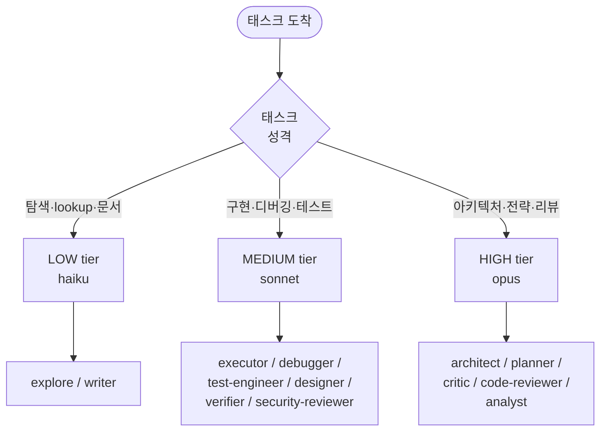

# OMC Model Routing (모델 라우팅)

> 태스크 복잡도에 맞춰 Haiku/Sonnet/Opus 중 하나를 자동 선택. 비용 30~50% 절감의 핵심.

## 3-Tier 모델 체계

OMC는 세 개의 모델 티어를 사용한다:

| Tier | 모델 | 특성 | 비용 |
|---|---|---|---|
| **LOW** | haiku | 빠르고 저렴 | Low |
| **MEDIUM** | sonnet | 균형 | Medium |
| **HIGH** | opus | 최고 추론 품질 | High |

## 기본 매핑 (에이전트별)

| 에이전트 | 기본 모델 | 역할 |
|---|---|---|
| `explore` | haiku | 코드베이스 탐색 |
| `writer` | haiku | 문서 작성 |
| `executor` | sonnet | 코드 구현 |
| `debugger` | sonnet | 디버깅 |
| `designer` | sonnet | UI/UX 디자인 |
| `verifier` | sonnet | 검증 |
| `tracer` | sonnet | 인과 추적 |
| `security-reviewer` | sonnet | 보안 취약점 리뷰 |
| `test-engineer` | sonnet | 테스트 전략 |
| `qa-tester` | sonnet | 런타임 검증 |
| `scientist` | sonnet | 데이터 분석 |
| `git-master` | sonnet | Git 이력 관리 |
| `document-specialist` | sonnet | 외부 문서 조사 |
| `architect` | opus | 시스템 설계 |
| `planner` | opus | 전략 기획 |
| `critic` | opus | 플랜 리뷰 |
| `analyst` | opus | 요구사항 분석 |
| `code-reviewer` | opus | 종합 코드 리뷰 |
| `code-simplifier` | opus | 코드 단순화 |

## 라우팅 철학

- **Haiku**: 빠른 lookup, 단순 액션 (`explore`, `writer`)
- **Sonnet**: 구현·디버깅·테스트 같은 표준 작업 (`executor`, `debugger`, `test-engineer`)
- **Opus**: 아키텍처·전략 분석·리뷰 (`architect`, `planner`, `critic`, `code-reviewer`)



태스크 성격에 맞춰 3-tier 모델 중 하나로 라우팅된다. 에이전트 기본 매핑은 이 결정 트리를 사람이 미리 고정해둔 결과다.

## Team Worker 모델 해석 우선순위

Team/Swarm 워커 시작 시 적용되는 모델 선정 순서 (높음 → 낮음):

1. 워커 launch args에 이미 명시된 `--model`
2. 프로바이더 직접 env: `ANTHROPIC_MODEL`, `CLAUDE_MODEL`
3. 프로바이더 티어 env: `CLAUDE_CODE_BEDROCK_SONNET_MODEL`, `ANTHROPIC_DEFAULT_SONNET_MODEL`
4. OMC 티어 env: `OMC_MODEL_MEDIUM`
5. Claude Code 기본값

**모델 플래그 정규화 규약**:
- `--model <value>`와 `--model=<value>` 모두 허용
- 중복/충돌 제거
- 최종적으로 canonical `--model <value>` 하나만 유지
- 관련 없는 워커 launch args는 보존

## 라우팅 설정

`config.jsonc`:

```jsonc
{
  "routing": {
    "enabled": true,
    "defaultTier": "MEDIUM",
    // CC Switch, Bedrock, Vertex AI 사용 시 자동 활성
    "forceInherit": false
  }
}
```

`forceInherit: true`일 때는 모든 에이전트가 부모 모델을 상속 → 멀티 프로바이더 환경에서 일관성 유지용.

## 에이전트별 모델 오버라이드

```jsonc
{
  "[[coding-agent|agent]]s": {
    // explore 에이전트를 더 강력하게
    "explore": { "model": "sonnet" },

    // 복잡한 프로젝트에서 executor를 opus로 승격
    "executor": { "model": "opus" },

    // 비용 절감: writer를 haiku로
    "writer": { "model": "haiku" }
  }
}
```

## Delegation Categories와의 관계

OMC는 태스크 프롬프트에서 [[omc-delegation-categories]]를 감지해 모델 티어, temperature, thinking budget을 함께 결정한다.

| 카테고리 | 티어 | Temperature | Thinking Budget |
|---|---|---|---|
| `visual-engineering` | HIGH | 0.7 | high |
| `ultrabrain` | HIGH | 0.3 | max |
| `artistry` | MEDIUM | 0.9 | medium |
| `quick` | LOW | 0.1 | low |
| `writing` | MEDIUM | 0.5 | medium |
| `unspecified-low` | LOW | 0.1 | low |
| `unspecified-high` | HIGH | 0.5 | high |

에이전트 기본 매핑은 사람이 정한 원칙, Delegation Categories는 런타임 자동 감지 경로다.

## 비용 절감 근거

OMC의 "30~50% 토큰 절감" 주장은 다음에서 나온다:

1. **Low-tier로 충분한 작업은 Haiku로** (`explore`, `writer` 등)
2. **High-tier는 꼭 필요한 곳만** (`architect`, `critic`, `code-reviewer`)
3. **컨텍스트 격리**: 자식 에이전트가 필요한 맥락만 받으므로 불필요한 토큰 누적 방지
4. **Ecomode 스킬**: 명시적 비용 절감 모드로 일부 작업을 강제로 저렴한 모델로 실행

## 선택 가이드 표

| 태스크 유형 | 추천 에이전트 | 모델 |
|---|---|---|
| 빠른 코드 lookup | `explore` | haiku |
| 기능 구현 | `executor` | sonnet |
| 복잡한 리팩터링 | `executor` (model=opus) | opus |
| 단순 버그 수정 | `debugger` | sonnet |
| 복잡한 디버깅 | `architect` | opus |
| UI 컴포넌트 | `designer` | sonnet |
| 문서 작성 | `writer` | haiku |
| 테스트 전략 | `test-engineer` | sonnet |
| 보안 리뷰 | `security-reviewer` | sonnet |
| 종합 코드 리뷰 | `code-reviewer` | opus |
| 데이터 분석 | `scientist` | sonnet |

## 실무 고려사항

- **Opus 남용 금지**: Architect/Critic 같은 전략 작업에만 사용. Executor를 opus로 강제하면 비용 폭증
- **Haiku의 한계 인식**: 복잡한 추론을 haiku에게 맡기면 품질 급락 → "저렴하니까"로 선택하면 재작업 비용이 더 큼
- **프로젝트별 튜닝**: 클라이언트 프로젝트는 opus 위주, 프로토타입은 sonnet 위주 등 프로젝트별 config로 조정

## 관련 문서

- [[oh-my-claudecode]]
- [[omc-agent-catalog]]
- [[omc-delegation-categories]]
- [[multi-agent-orchestration]]
