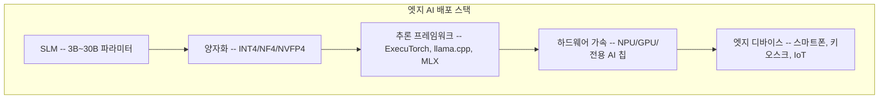

# 온디바이스 LLM / 엣지 AI 배포

클라우드가 아닌 엣지 디바이스(스마트폰, 병원 온프레미스 서버, 키오스크, IoT 장치)에서 직접 LLM을 실행하는 패러다임. 프라이버시, 지연 시간, 비용 측면의 이점으로 2026년 빠르게 확산 중이다.

## 개요

전통적으로 LLM 추론은 클라우드 데이터센터의 대형 GPU 클러스터에서 수행됐다. 그러나 3B-30B 파라미터 규모의 [[small-language-models|소형 언어 모델(SLM)]]과 양자화(Quantization) 기법의 발전으로, 엣지 디바이스에서도 실용적인 LLM 추론이 가능해졌다. Google의 [[litert-lm|LiteRT-LM]] 프레임워크와 NVIDIA의 [[dgx-spark|DGX Spark]] 같은 엣지 전용 인프라가 이 전환을 가속하고 있다. 엣지 AI 시장은 2030년까지 **664.7억 달러** 규모로 성장할 전망이며, 연평균 21% 이상 성장하고 있다.

## 핵심 개념

### 엣지 배포의 3대 이점

1. **프라이버시**: 민감 데이터가 디바이스를 떠나지 않아 GDPR, HIPAA 등 규정 준수가 용이하다. 의료 기관에서 환자 데이터를 네트워크 취약점에 노출시키지 않고 분석할 수 있다.

2. **지연 시간(Latency)**: 원격 서버 왕복 없이 로컬 처리하여 응답 시간이 수백 밀리초에서 한 자릿수 밀리초로 단축된다. 자율주행, 의료 모니터링 등 실시간 애플리케이션에 필수적이다.

3. **비용 절감**: 대량의 데이터를 클라우드로 지속 전송하는 대역폭 비용을 회피한다. 초기 하드웨어 투자가 필요하지만, 장기적으로 클라우드 추론 비용 대비 예측 가능한 운영 비용을 확보한다.

### 주요 사용 사례

| 분야 | 활용 | 특징 |
|------|------|------|
| 의료 | 휴대용 초음파 실시간 영상 분석, 웨어러블 심장 리듬 이상 감지, 연속 혈당 모니터링 | HIPAA 준수, 오프라인 동작 |
| 제조 | 품질 검사 카메라의 미세 결함 감지, 진동 센서 기반 베어링 고장 예측 | 생산 속도 유지, 연결 독립 |
| 리테일 | 스마트 카메라 실시간 재고 추적, 무인 매장 구매 추적 | 네트워크 단절 시에도 정확도 유지 |
| 산업 현장 | 음성 기반 장비 매뉴얼 조회 (오프라인 환경) | SLM으로 구현 가능 |

### 모델 최적화 기법

양자화를 통해 모델 크기를 원본 대비 **4-8배** 축소할 수 있다. 전용 AI 칩은 **2.5W 소비전력으로 최대 10조 연산/초(10 TOPS)** 를 달성한다.

### 주요 엣지 모델 (2026)

| 모델 | 파라미터 | 특징 |
|------|---------|------|
| Llama 3.2 | 1B / 3B | Meta, 엣지 배포 표준 |
| Gemma 3 | 270M - 27B | Google, 모바일 최적화 |
| Phi-4 mini | 3.8B | Microsoft, 소형 고성능 |
| SmolLM2 | 135M - 1.7B | HuggingFace, 초경량 |
| Qwen 2.5 | 0.5B - 1.5B | Alibaba, 다국어 지원 |

125M 파라미터 모델은 iPhone에서 약 50 tokens/sec를 달성하며, 1B 이하 모델로도 요약, Q&A, 텍스트 포맷팅을 효과적으로 처리할 수 있다. 특히 Test-Time Compute 전략을 적용하면 Llama 3.2 3B가 70B 모델을 능가하는 사례도 보고되었다.

## 기술 상세

### 하드웨어 현황 (2026)

| 칩셋 | TOPS | 비고 |
|------|------|------|
| Apple A19 Pro Neural Engine | ~35 | iPhone/iPad |
| Qualcomm Snapdragon 8 Elite Gen 5 | ~60 | Android 플래그십 |
| MediaTek Dimensity 9400+ | ~50 | 중고급 Android |

모바일 NPU가 이제 2017년 데이터센터 GPU(V100: 125 TOPS)에 근접하는 성능을 제공한다. 그러나 **메모리 대역폭이 핵심 병목**이다. 엣지 디바이스의 대역폭은 50-90 GB/s로 데이터센터 GPU(2-3 TB/s)와 30-50배 차이가 있어 디코딩 연산이 컴퓨트 바운드가 아닌 메모리 바운드로 동작한다.

### 엣지 배포 스택

### 양자화 기법 상세

| 기법 | 비트 | 품질 손실 | 용도 |
|------|------|----------|------|
| GPTQ / AWQ | 4-bit | 1-3% | 모바일/엣지 표준 (AWQ 1,900만+ 다운로드) |
| SmoothQuant | 8-bit | <1% | 서버 배포, 활성화 아웃라이어 처리 |
| SpinQuant | 4-bit (W/A/KV) | <3% | 회전 행렬로 아웃라이어 처리 |
| Sub-4-bit | 2-3 bit | 3%+ | 극한 엣지, 4-8배 압축 |

KV 캐시를 3비트까지 양자화해도 품질 저하가 거의 없으며, StreamingLLM은 초기 토큰(attention sink)을 보존하여 고정 메모리로 무한 길이 생성을 지원한다.

### 추론 프레임워크

| 프레임워크 | 개발사 | 특징 |
|-----------|--------|------|
| **ExecuTorch** | Meta | 기본 50KB, 12+ 하드웨어 백엔드, 10억 사용자 스케일 배포 (Instagram/WhatsApp/Messenger) |
| **llama.cpp** | 커뮤니티 | CPU 추론 표준, GGUF 포맷 |
| **MLX** | Apple | Apple Silicon 최적화, NumPy 유사 API |
| **MLC-LLM** | 커뮤니티 | 크로스 플랫폼 컴파일 |

권장 워크플로: HuggingFace에서 양자화된 모델(GGUF 포맷)을 가져와 llama.cpp로 유즈케이스를 검증한 뒤, 프로덕션 모바일 배포 시 ExecuTorch로 전환한다.

### 클라우드 vs 엣지 비교

| 기준 | 클라우드 추론 | 엣지 추론 |
|------|-------------|-----------|
| 지연 시간 | 200-500 ms (네트워크 왕복) | 20 ms 이하/토큰 |
| 프라이버시 | 데이터 전송 필요 | 로컬 처리 |
| 비용 구조 | 사용량 비례 (변동) | 하드웨어 초기 투자 (고정) |
| 모델 규모 | 100B+ 가능 | 3B-30B 실용 범위 |
| 오프라인 | 불가 | 가능 |
| 정확도 | 대형 모델 사용 가능 | 양자화로 1-3% 손실 |
| 전력 | 수백 W (GPU 서버) | 상시 사용 시 한 자릿수 mW 요구 |

프론티어 추론(frontier reasoning)과 장문 대화는 여전히 클라우드가 유리하지만, 포맷팅, 간단한 Q&A, 요약 등 일상 유틸리티 태스크는 점점 온디바이스로 이동하고 있다.

## 관련 문서

- [[litert-lm]] -- Google의 엣지 LLM 추론 프레임워크
- [[ai-inference-quantization-2026]] -- 엣지 배포를 위한 양자화 기법
- [[custom-ai-chips-asic]] -- 엣지 전용 AI 칩 동향
- [[nvfp4-quantization]] -- NVFP4 양자화
- [[kv-cache-compression]] -- 메모리 효율화 기법
