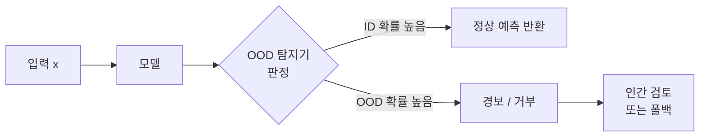
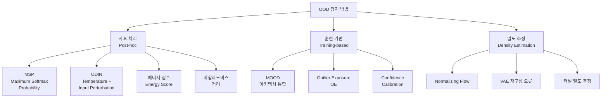
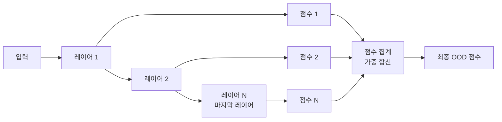

# 분포 외 탐지 (OOD Detection)

분포 외 탐지(Out-of-Distribution Detection, OOD Detection)는 모델이 훈련 분포(in-distribution, ID)에서 벗어난 입력을 받았을 때 이를 인식하고 경보를 울리는 기술이다. 신뢰할 수 없는 예측을 "모름"으로 처리해 안전한 AI 시스템을 구축하는 데 핵심적인 역할을 한다.

## 왜 중요한가

딥러닝 분류기는 훈련 분포 외 입력에 대해서도 높은 신뢰도(confidence)로 잘못된 예측을 내놓는 경향이 있다. 이를 **과신(overconfidence)** 문제라 한다. 자율주행에서 처음 보는 도로 상황, 의료 진단에서 희귀 질환 이미지, 금융 사기 탐지에서 새로운 수법 등 실무의 고위험 영역에서는 "모름"을 올바르게 표현하는 능력이 생존과 직결된다.



위 다이어그램은 OOD 탐지기가 파이프라인에서 안전 게이트(safety gate)로 동작하는 기본 구조를 보여준다.

## 문제 정의

훈련 분포 $P_{in}$과 테스트 분포 $P_{test}$가 주어질 때, 각 테스트 샘플 $x$에 대해 이진 판정을 수행한다:

$$g(x) = \begin{cases} 1 & \text{if } x \sim P_{in} \text{ (in-distribution)} \\ 0 & \text{if } x \sim P_{out} \text{ (out-of-distribution)} \end{cases}$$

이상적인 탐지기는 ID 샘플은 높은 점수, OOD 샘플은 낮은 점수를 부여하는 **스코어 함수** $s(x)$를 정의한다. 임계값 $\lambda$로 분류한다:

$$g(x) = \mathbb{1}[s(x) \geq \lambda]$$

## 탐지 방법 분류



## 핵심 기법

### 1. MSP (Maximum Softmax Probability)

Hendrycks & Gimpel (2017)의 기법으로, 가장 단순한 베이스라인이다. 소프트맥스 출력의 최댓값을 신뢰도 점수로 사용한다.

$$s_{MSP}(x) = \max_k \frac{e^{f_k(x)}}{\sum_j e^{f_j(x)}}$$

- **장점**: 추가 훈련 없이 바로 적용 가능
- **단점**: 딥러닝 모델의 과신 문제로 인해 OOD에서도 높은 소프트맥스 값이 나옴

```python
import torch
import torch.nn.functional as F

def msp_score(model, x):
    with torch.no_grad():
        logits = model(x)
        probs = F.softmax(logits, dim=-1)
        return probs.max(dim=-1).values  # 높을수록 ID
```

### 2. ODIN (Out-of-DIstribution detector for Neural networks)

Liang et al. (2018)이 제안. 두 가지 개선으로 MSP를 크게 능가한다:

**온도 스케일링(Temperature Scaling)**: 소프트맥스 이전 로짓을 온도 $T$로 나누어 분포를 부드럽게 만든다.

$$s_{ODIN}(x) = \max_k \frac{e^{f_k(x)/T}}{\sum_j e^{f_j(x)/T}}$$

**입력 전처리(Input Perturbation)**: 신뢰도를 높이는 방향으로 입력에 작은 적대적 섭동을 추가한다.

$$\tilde{x} = x - \varepsilon \cdot \text{sign}(-\nabla_x \log \hat{p}(y^* \mid x))$$

- 두 기법을 결합하면 ID와 OOD 분포를 더 잘 분리할 수 있다.
- **단점**: 온도 $T$와 섭동 크기 $\varepsilon$ 두 하이퍼파라미터 조정이 필요하다.

### 3. 에너지 점수 (Energy Score)

Liu et al. (2020)의 기법. 소프트맥스 확률 대신 에너지 기반 점수를 사용한다.

$$E(x; f) = -T \cdot \log \sum_k e^{f_k(x)/T}$$

에너지가 **낮을수록** 모델이 확신하는 ID 샘플이다 (OOD 탐지기로 쓸 때는 부호를 뒤집어 높을수록 ID로 처리).

- **이론적 근거**: 에너지 함수는 입력의 밀도와 음의 상관관계를 가진다.
- **MSP 대비 장점**: 소프트맥스 포화(saturation) 문제에 덜 취약하다.

```python
def energy_score(model, x, T=1.0):
    with torch.no_grad():
        logits = model(x)
        return -T * torch.logsumexp(logits / T, dim=-1)  # 낮을수록 ID
```

### 4. 마할라노비스 거리 (Mahalanobis Distance)

Lee et al. (2018)의 기법. 클래스 조건부 가우시안 분포를 피처 공간에 피팅하고, 테스트 샘플과 가장 가까운 클래스 중심(class mean)까지의 마할라노비스 거리를 점수로 사용한다.

$$s(x) = -\min_c (z - \mu_c)^\top \Sigma^{-1} (z - \mu_c)$$

여기서 $z$는 피처 추출기 출력, $\mu_c$는 클래스 $c$의 피처 평균, $\Sigma$는 공유 공분산 행렬이다.

- **장점**: 클래스 경계가 명확한 경우 매우 효과적
- **단점**: 공분산 행렬 계산 비용, 고차원에서의 역행렬 불안정성

### 5. MOOD (Multi-level Out-Of-Distribution Detection)

Lin et al. (2021)의 기법. 딥러닝 모델의 여러 레이어에서 피처를 추출해 다중 레벨 OOD 점수를 결합한다.

- 얕은 레이어: 저수준 시각 특성
- 깊은 레이어: 고수준 의미 특성



서로 다른 레벨의 피처가 상호 보완적이라는 관찰에서 출발한다.

### 6. Outlier Exposure (OE)

Hendrycks et al. (2019)의 기법. 훈련 시 외부 OOD 데이터를 명시적으로 사용해 탐지 능력을 학습한다.

$$\mathcal{L} = \mathcal{L}_{CE}(x_{in}, y) + \lambda \cdot \mathbb{E}_{x_{out} \sim \mathcal{D}_{out}}[\text{KL}(u \| f(x_{out}))]$$

OOD 샘플에 대해 균일 분포 출력을 유도한다.

- **단점**: 훈련 시 사용한 OOD 데이터와 다른 유형의 OOD에서 일반화가 떨어질 수 있다.

## 평가 지표

| 지표 | 설명 | 방향 |
|------|------|------|
| AUROC | OOD vs ID 분리 성능의 곡선 면적 | 높을수록 |
| FPR@95TPR | 95% TPR 달성 시 FPR | 낮을수록 |
| AUPR-In | ID를 양성으로 할 때 PR 곡선 면적 | 높을수록 |
| AUPR-Out | OOD를 양성으로 할 때 PR 곡선 면적 | 높을수록 |

실무에서는 AUROC와 FPR@95TPR을 함께 보고하는 것이 표준이다.

## LLM에서의 OOD 탐지

트랜스포머 기반 언어 모델에서의 OOD 탐지는 이미지 분류와 다른 고려사항이 있다.

**토큰 수준 불확실성**: 생성 모델은 각 토큰마다 확률 분포를 출력하므로, 시퀀스 전체의 누적 불확실성을 어떻게 집계할지가 문제다.

**의미적 OOD**: 문법적으로 올바른 문장이라도 훈련 분포의 주제와 크게 다를 수 있다. 이를 **의미적 OOD(semantic OOD)**라 하며, 표면적 특성만으로는 탐지하기 어렵다.

**주요 접근**:
- 마지막 레이어 히든 스테이트를 피처로 마할라노비스 거리 적용
- 생성 확률의 평균 엔트로피를 불확실성 대리 지표로 사용
- [[uncertainty-estimation]]의 앙상블 기법을 프롬프트 변형으로 근사

## OOD 탐지와 인접 개념 비교

| 개념 | 목표 | 방법 |
|------|------|------|
| OOD 탐지 | 분포 밖 샘플 인식 | 스코어 함수 + 임계값 |
| [[domain-adaptation]] | 분포 이동 후 적응 | 피처 정렬, 파인튜닝 |
| [[uncertainty-estimation]] | 예측 불확실성 정량화 | Bayesian, 앙상블 |
| 이상 탐지(Anomaly Detection) | 비정상 패턴 발견 | 밀도 추정, 재구성 오류 |
| [[ai-anomaly-detection]] | AI 시스템 비정상 탐지 | 포괄적 AI 안전성 접근 |

OOD 탐지는 [[uncertainty-estimation]]의 하위 문제로 볼 수 있다. 불확실성이 높다는 것이 OOD의 필요조건이지만 충분조건은 아니다 (훈련 분포 내에서도 불확실한 샘플이 존재함).

## 실무 가이드라인

1. **베이스라인 먼저**: MSP로 시작해 에너지 점수와 비교한다. 복잡한 기법이 항상 낫지 않다.
2. **피처 레이어 선택**: 마지막 레이어보다 그 직전 레이어의 피처가 OOD 탐지에 더 효과적인 경우가 많다.
3. **임계값 설정**: 운영 환경의 ID 데이터로 TPR 목표(예: 95%)를 설정하고 임계값을 결정한다.
4. **정기 재보정**: 분포가 시간이 지남에 따라 변하므로(개념 드리프트) 임계값을 주기적으로 재보정한다.
5. **OOD 유형 파악**: Near-OOD(훈련 분포와 가까운 OOD)와 Far-OOD를 구분해서 평가한다.

## 대표 벤치마크

| 벤치마크 | ID 데이터셋 | OOD 데이터셋 |
|----------|-------------|-------------|
| OpenOOD | CIFAR-10/100, ImageNet | 다수의 시각 OOD 셋 |
| GLUE-OOD | GLUE 태스크 | 도메인 이동 텍스트 |
| CLINC150 | 인텐트 분류 150개 | OOD 인텐트 |

## 관련 문서

- [[out-of-distribution]] -- OOD 문제 전반 개요
- [[ai-anomaly-detection]] -- AI 시스템 이상 탐지
- [[uncertainty-estimation]] -- 불확실성 추정 기법
- [[domain-adaptation]] -- 분포 이동 적응 기법
- [[ai-agent-security]] -- AI 에이전트 보안과 OOD의 관계
