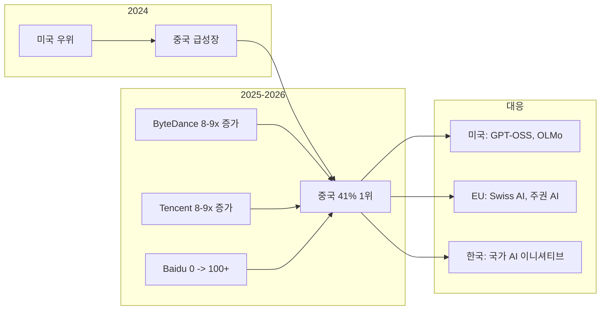

## 개요

2026년은 역대 가장 밀집된 오픈소스 AI 모델 릴리스가 이루어진 시기다. Qwen 3.6+, Gemma 4, DeepSeek R1/V3.2 등 주요 모델들이 연이어 공개되면서 오픈소스 AI 생태계가 질적 전환을 맞이했다. Hugging Face 기준 공개 모델 200만 개, 데이터셋 50만 개를 돌파했으며, 중국 모델이 월간 다운로드의 41%를 차지하며 미국을 추월하는 지형 변화가 일어났다. 이는 [[us-china-ai-competition|미중 AI 경쟁]]의 새 전선이 되었고, 각국의 [[sovereign-ai|주권 AI]] 이니셔티브를 자극했다. 독립/비제휴 개발자 비율이 39%로 상승하며 AI 개발의 민주화가 가속화되고 있다.

## 핵심 개념

### 생태계 규모 (2026년 기준)

| 항목 | 수치 |
|------|------|
| Hugging Face 사용자 | 1,300만 명 |
| 공개 모델 | 200만+ 개 |
| 공개 데이터셋 | 50만+ 개 |
| 중국 모델 다운로드 비율 | 41% (1위) |
| 독립 개발자 비율 | 39% (2022년 17%에서 증가) |
| Qwen 파생 모델 | 200,000+ 개 |

### 주요 오픈소스 모델 동향

- **Qwen (Alibaba)**: 파생 모델 200,000개 이상으로 오픈소스 생태계의 중심. Google, Meta 합산보다 많은 파생 모델 보유
- **DeepSeek**: 2025년 1월 R1 릴리스의 "DeepSeek Moment" 이후 V3, R1, V3.2 연속 릴리스. 중국 오픈소스 전환의 촉발점
- **Gemma (Google)**: 중국 모델과의 경쟁을 위한 미국/유럽의 상업 배포 가능 대안
- **OLMo (AI2)**: 완전 오픈소스(데이터+코드+가중치) 연구 모델

## 기술 상세

### 지역 역학 변화

### 한국의 주권 AI 이니셔티브

2025년 중반 출범한 한국 국가 주권 AI 프로젝트가 주목받고 있다. LG AI Research, SK Telecom, Naver Cloud, NC AI, Upstage가 국가 대표로 선정되었으며, 2026년 2월 3개 모델이 동시에 Hugging Face에서 트렌딩에 진입했다.

### 기술 트렌드

- **모델 크기의 양극화**: 평균 다운로드 모델 크기는 827M(2023) -> 20.8B(2025)로 증가했으나, 중앙값은 326M -> 406M으로 소폭 증가에 그침. 대형 모델 파워유저와 소형 모델 대중 사용자로 양분
- **양자화 & MoE 아키텍처**: 엣지 배포 가능성 증대, 클라우드 의존도 감소
- **모델 생명주기 단축**: 평균 참여 유지 기간 약 6주. DeepSeek만 연속 업데이트로 이 곡선을 역행
- **소형 모델 지배**: 1-9B 파라미터 모델이 다운로드 수에서 압도적 우위. 상위 10개 모델(1-9B) 다운로드 중앙값이 100B+ 모델 대비 4배에 불과할 정도로 격차가 축소됨
- **비용 효율**: 오픈소스 모델은 플래그십 상용 모델 대비 10x-1000x 낮은 비용으로 운영 가능

### 다운로드 집중도

모델 생태계의 극단적 불균형이 관측된다. 전체 모델의 50%는 총 다운로드 200건 미만이며, 상위 0.01%(약 200개 모델)가 전체 다운로드의 49.6%를 차지한다. 2025년 기준 가장 많이 다운로드된 모델은 DeepSeek-R1으로, 기존 Meta/Llama 패밀리의 지배를 뒤엎었다.

### 엔터프라이즈 채택

Fortune 500 기업의 30% 이상이 Hugging Face 인증 계정을 유지하고 있으며, 2025년에 조직 구독이 크게 증가했다. Airbnb, VSCode, Cursor 등이 오픈/클로즈드 모델을 혼용하는 하이브리드 전략을 채택하고 있다.

### 신흥 영역

- **로봇공학**: 로봇 데이터셋이 2024년 1,145개(44위)에서 2025년 26,991개(1위)로 급증하며 텍스트 생성(5,000개)을 5배 이상 초과. LeRobot(GitHub 스타 전년 대비 3배)이 선도하며, Pollen Robotics 인수로 취미 사용자까지 생태계를 확장. 최대 멀티모달 데이터셋인 Learning to Drive(L2D)와 107,000개 이상의 실세계 트래젝토리를 포함한 RoboMIND가 대표적
- **과학 AI**: 단백질 폴딩, 분자 역학, 신약 개발 영역에서 수백 명 기여자의 크로스 기관 협력 활발. 현재 문헌 탐색(literature discovery)이 주류이며, 직접 실험(direct experimentation)으로의 전환이 진행 중
- **에이전트 배포**: 오픈소스 모델의 상호운용성이 에이전트 생태계의 핵심 인프라로 부상

### 연구 논문 동향

ByteDance가 고영향 논문 생산량에서 1위를 차지하고 있으며, 대형 조직(미국/중국)이 가장 많은 추천을 받는 논문을 주도한다. 의료 분야 논문의 영향력이 특히 높으며, Hugging Face의 Daily Papers 시스템에서 빅테크 기업의 논문은 오히려 소수에 불과하다.

### 하드웨어 생태계 확장

기존 NVIDIA GPU 중심에서 AMD 듀얼 최적화로 확장. Stability AI가 NVIDIA와 AMD 양쪽 최적화를 동시에 수행하는 선례를 만들었고, 2025년 출시된 Kernel Hub는 두 플랫폼용 최적화 커널을 제공한다. 중국은 Alibaba를 필두로 국산 칩 기반의 추론 인프라를 구축하며, 자국 데이터센터에 최적화된 모델 설계를 추진하고 있다.

### 서방 진영의 대응

중국 모델의 부상에 대응하여 서방은 다양한 전략을 전개하고 있다. OpenAI는 GPT-OSS 이니셔티브로 오픈소스 영역에 진입했고, AI2의 OLMo는 데이터/코드/가중치를 모두 공개하는 완전 오픈소스 연구 모델로 투명성을 극대화했다. 유럽에서는 스위스 AI 이니셔티브를 비롯한 주권 AI 프로젝트가 추진되며, "공적 자금, 공적 코드(Public money, public code)" 원칙이 영향력을 확대하고 있다.

## 관련 문서

- [[ai-reasoning-models]] - AI 추론 모델 패러다임 (DeepSeek R1의 맥락)
- [[us-china-ai-competition]] -- 미중 AI 패권 경쟁이 오픈소스 생태계에 미치는 영향
- [[deepseek-mhc]] - DeepSeek의 아키텍처 혁신
- [[model-merging]] - 오픈소스 모델 병합을 통한 민주적 모델 개선
- [[boltz-2]] - MIT 라이선스 오픈소스 신약 발견 모델
