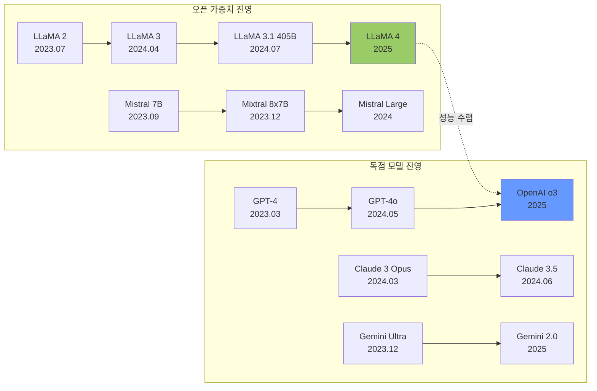
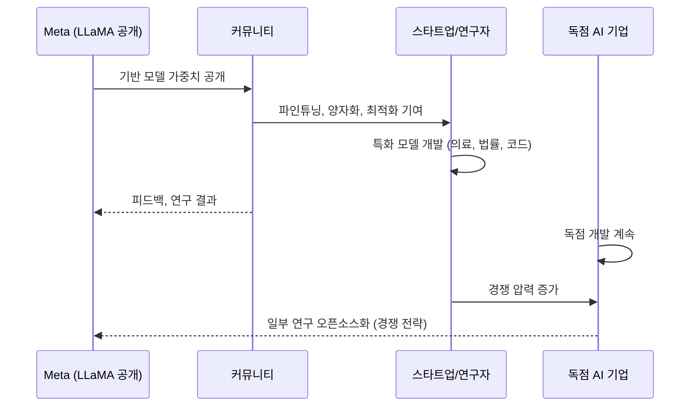

# 오픈소스 vs 독점 AI (Open Source vs Proprietary AI)

## 개요

오픈소스 AI와 독점 AI의 대립은 2023년 Meta의 LLaMA 공개 이후 AI 생태계의 핵심 구조적 긴장으로 부상했다. 단순한 기술적 선택의 문제가 아니라 **혁신 속도, 안전성, 경제적 인센티브, 규제 가능성**을 둘러싼 복잡한 역학 관계다.

2025-2026년에는 오픈 가중치(open-weights) 모델의 성능이 독점 모델과 급격히 수렴하면서, 이 논쟁의 양상이 "성능 격차"에서 "생태계 역학"으로 이동하고 있다.

## 성능 수렴 현황

2024년 말을 기점으로 LLaMA 3.1 405B 같은 오픈 가중치 모델이 GPT-4 수준의 성능을 달성하기 시작했다. 2026년 현재 코딩, 추론, 지시 따르기 등 대부분의 벤치마크에서 상위 오픈소스 모델과 독점 모델의 격차가 크게 좁혀졌다.

## 두 진영의 비교

| 차원 | 오픈 가중치 | 독점 모델 |
|-----|-----------|---------|
| 접근성 | 누구나 다운로드, 로컬 실행 | API 또는 구독 필요 |
| 커스터마이징 | 파인튜닝, 병합, 수정 자유 | 제한적 (파인튜닝 API만) |
| 비용 | 인프라 비용만, 추론 비용 없음 | 토큰당 과금 |
| 프라이버시 | 완전 로컬 실행 가능 | 데이터를 외부로 전송 |
| 최신성 | 릴리스 주기에 따라 지연 | 지속 업데이트 |
| 안전성 | 커뮤니티 감시, 제거 어려움 | 중앙 통제 용이 |
| 지원 | 커뮤니티 기반 | 공식 기술 지원 |

## 라이선스의 복잡성

[[open-weights-movement]]에서 "오픈소스"라는 용어는 전통적 소프트웨어의 오픈소스(OSI 정의)와 다르게 쓰이는 경우가 많다:

- **오픈 소스코드, 비공개 가중치**: 학습 코드는 공개하지만 모델 가중치는 미공개
- **오픈 가중치, 제한적 라이선스**: 가중치를 공개하지만 상업적 사용이나 특정 사용 사례를 금지 (LLaMA 2의 7억 사용자 초과 제한 등)
- **완전 오픈소스**: 코드, 가중치, 학습 데이터, 학습 과정 모두 공개 (Mistral, Falcon 등의 일부)

[[open-source-ai-movement-2026]]에서는 이 정의 혼란이 정책 논의를 복잡하게 만들고 있다는 지적이 이어지고 있다.

## 생태계 역학

Meta의 전략적 계산은 명확하다: 오픈소스 생태계를 지원함으로써 OpenAI와 Google의 독점 생태계에 대한 대안을 만들고, 동시에 자사 인프라(Meta AI, Instagram, WhatsApp)에서의 경쟁력을 유지한다.

## 안전성 논쟁

### 오픈소스 지지 측 논거

- 투명성: 연구자들이 내부를 검사하고 취약점을 발견·보고할 수 있음
- 감시 분산: 단일 기업의 결정이 아닌 커뮤니티의 집단적 감시
- 접근 민주화: 부유한 기업만이 AI의 혜택을 독점하는 것을 방지

### 독점 모델 지지 측 논거

- 중앙 통제: 위험한 사용 패턴 발견 시 빠른 조치 가능
- 안전 투자: 수익으로 안전 연구에 재투자
- 책임 소재: 문제 발생 시 명확한 책임 주체 존재

[[frontier-model-safety]] 관점에서는 오픈 가중치 모델이 일단 공개되면 위험한 역량을 되돌릴 수 없다는 우려가 크다. 특히 ASL-3 수준의 능력을 가진 모델이 오픈소스화될 경우 규제 가능성이 사라진다.

## 2026년 현황과 전망

- **수렴 가속**: 오픈 가중치 모델이 독점 모델의 6-12개월 뒤를 따라가는 패턴이 정착
- **특화 경쟁**: 범용 성능보다 특정 도메인 특화 능력에서 차별화 시도
- **인프라 경쟁**: 모델 자체보다 배포 인프라, 파인튜닝 파이프라인이 경쟁의 장으로
- **규제 대응**: EU AI Act 하에서 오픈 가중치 모델의 규제 적용 방식이 미확정

## 관련 문서

- [[open-weights-movement]] - 오픈 가중치 모델 공개의 역사와 철학
- [[open-source-ai-movement-2026]] - 2026년 오픈소스 AI 생태계 현황
- [[llm-homogenization]] - 오픈소스 파생 모델의 동질화 문제
- [[frontier-model-safety]] - 오픈소스화와 안전성 우려의 긴장
- [[compute-governance]] - 오픈소스 모델 규제를 위한 컴퓨팅 거버넌스
