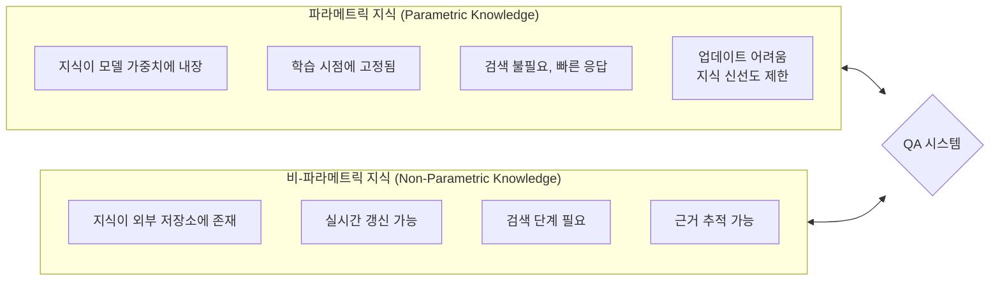
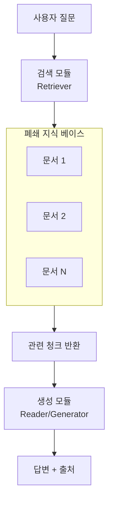
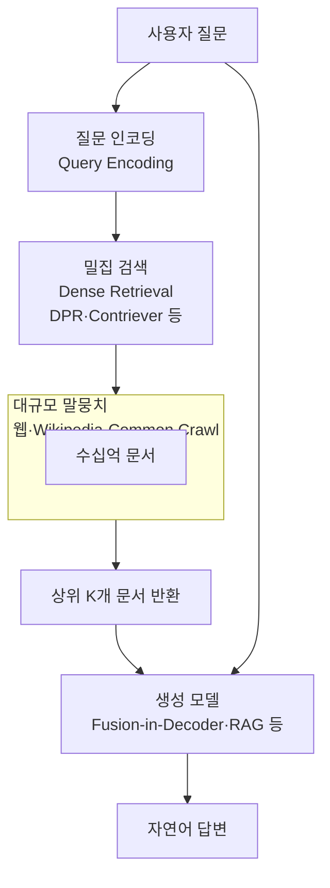
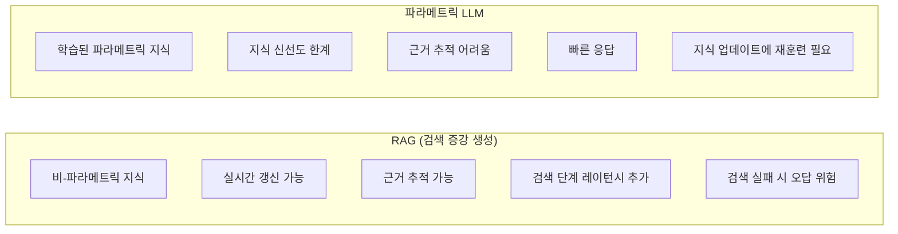
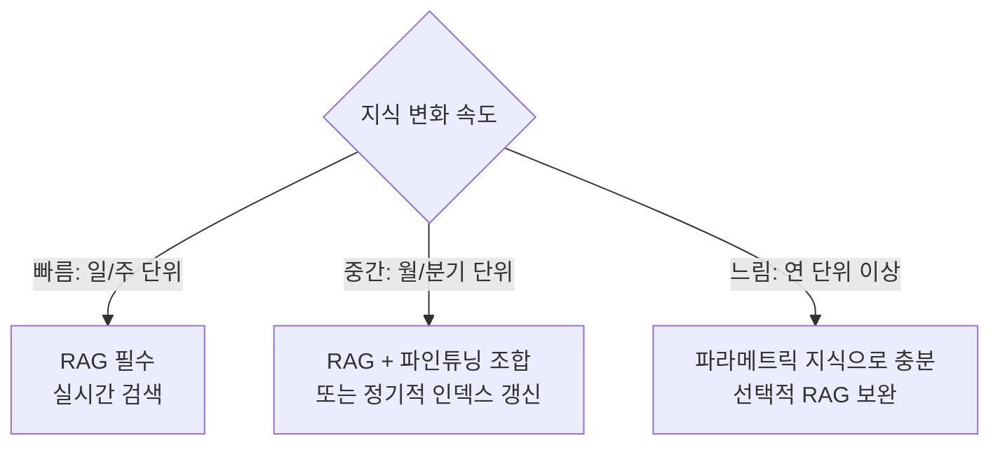
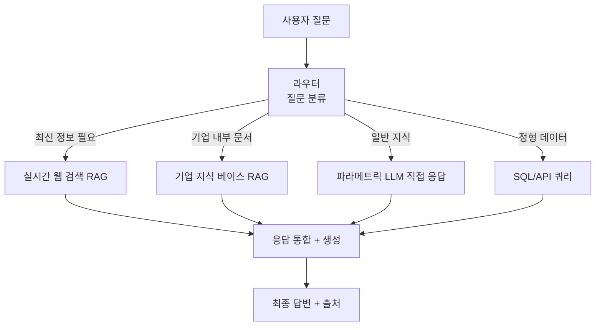

# 개방 도메인 vs 폐쇄 도메인 QA

## 정의와 본질

**폐쇄 도메인 QA(Closed-Domain Question Answering)**는 특정 문서 · 데이터베이스 · 도메인 범위 내의 질문에만 답하는 시스템이다. 답변의 근거가 되는 지식 원천이 명확하게 한정되어 있다.

**개방 도메인 QA(Open-Domain Question Answering)**는 특정 도메인에 국한되지 않고 임의의 질문에 답하는 시스템이다. 지식 원천이 방대한 말뭉치(웹 전체, 위키피디아 등) 또는 모델의 파라미터에 저장된 지식이다.

이 구분은 단순한 스펙트럼이 아니라, **지식을 어디에 저장하고 어떻게 검색하느냐**에 대한 아키텍처 선택이다.

### 핵심 이분법

---

## 폐쇄 도메인 QA

### 특성

폐쇄 도메인 QA는 범위가 정해진 문서 집합에서 질문에 대한 답을 추출하거나 생성한다:

- **Machine Reading Comprehension (MRC)**: 주어진 단락에서 답을 추출 (예: SQuAD 벤치마크)
- **Document QA**: 특정 PDF/문서 내용에 대한 질의응답
- **Enterprise FAQ**: 회사 내부 문서 · 매뉴얼 기반 챗봇
- **Legal Document QA**: 계약서 · 판례문 내용 한정 질의

### 폐쇄 도메인 QA 아키텍처

### 장점

- **신뢰성**: 답변이 정해진 소스에서만 나오므로 허구 정보 유입 위험 감소
- **감사 가능성(Auditability)**: 답변 근거 문서를 정확히 추적 가능 (컴플라이언스 요구사항 충족)
- **도메인 정확도**: 특화 도메인에서 일반 LLM보다 높은 정확도 달성 가능
- **비용 효율**: 대규모 언어 모델 없이도 구현 가능

---

## 개방 도메인 QA

### 특성

개방 도메인 QA는 사전에 지정되지 않은 임의의 주제에 대한 질문을 처리한다:

- **웹 검색 기반 QA**: 실시간 웹 검색 결과를 활용
- **파라메트릭 QA**: LLM의 내장 지식만으로 답변 (웹 검색 없음)
- **Wikipedia 기반 QA**: DPR + FiD 등 오픈소스 파이프라인
- **멀티홉 QA**: 여러 문서를 연결해 답을 구성

### 개방 도메인 QA 아키텍처 (RAG 기반)

---

## RAG vs 파라메트릭 지식: 핵심 트레이드오프

| 차원 | RAG | 파라메트릭 LLM |
|------|-----|---------------|
| 지식 신선도 | 실시간 업데이트 가능 | 훈련 데이터 컷오프에 고정 |
| 정확도 (팩트) | 소스 존재 시 높음 | 훈련 데이터 품질에 의존 |
| 근거 추적 | 인용 소스 제공 가능 | 어려움 (환각 위험) |
| 레이턴시 | 검색 단계 추가 (~수백ms) | 즉시 응답 |
| 도메인 적응 | 인덱스 교체로 즉시 적응 | 파인튜닝 또는 재훈련 필요 |
| 비용 | 검색 인프라 필요 | 추론만으로 완결 |
| 비공개 지식 | 내부 문서 인덱싱으로 활용 | 훈련에 포함 필요 |

---

## 정확도 vs 신선도 트레이드오프

### 지식 신선도 문제

파라메트릭 지식은 **훈련 컷오프(training cutoff)** 이후의 정보를 모른다. 이 문제는:
- 빠르게 변하는 정보 (뉴스, 주가, 신제품 출시) → RAG 필수
- 안정된 지식 (역사, 수학, 기초 과학) → 파라메트릭으로도 충분

### 환각 vs 검색 실패

- **파라메트릭 환각(Parametric Hallucination)**: 모델이 없는 정보를 만들어냄
- **검색 실패(Retrieval Failure)**: RAG에서 관련 문서를 못 찾아 잘못된 답변
- **검색 오염(Retrieval Pollution)**: 관련성 낮은 문서가 검색되어 답변 품질 하락

RAG이 "환각이 없다"는 오해가 있지만, 검색 결과의 신뢰성이 낮거나 검색 실패 시 RAG도 틀릴 수 있다.

---

## 응용별 권장사항

### 도메인 × 요구사항 매트릭스

| 응용 | 도메인 | 신선도 요구 | 감사 필요 | 권장 방식 |
|------|--------|-----------|-----------|-----------|
| 기업 내부 문서 검색 | 폐쇄 | 낮음 | 높음 | 폐쇄 도메인 RAG |
| 고객 지원 챗봇 | 폐쇄 | 중간 | 높음 | 폐쇄 도메인 RAG + 재랭킹 |
| 뉴스 요약/QA | 개방 | 매우 높음 | 낮음 | 실시간 웹 검색 + RAG |
| 의료 QA | 폐쇄 | 중간 | 매우 높음 | 폐쇄 + 인증 문서 기반 |
| 법률 문서 QA | 폐쇄 | 낮음 | 매우 높음 | 폐쇄 도메인 + 인용 추적 |
| 일반 지식 비서 | 개방 | 낮음 | 낮음 | 파라메트릭 LLM |
| 코드 생성 도우미 | 폐쇄/개방 | 중간 | 중간 | 코드베이스 RAG + 파라메트릭 |
| 금융 분석 | 폐쇄 | 매우 높음 | 높음 | 실시간 RAG + 정형 DB 연동 |

### 하이브리드 아키텍처

실제 프로덕션 시스템은 대부분 하이브리드로 설계된다:

---

## 고급 패턴

### 멀티홉 QA (Multi-Hop QA)

단일 문서로는 답할 수 없고 여러 문서를 연결해야 하는 질문:

- "A가 설립한 회사의 현재 CEO는 누구인가?" → A의 회사 → 현재 CEO 두 단계 검색 필요
- **HotpotQA**, **2WikiMultiHopQA** 등이 대표 벤치마크
- 간단한 RAG로는 처리 어렵고, 반복 검색(iterative retrieval) 또는 사고 사슬 기반 검색이 필요

### 대화형 QA (Conversational QA)

이전 대화 맥락을 고려한 QA:
- "그것의 가격은 얼마인가?" — "그것"이 무엇인지 이전 대화에서 해소 필요
- 대화 이력 기반 쿼리 재작성(query rewriting) 중요

---

## 평가 지표

| 지표 | 설명 | 적합 태스크 |
|------|------|------------|
| EM (Exact Match) | 정답 문자열과 완전 일치율 | 폐쇄 도메인, 단순 팩트 |
| F1 스코어 | 토큰 수준 정밀도·재현율 | 추출형 MRC |
| ROUGE | 텍스트 겹침 기반 | 생성형 요약/QA |
| BERTScore | 임베딩 유사도 기반 | 자유형 생성 |
| 인용 정확도 | RAG 시스템의 인용 근거 충실도 | RAG 특화 |
| Faithfulness | 답변이 검색 문서에 충실한가 | RAG 특화 |

---

## 한계와 비판

### 폐쇄 도메인의 한계

- 도메인 경계 밖의 질문에 "모른다"고 해야 하는데, 모델이 컨텍스트 밖 지식을 섞는 경우 발생
- 문서 범위가 너무 좁으면 검색 실패율 높아짐

### 개방 도메인의 한계

- 웹 검색 기반 시스템은 잘못된 정보 · 스팸 콘텐츠도 검색됨 → 품질 필터링 어려움
- 파라메트릭 지식의 신뢰도 불균일 — 인기 있는 사실은 잘 알지만 희귀 사실은 환각 위험

### 공통 한계

- **언어 편향**: 영어 중심 말뭉치로 인해 저자원 언어 성능 격차
- **멀티모달 지식 부족**: 이미지 · 표 · 수식 포함 문서에서의 QA는 여전히 어려운 과제

---

## 관련 문서

- [[rag]] - 검색 증강 생성의 전체 아키텍처 및 최신 기법.
- [[advanced-rag-patterns]] - 재랭킹, 반복 검색, 하이브리드 검색 등 고급 RAG 패턴.
- [[parametric-knowledge]] - LLM의 파라메트릭 지식 저장 메커니즘 (조사 필요).
- [[document-qa-agent]] - 문서 QA 에이전트 구현 패턴.
- [[in-context-learning]] - 퓨샷 예시를 컨텍스트로 활용하는 ICL 메커니즘.
