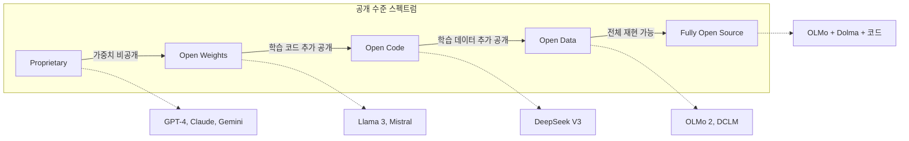

# 오픈 웨이트 운동 (Open Weights Movement)

## 정의

**오픈 웨이트(Open Weights)**는 학습된 모델의 가중치(weights)를 공개하여 누구나 다운로드, 실행, 파인튜닝할 수 있도록 하는 배포 방식이다. "오픈소스 AI"라는 표현이 흔히 쓰이지만, 실제로는 학습 데이터와 학습 코드가 공개되지 않는 경우가 대부분이므로 **오픈 웨이트**라는 용어가 더 정확하다.

2023년 Meta의 LLaMA 공개를 기점으로 촉발된 오픈 웨이트 운동은 [[open-source-ai-movement-2026|오픈소스 AI 운동]]의 핵심 축으로, 2026년 현재 프론티어급 성능의 모델까지 가중치가 공개되는 수준에 이르렀다.

## 스펙트럼: 공개 수준에 따른 분류

AI 모델의 공개 수준은 단순한 이분법이 아닌 스펙트럼으로 이해해야 한다.

이 다이어그램은 AI 모델 공개 수준의 스펙트럼을 보여준다. 왼쪽에서 오른쪽으로 갈수록 공개 범위가 넓어진다.

| 수준 | 가중치 | 학습 코드 | 학습 데이터 | 재현 가능성 | 대표 사례 |
|---|---|---|---|---|---|
| Proprietary | X | X | X | 불가 | GPT-4, Claude |
| Open Weights | O | X | X | 추론만 | Llama 3, Gemma |
| Open Code | O | O | X | 부분적 | DeepSeek V3 |
| Open Data | O | O | O | 높음 | OLMo 2 |
| Fully Open | O | O | O + 전처리 | 완전 | OLMo + Dolma |

## 주요 모델 패밀리

### Llama (Meta)

[[llama-4|Llama]] 시리즈는 오픈 웨이트 운동의 촉매제다. 2023년 LLaMA 7-65B를 시작으로, Llama 2(2023), Llama 3(2024), Llama 3.1(405B, 2024), Llama 4(2025-2026)로 진화하며 프론티어급 오픈 웨이트 모델의 기준을 세웠다.

- **라이선스**: Llama Community License (상업 이용 허용, 월간 활성 사용자 7억 이상 시 별도 협의)
- **특징**: 학습 비용, 인프라, 성능 벤치마크를 상세히 공개하여 후속 연구의 기준선 역할

### Mistral (Mistral AI)

프랑스 스타트업 Mistral AI의 모델 시리즈. 적은 파라미터로 높은 효율을 달성하는 것이 특징이다.

- **Mistral 7B**: 출시 당시 Llama 2 13B를 능가하는 효율
- **Mixtral 8x7B/8x22B**: Sparse MoE로 활성 파라미터 대비 높은 성능
- **라이선스**: Apache 2.0 (가장 허용적)

### Gemma (Google DeepMind)

[[gemma-4|Gemma]]는 Google이 Gemini 기술을 기반으로 공개하는 오픈 웨이트 모델이다.

- **Gemma 2**: 지식 증류(knowledge distillation)로 작은 모델에서 높은 성능 달성
- **Gemma 4**: 2026년 공개. 로컬 에이전트 추론에 최적화된 경량 프론티어 모델
- **라이선스**: Gemma Terms of Use (상업 이용 허용, 재배포 제한)

### Qwen (Alibaba Cloud)

중국 알리바바 클라우드의 오픈 웨이트 모델 시리즈다.

- **Qwen 2.5**: 18T 토큰 학습, 72B까지 공개. 다국어 강점
- **라이선스**: Apache 2.0 (72B 이하) / Qwen License (대형 모델)

### DeepSeek (DeepSeek AI)

[[deepseek-v4|DeepSeek]]은 중국 AI 스타트업으로, 학습 코드까지 공개하는 높은 투명성이 특징이다.

- **DeepSeek V3**: 671B MoE, 학습 비용 $5.6M으로 효율성 충격
- **DeepSeek-R1**: 추론 특화 모델, 오픈 웨이트 추론 모델의 기준
- **라이선스**: MIT License (가장 허용적 부류)

## 라이선스 환경

오픈 웨이트 모델의 라이선스는 소프트웨어 오픈소스 라이선스와 다른 고유한 구조를 가진다.

| 라이선스 유형 | 상업 이용 | 파생물 공개 의무 | 사용 제한 | 대표 모델 |
|---|---|---|---|---|
| Apache 2.0 | O | X | X | Mistral, Qwen |
| MIT | O | X | X | DeepSeek |
| Llama Community | O (7억 MAU 미만) | X | 일부 | Llama 3/4 |
| Gemma ToU | O | X | 재배포 제한 | Gemma |
| CreativeML Open RAIL-M | O | X | 유해 사용 금지 | Stable Diffusion |

"Apache 2.0"과 "MIT"는 전통적 오픈소스 라이선스와 동일하며 가장 자유롭다. 반면 Llama Community License나 Gemma Terms of Use는 기존 오픈소스 정의에 부합하지 않으므로, OSI(Open Source Initiative)는 이들을 "오픈소스"로 인정하지 않는다.

## 오픈 웨이트의 가치

### 연구 접근성

가중치가 공개되면 연구자들이 모델 내부를 분석하고 개선할 수 있다. 해석 가능성(interpretability) 연구, 편향 감사(bias audit), 안전성 검증이 가능해진다.

### 프라이버시와 데이터 주권

로컬 추론이 가능하므로 민감한 데이터를 외부 API로 전송할 필요가 없다. 의료, 법률, 금융 등 규제 산업에서 핵심 가치다.

### 비용 효율

자체 서빙 인프라를 구축하면 대규모 추론 시 API 비용 대비 70-90% 절감이 가능하다. 특히 양자화(INT4/FP4) + 소비자 GPU 조합으로 개인도 강력한 모델을 운용할 수 있다.

### 커스터마이징

특정 도메인에 파인튜닝하거나, LoRA 어댑터를 적용하여 맞춤형 모델을 만들 수 있다.

## 한계와 열린 문제

### 학습 데이터의 불투명성

대부분의 오픈 웨이트 모델은 학습 데이터를 공개하지 않는다. 데이터 출처, 저작권, 편향, 오염을 검증할 수 없다는 것은 심각한 제한이다. OLMo/Dolma 프로젝트는 이 문제를 해결하려는 시도다.

### 학습 레시피의 비공개

하이퍼파라미터, 데이터 배합, 학습 스케줄 등의 상세 레시피가 공개되지 않으면 모델을 완전히 재현할 수 없다. 이는 과학적 재현성 측면에서 문제다.

### 안전성 우려

오픈 가중치는 안전 장치(safety filter)를 제거하거나 유해 용도로 파인튜닝할 수 있다. 이 "이중 용도(dual-use)" 문제는 오픈 웨이트 운동의 가장 논쟁적인 지점이다.

### "오픈소스" 명칭 논란

OSI는 학습 데이터를 포함한 전체 재현 가능성을 "오픈소스 AI"의 요건으로 제시한다. 가중치만 공개하는 모델을 "오픈소스"라 부르는 것은 기존 소프트웨어 커뮤니티의 오픈소스 정의와 충돌한다.

## 관련 문서

- [[open-source-ai-movement-2026]] -- 2026년 오픈소스 AI 운동 전체 조망
- [[llama-4]] -- Meta Llama 4 모델 상세
- [[gemma-4]] -- Google Gemma 4 모델 상세
- [[deepseek-v4]] -- DeepSeek V4 모델 상세
- [[gemma-4-local-inference]] -- Gemma 4 로컬 추론 설정
- [[ai-inference-quantization-2026]] -- 양자화를 통한 오픈 웨이트 모델 효율화
