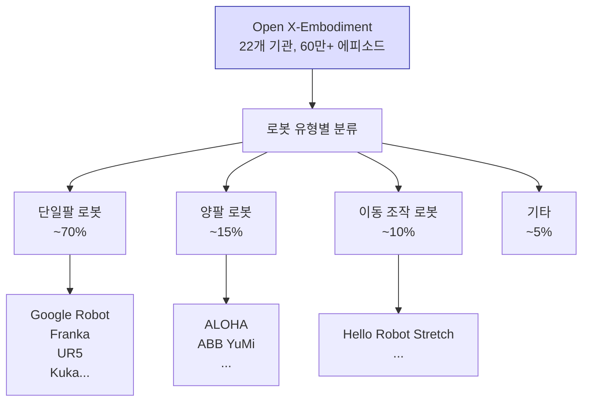
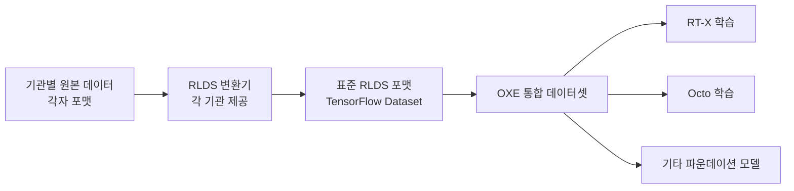

# Open X-Embodiment

## 개요

Open X-Embodiment(OXE)는 Google DeepMind가 주도하고 22개 연구 기관이 협력해 2023년에 발표한 **대규모 다중 로봇 데이터 통합 프로젝트**다. 다양한 로봇 플랫폼에서 수집한 조작 데이터를 표준화된 포맷으로 통합해 단일 파운데이션 모델 학습에 활용하는 것이 목표다.

이 프로젝트는 컴퓨터 비전의 ImageNet, NLP의 Common Crawl과 유사하게, 로봇 학습을 위한 대규모 공개 데이터 인프라를 구축하려는 시도다.

## 데이터 규모와 구성

| 통계 | 수치 |
|------|------|
| 참여 기관 수 | 22개 |
| 총 에피소드 수 | ~60만 |
| 총 데이터 스텝 수 | ~1억 5천만 |
| 로봇 플랫폼 수 | 22종 이상 |
| 태스크 유형 수 | 수백 개 |

## 데이터 표준화

각 기관은 서로 다른 로봇, 센서, 태스크, 데이터 포맷을 사용한다. OXE는 이를 통합하기 위해 **RLDS(Robot Learning Dataset Specification)** 포맷을 채택한다.

각 에피소드는 다음 정보를 포함한다.
- 관측: 카메라 이미지 (1차 뷰, 손목 카메라 등), 관절 상태
- 행동: 엔드이펙터 또는 관절 공간 제어 명령
- 태스크 언어 설명 (자연어)
- 에피소드 성공 여부

## RT-X: OXE 기반 파운데이션 모델

Google DeepMind는 OXE 데이터로 학습한 두 가지 모델을 제안했다.

### RT-1-X

RT-1(Google 자체 로봇 정책)을 OXE 전체 데이터로 파인튜닝한 버전이다. 단일 기관 학습 대비 다양한 로봇에서의 제로샷 성공률이 크게 향상됐다.

### RT-2-X

[[rt-2-vision-language-action]]의 구조에 OXE 데이터를 추가 학습한 버전이다. 언어 추론 능력과 다양한 로봇 플랫폼 지원을 결합했다.

## 핵심 발견

OXE 논문에서 공개한 실험 결과의 핵심 인사이트는 다음과 같다.

1. **양의 전이 학습**: 여러 로봇 데이터를 혼합하면 단일 로봇 데이터만 사용할 때보다 성능이 향상된다.
2. **데이터 다양성 > 데이터 양**: 동일한 총 데이터 양에서 다양한 기관 데이터 혼합이 단일 출처 대비 우수하다.
3. **새 로봇 제로샷 일반화**: OXE로 학습한 모델이 학습 데이터에 없던 로봇 플랫폼에서도 작동한다.

## 데이터 수집 방법론과의 관계

OXE의 대부분의 데이터는 [[robot-teleoperation-data]] 방식으로 수집되었다. 인간 시연자가 직접 로봇을 조작해 만든 시연 데이터가 핵심이다. 일부는 자율 로봇이 성공적으로 수행한 에피소드로 구성된다.

## [[octo-robot-policy]]와의 관계

Octo 파운데이션 모델은 OXE 데이터셋의 일부를 사용해 사전학습된다. OXE가 "로봇 학습의 Common Crawl"이라면, Octo는 그 위에 학습된 "로봇 학습의 GPT-3"에 해당한다.

## 한계와 과제

- **데이터 불균형**: 일부 기관(Google 등) 데이터가 압도적으로 많아 편향 발생 가능
- **행동 공간 이질성**: 관절 제어 vs. 카테시안 제어 등 서로 다른 제어 방식의 통합 어려움
- **품질 편차**: 기관별 데이터 품질과 태스크 난이도가 다름
- **지속적 갱신**: 신규 데이터와 로봇 플랫폼 추가를 위한 생태계 유지 필요

## 관련 문서

- [[vla-models]] - OXE 데이터로 학습하는 파운데이션 모델 패러다임
- [[rt-2-vision-language-action]] - OXE 기반 RT-2-X 모델
- [[octo-robot-policy]] - OXE 데이터로 사전학습된 오픈소스 파운데이션 모델
- [[robot-teleoperation-data]] - OXE 데이터의 주요 수집 방식
