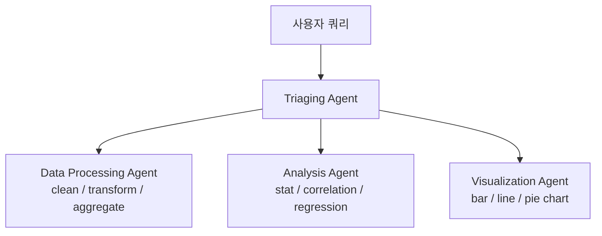

# Structured Outputs for Multi-Agent Systems (OpenAI Cookbook 2024-08)

Dylan Royan Almeida(OpenAI)가 작성한 multi-agent 패턴 가이드. 핵심 명제:

> "Structured Outputs is a new capability that builds upon JSON mode and function calling to enforce a strict schema in a model output."

`strict: true` 파라미터로 응답이 제공된 스키마를 따르도록 보장.

## 시스템 아키텍처 (4-Agent 데이터 분석 파이프라인)



### 4 에이전트 역할
1. **Triaging Agent** — 쿼리를 적절한 특화 에이전트로 라우팅
2. **Data Processing Agent** — 데이터 정제·변환
3. **Analysis Agent** — 통계·회귀 분석
4. **Visualization Agent** — 차트·시각화 생성

## Schema 강제 패턴

모든 도구 정의에 `"strict": True` 포함:

```json
{
  "type": "function",
  "function": { ... },
  "strict": true
}
```

## 에이전트별 도구

### Processing Agent Tools
- `clean_data`
- `transform_data`
- `aggregate_data`

### Analysis Agent Tools
- `stat_analysis`
- `correlation_analysis`
- `regression_analysis`

### Visualization Agent Tools
- `create_bar_chart`
- `create_line_chart`
- `create_pie_chart`

## 실행 흐름

계층적 도구 라우팅:
1. 초기 triage agent가 요청 분석
2. 특화 sub-agent에 위임
3. 각 도메인 특화 도구 실행
4. 검증된 출력 반환

## 핵심 동기

> "When using function calling, if the number of functions (or tools) increases, the performance may suffer."

다중 에이전트 분해를 통한 특화로 이 확장성 문제 해결. 도구 수를 줄이고 각 에이전트가 좁은 도메인의 도구만 다루도록 함.

## 메모

- 게시일: 2024-08-06
- OpenAI Cookbook 예제로 GitHub `openai/openai-cookbook` 레포에 노트북 형태로 존재
- Strict mode = function calling의 reliability 강화
- 본 패턴은 후속 **OpenAI Agents SDK의 routing 패턴 기반**

## 관련 문서

- [[function-calling]] — Function Calling 기본
- [[swarm-openai-handoffs]] — OpenAI Swarm 패턴 (후속)
- [[orchestrator-worker-pattern]] — Orchestrator-Worker
- [[structured-output]] — Structured output 일반
- [[llm-structured-output]] — LLM 구조화 출력
- [[effective-agents-patterns]] — Anthropic 7가지 패턴 (Routing 패턴 비교)
