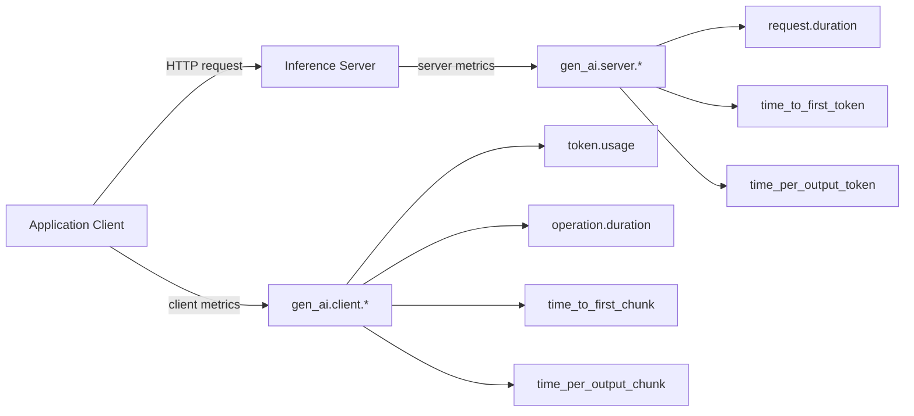

# OpenTelemetry GenAI Metrics

OpenTelemetry GenAI 명세는 7 개의 표준 metric (모두 Histogram) 을 정의한다. client
metric 4 개, server metric 3 개로 분리되어 LLM 호출 chain 의 양쪽 관점을 capture
한다. **bucket boundary 까지 명세에 박혀 있어 vendor 간 비교 가능**한 것이 핵심
가치다.

자세한 attribute 와 span 구조는 [[opentelemetry-genai-semconv]] 를 참고한다.

## Metric 카테고리



## Client Metrics (4 종)

### 1. `gen_ai.client.token.usage` (Recommended)

- type: Histogram, unit: `{token}`
- description: "Number of input and output tokens used."
- 필수: `gen_ai.operation.name`, `gen_ai.provider.name`, `gen_ai.token.type`
  (`input` | `output`)
- bucket: `[1, 4, 16, 64, 256, 1024, 4096, 16384, 65536, 262144, 1048576, 4194304, 16777216, 67108864]`

> "If instrumentation cannot efficiently obtain number of input and/or output tokens,
> it MAY allow users to enable offline token counting. Otherwise it MUST NOT report
> usage metric."

### 2. `gen_ai.client.operation.duration` (Required)

- type: Histogram, unit: `s`
- description: "GenAI operation duration."
- 필수: `gen_ai.operation.name`, `gen_ai.provider.name`
- 조건부: `error.type` (에러 시), `gen_ai.request.model`, `server.port`
- bucket: `[0.01, 0.02, 0.04, 0.08, 0.16, 0.32, 0.64, 1.28, 2.56, 5.12, 10.24, 20.48, 40.96, 81.92]`

### 3. `gen_ai.client.operation.time_to_first_chunk` (Recommended)

- streaming 한정
- description: "Time to receive the first chunk, measured from when the client
  issues the generation request to when the first chunk is received in the response
  stream."
- bucket 동일 (operation.duration)

### 4. `gen_ai.client.operation.time_per_output_chunk` (Recommended)

- streaming 한정
- "Time per output chunk, recorded for each chunk received after the first one"
- bucket 동일

## Server Metrics (3 종)

### 5. `gen_ai.server.request.duration` (Recommended)

- description: "Generative AI server request duration such as time-to-last byte or
  last output token."
- bucket: `[0.01, 0.02, 0.04, 0.08, 0.16, 0.32, 0.64, 1.28, 2.56, 5.12, 10.24, 20.48, 40.96, 81.92]`

### 6. `gen_ai.server.time_per_output_token` (Recommended)

- "Time per output token generated after the first token for successful responses."
- 의미: **decode phase performance** in LLM inference
- bucket: `[0.01, 0.025, 0.05, 0.075, 0.1, 0.15, 0.2, 0.3, 0.4, 0.5, 0.75, 1.0, 2.5]`
  (TTFT 와 다른 bucket — 토큰 단위 정밀도)

### 7. `gen_ai.server.time_to_first_token` (Recommended)

- "Time to generate first token for successful responses."
- 의미: **queue + prefill phase**, 특히 streaming 에 중요
- bucket: `[0.001, 0.005, 0.01, 0.02, 0.04, 0.06, 0.08, 0.1, 0.25, 0.5, 0.75, 1.0, 2.5, 5.0, 7.5, 10.0]`

## TTFT vs TTFC 구분

- `time_to_first_token` (server-side): inference engine 이 첫 토큰을 만드는 시간
- `time_to_first_chunk` (client-side): network round trip 포함, 첫 chunk 수신
- 차이 = network latency + queueing overhead

## Operation 표준 값

`gen_ai.operation.name` 표준 값:

- `chat`
- `create_agent`
- `embeddings`
- `execute_tool`
- `generate_content`
- `invoke_agent`
- `invoke_workflow`
- `retrieval`
- `text_completion`

## Provider 표준 값

`gen_ai.provider.name`:

- `anthropic`
- `aws.bedrock`
- `azure.ai.inference`, `azure.ai.openai`
- `cohere`
- `deepseek`
- `gcp.gemini`, `gcp.gen_ai`, `gcp.vertex_ai`
- `groq`
- `ibm.watsonx.ai`
- `mistral_ai`
- `openai`
- `perplexity`
- `x_ai`

## SLO/SLI 매핑 가이드

| SLI 후보 | 측정 metric | 권장 임계값 (참고) |
|---|---|---|
| 가용성 | `gen_ai.client.operation.duration` 의 success ratio | 99.9% |
| 응답 지연 P95 | `gen_ai.client.operation.duration` (chat 한정) | 모델/길이 의존 |
| 첫 토큰 지연 P95 (streaming) | `gen_ai.server.time_to_first_token` | < 1s for chat UX |
| 토큰당 시간 P95 | `gen_ai.server.time_per_output_token` | 모델 baseline 대비 ±20% |
| 토큰 사용량 | `gen_ai.client.token.usage` | budget guard 입력 |
| 캐시 적중률 | `cache_read.input_tokens` / total input | 비용 절감 목표 ≥ 50% |

## Anthropic 호환 Attribute 매핑

Claude API 응답을 OTel attribute 로 매핑:

```python
response.usage.input_tokens          # → gen_ai.usage.input_tokens
response.usage.output_tokens         # → gen_ai.usage.output_tokens
response.usage.cache_creation_input_tokens  # → gen_ai.usage.cache_creation.input_tokens
response.usage.cache_read_input_tokens      # → gen_ai.usage.cache_read.input_tokens
response.id                          # → gen_ai.response.id
response.stop_reason                 # → gen_ai.response.finish_reasons
```

## 운영 — Stability 주의

- 2026-05 시점 GenAI conventions 는 **Development** status
- production 사용 시 **spec version pinning** 필수
- `OTEL_SEMCONV_STABILITY_OPT_IN` env var 로 새 spec 버전 점진 채택

## 관련 문서

- [[opentelemetry-genai-semconv]] — span/attribute 명세 전체
- [[llm-observability-platforms]] — OTel 채택 플랫폼 비교
- [[agent-error-budget-sre]] — SLO 기반 운영
- [[prompt-cache-cost-economics]] — cache hit rate metric 활용
- [[agent-rate-limiting-patterns]] — rate limit 모니터링
