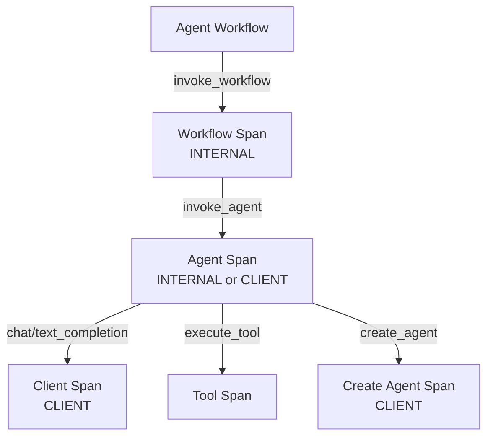

# OpenTelemetry GenAI Semantic Conventions

[[context-engineering|LLM]]·에이전트 텔레메트리를 위한 OTEL 표준 속성·스팬 규약.

## 왜 지금 중요한가

2026년 들어 Datadog·Grafana·Langfuse·Weave가 GenAI semconv를 네이티브 지원하기 시작하면서, 특정 플랫폼 lock-in 없이 에이전트 트레이스를 표준화하는 것이 관측성 스택의 가장 뜨거운 이슈다.

## 대표 레퍼런스

- [OpenTelemetry Semantic Conventions for GenAI Systems](https://opentelemetry.io/docs/specs/semconv/gen-ai/)
- [OpenLLMetry GitHub Repository (Traceloop)](https://github.com/traceloop/openllmetry)
- [Langfuse OpenTelemetry Integration](https://langfuse.com/integrations/native/opentelemetry)
- [Langfuse Observability Overview](https://langfuse.com/docs/observability/overview)
- [OpenTelemetry for Generative AI (OTel Blog)](https://opentelemetry.io/blog/2024/otel-generative-ai/)


### 프로바이더 무관 표준화

OpenAI, Anthropic, Amazon Bedrock 등 복수 벤더의 성능을 표준화된 필드 브레이크다운(모델/프로바이더별)으로 비교할 수 있다. 한 번 OTel로 계측하면 플랫폼별 병렬 계측 경로를 유지할 필요가 없다.

### 에이전트 태스크/액션/아티팩트 트레이싱 확장

`gen_ai.operation.name` 속성이 `tool_call`, `agent_run` 등의 값을 지원하면서, 멀티 에이전트 및 도구 기반 워크플로의 엔드투엔드 트레이싱이 가능해졌다. 오케스트레이션된 AI 시스템 내에서 에이전트와 도구 흐름을 완전히 추적할 수 있다.

### 거버넌스 통합

OpenTelemetry Collector 프로세서를 통해 편집(redaction), 샘플링, 보강(enrichment), 라우팅이 수행되어 텔레메트리 데이터가 네트워크를 떠나기 전에 데이터 정책이 적용된다.

### 2026-04-14 추가 소스

- [Datadog: LLM OTel Semantic Convention](https://www.datadoghq.com/blog/llm-otel-semantic-convention/)
- [Uptrace: OpenTelemetry AI Systems](https://uptrace.dev/blog/opentelemetry-ai-systems)
- [GitHub Issue: Agent Tracing Extension Proposal](https://github.com/open-telemetry/semantic-conventions/issues/2664)

## 2026-05-06 보강 — 표준 명세 정리

> "Existing GenAI instrumentations...SHOULD NOT change the version of the GenAI
> conventions that they emit by default" — 기존 instrumentation 은 default 버전
> 유지하고, 신버전은 `OTEL_SEMCONV_STABILITY_OPT_IN` env var 로 opt-in.

2026-05 시점 status 는 **Development (experimental)** 이며 아직 stable 이 아니다.
4 가지 signal 카테고리 (Spans, Metrics, Events, Exceptions) 에 걸쳐 정의된다.

### Span 종류 — 4 종



#### 1. Create Agent Span

- `gen_ai.operation.name` = `"create_agent"`
- span kind: `CLIENT`
- 용도: 원격 agent service 생성 (OpenAI Assistants API 등)
- span name 규칙: `"create_agent {gen_ai.agent.name}"`

#### 2. Invoke Agent Client Span

- `gen_ai.operation.name` = `"invoke_agent"`
- span kind: `CLIENT`
- 용도: 원격 agent 호출 (OpenAI Assistants, AWS Bedrock Agents)

#### 3. Invoke Agent Internal Span

- `gen_ai.operation.name` = `"invoke_agent"`
- span kind: `INTERNAL`
- 용도: in-process agent 실행 (LangChain, CrewAI)
- span name: `"invoke_agent {gen_ai.agent.name}"` (name 없으면 `"invoke_agent"`)

#### 4. Invoke Workflow Span

- `gen_ai.operation.name` = `"invoke_workflow"`
- span kind: `INTERNAL`
- 용도: multi-agent coordinated execution
- span name: `"invoke_workflow {gen_ai.workflow.name}"`

### Required Attributes (모든 span)

| Attribute | Type | 설명 |
|---|---|---|
| `gen_ai.operation.name` | string | Operation 종류 (`chat`, `generate_content`, `text_completion`, `create_agent`, `invoke_agent`, `invoke_workflow`, `embeddings` 등) |
| `gen_ai.provider.name` | string | 제공자 식별 (`anthropic`, `openai`, `aws.bedrock`, `gcp.vertex_ai`, `azure.ai.openai`, `cohere`, `deepseek`, `gcp.gemini`, `groq`, `ibm.watsonx.ai`, `mistral_ai`, `perplexity`, `x_ai`) |

Create/client invoke span 추가:

- `error.type` (string, conditionally) — 에러 클래스

### Conditionally Required Attributes

#### Agent attributes

| Attribute | 예시 |
|---|---|
| `gen_ai.agent.id` | `asst_5j66UpCpwteGg4YSxUnt7lPY` |
| `gen_ai.agent.name` | `Math Tutor`, `Fiction Writer` |
| `gen_ai.agent.description` | `Helps with math problems` |
| `gen_ai.agent.version` | `1.0.0`, `2025-05-01` |

#### Request/Response

- `gen_ai.request.model` — 호출되는 모델명
- `gen_ai.conversation.id` — session/thread 식별자 (예: `conv_5j66UpCpwteGg4YSxUnt7lPY`)
- `gen_ai.output.type` — content type (`text`, `json`, `image`, `speech`)

#### Server details

- `server.address`, `server.port`

### Recommended Attributes — Request parameters

| Attribute | Type | 예시 |
|---|---|---|
| `gen_ai.request.max_tokens` | int | `100` |
| `gen_ai.request.temperature` | double | `0.0` |
| `gen_ai.request.top_p` | double | `1.0` |
| `gen_ai.request.top_k` | double | `1.0` |
| `gen_ai.request.frequency_penalty` | double | `0.1` |
| `gen_ai.request.presence_penalty` | double | `0.1` |
| `gen_ai.request.stop_sequences` | string[] | `["forest", "lived"]` |
| `gen_ai.request.seed` | int | `100` |
| `gen_ai.request.stream` | boolean | |
| `gen_ai.request.choice.count` | int | `3` |

### Recommended Attributes — Token usage (가장 중요)

| Attribute | 설명 |
|---|---|
| `gen_ai.usage.input_tokens` | input prompt 토큰 수 |
| `gen_ai.usage.output_tokens` | response 토큰 수 |
| `gen_ai.usage.cache_creation.input_tokens` | provider-managed cache 에 쓰인 토큰 |
| `gen_ai.usage.cache_read.input_tokens` | cache 에서 읽은 토큰 |
| `gen_ai.usage.reasoning.output_tokens` | CoT/reasoning 출력 토큰 |
| `gen_ai.token.type` | `input` / `output` |

### Response

- `gen_ai.response.id` — `chatcmpl-123`
- `gen_ai.response.model` — 실제 응답 모델 (예: `gpt-4-0613` ≠ request.model)
- `gen_ai.response.finish_reasons` — `["stop"]`, `["stop", "length"]`
- `gen_ai.response.time_to_first_chunk` — streaming TTFB (seconds)

### Opt-In Attributes (민감 콘텐츠)

기본적으로 **수집 안 함**. 명시적 opt-in 필요:

| Attribute | 설명 |
|---|---|
| `gen_ai.input.messages` | 모델에 보낸 chat history (구조화 JSON, schema 존재) |
| `gen_ai.output.messages` | 모델 응답 메시지 |
| `gen_ai.system_instructions` | system prompt |
| `gen_ai.tool.definitions` | agent 가 사용 가능한 tool 정의 목록 |

> JSON schema 가 명세에 함께 정의되어 있어 (gen-ai-input-messages.json,
> gen-ai-output-messages.json, gen-ai-system-instructions.json,
> gen-ai-tool-definitions.json) exporter 호환성 보장.

### Tool Operation Attributes

| Attribute | 예시 |
|---|---|
| `gen_ai.tool.name` | `Flights` |
| `gen_ai.tool.description` | `Multiply two numbers` |
| `gen_ai.tool.type` | `function`, `extension`, `datastore` |
| `gen_ai.tool.call.id` | `call_mszuSIzqtI65i1wAUOE8w5H4` |
| `gen_ai.tool.call.arguments` | `{"location": "San Francisco"}` |
| `gen_ai.tool.call.result` | `{"temperature_range": {"high": 75, "low": 60}}` |

### Retrieval/RAG attributes

- `gen_ai.retrieval.query.text` — retrieval query
- `gen_ai.retrieval.documents` — 검색된 문서 (구조화 JSON)
- `gen_ai.data_source.id` — 데이터 소스 ID
- `gen_ai.embeddings.dimension.count` — embedding 차원

### Evaluation attributes (eval-in-loop)

| Attribute | 예시 |
|---|---|
| `gen_ai.evaluation.name` | `Relevance`, `IntentResolution` |
| `gen_ai.evaluation.score.value` | `4.0` (double) |
| `gen_ai.evaluation.score.label` | `relevant`, `not_relevant`, `correct`, `incorrect` |
| `gen_ai.evaluation.explanation` | free-form 설명 |

### Workflow & Prompt management

- `gen_ai.workflow.name` — `multi_agent_rag`, `customer_support_pipeline`
- `gen_ai.prompt.name` — `analyze-code`

### Deprecated → Current 매핑

| Old | New |
|---|---|
| `gen_ai.completion` | Event API (제거됨) |
| `gen_ai.prompt` | Event API (제거됨) |
| `gen_ai.system` | `gen_ai.provider.name` |
| `gen_ai.usage.completion_tokens` | `gen_ai.usage.output_tokens` |
| `gen_ai.usage.prompt_tokens` | `gen_ai.usage.input_tokens` |
| `gen_ai.openai.request.response_format` | `gen_ai.output.type` |
| `gen_ai.openai.*` | `openai.*` (provider-specific namespace 분리) |

### MCP (Model Context Protocol) 통합

> "Additionally, the spec includes conventions for the Model Context Protocol (MCP)."

MCP 호출 추적용 별도 convention 이 spec 에 포함되어 Claude/MCP 생태계와 호환.

### Stability & Migration

- **OTEL_SEMCONV_STABILITY_OPT_IN** env var 로 새 spec 버전 점진 채택
- 같은 instrumentation 이 legacy 와 experimental 두 버전 attribute 동시 emit 가능
- v1.36.0 이전 attribute 와의 호환성 layer 제공

### 실무 적용 — Agent Trace 표준화

```python
with tracer.start_as_current_span(
    f"invoke_agent {agent_name}",
    kind=SpanKind.INTERNAL,
    attributes={
        "gen_ai.operation.name": "invoke_agent",
        "gen_ai.provider.name": "anthropic",
        "gen_ai.agent.name": agent_name,
        "gen_ai.agent.id": agent_id,
        "gen_ai.conversation.id": conv_id,
    }
) as agent_span:
    with tracer.start_as_current_span(
        "chat claude-sonnet-4-6",
        kind=SpanKind.CLIENT,
        attributes={
            "gen_ai.operation.name": "chat",
            "gen_ai.provider.name": "anthropic",
            "gen_ai.request.model": "claude-sonnet-4-6",
            "gen_ai.request.max_tokens": 1024,
            "gen_ai.request.temperature": 0.7,
        }
    ) as model_span:
        response = client.messages.create(...)
        model_span.set_attribute("gen_ai.usage.input_tokens", response.usage.input_tokens)
        model_span.set_attribute("gen_ai.usage.output_tokens", response.usage.output_tokens)
        model_span.set_attribute("gen_ai.usage.cache_read.input_tokens",
                                  response.usage.cache_read_input_tokens)
        model_span.set_attribute("gen_ai.response.id", response.id)
        model_span.set_attribute("gen_ai.response.finish_reasons", [response.stop_reason])
```

## 관련 문서

- [[ai-hot-topics-2026-04|2026년 4월 AI 개발 핫토픽 100선]]
- [[pairwise-vs-pointwise-evals|Pairwise vs Pointwise Eval Protocol Bias]]
- [[synthetic-eval-data-generation|Synthetic Eval Data Generation]]
- [[context-engineering|Context Engineering]]
- [[llm-observability-platforms|LLM Observability Platforms]]
- [[agentic-ai-production|Agentic AI 프로덕션 배포 패턴]]
- [[opentelemetry-genai-metrics]] — 7 개 표준 metric 명세
- [[eval-in-loop-pattern]] — eval attribute 활용
- [[agent-error-budget-sre]] — SLI 표준화
- [[agent-observability-tracing]] — agent trace 적용
