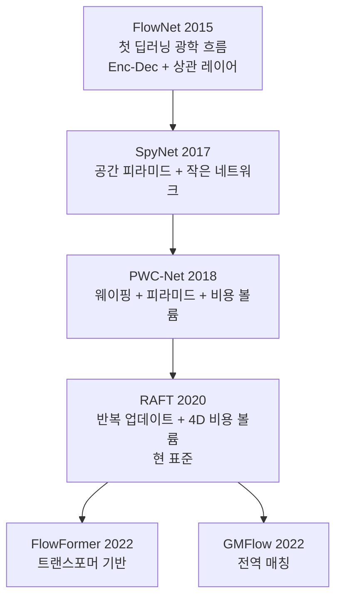
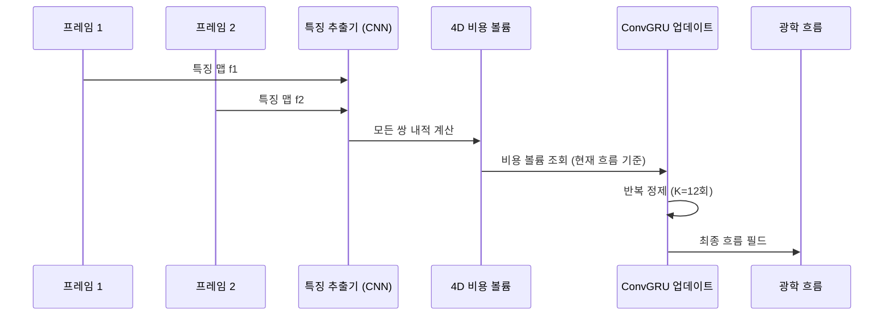

# 광학 흐름 딥러닝 - RAFT와 FlowNet

## 개요

광학 흐름(optical flow)은 연속된 두 이미지 프레임 사이에서 **각 픽셀이 얼마나, 어느 방향으로 이동했는지**를 나타내는 벡터 필드다. 고전적으로는 Lucas-Kanade, Horn-Schunck 알고리즘이 사용됐지만, 딥러닝 기반 방법이 정확도와 속도 모두에서 이를 압도한다. FlowNet(2015)이 시초이며 RAFT(2020)가 현재 표준으로 자리잡았다. [[videomae-masked-video]] 같은 비디오 이해 모델의 전처리 또는 보조 입력으로 활용되며, [[cnn]] 기반 특징 추출이 핵심 구성 요소다.

## 광학 흐름의 수학적 정의

픽셀 $(x, y)$의 시간 $t$에서의 강도를 $I(x, y, t)$라 하면, 밝기 불변 가정(brightness constancy assumption)에 따라:

$$I(x, y, t) = I(x + u, y + v, t + 1)$$

테일러 전개를 취하면:

$$I_x u + I_y v + I_t = 0$$

여기서 $u, v$가 구하고자 하는 광학 흐름 벡터 성분이다. 이 방정식은 하나이고 미지수는 두 개라 **단독으로는 결정 불가능(aperture problem)**하다. 딥러닝은 이 모호성을 데이터 기반으로 해결한다.

## 주요 아키텍처 발전

### FlowNet (2015)

최초의 엔드-투-엔드 광학 흐름 딥러닝 모델. [[cnn]] 인코더-디코더 구조를 사용하며 두 프레임을 채널 방향으로 연결하여 입력한다. **상관 레이어(correlation layer)**를 도입하여 두 프레임 피처 간의 유사도를 명시적으로 계산한다:

$$\text{Corr}(\mathbf{f}_1, \mathbf{f}_2)[\mathbf{x}, \mathbf{d}] = \mathbf{f}_1(\mathbf{x}) \cdot \mathbf{f}_2(\mathbf{x} + \mathbf{d})$$

$\mathbf{d}$는 탐색 변위(displacement) 벡터.

### RAFT - 반복 어텐셔닝과 4D 비용 볼륨 (2020)

RAFT(Recurrent All-Pairs Field Transforms, Princeton, 2020)는 광학 흐름의 현 SOTA 기준점이다.

**핵심 혁신 3가지:**

1. **4D 비용 볼륨**: 두 프레임의 모든 픽셀 쌍 간 상관관계를 미리 계산하고 저장. $(H \times W \times H \times W)$ 크기지만 피라미드로 다운샘플링하여 관리
2. **GRU 기반 반복 업데이트**: 초기 흐름 추정을 ConvGRU로 반복적으로 정제. $K$번 업데이트 후 최종 흐름 출력
3. **분리된 특징 추출**: 외형 피처(appearance)와 컨텍스트 피처(context)를 별도 네트워크로 추출

## 주요 벤치마크 성능 (EPE - End-Point Error, 낮을수록 좋음)

| 모델 | Sintel Clean | Sintel Final | KITTI-15 |
|------|-------------|--------------|----------|
| FlowNet2 | 3.96 | 6.02 | 10.06 |
| PWC-Net | 2.55 | 3.93 | 9.60 |
| RAFT | **1.43** | **2.71** | **5.10** |
| FlowFormer | 1.01 | 2.40 | 4.68 |

## 비디오 이해와의 관계

광학 흐름은 [[videomae-masked-video]] 이전의 비디오 인식 접근에서 핵심 입력이었다. Two-Stream 네트워크(2014)는 RGB 스트림과 광학 흐름 스트림을 별도로 처리 후 합산했다. [[videomae-masked-video]]와 [[timesformer-divided-attention]] 같은 최신 모델은 광학 흐름을 명시적으로 계산하지 않고 시간 어텐션으로 암묵적으로 동작 정보를 학습한다.

그럼에도 광학 흐름은 다음 용도에서 여전히 활용된다:

- **비디오 안정화(stabilization)**: 흔들린 영상 보정
- **슈퍼 레졸루션**: 프레임 보간(DAIN, RIFE)에서 워핑 기반 보간
- **동작 세그멘테이션**: 움직이는 객체 분리

## 자기지도 광학 흐름

레이블 없이 광학 흐름을 학습하는 방법:

1. **UnFlow**: 역방향 흐름의 일관성(cycle consistency) 손실
2. **UPFlow**: 언스플랫팅 피라미드로 자기지도 학습
3. **SMURF(2021)**: 구조적 불확실성과 자기지도 방식 결합

이는 [[videomae-masked-video]]의 자기지도 학습 철학과 맥락을 같이 한다.

## 실시간 처리 방법

RAFT는 정확하지만 반복 업데이트로 인해 느리다. 실시간 응용을 위한 경량화 방법:

- **RAFT-small**: 채널 수 축소 버전, 속도 10배 향상, 성능 소폭 감소
- **FlowNet-s**: 단순한 단일 네트워크 버전
- **FastFlowNet**: 실시간 자율주행 대상, ~90 FPS

## 실무 적용

- **자율주행**: 전방 차량, 보행자의 속도 벡터 추정
- **영화/방송 VFX**: 로토스코핑(rotoscoping), 모션 블러 합성
- **드론 항법**: 지면 기준 자기 운동(ego-motion) 추정
- **의료 영상**: 심장 MRI에서 심근 운동 추적

## 관련 문서

- [[cnn]] - 광학 흐름 특징 추출의 기반 아키텍처
- [[videomae-masked-video]] - 광학 흐름 없이 시간 정보를 암묵적으로 학습
- [[depth-estimation-monocular]] - 깊이 추정과 흐름은 모션 이해의 두 축
- [[video-clip-contrastive]] - 비디오 동작의 상위 수준 의미 이해
