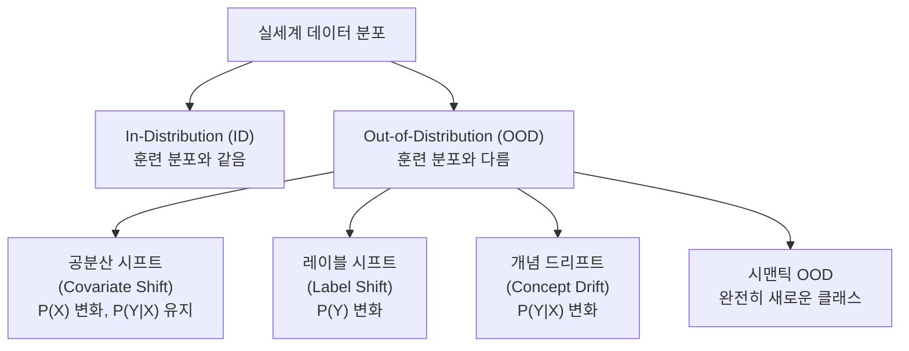
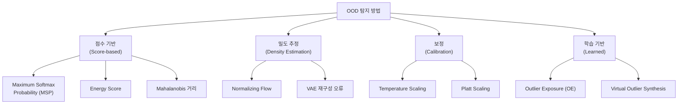
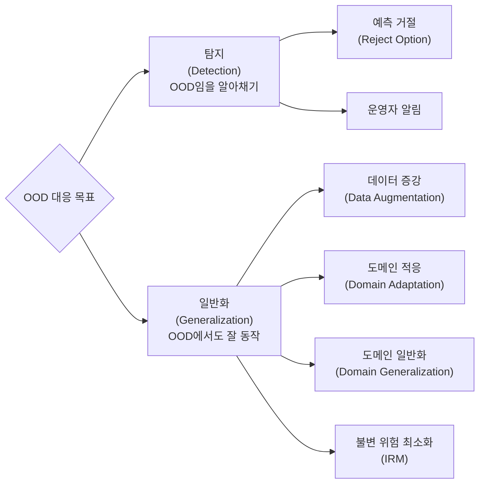

# 분포 외 (Out-of-Distribution, OOD) 탐지와 일반화

분포 외(Out-of-Distribution, OOD) 문제는 머신러닝 모델이 **학습 데이터의 분포(in-distribution)와 다른 입력**을 만났을 때 발생하는 현상과 그 대응 전략을 다룬다. 프로덕션 환경에서 모델이 예상치 못한 입력에 자신 있게 틀린 예측을 내놓는 원인이 된다.

---

## 핵심 개념 구분



**용어 정리**

| 용어 | 의미 | 예시 |
|-----|------|------|
| In-Distribution (ID) | 훈련 데이터와 같은 분포 | 훈련에 쓴 개/고양이 이미지 |
| Covariate Shift | 입력 분포만 다름, 레이블 조건부는 동일 | 야간 촬영 vs 낮 촬영 |
| Label Shift | 클래스 사전 확률 변화 | 훈련 9:1 vs 테스트 1:9 비율 |
| Concept Drift | 입력-레이블 관계 자체 변화 | 스팸 패턴이 시간에 따라 변함 |
| Semantic OOD | 완전히 새로운 클래스 등장 | 개/고양이 분류기에 말 입력 |

---

## 왜 문제인가

일반적인 소프트맥스 분류기는 OOD 입력에도 **높은 신뢰도(confidence)**를 출력하는 경향이 있다.

```
훈련: [개 이미지] → softmax([0.95, 0.05]) → "개" (올바름)
배포: [자동차 이미지] → softmax([0.82, 0.18]) → "개" (틀림, 그러나 자신 있음)
```

이 현상의 원인:
- 소프트맥스는 상대적 점수만 정규화 (절대적 확실성과 무관)
- 훈련 중 본 적 없는 입력에 대한 패널티가 없음
- 신경망은 학습 분포 바깥으로 외삽(extrapolation)하지 못함

**실무 위험**
- 의료 AI: X-ray 품질 불량 이미지를 정상으로 분류
- 자율주행: 훈련에 없던 도로 상황에서 잘못된 결정
- 금융 [[ai-credit-scoring]]: 새 고객 유형에 잘못된 신용 점수 부여

---

## OOD 탐지 방법



### 1. Maximum Softmax Probability (MSP)

가장 단순한 기준선. 소프트맥스 최대값이 낮으면 OOD로 판단.

```python
import torch
import torch.nn.functional as F

def msp_score(model, x):
    """
    낮은 점수 = OOD 가능성 높음
    """
    with torch.no_grad():
        logits = model(x)
        probs = F.softmax(logits, dim=-1)
        score = probs.max(dim=-1).values
    return score
```

**한계**: 소프트맥스 자체가 과신뢰 경향이 있어 ID와 OOD 분리가 어려움.

### 2. Energy Score

로짓(logits)에서 직접 에너지 점수를 계산. MSP보다 OOD 탐지 성능이 우수하다.

$$E(x; f) = -T \cdot \log \sum_{k=1}^{K} e^{f_k(x)/T}$$

```python
def energy_score(model, x, temperature=1.0):
    """
    낮은(더 음수) 에너지 = OOD 가능성 높음
    """
    with torch.no_grad():
        logits = model(x)
        energy = -temperature * torch.logsumexp(logits / temperature, dim=-1)
    return energy
```

### 3. Mahalanobis 거리

클래스별 특성 공간의 가우시안 분포를 추정하고, 새 입력까지의 마할라노비스 거리를 계산.

$$M(x) = \max_c (f(x) - \mu_c)^T \Sigma^{-1} (f(x) - \mu_c)$$

```python
import numpy as np
from sklearn.covariance import EmpiricalCovariance

def compute_mahalanobis_score(features_train, labels_train, features_test):
    """
    클래스별 평균/공분산 추정 후 Mahalanobis 거리 계산
    """
    classes = np.unique(labels_train)
    class_means = []
    for c in classes:
        class_means.append(features_train[labels_train == c].mean(axis=0))

    cov = EmpiricalCovariance(assume_centered=False)
    cov.fit(features_train)
    precision = cov.precision_

    scores = []
    for feat in features_test:
        dists = [
            np.dot(np.dot((feat - mu), precision), (feat - mu))
            for mu in class_means
        ]
        scores.append(min(dists))  # 가장 가까운 클래스까지의 거리
    return np.array(scores)
```

### 4. Temperature Scaling (보정)

출력 확률을 잘 보정하면 OOD 탐지가 개선된다.

$$P(y|x) = \text{softmax}(f(x) / T)$$

```python
class TemperatureScaling(torch.nn.Module):
    def __init__(self):
        super().__init__()
        self.temperature = torch.nn.Parameter(torch.ones(1) * 1.5)

    def forward(self, logits):
        return logits / self.temperature

    def calibrate(self, val_logits, val_labels):
        """
        검증셋으로 최적 온도 T 탐색
        """
        optimizer = torch.optim.LBFGS([self.temperature], lr=0.01, max_iter=50)
        nll_loss = torch.nn.CrossEntropyLoss()

        def eval_fn():
            optimizer.zero_grad()
            loss = nll_loss(self.forward(val_logits), val_labels)
            loss.backward()
            return loss

        optimizer.step(eval_fn)
```

---

## OOD 일반화 전략

탐지는 "OOD를 발견"하고, 일반화는 "OOD에서도 잘 동작"하도록 만드는 것이다.



### 데이터 증강

훈련 중 다양한 변환으로 분포 범위를 넓힘.

```python
from torchvision import transforms

train_transform = transforms.Compose([
    transforms.RandomResizedCrop(224),
    transforms.RandomHorizontalFlip(),
    transforms.ColorJitter(brightness=0.4, contrast=0.4, saturation=0.4),
    transforms.RandomGrayscale(p=0.2),
    transforms.ToTensor(),
    transforms.Normalize(mean=[0.485, 0.456, 0.406],
                         std=[0.229, 0.224, 0.225]),
])
```

### Outlier Exposure (OE)

훈련 중 의도적으로 OOD 샘플(보조 아웃라이어 데이터셋)을 노출시켜 낮은 신뢰도를 출력하도록 학습.

```python
def oe_loss(model, id_inputs, id_labels, ood_inputs, lambda_oe=0.5):
    """
    ID 샘플: 정상 분류 손실
    OOD 샘플: 균일 분포를 출력하도록 유도
    """
    id_logits = model(id_inputs)
    ce_loss = F.cross_entropy(id_logits, id_labels)

    ood_logits = model(ood_inputs)
    oe = -(ood_logits.mean(1) - torch.logsumexp(ood_logits, dim=1)).mean()

    return ce_loss + lambda_oe * oe
```

### 불변 위험 최소화 (Invariant Risk Minimization, IRM)

여러 환경에서 공통적으로 작동하는 불변 특성(invariant feature)을 학습해 도메인 일반화를 달성한다.

$$\min_\Phi \sum_e \mathcal{R}^e(\Phi) \quad \text{s.t.} \quad \Phi \in \arg\min_{\bar\Phi} \mathcal{R}^e(\bar\Phi) \forall e$$

---

## 도메인 시프트 측정

```python
import numpy as np
from scipy.stats import ks_2samp

def detect_distribution_shift(reference_features, production_features):
    """
    Kolmogorov-Smirnov 검정으로 분포 시프트 감지
    각 특성 차원별 p-value 반환
    """
    n_features = reference_features.shape[1]
    results = []

    for i in range(n_features):
        stat, p_value = ks_2samp(
            reference_features[:, i],
            production_features[:, i]
        )
        results.append({"feature": i, "statistic": stat, "p_value": p_value})

    shifted = [r for r in results if r["p_value"] < 0.05]
    return shifted
```

---

## 평가 지표

OOD 탐지 성능 평가에 쓰이는 표준 지표:

| 지표 | 설명 | 해석 |
|-----|------|------|
| AUROC | ROC 곡선 아래 면적 | 1.0 = 완벽, 0.5 = 랜덤 |
| AUPR | Precision-Recall 곡선 아래 면적 | 불균형 데이터에서 유용 |
| FPR@95TPR | TPR 95%일 때 FPR | 낮을수록 좋음 |
| Detection Error | 최적 임계값에서 오류율 | 낮을수록 좋음 |

```python
from sklearn.metrics import roc_auc_score, average_precision_score

def evaluate_ood_detection(id_scores, ood_scores):
    """
    ID: 높은 점수 (정상), OOD: 낮은 점수 (이상)
    레이블: ID=1, OOD=0
    """
    labels = np.concatenate([
        np.ones(len(id_scores)),
        np.zeros(len(ood_scores))
    ])
    scores = np.concatenate([id_scores, ood_scores])

    auroc = roc_auc_score(labels, scores)
    aupr = average_precision_score(labels, scores)

    return {"AUROC": auroc, "AUPR-in": aupr}
```

---

## LLM에서의 OOD 문제

대형 언어 모델에서도 OOD는 다른 형태로 나타난다:

| 현상 | 설명 |
|-----|------|
| 할루시네이션 | 훈련 데이터에 없는 사실을 자신 있게 생성 |
| 도메인 밖 질문 | 의료/법률 전문 지식 부재 시 틀린 답 제공 |
| 날짜 드리프트 | 훈련 컷오프 이후 정보에 대한 답변 오류 |
| 언어 외삽 | 훈련에 적게 포함된 언어에서 성능 저하 |

**LLM OOD 대응**
- RAG (Retrieval-Augmented Generation) [[retrieval-augmented-generation]]으로 외부 지식 보완
- 불확실성 표현 ("모르겠습니다" 출력) 파인튜닝
- 도메인 특화 파인튜닝으로 특정 분포에 적응

---

## 산업별 적용 사례

| 산업 | OOD 시나리오 | 대응 방법 |
|-----|------------|---------|
| 의료 영상 | 새로운 질환 또는 촬영 장비 변경 | Mahalanobis 탐지 + 전문가 리뷰 |
| 자율주행 | 날씨, 조도, 새로운 지형 | 다양한 도메인 학습 + [[domain-adaptation]] |
| 금융 [[ai-credit-scoring]] | 새로운 고객 세그먼트, 경제 위기 | 컨셉 드리프트 모니터링 |
| 제조 [[ai-quality-inspection]] | 새로운 불량 유형 | Anomaly Detection + [[ai-anomaly-detection]] |

---

## 관련 문서

- [[ai-anomaly-detection]] - OOD 탐지와 밀접한 이상 탐지 기법
- [[domain-adaptation]] - OOD 일반화의 핵심 전략
- [[ai-quality-inspection]] - 제조업 OOD 탐지 응용
- [[ai-credit-scoring]] - 금융 OOD 시나리오
- [[calibration-uncertainty]] - 모델 불확실성 보정
- [[distribution-shift-monitoring]] - 프로덕션 분포 모니터링
