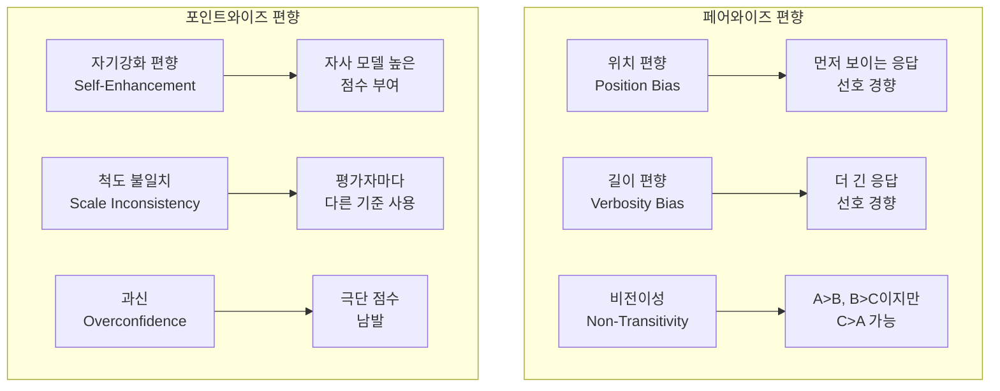

# Pairwise vs Pointwise Eval Protocol Bias

두 응답을 비교해 선호를 판정하는 **페어와이즈(pairwise)** 방식과 각 응답을 독립적으로 절대 점수로 채점하는 **포인트와이즈(pointwise)** 방식의 편향(bias)과 안정성 차이를 분석하는 연구 영역.

## 정의

### 페어와이즈 평가 (Pairwise Evaluation)
두 응답 A, B를 동시에 제시하고 어느 쪽이 더 나은지 판정한다.
```
입력: [응답 A, 응답 B]
출력: "A가 더 좋다" / "B가 더 좋다" / "비슷하다"
```

### 포인트와이즈 평가 (Pointwise Evaluation)
각 응답을 독립적으로 채점한다.
```
입력: [응답 A] → 출력: 점수 (0-10)
입력: [응답 B] → 출력: 점수 (0-10)
```

## 주요 편향 비교



## 핵심 연구 결과

### "비교의 함정" (The Comparative Trap)
2025년 연구에서 페어와이즈 비교가 편향을 **35% 뒤집음률**로 증폭한다는 것이 밝혀졌다. 특히:
- 응답 순서를 바꾸면 (A,B -> B,A) 판정이 바뀌는 비율: 최대 35%
- 길이가 2배인 응답이 품질 무관하게 선호되는 비율: 약 25%

### 비전이성 문제 (Non-Transitivity)
LLM 평가자의 선호가 비전이적(non-transitive)인 경우가 빈번하다:
- A > B (A가 B보다 낫다고 판정)
- B > C
- 그러나 C > A (순환)

이 현상은 ELO 기반 랭킹을 불안정하게 만든다. ELSPR은 이런 비전이 쌍을 학습 데이터에서 제거해 평가자를 정화하는 방법이다.

## 언제 어느 방식을 쓸 것인가

| 상황 | 권장 방식 | 이유 |
|------|----------|------|
| 모델 A vs 모델 B 비교 (대규모) | 페어와이즈 | 상대적 차이 감지 민감도 높음 |
| 단일 모델 품질 측정 | 포인트와이즈 | 절대 기준 필요 |
| CI/CD 회귀 감지 | 포인트와이즈 | 독립 점수로 추세 추적 가능 |
| Human preference 수집 | 페어와이즈 | 인간도 절대 점수보다 비교가 자연스러움 |
| 보상 모델 학습 데이터 | 혼합 | 비전이 쌍 제거 후 페어와이즈 |

## 편향 완화 방법

### 페어와이즈 편향 완화
1. **위치 교환(position swap)**: (A,B)와 (B,A) 모두 평가 후 불일치 시 "동점" 처리
2. **길이 제한**: 두 응답의 길이를 정규화 후 평가
3. **비전이 필터링**: ELSPR 방식으로 비전이 쌍 제거

### 포인트와이즈 편향 완화
1. **앵커 예시 제공**: 각 점수대의 예시 응답을 제공해 척도 통일
2. **보정(calibration)**: Brier 스코어로 과신도 보정
3. **앙상블**: 복수의 약한 평가자를 앙상블해 분산 감소

## 실전 권장

- **모델 랭킹 용도**: 위치 교환 페어와이즈 + 비전이 필터링
- **품질 모니터링 용도**: 루브릭 기반 포인트와이즈 (앵커 예시 포함)
- **비용 절감**: 1차 포인트와이즈로 필터링 -> 상위권만 페어와이즈

## 대표 레퍼런스

- [Pairwise or Pointwise? Evaluating Feedback Protocols for Bias (arXiv:2504.14716)](https://arxiv.org/abs/2504.14716)
- [Aligning with Human Judgement: Pairwise Preference in LLM Evaluators (arXiv:2403.16950)](https://arxiv.org/abs/2403.16950)
- [The Comparative Trap: Pairwise Comparisons Amplify Biased Preferences (arXiv:2406.12319)](https://arxiv.org/html/2406.12319v4)
- [ELSPR: Evaluator LLM Training Data Self-Purification on Non-Transitive Preferences (arXiv:2505.17691)](https://arxiv.org/html/2505.17691)
- [Language Model Preference Evaluation with Multiple Weak Evaluators (arXiv:2410.12869)](https://arxiv.org/html/2410.12869v3)

## 관련 문서

- [[rubric-based-evals|Rubric-Based Evaluation Frameworks]]
- [[llm-as-judge-calibration|LLM-as-Judge Calibration]]
- [[error-analysis-for-evals|Error Analysis for Evals]]
