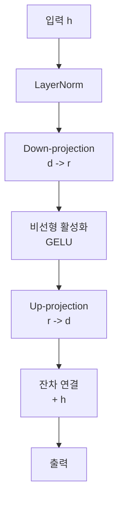
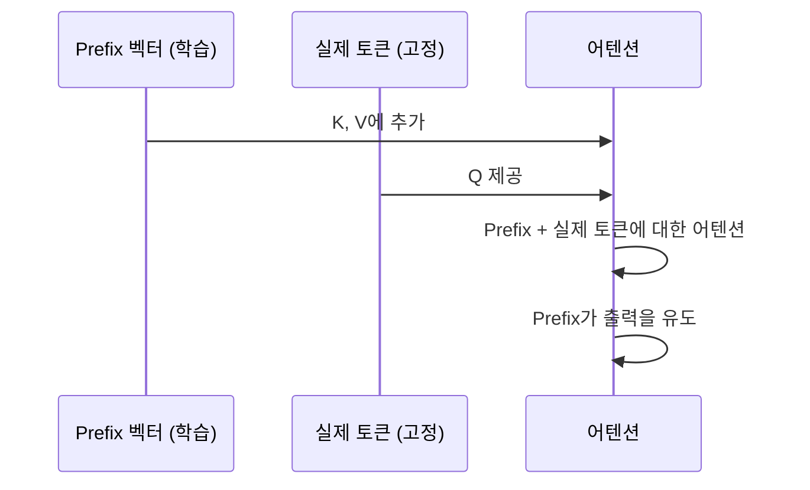
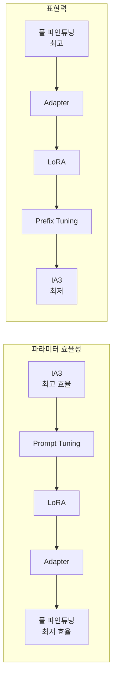
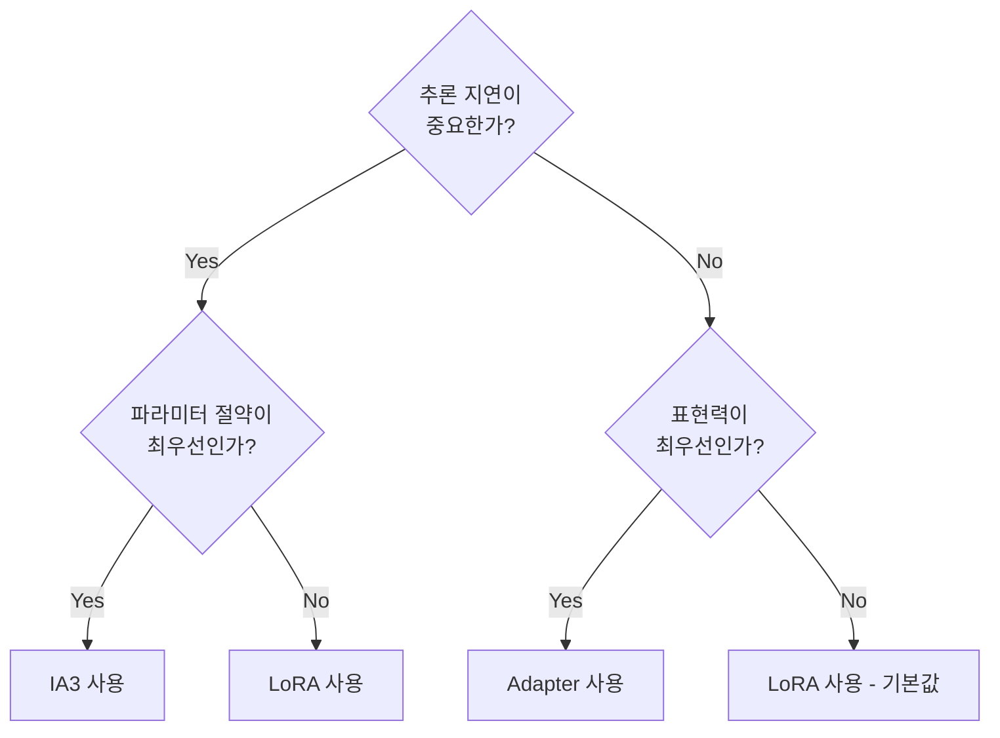

# PEFT 어댑터 서베이

## 개요

PEFT(Parameter-Efficient Fine-Tuning)는 대형 언어 모델의 전체 파라미터를 업데이트하는 대신, 소수의 추가 파라미터만 학습하여 특정 태스크에 적응시키는 기법들의 총칭이다. 모델 크기가 급격히 증가하면서 풀 파인튜닝의 비용이 감당하기 어려운 수준이 됐고, PEFT는 이에 대한 실용적 해결책으로 자리잡았다.

이 페이지는 주요 PEFT 방법들의 이론적 차이, 성능 특성, 적용 시나리오를 비교 분석한다.

## PEFT 방법론 분류

```mermaid
flowchart TD
    PEFT[PEFT 방법론] --> ADD[파라미터 추가형]
    PEFT --> SEL[파라미터 선택형]
    PEFT --> REMAP[파라미터 재매핑형]
    
    ADD --> ADP[Adapter\n병렬/직렬]
    ADD --> PT[Prefix Tuning]
    ADD --> PRT[Prompt Tuning]
    ADD --> LRA[LoRA 계열]
    
    SEL --> SP[Sparse FT\n선택적 업데이트]
    SEL --> BIT[BitFit\nbias만 학습]
    
    REMAP --> IA3[(IA)^3\n내부 활성화 스케일]
    REMAP --> DIF[Diff Pruning]
```

## 1. 어댑터 (Adapter)

원형 어댑터는 Houlsby et al. (2019)이 제안했다. 각 트랜스포머 레이어의 내부에 소형 병목(bottleneck) 모듈을 직렬로 삽입한다.



**구조**: `LayerNorm → Linear(d→r) → Activation → Linear(r→d) → Residual`

**장점**: 이론적으로 이해하기 쉽고 구현이 단순하다  
**단점**: 직렬 삽입이므로 추론 시 추가 지연 발생, 병렬화 불리

### 병렬 어댑터

AdapterFusion, MAM Adapter 등에서 직렬 대신 병렬로 삽입하는 변형을 제안했다. 메인 레이어와 어댑터가 동시에 실행되어 지연이 줄어든다.

## 2. Prefix Tuning

Li and Liang (2021)이 제안. 입력 시퀀스 앞에 학습 가능한 연속 벡터(prefix)를 붙인다. 이 prefix는 어텐션의 Key와 Value에 영향을 미쳐 모델의 행동을 유도한다.



**핵심 특징**: prefix는 실제 토큰이 아닌 임베딩 공간의 연속 벡터다. 해석 불가능하지만 최적화하기 쉽다.

**장점**: 태스크별 prefix만 교체하면 다양한 태스크 서빙 가능  
**단점**: 긴 prefix는 유효 컨텍스트 길이를 잠식, 매우 소량 데이터에서 불안정

## 3. Prompt Tuning

Prefix Tuning의 단순화 버전. 입력 임베딩 레이어에만 소프트 프롬프트를 추가하고 다른 레이어는 건드리지 않는다.

| 항목 | Prefix Tuning | Prompt Tuning |
|------|--------------|---------------|
| 삽입 위치 | 모든 레이어 | 입력 레이어만 |
| 학습 파라미터 | 레이어 수 x prefix 길이 | prefix 길이만 |
| 안정성 | 상대적으로 낮음 | 높음 |
| 표현력 | 높음 | 제한적 |
| 모델 크기 의존성 | 중간 | 높음 (대형 모델에서 더 효과적) |

## 4. LoRA와 변형들

[[lora-theory-mechanism]]에서 상세히 다루므로 여기서는 변형들을 중심으로 비교한다.

### LoRA 변형 비교

| 방법 | 핵심 아이디어 | 개선점 |
|------|-------------|--------|
| LoRA | 저랭크 행렬 분해 | 기준선 |
| AdaLoRA | 중요도에 따라 랭크를 적응적으로 조정 | 고정 랭크 비효율 해소 |
| DyLoRA | 훈련 중 랭크를 무작위 샘플링 | 랭크 검색 비용 절감 |
| LoKr | Kronecker Product 사용 | 다른 분해 방식 |
| DoRA | 방향 + 크기로 분해 | 더 풀 파인튜닝에 근접 |
| rsLoRA | 스케일링 인자 개선 ($1/\sqrt{r}$) | 높은 랭크에서 안정성 |

### [[peft-library]] 지원 현황

Hugging Face PEFT 라이브러리는 이 방법들 대부분을 구현하여 제공한다. 코드 예시:

```python
from peft import LoraConfig, get_peft_model

config = LoraConfig(
    r=16,
    lora_alpha=32,
    target_modules=["q_proj", "v_proj"],
    lora_dropout=0.05,
    bias="none",
    task_type="CAUSAL_LM"
)
model = get_peft_model(base_model, config)
```

## 5. (IA)^3 - Infused Adapter by Inhibiting and Amplifying Inner Activations

Liu et al. (2022)이 제안. 어텐션과 FFN의 내부 활성화를 학습 가능한 벡터로 스케일링한다.

$$K' = l_k \odot K, \quad V' = l_v \odot V, \quad FF' = l_{ff} \odot FF$$

- $l_k, l_v, l_{ff}$: 학습 가능한 스케일 벡터 (행렬 아님!)
- 파라미터 수: 기존 방법들보다 훨씬 적음

**장점**: 극도로 적은 파라미터 (~0.01%), Few-shot 학습에 특히 효과적  
**단점**: 표현력이 제한적, 대규모 태스크 적응에 부족할 수 있음

## 방법론 비교 요약



| 방법 | 파라미터 비율 | 추론 오버헤드 | 표현력 | 추천 사용 시나리오 |
|------|-------------|-------------|--------|-----------------|
| 풀 파인튜닝 | 100% | 없음 | 최고 | 충분한 자원 + 많은 데이터 |
| Adapter | ~3-4% | 있음 (직렬) | 높음 | 다중 태스크 서빙 |
| Prefix Tuning | ~0.1-1% | 컨텍스트 소모 | 중간 | 생성 태스크 |
| Prompt Tuning | ~0.01-0.1% | 컨텍스트 소모 | 낮음 | 대형 모델 + 간단한 태스크 |
| LoRA | ~0.1-1% | 없음 (병합 후) | 높음 | 가장 범용적 |
| (IA)^3 | ~0.01% | 없음 | 낮음 | Few-shot, 다국어 |

## 선택 가이드라인



실무에서는 대부분 **LoRA가 기본값**으로 선택된다. 추론 시 병합하면 오버헤드가 없고, 파라미터 절약도 충분하며, 구현이 안정적이기 때문이다.

## 관련 문서

- [[peft-library]] - Hugging Face PEFT 라이브러리 사용법
- [[lora-theory-mechanism]] - LoRA 이론 상세
- [[lora-qlora-finetuning]] - QLoRA 실무 적용
