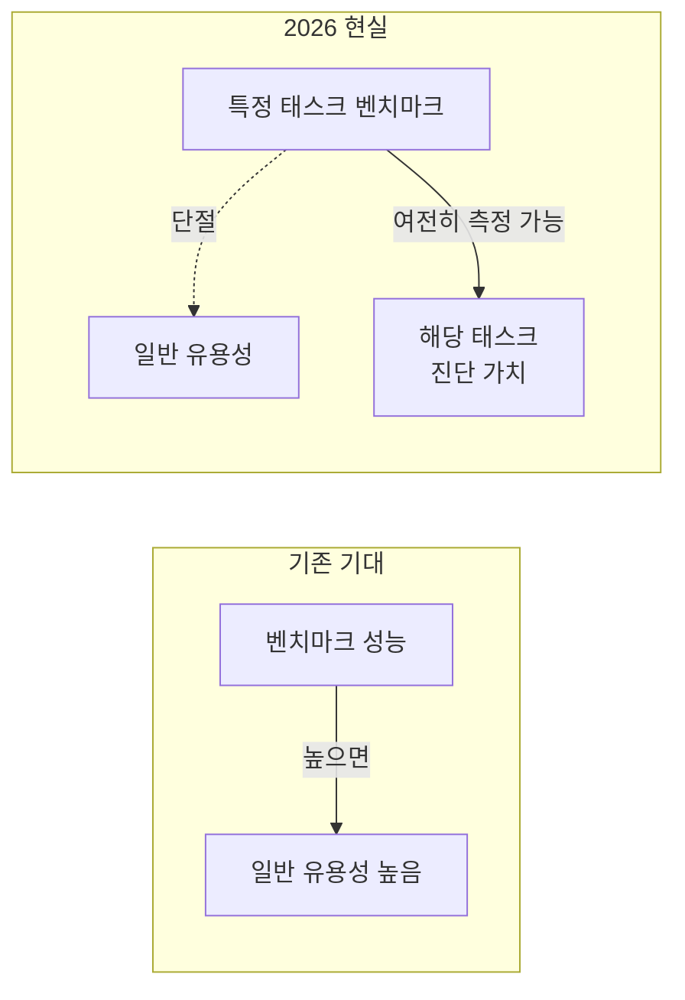

# Pelican 벤치마크

Simon Willison이 개인적으로 사용하는 **비공식 LLM 창작 평가 기준**. "자전거를 탄 펠리컨(pelican riding a bicycle)"을 SVG로 그리게 하는 단일 태스크로, 모델의 SVG 구조 이해 능력과 창작적 표현력을 함께 평가한다. 특정 라이브러리나 채점 기준 없이 주관적으로 판단하는 informal benchmark의 전형적인 사례다.

## 배경과 역사

Willison은 2024년 10월경부터 이 테스트를 여러 모델에 반복 적용해왔다. 초기(2024년 하반기) 모델들은 대부분 기하학적으로 올바른 자전거를 그리지 못했다. 2025-2026년에 들어서며 프론티어 모델들의 SVG 생성 품질이 전반적으로 향상됐다.

**주요 경과:**

| 기간 | 관찰 |
|------|------|
| 2024-10 | 대부분 모델 기하학 오류 (바퀴 없음, 프레임 왜곡) |
| 2025 | 프론티어 모델 개선 시작 |
| 2026-04 | Opus 4.7 여전히 오류 / Qwen3.6 로컬 모델이 역전 |

## informal benchmark란 무엇인가

공식 학술 벤치마크(MMLU, HumanEval, SWE-bench 등)와 달리, informal benchmark는:

- 채점 기준이 주관적이거나 불명확하다
- 재현 환경이 표준화되지 않는다
- 단일 태스크에서 모델 능력의 일부만 측정한다
- 그럼에도 **진화 추적 신호**로 실용적 가치를 갖는다

Willison의 pelican benchmark가 오래 살아남은 이유는 채점의 단순성("자전거가 기하학적으로 올바른가", "펠리컨이 인식 가능한가")과 반복 비교 가능성에 있다.

## 벤치마크-유용성 단절 문제

pelican 사례는 더 넓은 패턴을 드러낸다: **단일 태스크 벤치마크 성능이 모델의 일반 유용성을 대리 지표로 쓰기 어려워지고 있다**.

구체적으로:
- 로컬 20.9GB 양자화 모델이 SVG 창작에서 프리미엄 클라우드 모델을 이길 수 있다
- 그러나 동일 모델이 복잡한 추론, 장기 컨텍스트, 멀티스텝 에이전트 작업에서도 우위를 갖는 것은 아니다

## 한계와 주의사항

- 단일 프롬프트, 단일 출력 비교이므로 확률론적 변동 무시
- 평가자(Willison)의 미적 판단이 개입
- "더 나은 SVG" = "더 나은 모델" 등식 성립하지 않음
- Willison 자신도 "21GB 양자화 모델이 Anthropic 최신 릴리스보다 전반적으로 유용하다고 생각하지 않는다"고 명시

## 관련 문서

- [[pelican-benchmark-qwen-opus|Pelican 벤치마크: Qwen3.6 vs Opus 4.7 비교]]
- [[claude-opus-4-7|Claude Opus 4.7]]
