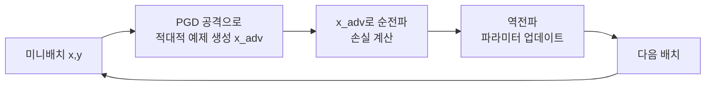

# PGD 적대적 학습 (Projected Gradient Descent Adversarial Training)

PGD(Projected Gradient Descent) 기반 적대적 학습은 Aleksander Madry 등이 2017년 "Towards Deep Learning Models Resistant to Adversarial Attacks"에서 제안한 기법이다. [[fgsm-fast-gradient-sign]]의 단일 스텝 한계를 극복해 **허용된 섭동 범위($\epsilon$-ball) 안에서 가장 강한 적대적 예제를 반복 경사 상승으로 찾고, 이를 학습 데이터로 사용**해 모델을 강건하게 만든다.

## 핵심 아이디어

모델 강건성(robustness)을 미니맥스(minimax) 최적화 문제로 정식화한다:

$$\min_\theta \mathbb{E}_{(x,y)\sim\mathcal{D}}\left[\max_{\delta \in \mathcal{S}} J(\theta, x+\delta, y)\right]$$

- 내부 최대화 $\max$: 현재 모델이 가장 틀리도록 하는 섭동 $\delta$를 탐색
- 외부 최소화 $\min$: 그 최악의 섭동에도 정확히 예측하는 파라미터 학습
- $\mathcal{S}$: 허용 섭동 집합 (보통 $\ell_\infty$ 노름 기준 $\epsilon$-ball)

이 내부 최대화를 여러 스텝으로 수행하는 것이 PGD 공격이다.

## PGD 공격 알고리즘

```mermaid
flowchart TD
    A[원본 입력 x] --> B[무작위 초기화\nx_0 = x + uniform noise]
    B --> C{반복 t = 1..K}
    C --> D[순전파 + 손실 계산\nJ θ, x_t, y]
    D --> E[역전파로 기울기 계산\nnabla_x J]
    E --> F[경사 상승 한 스텝\nx' = x_t + alpha * sign nabla_x J]
    F --> G[투영: eps-ball 내로 클리핑\nx_{t+1} = Proj eps-ball x']
    G --> C
    C -->|K번 완료| H[최종 적대적 예제 x_K]
```

각 스텝에서 허용 범위를 벗어나면 가장 가까운 경계로 투영(projection)한다. $\ell_\infty$ 기준이라면 단순 클리핑으로 구현된다.

### FGSM과의 차이

| 항목 | FGSM | PGD |
|------|------|-----|
| 스텝 수 | 1 | K (보통 7~40) |
| 초기화 | 원본 입력 | 랜덤 노이즈 추가 |
| 공격 강도 | 약함 | 강함 (nearly optimal) |
| 계산 비용 | 낮음 | K배 높음 |
| 방어 효과 | 약한 방어 | 더 신뢰성 있는 방어 |

## PGD 적대적 학습 절차



학습 루프 안에서 매 미니배치마다 PGD 공격을 실행해 가장 어려운 예제를 생성하고, 그 예제로 모델을 업데이트한다. 학습 비용은 일반 학습 대비 K배 증가하지만, 실질적 강건성은 크게 향상된다.

## $\ell_p$ 노름 위협 모델

PGD는 위협 모델(threat model)에 따라 변형된다:

- **$\ell_\infty$**: 모든 픽셀을 최대 $\epsilon$만큼 바꿀 수 있음 - 가장 일반적
- **$\ell_2$**: 전체 섭동의 유클리드 거리를 $\epsilon$ 이내로 제한
- **$\ell_1$**: 희소한(sparse) 섭동 허용

실무에서는 $\ell_\infty$ 위협 모델이 가장 많이 쓰이며, CIFAR-10 기준 $\epsilon=8/255$가 표준 벤치마크다.

## Madry et al. 의 핵심 주장

1. **PGD는 1차 방법(first-order method)의 최선**: 기울기 정보만 사용하는 공격 중 PGD가 가장 강하다
2. **안장점(saddle point) 수렴**: 미니맥스 문제의 안장점이 실용적으로 의미 있는 강건한 모델
3. **확장성**: 대규모 모델(ResNet, VGG 등)에도 적용 가능

이후 AutoAttack(2020)이 등장해 PGD보다 더 신뢰성 있는 평가 기준으로 자리잡았지만, PGD는 학습 기법으로는 여전히 광범위하게 사용된다.

## 강건성-정확도 트레이드오프

PGD 적대적 학습의 핵심 한계는 **클린 정확도(clean accuracy)가 감소**한다는 점이다.

- CIFAR-10 ResNet-50 기준: 클린 정확도 ~94% → 적대적 학습 후 ~85%
- 강건 정확도(robust accuracy): 0% → ~50% ($\ell_\infty$, $\epsilon=8/255$)

이 트레이드오프를 줄이기 위한 연구로 TRADES, AWP, HAT 등이 제안되었다.

## 구현 예시

```python
import torch

def pgd_attack(model, loss_fn, x, y, epsilon=8/255, alpha=2/255, num_steps=20):
    x_adv = x + torch.zeros_like(x).uniform_(-epsilon, epsilon)
    x_adv = torch.clamp(x_adv, 0, 1).detach()

    for _ in range(num_steps):
        x_adv.requires_grad_(True)
        output = model(x_adv)
        loss = loss_fn(output, y)
        loss.backward()

        with torch.no_grad():
            x_adv = x_adv + alpha * x_adv.grad.sign()
            # eps-ball 내로 투영
            delta = torch.clamp(x_adv - x, -epsilon, epsilon)
            x_adv = torch.clamp(x + delta, 0, 1)

    return x_adv.detach()
```

## [[adversarial-robustness-certified]] 와의 관계

PGD 적대적 학습은 실증적(empirical) 강건성을 제공하지만, 수학적 보장(certified robustness)은 아니다. 즉, 새로운 공격이 등장하면 PGD-robust 모델도 뚫릴 수 있다. 수학적 보장이 필요한 경우 무작위 평활화(randomized smoothing) 같은 기법이 필요하다.

## 실무 관점

- 이미지 분류, 객체 검출, 자연어 처리 등 다양한 도메인에 적용 가능
- GPU 메모리는 동일하지만 학습 시간이 K배 증가 - K=7이 비용/효과 절충점으로 자주 사용
- [[adversarial-attacks-robustness]] 벤치마크(RobustBench)에서 PGD-AT 기반 모델들이 상위권 차지
- 의료 영상, 자율주행 같은 안전-크리티컬 시스템에서 점점 더 필수 요건으로 간주

## 관련 문서
- [[robustness-generalization-tradeoff]] -- 강건성-일반화 트레이드오프
- [[autoattack-benchmark]] -- AutoAttack 벤치마크

- [[adversarial-attacks-robustness]] - 적대적 공격 전반과 평가 프레임워크
- [[fgsm-fast-gradient-sign]] - PGD의 전신인 단일 스텝 공격 기법
- [[adversarial-robustness-certified]] - 실증적 방어를 넘어 수학적 보장 제공
