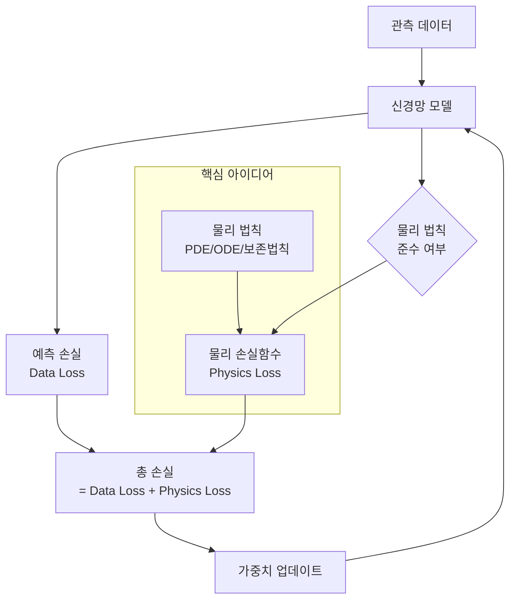

# Physics-Informed Machine Learning (PIML)

물리 법칙을 기계학습 모델에 제약조건(constraint)으로 통합하는 접근. AI가 복잡한 데이터셋을 처리하면서도 물리 법칙을 준수하도록 보장한다. 순수 데이터 기반 ML이 물리적으로 불가능한 예측을 생성하는 문제를 해결한다.

## 왜 중요한가

- **더 정확한 예측**: 물리적 일관성이 보장되어 학습 데이터 분포 외에서도 일반화 성능이 높다
- **더 적은 데이터 요구**: 물리 법칙이 사전지식(prior)으로 작용하여 데이터 효율성이 높다
- **2026년 돌파구**: University of Hawaii에서 유체역학/기후 모델링 정확도 개선, NS-VLA에서 에너지 100x 절감 + 정확도 향상을 동시 달성

## 핵심 기법

이 다이어그램은 PIML의 학습 루프를 보여준다. 기존 데이터 손실에 물리 법칙 준수를 검증하는 물리 손실(physics loss)이 추가되어, 모델이 물리 법칙에 부합하는 예측을 학습한다.

## 4가지 핵심 기법

### 1. Physics-Informed Neural Networks (PINNs)

편미분방정식(PDE)을 손실함수에 직접 통합한다. 모델의 출력이 PDE를 만족하도록 자동미분으로 잔차(residual)를 계산하고 이를 최소화한다. 가장 널리 연구되는 접근이다.

### 2. Neural ODE

상미분방정식(ODE) 솔버를 신경망 레이어로 사용한다. 연속적 시간 역학(continuous-time dynamics)을 모델링하며, 불규칙 시계열이나 연속 정규화 흐름(continuous normalizing flow)에 적합하다.

### 3. Hamiltonian/Lagrangian Neural Networks

에너지 보존 법칙을 아키텍처 자체에 인코딩한다. 해밀토니안 역학 또는 라그랑지안 역학의 구조를 신경망 아키텍처에 반영하여 에너지 보존이 구조적으로 보장된다.

### 4. Equivariant Neural Networks

대칭성(symmetry) -- 회전, 평행이동, 반사 -- 을 보존하는 아키텍처. 3D 분자 구조, 입자 물리학 등 대칭성이 핵심인 도메인에서 데이터 효율성과 일반화를 크게 향상한다.

## 응용 분야

| 분야 | 적용 예 |
|------|---------|
| 유체역학 | 난류 시뮬레이션, 항공 설계 |
| 기후 모델링 | 날씨 예측, 해양 순환 모델 |
| 분자 동역학 | 단백질 접힘, 신약 발견 |
| 구조 공학 | 응력/변형 해석, 수명 예측 |
| 로보틱스 제어 | [[vla-models\|VLA]] 모델의 물리 기반 제어 |
| 의료 영상 | 물리적 제약이 있는 MRI 재구성 |

## 관련 문서

- [[vla-models]] -- VLA 모델에서 NS-VLA가 물리 기반 접근으로 100x 에너지 절감 달성
- [[scaling-laws]] -- 신경망 스케일링 법칙: PIML에서도 데이터/모델 크기의 스케일링이 중요
