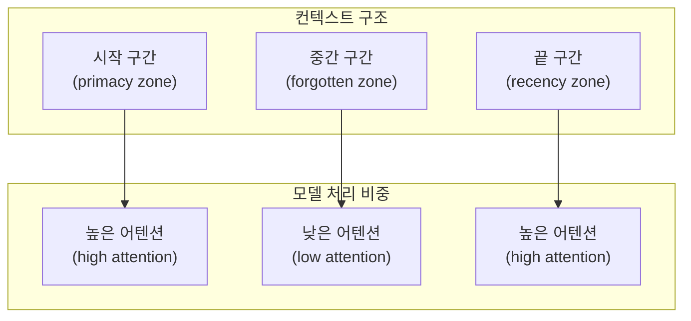
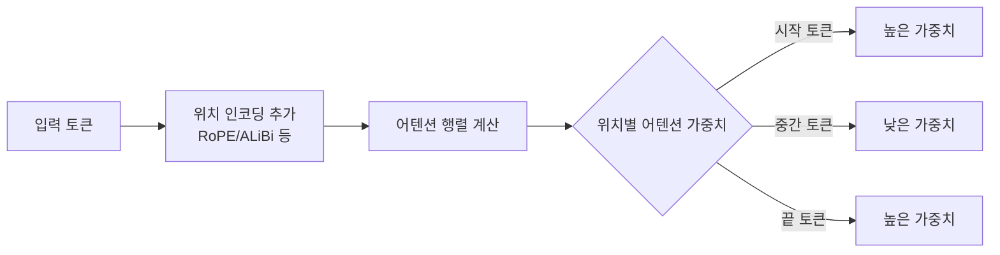
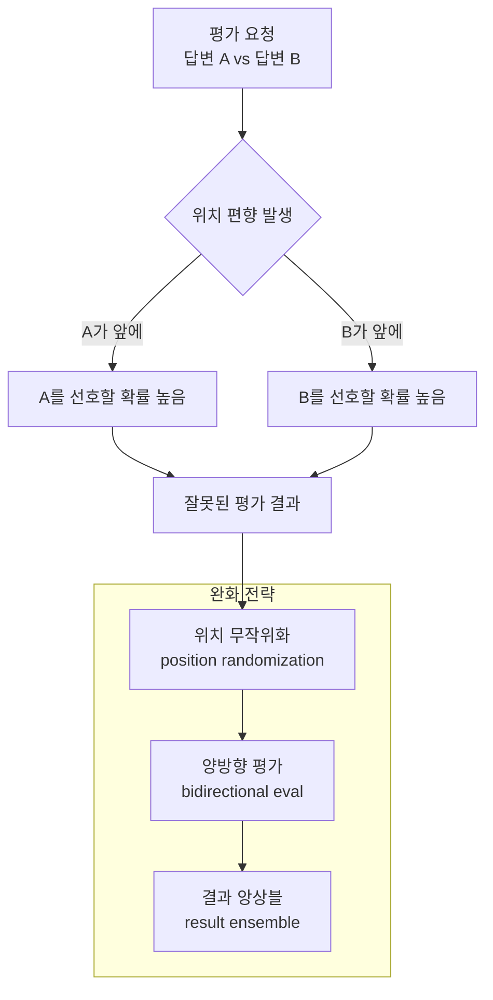

# LLM 위치 편향 (Positional Bias in LLMs)

## 정의 / 본질

위치 편향(positional bias)이란 LLM이 입력 컨텍스트에서 **토큰의 의미적 중요도와 무관하게 위치(position)만으로 처리 우선순위를 결정하는 경향**을 말한다. 모델은 프롬프트 내 모든 위치를 균등하게 처리해야 이상적이지만, 실제로는 특정 위치(시작, 끝)의 내용에 불균형하게 높은 주의(attention)를 기울인다.

이 현상은 두 가지 주요 형태로 나타난다:

- **시작 위치 편향(primacy bias)**: 컨텍스트 맨 앞에 등장한 정보를 과대평가
- **끝 위치 편향(recency bias)**: 컨텍스트 맨 뒤에 등장한 정보를 과대평가

그 결과, 컨텍스트 **중간에 위치한 관련 정보는 무시되는 경향**이 나타나는데, 이를 [[lost-in-the-middle]] 현상이라 부른다.

---

## 핵심 아이디어

### 위치별 처리 우선순위 분포



이 U자형 분포는 긴 컨텍스트에서 특히 두드러진다. 관련 문서가 컨텍스트 중간에 배치될수록 모델 응답 품질이 저하된다.

### 어텐션 메커니즘과의 관계

위치 편향은 트랜스포머(Transformer)의 셀프 어텐션(self-attention)이 위치 인코딩(positional encoding)과 상호작용하는 방식에서 기원한다.



RoPE(Rotary Position Embedding)나 ALiBi(Attention with Linear Biases) 같은 상대적 위치 인코딩 방식도 이 편향을 완전히 제거하지는 못한다. 학습 데이터 자체의 구조적 특성(예: 문서 시작에 중요 정보를 두는 인간 글쓰기 관습)이 편향을 강화하기 때문이다.

---

## Lost-in-the-Middle 현상

2023년 Liu et al.의 연구 "Lost in the Middle: How Language Models Use Long Contexts"에서 체계적으로 분석된 현상이다. 다수의 문서 중 답변에 필요한 문서를 특정 위치에 삽입하고 모델 성능을 측정한 결과, **문서가 컨텍스트 중간에 있을 때 성능이 가장 낮았다**.

### 위치별 정답률 패턴

| 관련 문서 위치 | 모델 성능 |
|---------------|-----------|
| 컨텍스트 맨 앞 | 높음 |
| 컨텍스트 중간 | 낮음 (최저점) |
| 컨텍스트 맨 뒤 | 높음 |

이 패턴은 GPT-3.5, GPT-4, Claude 등 여러 모델에서 공통으로 관찰되었다. 컨텍스트 길이가 길어질수록 중간 구간의 성능 저하가 더 심해지는 경향이 있다.

---

## 평가 시 위치 무작위화

위치 편향은 LLM을 평가자(judge)로 사용할 때 심각한 문제를 야기한다. 예를 들어 "두 답변 A, B 중 어느 것이 더 좋은가?" 유형의 평가에서, 모델은 먼저 제시된 답변(위치 편향)이나 더 길거나 상세한 답변(길이 편향)을 선호하는 경향이 있다.



### 위치 무작위화 전략

평가 신뢰성을 높이려면 **같은 페어를 두 번 평가**해야 한다: 한 번은 A-B 순서로, 한 번은 B-A 순서로. 두 결과가 일치할 때만 결론을 확정한다.

```python
import random
from typing import Literal

def evaluate_with_position_control(
    judge_llm,
    response_a: str,
    response_b: str,
    question: str,
) -> Literal["A", "B", "tie", "inconsistent"]:
    """위치 무작위화를 적용한 LLM 평가."""

    def run_eval(first: str, second: str) -> str:
        prompt = f"""질문: {question}

답변 1: {first}

답변 2: {second}

어느 답변이 더 좋습니까? "1" 또는 "2" 또는 "동등"으로만 답하세요."""
        return judge_llm.invoke(prompt).content.strip()

    # 두 방향으로 평가
    result_ab = run_eval(response_a, response_b)
    result_ba = run_eval(response_b, response_a)

    # 결과 정규화
    winner_ab = "A" if "1" in result_ab else ("B" if "2" in result_ab else "tie")
    # B-A 순서에서 "1"은 실제로 B
    winner_ba = "B" if "1" in result_ba else ("A" if "2" in result_ba else "tie")

    if winner_ab == winner_ba:
        return winner_ab
    return "inconsistent"
```

---

## 모델별 위치 편향 경향

```mermaid
flowchart LR
    subgraph 강한 편향
        A[초기 GPT-3급 모델]
        B[짧은 컨텍스트 파인튜닝 모델]
    end
    subgraph 중간 편향
        C[GPT-4-turbo\n128k 컨텍스트]
        D[Claude 2\n100k 컨텍스트]
    end
    subgraph 약한 편향\n(개선 중)
        E[Gemini 1.5 Pro\n1M 컨텍스트]
        F[Claude 3.5+]
    end
```

컨텍스트 길이 확장 연구와 함께 위치 편향 완화 기법도 발전하고 있다. 그러나 2026년 현재까지도 완전한 해결책은 없다.

---

## 완화 전략

### 1. 프롬프트 구성 전략

가장 중요한 정보를 프롬프트의 **시작 또는 끝**에 배치한다. 검색된 문서를 삽입할 때 관련성 높은 문서를 앞이나 뒤에 놓는다.

```python
def arrange_contexts_for_llm(
    contexts: list[str],
    relevance_scores: list[float],
) -> list[str]:
    """관련성 점수 기반으로 컨텍스트 배열 최적화.
    
    가장 관련성 높은 항목을 앞뒤로 배치하고
    낮은 항목을 중간에 배치한다.
    """
    ranked = sorted(zip(relevance_scores, contexts), reverse=True)
    _, sorted_contexts = zip(*ranked)

    n = len(sorted_contexts)
    result = [""] * n

    # 짝수 인덱스: 앞에서부터 채우기 (관련성 1위, 3위, 5위...)
    # 홀수 인덱스: 뒤에서부터 채우기 (관련성 2위, 4위, 6위...)
    front_idx = 0
    back_idx = n - 1
    for i, ctx in enumerate(sorted_contexts):
        if i % 2 == 0:
            result[front_idx] = ctx
            front_idx += 1
        else:
            result[back_idx] = ctx
            back_idx -= 1

    return result
```

### 2. 컨텍스트 압축

긴 컨텍스트를 그대로 전달하는 대신, 질문과 관련 없는 부분을 제거하거나 요약해서 전달한다. 이렇게 하면 중간 구간 자체가 줄어든다.

### 3. 다중 청크 전략

한 번에 전체 컨텍스트를 주지 않고, 청크(chunk) 단위로 나눠서 각각 처리한 뒤 결과를 합산하는 MapReduce 패턴을 사용한다.

### 4. 명시적 어텐션 유도

프롬프트에 "다음은 가장 관련성 높은 정보입니다"와 같은 명시적 안내를 추가해 모델이 해당 구간에 집중하도록 유도한다. 완전한 해결책은 아니지만 경험적으로 효과가 있다.

---

## 한계 / 비판

### 1. 학습 데이터 근본 원인

위치 편향의 근본 원인은 인간이 작성한 텍스트의 구조적 특성 - 중요한 내용을 처음과 끝에 두는 관습 - 이 학습 데이터에 반영된 것이다. 이는 모델 아키텍처가 아닌 **데이터 분포**의 문제이므로 아키텍처 변경만으로는 해결하기 어렵다.

### 2. 컨텍스트 길이 확장의 역설

컨텍스트 창이 길어질수록 중간 구간이 넓어져 편향의 영향 범위가 커진다. 단순히 컨텍스트 창을 늘리는 것이 해결책이 아닌 이유다.

### 3. 태스크 의존성

위치 편향의 강도는 태스크 유형에 따라 다르다. 단답형 QA에서는 강하게 나타나지만, 창의적 글쓰기처럼 전체 컨텍스트가 균등하게 중요한 태스크에서는 다르게 나타날 수 있다.

---

## 관련 문서

- [[lost-in-the-middle]] - 중간 컨텍스트 망각 현상 상세
- [[long-context]] - 긴 컨텍스트 처리 기법 전반
- [[recency-bias-llm]] - 최근성 편향 (끝 위치 과대평가)
- [[llm-as-judge]] - LLM 평가자 사용 시 편향 문제
- [[evaluation-bias]] - LLM 평가의 다양한 편향 유형
- [[agent-context-management]] - 에이전트에서 컨텍스트 관리 전략
