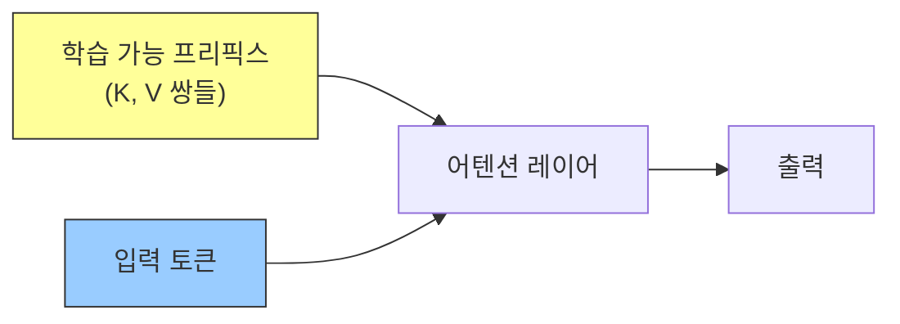
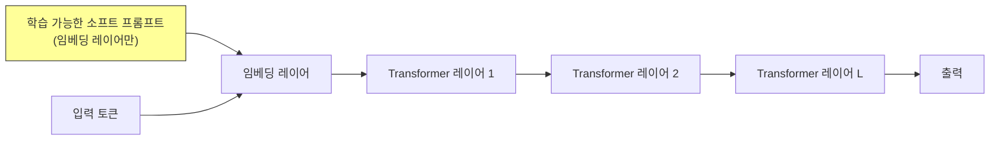

# 프리픽스 튜닝과 프롬프트 튜닝

## 개요

프리픽스 튜닝(prefix tuning)과 프롬프트 튜닝(prompt tuning)은 **사전 학습 모델의 파라미터를 동결(freeze)**한 채로, 소수의 추가적인 학습 가능한 벡터만으로 모델을 특정 작업에 적응시키는 파라미터 효율적 파인튜닝(PEFT) 기법이다. 수십억 개의 파라미터 전체를 조정하는 전통적 파인튜닝에 비해 수백~수천 배 적은 파라미터로 유사한 성능을 달성할 수 있다.

## 배경: 왜 PEFT인가

GPT-3가 175B 파라미터를 가졌을 때, 각 다운스트림 작업마다 전체 모델을 파인튜닝하는 것은 현실적으로 불가능하다.

- **저장 비용**: 작업당 175B 파라미터 복사본 저장 불가
- **학습 비용**: 전체 파인튜닝에 필요한 GPU 메모리와 시간
- **재앙적 망각**: 전체 파인튜닝 시 원래 능력 손실 위험

PEFT는 이 문제를 "모델 파라미터는 고정, 소수의 추가 파라미터만 학습"으로 해결한다.

## 프리픽스 튜닝 (Prefix Tuning)

Li & Liang(2021) "Prefix-Tuning: Optimizing Continuous Prompts for Generation"에서 제안.

### 핵심 아이디어

Transformer의 각 레이어에 **학습 가능한 Key-Value 쌍들**을 앞에 붙인다(prefix).

- 이 KV 쌍들은 실제 토큰이 아닌 **연속적인 벡터(continuous vectors)**
- 자연어 프롬프트("Summarize the following:")는 이산적(discrete)이지만, 프리픽스는 연속적이므로 경사 하강법으로 직접 최적화 가능
- 모든 Transformer 레이어에 추가 (깊은 영향력)

### 수식

일반 어텐션: $\text{Attention}(Q, K, V)$

프리픽스 어텐션: $\text{Attention}(Q, [K_{prefix}; K], [V_{prefix}; V])$

$K_{prefix}, V_{prefix}$는 학습 가능한 파라미터. $[\cdot;\cdot]$은 시퀀스 방향 연결.

### 학습 안정화

저자들은 직접 KV 벡터를 최적화하면 불안정하다고 발견. 실제로는 **리파라미터화(reparameterization)** 사용:

- MLP로 작은 파라미터 행렬을 고차원 KV로 투영
- 학습 완료 후 MLP는 버리고 KV만 저장

### 파라미터 수

- 일반적으로 프리픽스 토큰 10-100개
- 전체 파라미터의 약 0.1% 미만

## 프롬프트 튜닝 (Prompt Tuning)

Lester et al.(2021) "The Power of Scale for Parameter-Efficient Prompt Tuning"에서 제안. 프리픽스 튜닝보다 더 단순한 방식.

### 프리픽스 튜닝과의 차이

| 항목 | 프리픽스 튜닝 | 프롬프트 튜닝 |
|------|------------|------------|
| 추가 위치 | **모든 레이어**의 KV | **임베딩 레이어만** |
| 파라미터 수 | 더 많음 | 더 적음 (극소) |
| 성능 | 더 높음 (소형 모델) | 대형 모델에서 동등 |
| 구현 복잡도 | 중간 | 매우 단순 |

### 스케일 의존성

논문의 핵심 발견: **모델 크기가 충분히 크면 프롬프트 튜닝이 전체 파인튜닝과 동등하다.**

- T5-Small(60M): 전체 파인튜닝보다 크게 열등
- T5-Large(770M): 격차 좁혀짐
- T5-XXL(11B): 전체 파인튜닝과 거의 동등

## P-Tuning v2 (심층 프롬프트 튜닝)

Liu et al.(2022). 프리픽스 튜닝의 아이디어를 NLU(분류) 작업에 적용.

- 모든 Transformer 레이어에 학습 가능한 프롬프트 추가 (프리픽스 튜닝과 유사)
- BERT/GPT-2 같은 소형 모델에서도 효과적 (프롬프트 튜닝의 스케일 의존성 극복)
- NER, 질의응답, 분류 등 다양한 NLU 벤치마크에서 전체 파인튜닝과 동등

## LoRA와의 비교

LoRA(Low-Rank Adaptation)는 현재 가장 많이 사용되는 PEFT 기법이다.

| 기준 | 프리픽스 튜닝 | 프롬프트 튜닝 | LoRA |
|------|------------|------------|------|
| 파라미터 수 | 매우 적음 | 극소 | 적음 (r에 따라) |
| 학습 안정성 | 중간 (리파라미터화 필요) | 높음 | 높음 |
| 성능 (소형 모델) | 좋음 | 보통 | 좋음 |
| 성능 (대형 모델) | 좋음 | 전체 파인튜닝과 동등 | 전체 파인튜닝과 동등 |
| 추론 오버헤드 | 없음 (접합 후) | 없음 | 없음 (병합 가능) |
| 유연성 | 낮음 (KV만) | 낮음 | 높음 (어느 행렬이든) |

**왜 LoRA가 더 많이 사용되는가:**
- 더 직관적인 설명(행렬 분해)
- 안정적인 학습
- 다양한 아키텍처에 쉽게 적용
- 학습 완료 후 원본 모델에 합산해 추론 오버헤드 제거 가능

## 소프트 프롬프트 vs 하드 프롬프트

| 종류 | 특징 |
|------|------|
| 하드 프롬프트 (Hard Prompt) | 실제 토큰(단어)으로 구성, 사람이 읽을 수 있음, 이산적 최적화 필요 |
| 소프트 프롬프트 (Soft Prompt) | 연속 벡터, 해석 어려움, 경사 하강법으로 직접 최적화 가능 |

소프트 프롬프트는 종종 자연어로 해석 불가능한 벡터로 수렴한다. 이는 모델이 사람이 이해하기 어려운 표현 공간에서 작업을 표현하고 있음을 시사한다.

## 실무 관점

프리픽스 튜닝과 프롬프트 튜닝은 **매우 빠른 작업 전환이 필요한 시나리오**에서 장점을 발휘한다. 수백 개의 작업에 대해 각각 LoRA 어댑터를 저장하는 것도 무겁다면, 프롬프트 튜닝은 작업당 수 KB의 소프트 프롬프트만 저장하면 된다. 단, 최근 연구 트렌드는 LoRA와 그 변형(QLoRA, DoRA 등)이 지배적이며, 소프트 프롬프트 기법의 실용 사용은 특수 케이스에 한정된다.

## 관련 문서

- [[LoRA/QLoRA]]
- [[PEFT 라이브러리]]
- [[전이 학습]]
- [[LLM 지식 증류]]
- [[어댑터 기반 파인튜닝 (Adapter Tuning)]]
- [[prompt-engineering|프롬프트 엔지니어링]]
