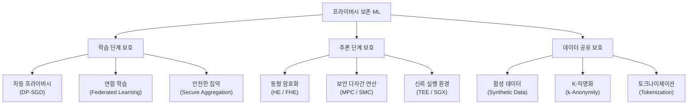

# 프라이버시 보존 머신러닝 (Privacy-Preserving ML)

## 개요

프라이버시 보존 머신러닝(Privacy-Preserving Machine Learning, PPML)은 모델 학습과 추론 과정에서 민감한 데이터의 노출을 최소화하면서도 유용한 예측이나 분석을 수행하는 기술 체계를 총칭한다. GDPR, HIPAA, CCPA 같은 데이터 규제가 강화되고 데이터 유출 사고가 반복되면서, PPML은 연구 주제를 넘어 프로덕션 시스템에서 반드시 고려해야 할 엔지니어링 요구사항이 되었다.

PPML이 다루는 위협 모델은 크게 세 가지다:

1. **데이터 접근 위협**: 학습 데이터 자체가 외부에 노출되는 경우
2. **모델 역추론 위협**: 완성된 모델로부터 학습 데이터를 역추론(멤버십 추론, 모델 역전 공격)하는 경우
3. **추론 시 노출 위협**: 쿼리 데이터가 서버에 평문으로 전달되는 경우

## 핵심 기술 분류



위 분류도는 PPML 기술을 학습 단계, 추론 단계, 데이터 공유 단계로 나누어 각 핵심 기법이 어느 위협을 해결하는지 보여준다.

---

## 1. 차등 프라이버시 (Differential Privacy)

[[differential-privacy]]에서 상세히 다루지만, PPML 맥락에서 핵심은 DP-SGD(Differentially Private SGD)다. 모델이 특정 개인 데이터를 "기억(memorize)"하지 못하도록 학습 단계에서 그래디언트에 조정된 노이즈를 추가한다.

**적용 레이어**:
- **로컬 DP**: 클라이언트가 데이터를 서버로 보내기 전에 노이즈 적용. 서버를 신뢰하지 않는 환경
- **글로벌 DP**: 서버에서 집약된 통계에 노이즈 적용. 클라이언트를 어느 정도 신뢰하는 환경

**실무 트레이드오프**:
- 강한 프라이버시($\varepsilon$ 작을수록) = 큰 노이즈 = 정확도 하락
- 대규모 데이터셋에서는 노이즈 영향이 희석되어 트레이드오프가 완만해짐
- LoRA 파인튜닝과 결합 시 파라미터 수가 줄어 동일 $\varepsilon$에서 더 낮은 노이즈로 학습 가능

---

## 2. 연합 학습 (Federated Learning)

[[federated-learning]]은 원본 데이터를 서버에 보내지 않고, 로컬에서 학습한 모델 업데이트만 공유하는 분산 학습 패러다임이다. 데이터 접근 위협을 구조적으로 차단하는 접근법이다.

주요 변형:
- **FedAvg**: 클라이언트 가중치의 데이터 크기 비례 평균
- **FedProx**: Non-IID 환경에서 로컬 업데이트와 글로벌 모델 간 거리에 페널티를 부여해 수렴 안정성 향상
- **SCAFFOLD**: 제어 변수(control variate)로 클라이언트 드리프트를 보정

연합 학습만으로는 그래디언트 역전 공격(gradient inversion attack)에 취약하다. 그래디언트에서 원본 이미지·텍스트를 복원할 수 있으므로, 차등 프라이버시 또는 안전한 집약을 함께 적용해야 한다.

---

## 3. 안전한 다자간 연산 (Secure Multi-Party Computation, MPC/SMC)

MPC는 여러 참여자가 각자의 비밀 입력을 공개하지 않고 공동으로 함수를 계산하는 암호화 프레임워크다. 모든 참여자가 자신의 입력은 알지만 다른 참여자의 입력은 모르는 채로, 합의된 함수의 출력만 얻는다.

**핵심 프로토콜**:
- **Garbled Circuits**: 불리언 회로 기반. 두 당사자(2PC) 설정에 효율적
- **Secret Sharing**: 비밀을 여러 조각으로 분할. 조각 중 일부가 노출되어도 비밀 유지
  - Shamir's Secret Sharing: $k$-of-$n$ 임계값 방식
  - Additive Secret Sharing: SPDZ 등 현대 MPC 프로토콜의 기반
- **Oblivious RAM (ORAM)**: 메모리 접근 패턴 자체를 숨기는 기법

**ML 추론에서의 활용**:
```
입력 데이터 (클라이언트 비밀) + 모델 가중치 (서버 비밀)
→ MPC 프로토콜
→ 예측 결과만 노출 (입력도 가중치도 공개 안됨)
```

대표 프레임워크: CrypTen (PyTorch 기반), MOTION, MP-SPDZ

**한계**: 일반적인 MPC는 선형 연산(행렬 곱)에 비해 비선형 활성화 함수(ReLU, Softmax)에서 통신 비용이 폭증한다. 이를 완화하기 위해 활성화 함수를 다항식으로 근사하거나, 비선형 부분만 OT(Oblivious Transfer)로 처리하는 하이브리드 방식이 연구된다.

---

## 4. 동형 암호화 (Homomorphic Encryption, HE / FHE)

동형 암호화(HE)는 암호화된 상태로 연산을 수행하여, 복호화하면 평문 상태에서 계산한 결과와 동일한 값을 얻는 암호화 방식이다. 완전 동형 암호화(Fully HE, FHE)는 덧셈과 곱셈을 임의 횟수 수행할 수 있어 임의의 함수를 암호문 위에서 계산할 수 있다.

**동형 암호화의 유형**:

| 유형 | 지원 연산 | 연산 횟수 | 대표 스킴 |
|------|---------|---------|---------|
| 부분 HE (PHE) | 덧셈 또는 곱셈 중 하나 | 무제한 | Paillier (덧셈), RSA (곱셈) |
| 레벨 HE (LHE) | 덧셈 + 곱셈 | 유한 | BGV, BFV |
| 완전 HE (FHE) | 덧셈 + 곱셈 | 무제한 | CKKS, TFHE, CGGI |

**ML 추론 파이프라인에서의 FHE**:

1. 클라이언트: 입력 데이터를 공개키로 암호화
2. 서버: 암호화된 입력에 대해 모델 추론 (복호화 없이)
3. 클라이언트: 암호화된 결과를 개인키로 복호화

서버는 데이터를 전혀 볼 수 없으므로 이론적으로 가장 강력한 프라이버시 보호를 제공한다.

**현실적 한계**:
- 현재 FHE는 평문 연산보다 $10^3 \sim 10^5$배 느림
- CKKS 스킴은 부동소수점 근사를 지원하여 신경망 추론에 상대적으로 적합하지만, 여전히 지연 시간이 수십 초~수 분
- 부스트래핑(bootstrapping) 연산이 주요 병목: 암호문의 노이즈 수준을 리셋하는 과정
- 대형 모델(LLM 규모)의 FHE 추론은 현재로서는 실용적이지 않음

**실용적 적용 범위**: 간단한 분류 모델, 로지스틱 회귀, 작은 CNN 추론에 주로 적용. Zama, Microsoft SEAL, OpenFHE 등이 대표 라이브러리.

---

## 5. 신뢰 실행 환경 (Trusted Execution Environment, TEE)

TEE는 하드웨어 레벨에서 격리된 실행 환경을 제공하여, 운영체제나 하이퍼바이저조차 내부 데이터를 볼 수 없게 만드는 기술이다. 소프트웨어 암호화가 아닌 하드웨어 신뢰 루트(hardware root of trust)에 기반한다.

**주요 구현**:
- **Intel SGX (Software Guard Extensions)**: 인클레이브(enclave)라는 격리된 메모리 영역. 원격 증명(remote attestation)으로 클라이언트가 서버 내 TEE의 무결성을 검증 가능
- **ARM TrustZone**: 모바일/임베디드 환경의 TEE. 일반 세계(Normal World)와 보안 세계(Secure World) 분리
- **AMD SEV (Secure Encrypted Virtualization)**: VM 메모리를 하드웨어 암호화. 클라우드 환경의 기밀 컴퓨팅(Confidential Computing)에 활용

**ML 추론에서의 활용**:
- 민감한 입력 데이터가 TEE 내부에서만 평문으로 존재
- 모델 가중치도 인클레이브 내에 로드하여 IP 보호 가능
- 암호화 오버헤드가 없어 FHE보다 훨씬 빠름

**한계**: 사이드 채널 공격(Spectre, Meltdown 류), 메모리 크기 제한(SGX는 수십~수백 MB), 하드웨어 의존성

---

## 6. 합성 데이터 (Synthetic Data)

민감한 실제 데이터 대신 통계적 특성을 보존하는 합성 데이터를 생성하여 ML 학습에 사용하는 접근법이다. 차등 프라이버시를 적용한 합성 데이터 생성기(DP generative model)를 사용하면 프라이버시 보장도 수학적으로 제공할 수 있다.

- **GAN 기반**: DGAN(DP-GAN), PATE-GAN 등
- **확산 모델 기반**: DP 제약을 적용한 확산 모델로 고품질 합성 이미지/표형 데이터 생성
- **LLM 기반**: 실제 데이터의 패턴을 학습한 LLM이 프라이버시-안전한 합성 데이터 생성

합성 데이터는 "진짜 데이터와 얼마나 유사한가(fidelity)"와 "원본 데이터를 얼마나 노출하는가(privacy leakage)" 사이의 트레이드오프를 내포한다.

---

## 기법 비교 및 선택 가이드

| 기법 | 위협 대상 | 성능 오버헤드 | 정확도 영향 | 주요 사용처 |
|------|---------|------------|----------|----------|
| 차등 프라이버시 | 개별 데이터 기억 | 낮음 | 중간 (ε에 따라) | 학습 단계 전반 |
| 연합 학습 | 원시 데이터 접근 | 낮음 | 낮음 (Non-IID 이슈) | 분산 조직 협력 |
| MPC/SMC | 추론 시 입력 노출 | 높음 (통신) | 없음 | 민감 쿼리 서비스 |
| HE/FHE | 추론 시 입력 노출 | 매우 높음 (연산) | 없음 (근사 오류만) | 소규모 모델 추론 |
| TEE | 추론 시 입력 노출 | 낮음~중간 | 없음 | 클라우드 추론 |
| 합성 데이터 | 데이터 공유 | 없음 | 낮음 | 데이터셋 배포 |

**실무 설계 원칙**:
- 단일 기법으로 모든 위협을 막으려 하지 말 것. 계층화(layered defense)가 기본
- 연합 학습 + 차등 프라이버시 + 안전한 집약 조합이 가장 널리 검증된 스택
- FHE/MPC는 지연 허용 요구사항과 데이터 민감도 수준을 반드시 고려

---

## 규제 및 컴플라이언스 맥락

| 규제 | 관할 | PPML 적용 이유 |
|------|------|--------------|
| GDPR (EU) | 유럽 | 개인정보 최소화, 처리 목적 제한 원칙 |
| HIPAA (US) | 미국 의료 | PHI(보호 건강 정보)의 de-identification |
| CCPA | 캘리포니아 | 소비자 데이터 판매/공유 제한 |
| PIPL (중국) | 중국 | 개인정보 국경 이전 제한 |
| AI Act (EU) | 유럽 | 고위험 AI 시스템의 투명성·책임성 요구 |

데이터 현지화(data localization) 요건이 강한 의료·금융·공공 분야에서 연합 학습과 TEE 조합이 실질적 컴플라이언스 솔루션으로 채택되는 사례가 증가하고 있다.

---

## 실무 구현 예시

```python
# DP-SGD를 사용한 프라이버시 보존 파인튜닝 (Opacus 라이브러리)
import torch
from opacus import PrivacyEngine

model = MyModel()
optimizer = torch.optim.Adam(model.parameters(), lr=1e-4)
data_loader = get_dataloader()

privacy_engine = PrivacyEngine()
model, optimizer, data_loader = privacy_engine.make_private_with_epsilon(
    module=model,
    optimizer=optimizer,
    data_loader=data_loader,
    epochs=10,
    target_epsilon=3.0,   # 프라이버시 예산
    target_delta=1e-5,    # 실패 확률 상한
    max_grad_norm=1.0,    # 그래디언트 클리핑 임계값
)

for epoch in range(10):
    for batch in data_loader:
        optimizer.zero_grad()
        loss = model(batch).sum()
        loss.backward()
        optimizer.step()

epsilon = privacy_engine.get_epsilon(delta=1e-5)
print(f"학습 후 프라이버시 예산 소모: ε = {epsilon:.2f}")
```

---

## 연구 동향 (2024-2026)

- **FHE 가속**: 전용 ASIC(CraterLake, BTS 등)으로 FHE 연산 속도 1000배 이상 향상 연구
- **MPC-Friendly 아키텍처**: ReLU 대신 다항식 활성화, 비선형 레이어를 최소화한 "MPC-친화적" 신경망 설계
- **DP Fine-Tuning for LLM**: LoRA + DP-SGD 조합으로 파라미터 수를 줄여 동일 $\varepsilon$에서 더 낮은 노이즈. LDP-LoRA, DP-LoRA 등 변형 연구 활발
- **연합 학습의 개인화**: 글로벌 모델 + 클라이언트별 개인화 헤드를 결합한 pFedMe, DITTO 등
- **기밀 컴퓨팅 플랫폼**: Azure Confidential Computing, AWS Nitro Enclaves, Google Confidential GKE 등 클라우드 TEE 서비스 상용화

---

## 관련 문서

- [[differential-privacy]] - 차등 프라이버시의 수학적 기반과 DP-SGD 상세
- [[federated-learning]] - 분산 협력 학습 패러다임
- [[ai-agent-security]] - AI 에이전트 환경의 보안 위협 모델
- [[ai-content-detection]] - 생성 모델 출력의 추적 및 감지

---

## 참고 자료

- Dwork, C. & Roth, A. (2014). "The Algorithmic Foundations of Differential Privacy." Foundations and Trends in Theoretical Computer Science.
- Bonawitz, K. et al. (2017). "Practical Secure Aggregation for Privacy-Preserving Machine Learning." CCS 2017.
- Li, T. et al. (2020). "Federated Learning: Challenges, Methods, and Future Directions." IEEE Signal Processing Magazine.
- Cheon, J.H. et al. (2017). "Homomorphic Encryption for Arithmetic of Approximate Numbers (CKKS)." ASIACRYPT 2017.
