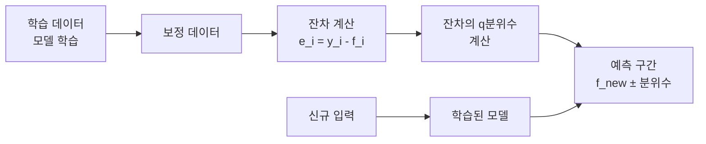
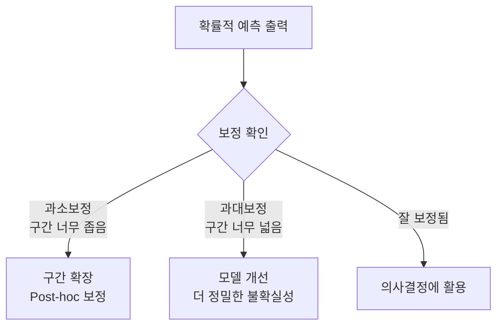

# 확률적 예측 (Probabilistic Forecasting)

## 개념 요약

확률적 예측(Probabilistic Forecasting)은 단일 점 추정치 대신 미래 값의 분포 또는 불확실성 구간을 출력하는 예측 방식이다. 전통적인 결정론적 예측이 "내일 기온은 22도"라고 말한다면, 확률적 예측은 "내일 기온이 18~26도 범위에 있을 확률이 90%"라고 표현한다.

의사결정, 리스크 관리, 재고 최적화, 에너지 수요 예측 등 불확실성이 중요한 도메인에서 점 예측보다 훨씬 유용한 정보를 제공한다.

## 불확실성의 두 종류

| 종류 | 설명 | 감소 가능 여부 |
|------|------|--------------|
| 인식론적 불확실성 (Epistemic) | 데이터 부족이나 모델 한계에서 오는 불확실성 | 데이터 추가로 감소 가능 |
| 우발적 불확실성 (Aleatoric) | 현상 자체의 본질적 무작위성 | 감소 불가 |

좋은 확률적 예측 모델은 두 불확실성을 구별하고 각각을 적절히 표현해야 한다.

## 주요 접근법

### 분위수 회귀 (Quantile Regression)

특정 분위수(quantile) $q \in (0,1)$에서의 조건부 분위수를 직접 모델링한다. 손실 함수는 Pinball Loss:

$$\mathcal{L}_q(y, \hat{y}) = \begin{cases} q(y - \hat{y}) & \text{if } y \geq \hat{y} \\ (1-q)(\hat{y} - y) & \text{if } y < \hat{y} \end{cases}$$

예를 들어 $q = 0.1, 0.5, 0.9$ 세 분위수를 동시에 학습하면 80% 예측 구간을 얻을 수 있다. [[time-series-forecasting-dl]]의 Temporal Fusion Transformer(TFT)가 이 방식을 채택한다.

### 분포 예측 (Distribution Forecasting)

출력이 특정 확률 분포(예: 가우시안, 스튜던트-t, 네거티브 이항)의 파라미터가 되도록 학습. 자연스러운 불확실성 전파가 가능하다.

가우시안 분포 가정:

$$p(y_t | \mathbf{x}_t) = \mathcal{N}(\mu_t, \sigma_t^2)$$

모델이 $\mu_t$와 $\sigma_t$를 동시에 출력한다. 손실은 음의 로그 가능도(NLL).

### 정합 예측 (Conformal Prediction)

모델 불가지론적(model-agnostic) 방법으로, 보정 데이터셋의 잔차 분포를 활용해 통계적으로 유효한 예측 구간을 구성한다.

분포 가정 없이 커버리지 보장(coverage guarantee)을 제공하는 것이 큰 장점이다.

### 베이지안 딥러닝

[[bayesian-inference]] 관점에서 모델 파라미터에 사전 분포를 두고, 학습 데이터로 사후 분포를 추론한다. 실용적인 근사 방법:

- **MC 드롭아웃**: 추론 시 드롭아웃을 켜둔 채 N회 순전파, 분산으로 불확실성 추정
- **딥 앙상블**: 서로 다른 초기화로 N개 모델 학습, 예측 분산 계산
- **변분 추론**: 사후 분포를 근사 분포로 추론 (Bayes by Backprop)

## 평가 지표

점 예측과 달리 확률적 예측은 보정(calibration)과 선명도(sharpness)를 함께 평가한다.

| 지표 | 설명 |
|------|------|
| CRPS (Continuous Ranked Probability Score) | 분포 전체를 평가하는 통합 점수 |
| 커버리지 | 예측 구간 내에 실제값이 포함된 비율 |
| 구간 너비 | 구간이 좁을수록 선명도 높음 |
| Pinball Loss | 특정 분위수에서의 손실 |

보정된(calibrated) 예측이란 90% 예측 구간에 실제로 90%의 값이 포함되는 것을 의미한다.

## 도메인별 응용

- **에너지**: 전력 수요·재생에너지 출력의 불확실성 반영한 그리드 운영
- **금융**: VaR(Value at Risk) 및 CVaR 계산, 옵션 가격 산정
- **물류**: 재고 수준 최적화, 안전 재고 산정
- **기상**: 강수 확률, 기온 범위 예보

## 관련 문서

- [[time-series-forecasting-dl]] - 딥러닝 시계열 예측 전반
- [[bayesian-inference]] - 베이지안 관점의 불확실성 모델링
- [[time-series-imputation]] - 결측 데이터가 예측 불확실성에 미치는 영향
