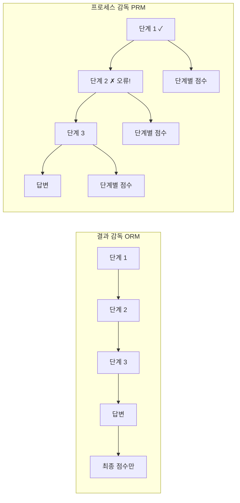

# 프로세스 감독 vs 결과 감독

LLM 추론 품질을 평가하는 두 가지 보상 모델 패러다임. **결과 감독(ORM)**은 최종 답만 채점하고, **프로세스 감독(PRM)**은 추론 각 단계를 개별 평가한다.

## 비교

| 측면 | ORM | PRM |
|------|-----|-----|
| 평가 대상 | 최종 답변만 | 각 추론 단계 |
| 오류 위치 | 알 수 없음 | 정확히 식별 |
| 레이블 비용 | 낮음 (정답 여부만) | 높음 (단계별 평가 필요) |
| 수학/코딩 성능 | 기준선 | **+10-20%** 향상 |
| 보상 해킹 위험 | 높음 | 낮음 (밀집 피드백) |

## 핵심 연구 결과

OpenAI의 "Let's Verify Step by Step" (2023):
- PRM이 ORM 대비 MATH 벤치마크에서 **78.2% vs 72.4%** 달성
- 단계별 감독이 모델의 "운 좋은 정답"보다 "올바른 추론"을 학습하게 함

## 실무 선택 기준

- **수학/코딩/논리**: PRM 우세 (추론 과정이 검증 가능)
- **창의적 작업/개방형**: ORM이 현실적 (단계 정의 어려움)
- **비용 제약**: ORM (레이블링 비용 10-100x 차이)
- **하이브리드**: ORM으로 후보 필터링 -> PRM으로 최종 선택

## 관련 문서

- [[process-reward-model-detail]] -- PRM 상세
- [[reward-model-training]] -- 보상 모델 학습
- [[reward-model-theory]] -- 보상 모델 이론
- [[inference-time-scaling]] -- 추론 시간 스케일링 (PRM 활용)
