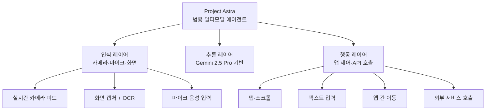
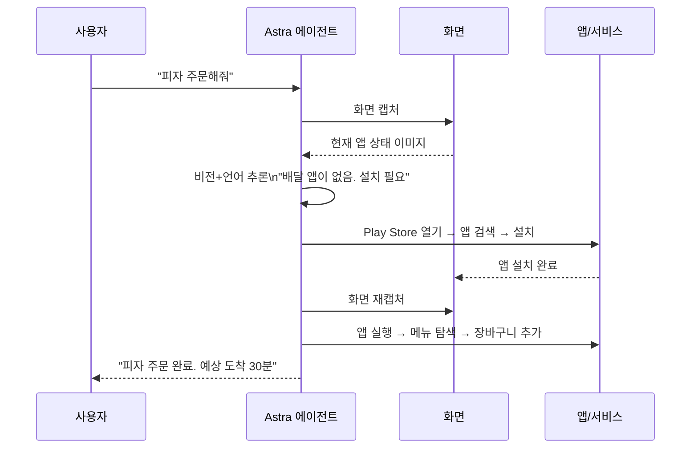
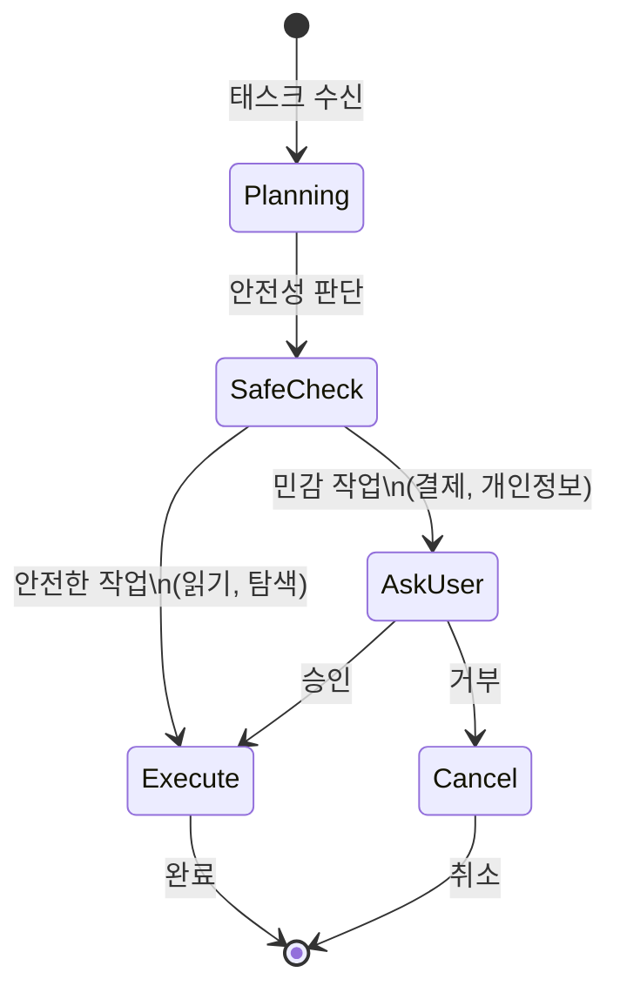

# Project Astra 안드로이드 에이전트

Project Astra는 Google DeepMind의 범용 멀티모달 AI 어시스턴트 리서치 프로젝트다. 2024년 Google I/O에서 처음 소개됐으며, 2026년에는 안드로이드 앱 자동화("screen automation") 기능으로 확장되고 있다. 이 페이지는 안드로이드 에이전트 패러다임으로서 Project Astra의 개념적 의의를 다루며, 특정 구현보다 **온디바이스 멀티모달 에이전트(on-device multimodal agent)** 개념에 초점을 맞춘다.

[[gemini-models]] 기반 모달리티 통합과 [[browser-use-agent-framework]] 유사 개념의 모바일 확장이라는 두 갈래에서 이해할 수 있다.

---

## 핵심 개념 구조

---

## 안드로이드 에이전트 기능

### Screen Automation (화면 자동화)

2026년 4월, Google 앱 베타(v17.4.66) 코드에서 "screen automation" 관련 코드가 발견됐다. 아직 정식 출시 전이나, 다음 기능이 포함될 것으로 분석된다.

| 기능 | 설명 |
|------|------|
| 탭(Tap) | 특정 좌표 또는 UI 요소 클릭 |
| 스크롤(Scroll) | 상하좌우 스크롤 동작 |
| 버튼 선택 | 레이블 기반 버튼 인식 및 클릭 |
| 텍스트 입력 | 폼 필드에 텍스트 자동 입력 |
| 앱 간 이동 | 딥링크·인텐트 기반 앱 전환 |

이 기능들은 [[browser-use-agent-framework]]가 웹 브라우저에서 수행하는 DOM 조작과 구조적으로 동일하지만, 대상이 네이티브 안드로이드 UI로 바뀐 버전이다.

### 목표 태스크 예시

- **음식 주문**: "저녁에 피자 주문해줘" → 배달 앱 열기 → 메뉴 탐색 → 결제
- **승차 예약**: "택시 불러줘, 집으로" → 라이드 앱 열기 → 목적지 설정 → 예약
- **쇼핑**: "아마존에서 이 제품 가장 저렴한 옵션으로 사줘"
- **이메일 답장**: 수신된 메일을 읽고 사용자 의도에 맞는 답변 초안 생성

---

## 멀티모달 인식의 역할

Project Astra의 핵심 차별점은 **실시간 멀티모달 스트림 처리**다.

단순 명령 실행이 아니라, 현재 화면 상태를 보고 다음 행동을 결정하는 **관찰-추론-행동(Observe-Reason-Act)** 루프다.

---

## 컴퓨터 사용(Computer Use) 패러다임과의 관계

Project Astra 안드로이드 에이전트는 더 넓은 "컴퓨터 사용(computer use)" 패러다임의 모바일 구현이다.

| 구현 | 벤더 | 플랫폼 | 상태 (2026년 4월) |
|------|------|--------|-------------------|
| Computer Use | Anthropic Claude | 데스크톱/웹 | 정식 출시 |
| Project Mariner | Google (Gemini 2.5) | 웹 브라우저 | 리서치 → 통합 |
| Project Astra Android | Google (Gemini 2.5 Pro) | 안드로이드 앱 | 베타 코드 발견 |
| Magentic-UI | Microsoft | 웹 | 오픈소스 프로토타입 |

각 구현은 실행 환경(웹 DOM, 데스크톱 OS, 모바일 앱)이 다르지만 핵심 패턴은 동일하다.

---

## 기술적 도전 과제

### 1. UI 이해의 신뢰성

안드로이드 앱은 표준화된 HTML DOM이 없어 요소 인식이 어렵다. Accessibility API를 활용하거나 화면 캡처+시각 모델로 UI를 해석해야 한다.

- Accessibility Service: 안드로이드 접근성 API를 통해 UI 트리 획득
- Vision-based: 화면 이미지에서 Gemini 시각 모델로 직접 버튼/텍스트 인식
- 두 방식의 하이브리드가 신뢰성 측면에서 유리 [교차검증 필요 - Astra 구체 구현 방식]

### 2. 개인정보 및 보안

화면 내용을 클라우드 모델로 전송할 경우 민감한 정보(은행 앱 화면, 의료 기록 등)가 포함될 수 있다.

- 온디바이스 모델(Gemini Nano)로 민감 처리 + 클라우드 모델로 복잡 추론 분리
- 화면 캡처 전 민감 영역 마스킹 필요
- 사용자 명시적 동의 및 작업 단위 승인 UI 필수

### 3. 앱 업데이트에 따른 UI 변경

앱이 업데이트될 때마다 버튼 위치나 플로가 바뀌어 에이전트가 실패할 수 있다. 시각 모델 기반 접근은 이를 더 유연하게 처리하지만, 완전한 내성은 어렵다.

---

## 에이전트 승인(Human-in-the-Loop) 고려

민감한 작업(결제, 개인 데이터 전송)에서는 에이전트가 임의로 실행하지 않고 사용자 승인을 거쳐야 한다.

이 패턴은 Magentic-UI의 Co-tasking 개념과 동일하며, 에이전트 시대의 핵심 UX 과제다.

---

## Google I/O 2026 예상 발표

2026년 5월 19-20일 Google I/O에서 Project Astra 안드로이드 에이전트의 공식 발표가 예상된다. 정식 기능 범위, API 공개 여부, 지원 기기 목록 등이 공개될 것으로 보인다. 이 페이지는 발표 후 업데이트 필요.

---

## 관련 문서

- [[gemini-models]] - Astra의 기반 모델 (Gemini 2.5 Pro)
- [[browser-use-agent-framework]] - 웹 기반 UI 에이전트 프레임워크 (개념적 유사체)
- [[gemini-2-5-flash-thinking]] - Astra와 함께 컴퓨터 사용 기능을 제공하는 Flash 모델
- [[gemini-enterprise-agent-platform]] - Astra 기술이 통합될 엔터프라이즈 플랫폼
