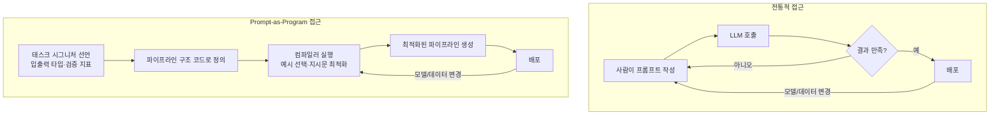
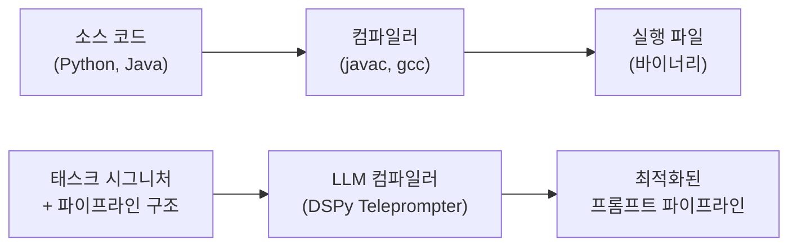
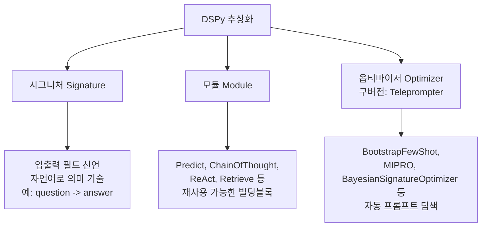
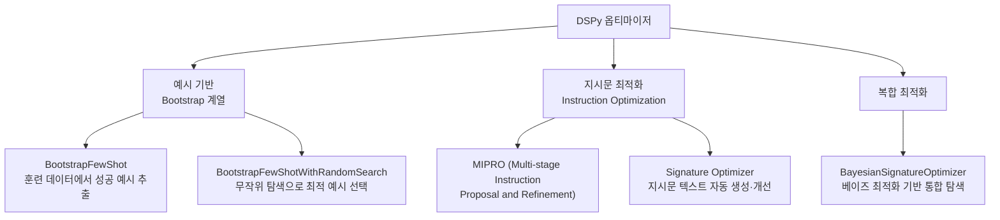
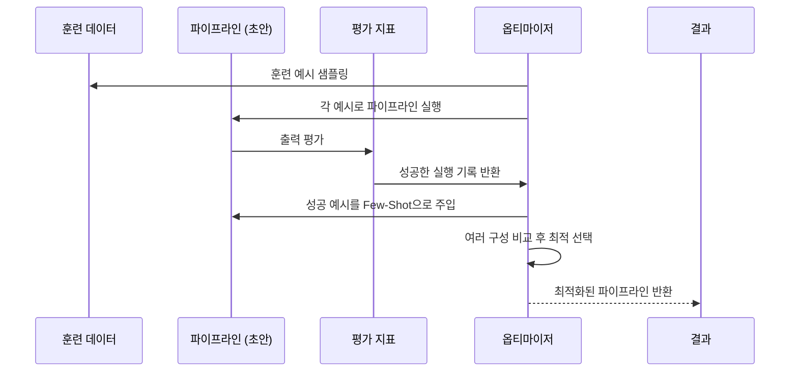
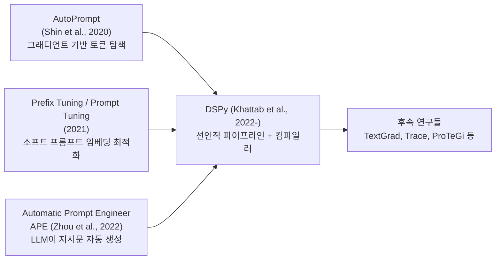
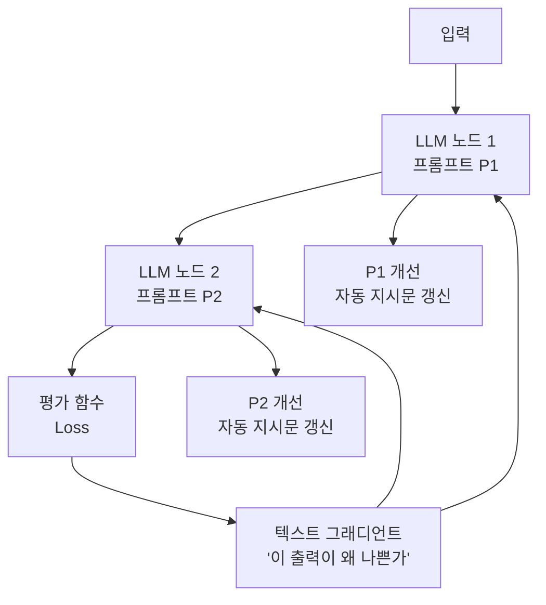

# Prompt-as-Program 패러다임

## 정의와 본질

**Prompt-as-Program** 패러다임은 프롬프트(prompt)를 수동으로 작성하는 텍스트로 보는 대신, **컴파일 · 최적화 · 테스트가 가능한 프로그램 코드**로 취급하는 사고방식이다.

기존 프롬프트 엔지니어링에서는 사람이 직접 "좋은 프롬프트"를 손으로 작성하고, 결과가 마음에 들지 않으면 직관적으로 수정했다. Prompt-as-Program 접근은 이 과정을 다음과 같이 바꾼다:

1. **프롬프트 구조를 코드로 선언** — 태스크의 시그니처(입출력 타입), 모듈 구성, 예시 선택 방식을 프로그래밍 언어로 정의
2. **자동 최적화(자동 프롬프팅)** — 검증 지표에 따라 시스템이 최적 지시문 · 예시 구성을 자동으로 탐색
3. **컴파일** — 정의된 파이프라인을 실제 LLM 호출 시퀀스로 변환

이 패러다임의 가장 대표적인 구현이 **DSPy(Declarative Self-improving Language Programs)**다.

---

## 핵심 아이디어

### 전통적 프롬프트 엔지니어링 vs Prompt-as-Program



핵심 차이: 사람이 **"어떻게"** 프롬프트를 쓸지를 고민하는 대신, **"무엇을"** 달성하고 싶은지(시그니처 + 지표)만 정의하면 된다.

### 프로그래밍 언어 유추



소스 코드가 컴파일러를 통해 실행 파일로 변환되듯, 선언적 파이프라인 정의가 LLM 컴파일러를 통해 최적화된 프롬프트 시퀀스로 변환된다.

---

## DSPy 소개 및 핵심 구조

[[dspy|DSPy(Declarative Self-improving Language Programs)]]는 Stanford NLP 그룹(Omar Khattab et al., 2022-2023)이 개발한 Prompt-as-Program 패러다임의 대표적 구현이다.

### DSPy의 3가지 핵심 추상화



### DSPy 코드 예시

```python
import dspy

# 1. 시그니처 선언 — "무엇을" 할지 정의
class BasicQA(dspy.Signature):
    """질문에 간결하게 답변하라."""
    question = dspy.InputField()
    answer = dspy.OutputField(desc="종종 5단어 이내")

# 2. 모듈 조합 — 파이프라인 구조 정의
class CoTQA(dspy.Module):
    def __init__(self):
        self.generate = dspy.ChainOfThought(BasicQA)

    def forward(self, question):
        return self.generate(question=question)

# 3. 컴파일 — 옵티마이저로 자동 최적화
teleprompter = dspy.BootstrapFewShot(metric=my_metric)
optimized_program = teleprompter.compile(CoTQA(), trainset=trainset)
```

이 패턴의 핵심은 `BasicQA`의 지시문 텍스트나 구체적 예시를 사람이 직접 쓰지 않는다는 점이다. 컴파일러가 훈련 데이터와 평가 지표를 기반으로 자동으로 최적 구성을 찾는다.

---

## 자동 최적화 메커니즘

### 주요 옵티마이저 유형



### Bootstrap Few-Shot 작동 방식



핵심 아이디어: 모델이 맞힌 예시들을 자동으로 데모(demonstrations)로 수집하여, 다음 실행 시 퓨샷 예시로 활용한다. 이 과정을 자동화함으로써 수동 예시 선별을 대체한다.

---

## Prompt Template Libraries와의 비교

### 기존 프롬프트 템플릿 라이브러리

[[prompt-template-libraries|프롬프트 템플릿 라이브러리]]는 주로 정적인 프롬프트 문자열 관리를 다룬다:

```python
# 전통적 템플릿 방식 (LangChain, LlamaIndex 등)
template = PromptTemplate(
    input_variables=["question"],
    template="다음 질문에 답하라: {question}\n답변:"
)
prompt = template.format(question="AI란 무엇인가?")
```

| 차원 | 템플릿 라이브러리 | Prompt-as-Program (DSPy) |
|------|-----------------|--------------------------|
| 프롬프트 작성 | 수동 | 자동 최적화 |
| 예시 선택 | 수동 | 자동 Bootstrap |
| 모델 변경 적응 | 수동 재작성 | 재컴파일 (부분 자동) |
| 파이프라인 구조 | 코드로 관리 | 코드로 관리 |
| 평가 통합 | 별도 구현 필요 | 내장 |
| 학습 곡선 | 낮음 | 중간 |

---

## 자동 프롬프트 최적화 (APO) 관련 연구

DSPy 외에도 Prompt-as-Program 아이디어는 다양한 연구에서 탐구됐다:

### 주요 연구 계보



- **AutoPrompt**: 토큰 단위 그래디언트 탐색으로 최적 프롬프트 토큰 찾기. 해석하기 어려운 프롬프트 생성 문제.
- **APE**: LLM이 지시문 후보를 자동 생성하고 평가. 해석 가능하지만 탐색 공간이 넓어 비효율.
- **DSPy**: 위 방법들의 장점을 통합 + 프로그래밍 추상화 추가.

---

## TextGrad와 미분 가능 프롬프팅

**TextGrad**(Yuksekgonul et al., 2024)는 LLM을 미분 가능한 연산자로 보고, 텍스트 그래디언트(text gradient)를 통해 파이프라인 전체를 자동 최적화하는 시스템이다:



텍스트 그래디언트는 수치 그래디언트와 달리 자연어로 "이 출력이 왜 목표에서 벗어났는가"를 설명하는 피드백이다. 이 피드백으로 업스트림 프롬프트를 수정한다.

---

## 실제 사례와 응용

### 퍼포먼스 개선 사례

DSPy 논문 결과에서 수동 프롬프트 엔지니어링 대비 개선 사례:

- **HotpotQA (복잡 QA)**: 수동 CoT 대비 DSPy 컴파일된 파이프라인이 10-20% 이상 향상 보고
- **GSM8K (수학)**: 작은 모델(7B 파라미터)에서 수동 프롬프팅 대비 일관된 향상
- **분류 태스크**: 퓨샷 예시 자동 선택으로 수동 선택 대비 안정적인 성능

### 프로덕션 활용 패턴

1. **파이프라인 컴파일 후 고정**: 최적화된 파이프라인을 한 번 컴파일하고, 프롬프트 문자열로 추출해 저장 → 실제 서빙 시 DSPy 런타임 의존성 없이 운영
2. **모델 업그레이드 시 재컴파일**: 새 모델 출시 때마다 수동 프롬프트 재작성 대신 재컴파일로 적응
3. **A/B 테스트 자동화**: 여러 파이프라인 구성을 자동 생성하고 최적 선택

---

## 한계와 비판

### 기술적 한계

1. **컴파일 비용**: 최적화 과정에서 수십-수백 회의 LLM 호출이 필요하다. 컴파일 비용이 수동 프롬프팅보다 훨씬 높다.
2. **훈련 데이터 필요**: Bootstrap 옵티마이저는 레이블된 훈련 예시가 필요하다. 레이블 수집 비용이 새로운 병목이 될 수 있다.
3. **평가 지표 설계 의존성**: "좋은 출력"의 정의(평가 지표) 설계가 결과를 크게 좌우한다. 지표 설계 자체는 여전히 사람의 판단이 필요하다.
4. **전역 최적화 불보장**: 탐색 공간이 너무 크기 때문에 컴파일러가 찾은 해가 전역 최적이라는 보장이 없다.

### 개념적 비판

- **프롬프트의 불안정성**: 최적화된 프롬프트도 모델 버전 업그레이드, 배포 설정 변화 등으로 성능이 달라질 수 있다. "컴파일된 프로그램"의 안정성 보장과 차이.
- **해석 가능성 저하**: 자동 생성된 지시문은 인간이 직관적으로 이해하기 어려운 경우가 있다 — 왜 이 프롬프트가 작동하는지 설명하기 어려움.
- **일반화 불명확**: 특정 태스크 · 모델에서 효과가 검증됐더라도, 다른 태스크 · 모델에서 같은 효과를 보장하기 어렵다.

---

## 관련 문서

- [[dspy]] - DSPy 프레임워크의 전체 아키텍처, 모듈 목록, 옵티마이저 상세.
- [[prompt-engineering]] - 수동 프롬프트 엔지니어링 기법 — Prompt-as-Program의 대조 배경.
- [[prompt-template-libraries]] - LangChain `PromptTemplate`(`{변수}` 단일 중괄호, `from_template` 인스턴스화)과 LlamaIndex `PromptTemplate`(데이터 검색·인덱싱 통합 지향) 등 정적 템플릿 라이브러리 — Prompt-as-Program의 대조 사례.
- [[chain-of-thought]] - CoT 모듈을 DSPy로 자동 최적화하는 대표 사례.
- [[zero-vs-few-shot-comparison]] - 자동 예시 선택의 기반이 되는 퓨샷 학습 원리.
