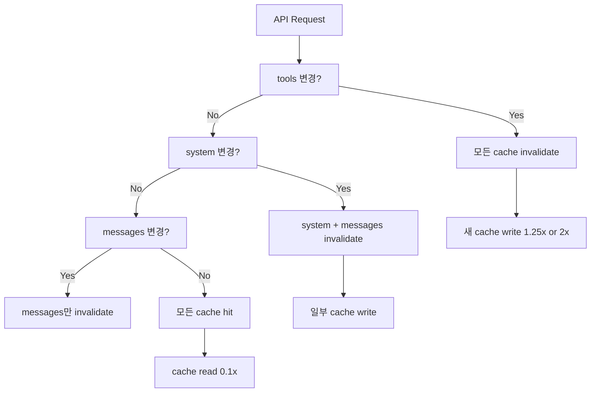
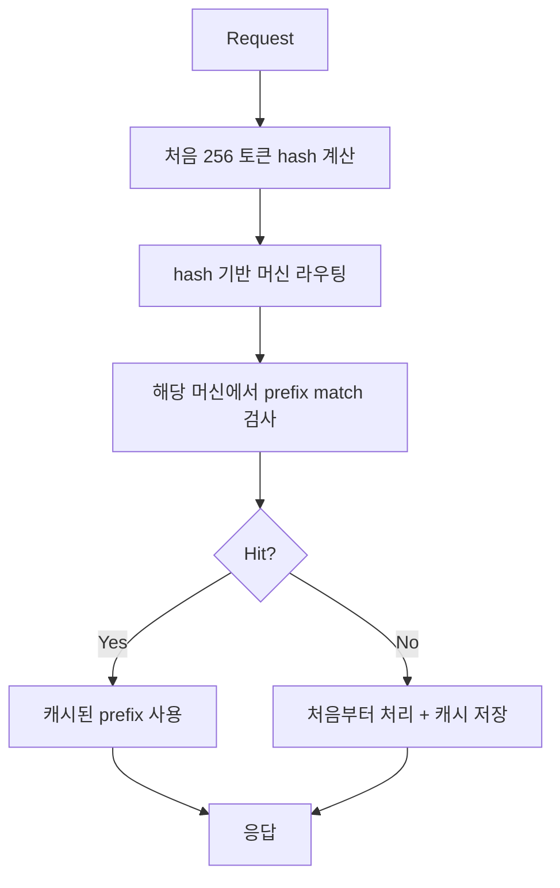

# Prompt Caching Strategies

LLM 에이전트 비용의 60-90%는 입력 토큰이 차지한다. 시스템 프롬프트, 도구 정의, 검색된 문서 등 **반복되는 정적 prefix**를 캐시에 보관하고 재사용하면 비용·지연을 모두 80-90% 줄일 수 있다.

> 기존 [[prompt-caching-agentic]] 와 차별화 — 이 페이지는 provider 간 활성화 방식·비용·TTL 정책을 source-agnostic하게 비교하고, 캐시 친화 프롬프트 구조 설계 원칙에 초점을 맞춘다. 에이전트 워크로드 적용 디테일은 [[prompt-caching-agentic]] 참조.

## 1. 캐싱 메커니즘의 두 패러다임

### A. 명시적 캐싱 (Anthropic 스타일)

`cache_control: {"type": "ephemeral"}` 같은 마커를 명시적으로 부착해 캐시 breakpoint를 지정. 개발자가 어디까지 cache prefix로 만들지 결정한다.

장점: 세밀한 통제, 워크플로우 형태에 따라 4개 breakpoint를 다르게 활용 가능.
단점: 코드 복잡도, 마킹 위치 미스로 캐시 미스 발생.

### B. 자동 캐싱 (OpenAI 스타일)

설정 없이 1024 토큰 이상의 prefix가 자동 캐시. `prompt_cache_key`로 라우팅 힌트만 전달.

장점: 코드 수정 없음, 설정 비용 0.
단점: 통제력 부족, hit rate 예측이 어려움.

## 2. Provider 비교

| 항목 | Anthropic | OpenAI |
|------|-----------|--------|
| 활성화 | 명시적 `cache_control` | 자동 |
| Cache write 비용 | 1.25x (5분 TTL) / 2x (1시간 TTL) | 무료 |
| Cache read 비용 | 0.1x (90% 절감) | 0.5x (50% 절감 평균) |
| TTL | 5분 (기본) / 1시간 | 5-10분 / 최대 1시간 / 일부 모델 24h extended |
| 최소 토큰 | 모델별 1024-4096 | 1024 |
| Breakpoint 수 | 최대 4개 | N/A (자동) |
| Lookback | 20 블록 | 256 토큰 hash + prefix match |
| Routing 영향 | breakpoint 위치 | `prompt_cache_key` |

## 3. Anthropic 캐시 breakpoint 규칙



### 핵심 규칙
- 최대 **4개 breakpoints** 정의 가능
- Breakpoint 자체는 추가 비용 없음
- **20-block lookback window**: 매 요청마다 breakpoint에서 거꾸로 최대 20개 블록 검사

> "Cache writes happen only at your breakpoint. Cache reads look backward. 20-block lookback window."

### 캐시 가능/불가 영역

**가능**: `tools` 정의 전체, `system` 메시지 블록, `messages.content` 텍스트/이미지/문서 블록, `tool_use`/`tool_result` 블록.

**불가**: thinking 블록 직접 marking 불가 (이전 assistant turn에 포함되면 같이 캐시됨), citations sub-block (top-level document만 가능), 빈 텍스트 블록.

### 모델별 최소 토큰 [교차검증 필요 — 모델 세대별 변동]

| 모델 세대 | 최소 토큰 |
|-----------|-----------|
| Opus 4.7/4.6/4.5, Haiku 4.5 | 4096 |
| Sonnet 4.6, Haiku 3.5 | 2048 |
| Sonnet 4.5, Opus 4.1/4, Sonnet 4/3.7 | 1024 |

미만이면 silently skip (에러 없음). `cache_creation_input_tokens` / `cache_read_input_tokens`가 0이면 캐시 안 된 것.

### Cache Invalidation 계층

`tools` → `system` → `messages` 순서. 상위 변경 시 하위 모두 무효화.

| 변경 항목 | tools cache | system cache | messages cache |
|----------|-------------|--------------|----------------|
| Tool 정의 변경 | invalidated | invalidated | invalidated |
| tool_choice | preserved | invalidated | invalidated |
| Images 변경 | preserved | preserved | invalidated |
| Thinking 파라미터 | preserved | preserved | invalidated |

## 4. OpenAI 자동 캐시 동작



### 캐시 정책
- 최소 1024 토큰
- Hit는 128 토큰 단위로 증가
- 5-10분 비활성 후 evict, 최대 1시간
- 일부 모델은 extended retention으로 24시간 가능 [교차검증 필요]

### prompt_cache_key

```python
response = client.chat.completions.create(
    model="gpt-5.5",
    messages=[...],
    prompt_cache_key="user_session_xyz"  # 라우팅 영향
)
```

> "Influence routing and improve cache hit rates. This is especially beneficial when many requests share long, common prefixes."

## 5. 캐시 친화 프롬프트 구조

### 공통 원칙

> "Place static content like instructions and examples at the beginning of your prompt, and put variable content, such as user-specific information, at the end."

### 권장 레이아웃

```
[System prompt]            <- 영구 캐시 대상
[Tools definitions]        <- 캐시 대상
[Few-shot examples]        <- 캐시 대상
[Long retrieved context]   <- 캐시 대상 (여기에 breakpoint)
---
[User-specific question]   <- 변동 (캐시 안 됨)
[Recent conversation]      <- 변동
```

### Anti-pattern

- 동적 timestamp를 system 앞에 두기 → 매 요청마다 invalidate
- User ID, session 정보를 system에 포함 → 사용자별 cache 분기 폭발
- 1시간 TTL 위에 5분 TTL이 오는 ordering 위반
- 매 요청마다 breakpoint 위치를 변경 → cache lookback fail

## 6. 비용 시나리오

### 100K 토큰 system + 1K 토큰 question, 100 requests/시간 가정 (Opus 4.7 base $5/MTok)

**캐시 미사용**:
- 100 × 100K × $5/MTok = **$50/시간**

**Anthropic 1시간 캐시**:
- 1번째: 100K × $10/MTok = $1.0 (cache write)
- 99번째까지: 100K × $0.50/MTok × 99 = $4.95
- **총 $5.95/시간 → 88% 절감**

**OpenAI 자동 캐시**:
- 90% cache 적용 시 약 $5-10/시간 (구체 수치는 모델/시점에 따라 변동)

## 7. Pre-warming 패턴

`max_tokens: 0`으로 시스템 프롬프트만 미리 캐시:

```python
prewarm = client.messages.create(
    model="claude-opus-4-7",
    max_tokens=0,
    system=[{"type": "text", "text": "...", "cache_control": {"type": "ephemeral"}}],
    messages=[{"role": "user", "content": "warmup"}],
)
```

배포 직후 startup script로 warm-up하면 첫 사용자 요청부터 cache hit. 워크스페이스 단위 isolation을 고려해 워크스페이스마다 warm-up이 필요할 수 있다.

## 8. 운영 KPI

### Cache hit rate 모니터링
- `cache_read_input_tokens / (cache_read + cache_creation + input)` 추적
- 목표 70-90%
- 70% 미만이면 prompt 구조 재검토

### 1시간 TTL 사용 시점
- 24시간 내 동일 시스템 프롬프트로 100+ 요청
- 5분 TTL 만료가 잦은 워크플로우 (사용자별 deep work)
- 2x cache write cost를 hit rate × 90% 절감으로 회수 계산

## 9. Workspace-level isolation

[교차검증 필요 — 정확한 시점/조건은 Anthropic 공식 문서 확인]
일부 provider는 organization-level → workspace-level isolation으로 전환했다. 워크스페이스마다 독립 캐시를 사용하므로, 멀티 테넌트 운영 시 워크스페이스별 warm-up 전략이 필요해질 수 있다.

## 관련 문서

- [[prompt-caching-agentic]] — 에이전트 워크로드 적용 디테일
- [[context-window-management]] — context editing과의 cache invalidation 트레이드오프
- [[tool-orchestration-patterns]] — 도구 정의 캐싱
- [[batch-inference-caching]] — 배치 캐싱
- [[semantic-cache]] — 의미 기반 캐시 (별도 패턴)
- [[kv-cache]] — 모델 내부 KV 캐시와의 차이
- [[long-horizon-agent-loop]] — 장기 작업의 누적 비용 절감
