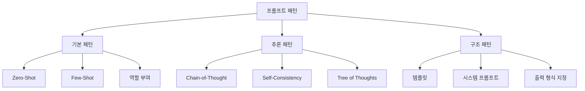

# 프롬프트 엔지니어링 패턴

LLM에서 원하는 출력을 얻기 위한 입력 설계 기법들의 체계적 분류. [[prompt-engineering|프롬프트 엔지니어링]]의 실무 패턴을 카테고리별로 정리한다.

## 패턴 분류

## 기본 패턴

| 패턴 | 설명 | 적합한 태스크 |
|------|------|-------------|
| **Zero-Shot** | 예시 없이 지시만으로 수행 | 단순 분류, 번역 |
| **Few-Shot** | 2-5개 입출력 예시 제공 | 포맷 맞추기, 스타일 모방 |
| **Role Prompting** | "당신은 X 전문가입니다" | 전문 지식 활성화 |

## 추론 패턴

| 패턴 | 핵심 | 참조 |
|------|------|------|
| **CoT** | "단계별로 생각하세요" | [[chain-of-thought-paper]] |
| **Self-Consistency** | 다중 CoT + 다수결 | [[self-consistency-paper]] |
| **Tree of Thoughts** | 트리 탐색 추론 | [[tree-of-thought-paper]] |
| **Step-Back** | 추상적 원리 먼저 | [[step-back-prompting]] |

## 구조 패턴

- **[[system-prompt|시스템 프롬프트]]**: 모델의 정체성/규칙/제약 설정
- **출력 형식 지정**: JSON, 마크다운 테이블, 특정 스키마 강제
- **구분자 활용**: XML 태그, 마크다운 헤더로 입력 구조화

## [[context-engineering|컨텍스트 엔지니어링]]과의 관계

프롬프트 엔지니어링이 단일 프롬프트 최적화라면, 컨텍스트 엔지니어링은 에이전트 시스템 전체의 컨텍스트 흐름을 설계하는 상위 개념이다.

## 관련 문서

- [[prompt-engineering]] -- 프롬프트 엔지니어링
- [[system-prompt]] -- 시스템 프롬프트
- [[context-engineering]] -- 컨텍스트 엔지니어링
- [[chain-of-thought-paper]] -- CoT 논문
- [[blind-prompting]] -- 맹목적 프롬프팅 (안티패턴)
