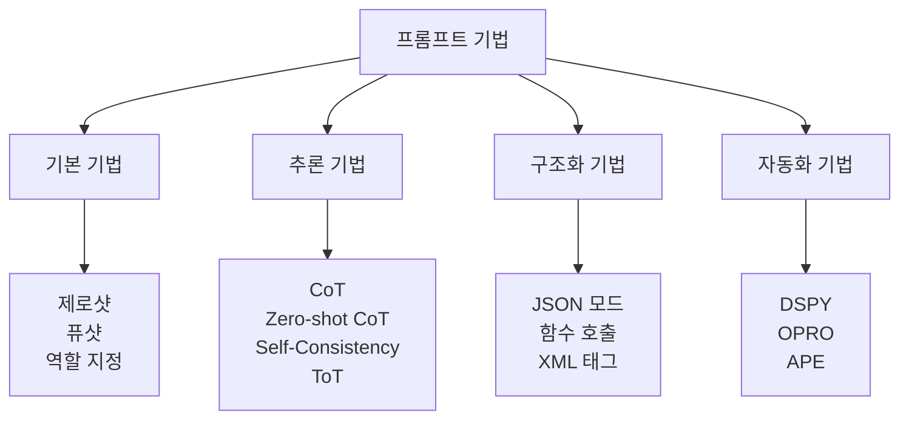

# 프롬프트 엔지니어링 종합

## 개요

프롬프트 엔지니어링(Prompt Engineering)은 언어 모델에게 원하는 출력을 유도하기 위해 입력 텍스트를 설계하는 기술이다. 모델 파라미터를 변경하지 않고 입력만으로 모델 행동을 제어한다. 단순한 텍스트 작성을 넘어 체계적인 기법들이 축적되었으며, 자동화/최적화 도구도 등장했다.

## 기법 전체 지도



## 기본 기법

### 제로샷 (Zero-Shot)

예제 없이 지시만으로 태스크를 수행하도록 요청한다. 최신 LLM은 대부분의 일반 태스크에서 제로샷으로 좋은 성능을 보인다.

```
지시: 다음 리뷰의 감정을 긍정/부정으로 분류하라.
리뷰: "배송이 빠르고 제품이 튼튼했습니다."
```

### 퓨샷 (Few-Shot)

입력-출력 예제 몇 개를 함께 제공해 모델이 패턴을 학습하도록 한다. 예제 선택과 순서가 성능에 영향을 미친다.

- 전형적(prototypical) 예제 우선
- 태스크의 다양한 케이스를 커버
- 예제 수는 보통 3-8개가 최적

### 역할 지정 (Role Prompting)

"당신은 경험 많은 법률 전문가입니다"처럼 특정 페르소나를 부여한다. 도메인 전문성이 필요한 태스크에서 응답 품질을 높일 수 있다.

## 추론 기법

### 연쇄 사고 (Chain-of-Thought, CoT)

중간 추론 단계를 명시적으로 거치도록 유도한다. Wei et al.(2022)이 체계화했으며, 수학/논리 문제에서 특히 효과적이다.

```
Q: 서울에서 부산까지 KTX로 2.5시간, 자동차로 4.5시간이 걸린다. 
   매주 월요일과 금요일에 왕복한다면 한 달(4주) 동안 KTX와 자동차의 
   총 이동시간 차이는?
A: 단계별로 풀어보겠습니다.
   왕복 한 번: KTX 5시간, 자동차 9시간
   한 주 2회 왕복: KTX 10시간, 자동차 18시간
   한 달 4주: KTX 40시간, 자동차 72시간
   차이: 72 - 40 = 32시간
```

### Zero-shot CoT

"단계별로 생각해보자(Let's think step by step)"라는 간단한 문구만으로 CoT를 유도한다(Kojima et al., 2022). 별도 예제 없이도 추론 능력을 끌어낸다.

### Self-Consistency

동일한 프롬프트를 여러 번 실행(temperature > 0)해 다양한 추론 경로를 얻고, 다수결로 최종 답을 결정한다. CoT와 결합하면 단순 greedy decoding보다 일관되게 높은 정확도를 보인다.

### Tree-of-Thought (ToT)

단선적 추론 대신 트리 구조로 여러 추론 경로를 탐색한다. 각 단계에서 여러 후보를 생성하고 평가하며, 유망한 경로를 우선 탐색한다. 복잡한 계획 문제에 효과적이지만 계산 비용이 높다.

## 구조화 기법

### JSON 모드 / 함수 호출

OpenAI, Anthropic 등이 지원하는 구조화 출력 기능이다. 출력이 반드시 유효한 JSON이 되도록 보장하여, 후처리 파싱 실패를 방지한다.

### XML 태그 구조화

Anthropic Claude에서 특히 효과적인 패턴이다. `<thinking>`, `<answer>`, `<context>` 같은 태그로 프롬프트의 각 부분을 구분하면 모델이 구조를 명확히 인식한다.

## 자동화 기법

### DSPy (Stanford, 2023)

프롬프트를 직접 작성하는 대신, 태스크를 모듈과 메트릭으로 정의하고 프롬프트를 자동 최적화한다. "프로그래밍으로 LLM 파이프라인 구축"을 지향한다.

### OPRO (Optimization by PROmpting)

LLM 자체를 최적화 프로세스로 활용한다. 과거 프롬프트와 그 성능을 메타-프롬프트에 제공하고, LLM이 더 나은 프롬프트를 제안하도록 한다.

### APE (Automatic Prompt Engineer)

후보 프롬프트를 대량 생성한 후 평가 세트에서 점수를 매겨 최적 프롬프트를 선택한다.

## 시스템 프롬프트 설계 원칙

1. **역할과 목적 명확화**: 모델이 무엇을 해야 하는지, 어떤 페르소나인지 명시
2. **출력 포맷 지정**: 길이, 구조, 언어, 스타일을 구체적으로 기술
3. **경계(boundary) 설정**: 해서는 안 되는 것을 포함해야 할 것
4. **예외 처리 지침**: 모호하거나 불가능한 요청에 어떻게 응답할지

## 안티패턴

| 안티패턴 | 문제 | 대안 |
|---------|------|------|
| 과도한 금지 지시 | 모델이 규칙에 집착해 유연성 저하 | 긍정적 지시 위주로 |
| 모순 규칙 | 모델이 어느 규칙을 따를지 혼란 | 명확한 우선순위 설정 |
| 모호한 기준 | "좋은 답변" 등 측정 불가 기준 | 구체적인 기준 제시 |
| 컨텍스트 없는 퓨샷 | 무관한 예제가 오히려 방해 | 태스크와 일치하는 예제 선택 |

## 프롬프트 민감도 분석

동일한 의미의 다른 표현이 모델 성능에 큰 차이를 만들 수 있다(프롬프트 취약성, prompt brittleness). 중요한 프롬프트는:
- 여러 의미적 동치 표현으로 테스트
- 다른 모델 버전에서 검증
- A/B 테스트 또는 LLM-as-Judge로 평가

## 최신 동향

**Constitutional Prompting**: 모델에게 원칙(constitution)을 제공하고, 자신의 출력을 그 원칙에 맞게 자체 수정하도록 유도한다. Anthropic의 Constitutional AI에서 파생된 프롬프팅 패턴이다.

**Multi-turn 전략**: 단일 프롬프트보다 여러 단계의 대화로 복잡한 태스크를 분해한다. 명세 확인 -> 계획 수립 -> 실행 -> 검토 등의 단계를 별도 턴으로 처리한다.

## 관련 문서

- [[chain-of-thought]] - CoT 추론 심화
- [[tree-of-thought]] - ToT 탐색 알고리즘
- [[self-consistency-decoding]] - Self-Consistency 디코딩
- [[in-context-learning]] - 인컨텍스트 학습 메커니즘
- [[constitutional-ai-pipeline]] - Constitutional AI
- [[system-prompt]] - 시스템 프롬프트 설계
- [[prompt-management-versioning]] - 프롬프트 버전 관리
