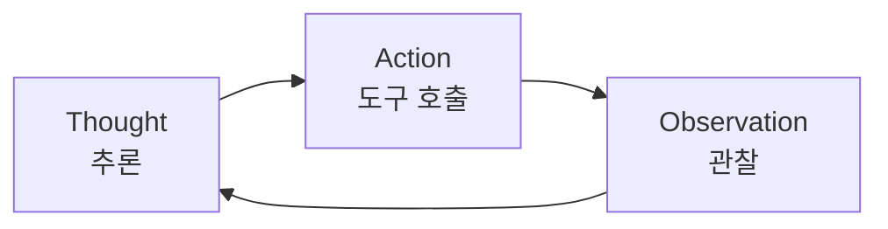

# Prompt Engineering (프롬프트 엔지니어링)

## 정의

**Prompt Engineering**은 2022-2024년 사이 AI 개발의 지배적 패러다임이었다. 핵심 질문은 "**모델에게 무엇을 말해야 원하는 결과를 얻을까?**"였다. [[relocating-rigor|엄밀함]]의 위치는 **프롬프트 텍스트 자체**였다.

## 왜 프롬프트가 중심이었나

2022년 6월 GitHub Copilot, 11월 ChatGPT가 출시된 이후 LLM과 상호작용하는 유일한 레버가 프롬프트였다. Andrej Karpathy는 이 시기를 "**Software 3.0**"이라 명명했다 — 자연어 지시가 프로그램 자체가 되는 패러다임.

## 학술적 기반: 프롬프트로 추론을 유도하기

### Chain-of-Thought (CoT) Prompting

Wei et al. (2022)의 논문. 모델에게 "단계별로 생각(think step by step)"하도록 지시하는 것만으로 추론 성능이 급상승한다는 발견.

- GSM8K 벤치마크: PaLM 540B 정확도 **17.9% → 58.1%**
- 특별한 파인튜닝 없이 프롬프트만으로 달성

### ReAct: Reasoning + Acting

Yao et al. (2022). 모델이 다음 루프를 반복:

외부 도구 사용과 환각 감소를 동시에 달성. 현대 [[coding-agent|코딩 에이전트]] 루프의 원형.

### Tree-of-Thought

Yao et al. (2023). 단일 경로가 아닌 **여러 추론 경로를 트리 구조로 동시 탐색**. 복잡한 퍼즐에서 성능 향상. 그러나 프로덕션에서 **지수적 비용 폭발**을 겪음.

### Self-Refine, Reflexion

Madaan et al. (2023), Shinn et al. (2023). 모델이 **자기 출력을 비평하고 개선**한다. 피드백 품질이 모델 자체 능력에 의존한다는 한계.

## Andrew Ng의 4가지 Agentic Design Patterns (2024)

Prompt Engineering 에라의 마지막 정리:

1. **Reflection**: 모델이 자기 출력 셀프 비평. 같은 모델을 다른 페르소나로 적용하면 품질 향상
2. **Tool Use**: 모델이 외부 도구(API, DB, 계산기) 호출 시점을 자율 결정
3. **Planning**: 복잡한 작업을 서브태스크로 분해. "악마는 디테일에 있다"는 경고 포함
4. **Multi-Agent Collaboration**: 역할이 다른 특화 에이전트들이 결과를 교환하며 협력. 이 협력 구조의 구체적 패턴은 [[agent-prompt-patterns]]에 정리되어 있다

## 벽에 부딪히기

### Blind Prompting (맹목적 프롬프팅)

Mitchell Hashimoto는 "[[blind-prompting]]"을 지적 — 엄밀한 측정 없이 **trial-and-error**에만 의존하는 프롬프트 최적화. A/B 테스트 없이 "이 프롬프트가 더 좋아 보인다"로 수렴.

### 구조적 문제: 비결정성

모델은 비결정적이다. 완벽한 프롬프트도 같은 입력에 다른 출력을 준다.

### 더 큰 문제: 컨텍스트 창에 관련 정보가 없음

"진짜 문제는 프롬프트 텍스트가 아니라 **불완전한 컨텍스트**였다." 아무리 프롬프트를 다듬어도 필요한 정보가 컨텍스트 창에 없으면 실패한다. 이 통찰이 [[context-engineering]] 에라의 시작이었다.

## [[vibe-coding|바이브 코딩]]: 프롬프트 엔지니어링의 극단

2025년 2월, Karpathy가 Cursor의 제안을 diff 검토 없이 수락한다고 고백했다. "Vibe coding"은 프롬프트만으로 모든 것을 해결하려는 태도의 극단적 표현이었다. 그리고 2025년 9월 "바이브 코딩 숙취" 사건으로 이 접근의 한계가 드러났다.

## 프롬프트 엔지니어링은 죽지 않았다

[[relocating-rigor]] 원칙에 따라 엄밀함은 사라진 게 아니라 이동했다. 2026년에도 시스템 프롬프트 작성은 여전히 [[harness-quadrants|하네스의 좌하 사분면]](Non-deterministic feedforward)에 속하는 필수 작업이다. 다만 **전체 레버가 프롬프트 하나에서 여러 사분면으로 확장**되었을 뿐이다.

## 관련 문서

- [[evolution-of-agentic-patterns]] — 3 에라 연대기에서 Era 1
- [[context-engineering]] — Era 2 (프롬프트 엔지니어링의 후계)
- [[harness-engineering]] — Era 3
- [[blind-prompting]] — Mitchell Hashimoto의 경고
- [[vibe-coding]] — 프롬프트 엔지니어링의 극단적 표현
- [[relocating-rigor]] — 엄밀함의 위치 이동 메타 원칙
- [[coding-agent]] — ReAct 루프 기반 현대 구현
