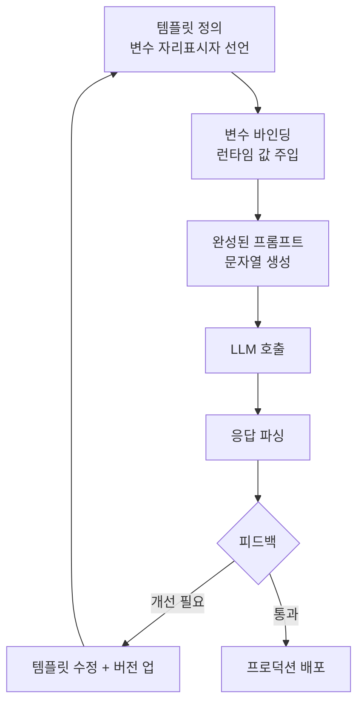
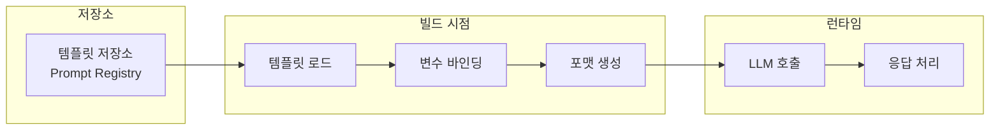
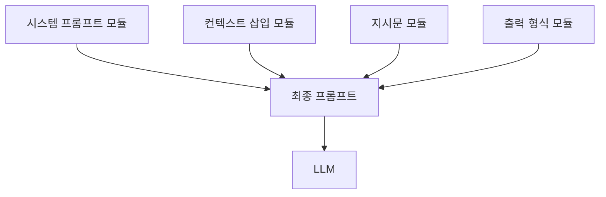

# 프롬프트 템플릿 라이브러리

## 정의 / 본질

프롬프트 템플릿 라이브러리(prompt template library)란 LLM 호출에 사용되는 프롬프트 문자열을 **재사용 가능한 구조체**로 관리하는 도구 또는 체계를 말한다. 프롬프트를 코드 안에 하드코딩하지 않고 변수 치환(variable substitution), 버전 관리(versioning), 공유·협업이 가능한 방식으로 추상화한다.

LLM 애플리케이션이 프로덕션 단계로 성숙하면 세 가지 문제가 반드시 등장한다:

1. **반복**: 같은 형태의 프롬프트가 코드베이스 곳곳에 중복된다.
2. **불일치**: 복사-붙여넣기로 파생된 변형들이 서로 달라진다.
3. **추적 불가**: 프롬프트가 언제, 왜 바뀌었는지 알 수 없다.

프롬프트 템플릿 라이브러리는 이 세 문제를 해결하기 위한 소프트웨어 엔지니어링 패턴이다. 함수(function)가 코드 재사용을 가능하게 하듯, 프롬프트 템플릿은 LLM 지시문(instruction) 재사용을 가능하게 한다.

---

## 핵심 아이디어

### 템플릿 생애 주기



템플릿은 정의 - 바인딩 - 호출 - 평가 - 수정의 순환 주기를 갖는다. 중요한 점은 "수정 후 버전 업"이 명시적으로 관리되어야 한다는 것이다.

### 주요 추상화 계층



실무에서는 저장소(registry) - 빌드 - 런타임 세 계층을 분리하는 것이 좋다. 저장소만 교체해도 다른 계층은 그대로 동작해야 한다.

---

## 주요 라이브러리 비교

### LangChain PromptTemplate

LangChain은 파이썬 클래스 기반으로 프롬프트 템플릿을 정의한다. `PromptTemplate`, `ChatPromptTemplate`, `FewShotPromptTemplate` 등 다양한 서브클래스를 제공한다.

```python
from langchain_core.prompts import PromptTemplate, ChatPromptTemplate
from langchain_core.messages import SystemMessage, HumanMessagePromptTemplate

# 단순 문자열 템플릿
simple = PromptTemplate.from_template(
    "다음 텍스트를 {language}로 번역해줘:\n{text}"
)
result = simple.format(language="영어", text="안녕하세요")

# 채팅 템플릿 (멀티턴 구조)
chat = ChatPromptTemplate.from_messages([
    ("system", "당신은 {role}입니다."),
    ("human", "{question}"),
])
messages = chat.format_messages(role="전문 번역가", question="이 문장을 번역해줘")
```

**특징:**
- 타입 안전성(type safety) 없음: 변수명이 맞는지 런타임에만 확인
- LCEL(LangChain Expression Language)과 파이프라인 합성 가능: `prompt | llm | parser`
- 허브(LangChain Hub)를 통한 공유 템플릿 생태계 존재
- 직렬화(serialization): JSON/YAML으로 저장하고 불러올 수 있음

**한계:**
- 저장소(registry) 기능 없음 - 파일 또는 허브에 직접 올려야 함
- 버전 관리 체계가 내장되지 않음
- 프로덕션 모니터링 기능 없음

### LlamaIndex PromptTemplate

LlamaIndex는 RAG(Retrieval-Augmented Generation) 파이프라인 특화 템플릿을 제공한다. `PromptTemplate` 외에 `SelectorPromptTemplate`(모델별 자동 선택)이 특징적이다.

```python
from llama_index.core.prompts import PromptTemplate, SelectorPromptTemplate
from llama_index.core.prompts.base import PromptType

# RAG 특화 템플릿
qa_prompt = PromptTemplate(
    "컨텍스트 정보:\n{context_str}\n\n질문: {query_str}\n답변:",
    prompt_type=PromptType.QUESTION_ANSWER,
)

# 모델별 선택 템플릿
selector = SelectorPromptTemplate(
    default_template=qa_prompt,
    conditionals=[
        (lambda llm: "claude" in type(llm).__name__.lower(), claude_specific_prompt),
    ],
)
```

**특징:**
- `PromptType` 열거형으로 용도 분류 (`QUESTION_ANSWER`, `SUMMARY`, `TREE_SUMMARIZE` 등)
- 인덱스 쿼리 엔진이 내부적으로 템플릿을 자동 주입 - 커스터마이징 지점이 명확
- 파샬(partial) 적용: 일부 변수만 먼저 채운 템플릿 생성 가능

**한계:**
- LlamaIndex 파이프라인 바깥에서 독립 사용하면 오버헤드 존재
- 채팅 멀티턴 구조는 LangChain 대비 표현력 제한

### PromptLayer

PromptLayer는 프롬프트 **버전 관리 + 모니터링**에 특화된 플랫폼형 도구다. LangChain/OpenAI SDK와 래퍼(wrapper) 형태로 통합된다.

```python
import promptlayer

promptlayer.api_key = "pl_..."

# OpenAI SDK를 PromptLayer로 감싸기
openai = promptlayer.openai

response = openai.chat.completions.create(
    model="gpt-4o",
    messages=[{"role": "user", "content": "안녕하세요"}],
    pl_tags=["production", "greeting-v2"],  # 태깅
)
```

**특징:**
- 웹 대시보드에서 프롬프트 버전 관리, A/B 비교, 실행 이력 조회 가능
- 프롬프트 레지스트리(registry): 코드 변경 없이 프롬프트 수정·배포 가능
- 코드-프롬프트 분리: 엔지니어가 코드를 고치지 않아도 PM/연구자가 프롬프트 수정 가능
- 비용·레이턴시 추적 내장

**한계:**
- SaaS 의존성 - 오프라인 환경 불가, 비용 발생
- 대규모 호출 시 래퍼 레이턴시 오버헤드 존재
- 오픈소스 자체 호스팅 불가 (2026년 기준 [교차검증 필요])

### 라이브러리 비교 요약

| 항목 | LangChain | LlamaIndex | PromptLayer |
|------|-----------|------------|-------------|
| 주요 사용처 | 범용 체인/에이전트 | RAG 파이프라인 | 버전 관리·모니터링 |
| 템플릿 형식 | 파이썬 클래스 | 파이썬 클래스 | 웹 UI + 코드 |
| 버전 관리 | 수동 (파일/허브) | 수동 | 내장 (대시보드) |
| 모니터링 | 별도 통합 필요 | 별도 통합 필요 | 내장 |
| 오픈소스 | 예 (MIT) | 예 (MIT) | 부분적 |
| 멀티모달 지원 | 예 | 예 | 제한적 |
| 러닝 커브 | 중간 | 중간-높음 | 낮음 |

---

## 버전 관리 패턴

### 코드 기반 버전 관리

```python
# 버전을 딕셔너리로 관리하는 단순한 패턴
PROMPT_REGISTRY = {
    "summarize_v1": PromptTemplate.from_template(
        "다음 텍스트를 요약해줘:\n{text}"
    ),
    "summarize_v2": PromptTemplate.from_template(
        "다음 텍스트를 3문장 이내로 요약해줘. 핵심만 간결하게:\n{text}"
    ),
}

def get_prompt(name: str, version: str = "latest") -> PromptTemplate:
    key = f"{name}_{version}" if version != "latest" else name
    return PROMPT_REGISTRY[key]
```

### Git 기반 버전 관리

프롬프트를 YAML 파일로 저장하고 Git으로 추적하는 패턴이다. 코드 변경과 프롬프트 변경 히스토리가 분리된다.

```yaml
# prompts/summarize.yaml
name: summarize
version: "2.1.0"
description: 텍스트 요약 - 길이 제한 추가
template: |
  다음 텍스트를 {max_sentences}문장 이내로 요약해줘.
  핵심만 간결하게. 불필요한 서두 없이 바로 요약 시작:

  {text}
variables:
  - name: text
    required: true
  - name: max_sentences
    required: false
    default: "3"
```

### 시맨틱 버저닝 권고

| 변경 유형 | 버전 올림 | 예시 |
|-----------|-----------|------|
| 완전히 새 프롬프트 | Major (1.x → 2.0) | 작업 방식 전환 |
| 출력 형식 변경 | Minor (1.0 → 1.1) | JSON 구조 추가 |
| 표현 개선, 오타 수정 | Patch (1.0.0 → 1.0.1) | 문장 다듬기 |

---

## 재사용 패턴

### 부분 적용 (Partial Application)

공통 시스템 프롬프트를 미리 채워두고 유저별 부분만 런타임에 주입하는 패턴이다.

```python
from langchain_core.prompts import PromptTemplate
from datetime import datetime

base = PromptTemplate.from_template(
    "현재 날짜: {date}\n역할: {role}\n\n사용자 요청: {user_input}"
)

# 날짜와 역할을 미리 고정
daily_assistant = base.partial(
    date=datetime.now().strftime("%Y-%m-%d"),
    role="친절한 AI 비서",
)

# 런타임에 user_input만 주입
prompt = daily_assistant.format(user_input="오늘 날씨 어때?")
```

### 컴포지션 패턴

여러 템플릿 조각을 조합하는 패턴이다. 시스템 프롬프트, 컨텍스트 삽입, 지시문, 출력 형식 지시를 각각 독립 모듈로 관리한다.



```python
SYSTEM_MODULES = {
    "helpful_assistant": "당신은 친절하고 정확한 AI 비서입니다.",
    "code_reviewer": "당신은 시니어 소프트웨어 엔지니어입니다. 코드 리뷰에 집중하세요.",
}

OUTPUT_FORMATS = {
    "json": "\n\n반드시 유효한 JSON으로만 응답하세요. 다른 텍스트 없이.",
    "markdown": "\n\n마크다운 형식으로 응답하세요.",
    "plain": "",
}

def build_prompt(system_key: str, task: str, output_format: str = "plain") -> str:
    system = SYSTEM_MODULES[system_key]
    fmt = OUTPUT_FORMATS[output_format]
    return f"{system}\n\n{task}{fmt}"
```

### Few-Shot 템플릿

예시(example)를 동적으로 주입하는 패턴이다. 예시 풀(pool)에서 현재 입력과 유사한 예시를 선택하는 동적 few-shot도 가능하다.

```python
from langchain_core.prompts import FewShotPromptTemplate

examples = [
    {"input": "happy", "output": "행복한"},
    {"input": "sad", "output": "슬픈"},
]

few_shot = FewShotPromptTemplate(
    examples=examples,
    example_prompt=PromptTemplate.from_template("영어: {input}\n한국어: {output}"),
    prefix="영어 단어를 한국어로 번역해줘:",
    suffix="영어: {input}\n한국어:",
    input_variables=["input"],
)
```

---

## 실제 사례 / 응용

### RAG 파이프라인에서의 활용

RAG 시스템에서는 검색 결과(retrieved context)가 프롬프트에 동적으로 삽입된다. LlamaIndex의 `PromptType.QUESTION_ANSWER` 템플릿이 대표적이다.

```python
RAG_TEMPLATE = """
다음은 참고 문서입니다:
-----
{context}
-----

위 문서를 바탕으로 아래 질문에 답하세요.
문서에 없는 내용은 "문서에서 확인할 수 없습니다"라고 답하세요.

질문: {question}
답변:"""
```

### 에이전트 시스템에서의 활용

도구 목록(tool list)과 에이전트 역할을 템플릿 변수로 분리한다. 도구가 추가될 때 프롬프트 구조 자체는 변경하지 않아도 된다.

```python
AGENT_SYSTEM_TEMPLATE = """당신은 {agent_name}입니다.

사용 가능한 도구:
{tool_descriptions}

도구 호출 형식:
<tool_call>
  <name>도구명</name>
  <input>입력값</input>
</tool_call>

항상 최소한의 도구 호출로 작업을 완수하세요."""
```

### 다국어 지원 패턴

```python
LOCALE_PROMPTS = {
    "ko": PromptTemplate.from_template("다음을 한국어로 요약하세요:\n{text}"),
    "en": PromptTemplate.from_template("Summarize the following in English:\n{text}"),
    "ja": PromptTemplate.from_template("次の内容を日本語で要約してください:\n{text}"),
}

def get_localized_prompt(locale: str, text: str) -> str:
    template = LOCALE_PROMPTS.get(locale, LOCALE_PROMPTS["en"])
    return template.format(text=text)
```

---

## 한계 / 비판

### 1. 추상화 비용

템플릿 라이브러리를 도입하면 프롬프트가 코드에서 분리되어 가독성이 떨어질 수 있다. 특히 소규모 프로젝트에서는 단순 f-string이 더 관리하기 쉽다.

### 2. 타입 안전성 부재

대부분의 라이브러리가 런타임에만 변수 누락을 감지한다. 정적 분석 도구와의 통합이 부족해 빌드 타임 오류 감지가 어렵다.

### 3. 프롬프트와 로직 커플링

복잡한 조건부 템플릿은 사실상 프로그래밍 로직을 프롬프트 안으로 끌어들인다. 이를 관리하다 보면 프롬프트 자체가 "미니 프로그램"이 되어 [[prompt-as-program]] 패턴과 경계가 모호해진다.

### 4. 평가(evaluation) 부재

템플릿 버전이 바뀔 때 성능이 좋아졌는지 나빠졌는지 측정하는 기능은 별도 평가 프레임워크가 필요하다. 라이브러리 자체는 평가를 제공하지 않는다.

### 5. 멀티모달 제한

이미지, 오디오 등 비텍스트 입력을 포함하는 프롬프트는 현재 대부분의 템플릿 라이브러리에서 일급 지원(first-class support)이 부족하다.

---

## 관련 문서

- [[prompt-as-program]] - 프롬프트를 프로그램으로 다루는 고급 패턴
- [[langchain]] - LangChain 전체 생태계 및 아키텍처
- [[llamaindex]] - LlamaIndex RAG 파이프라인 허브
- [[hallucination]] - 잘못된 템플릿이 환각을 유발하는 방식
- [[agent-context-management]] - 에이전트에서 프롬프트 컨텍스트 관리
