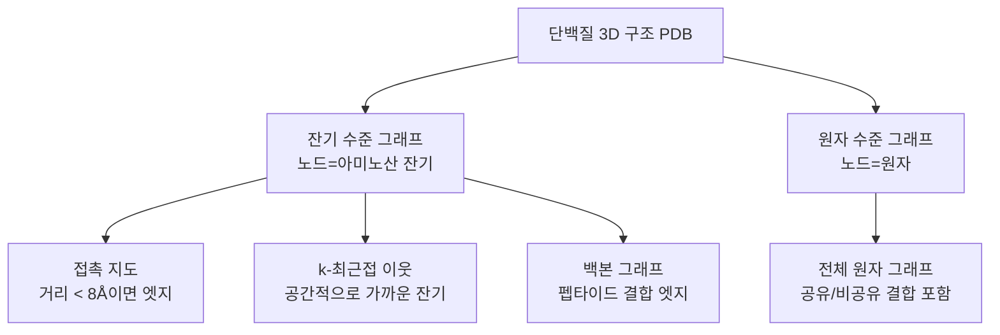
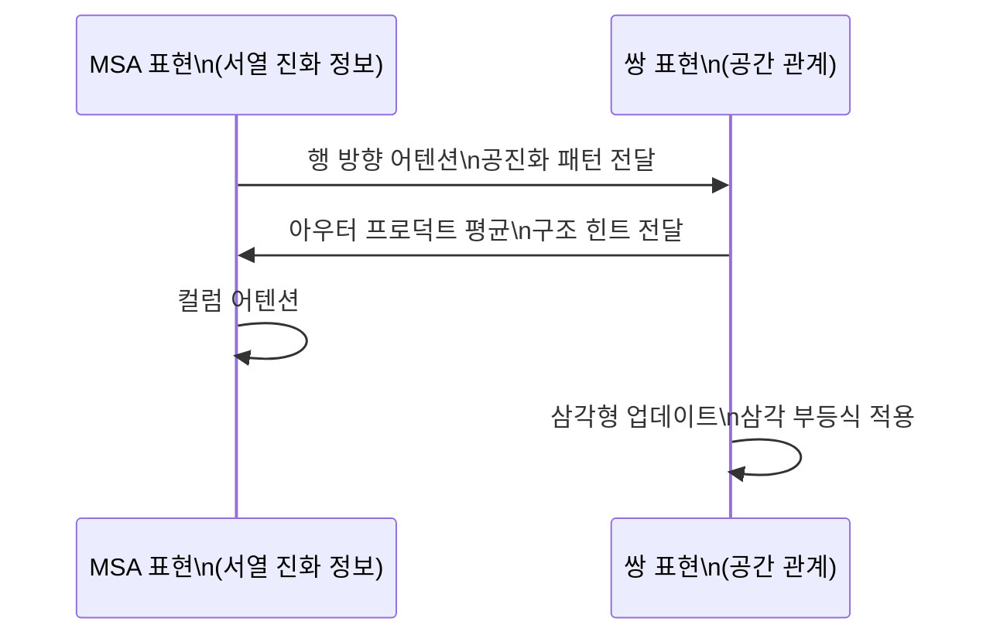

# 단백질 구조 GNN

단백질은 아미노산 서열이 3차원 공간에서 접혀 형성된 복잡한 구조를 가진다. 이 구조를 그래프로 모델링해 [[graph-neural-networks]]를 적용하면 단백질 기능 예측, 결합 부위 탐지, 약물-단백질 상호작용 분석 등 다양한 생물정보학 문제를 풀 수 있다.

## 단백질을 그래프로 표현하는 방법

단백질 그래프 구성에는 여러 선택이 있다:

**노드 특성 예시 (잔기 수준)**:
- 아미노산 종류 (20가지 원-핫 인코딩)
- 백본 이면각 $\phi, \psi$ (Ramachandran 공간)
- 용매 접근 표면적(SASA)
- 이차구조 요소(알파 나선, 베타 시트, 루프)

**엣지 특성 예시**:
- 잔기 간 거리 $d_{ij}$
- 방위각(direction vector)
- 결합 종류(공유, 수소, 소수성 접촉)

## AlphaFold2 이전: 전통적 접근

AlphaFold2(2020) 이전에는 단백질 구조 예측이 수십 년간 풀리지 않은 난제였다.

### GNN 기반 접촉 지도 예측

1차원 서열에서 잔기 쌍의 공간적 접촉 여부를 예측하는 이진 분류다. 공진화(co-evolution) 정보 + GNN으로 약 80% 정확도를 달성했다.

### 구조 기반 기능 예측

PDB 구조가 알려진 단백질에 GNN을 적용해 기능을 예측한다:
- **ProteinGCN**: 잔기 그래프에서 단백질 기능(EC 번호, GO 용어) 예측
- **HOLOPROT**: 다중 스케일 그래프로 효소 활성 예측

## AlphaFold2 이후: 새로운 패러다임

DeepMind의 AlphaFold2(Jumper et al., 2021, Nature)는 단백질 구조 예측 문제를 사실상 해결했다. GNN과 Transformer의 결합이 핵심이다.

### Evoformer

AlphaFold2의 핵심 블록인 Evoformer는 **MSA(다중 서열 정렬) 표현**과 **잔기 쌍 표현**을 교대로 업데이트한다:

삼각형 업데이트(triangle update)는 잔기 i-j, j-k 거리에서 i-k 거리를 추론하는 기하학적 일관성을 강제한다.

### Structure Module

Evoformer 출력을 받아 실제 3D 좌표를 예측하는 모듈이다. SE(3) 동변(equivariant) 프레임을 각 잔기에 부여하고, 반복적으로 정제(recycle)한다.

## AlphaFold2 이후 GNN 응용

AlphaFold2로 대규모 단백질 구조가 예측 가능해지면서, GNN의 역할이 **구조에서 기능/상호작용 예측**으로 이동했다:

| 작업 | 대표 모델 | 입력 |
|------|-----------|------|
| 단백질-리간드 결합 | EquiBind, DiffDock | 단백질 구조 + 리간드 |
| 단백질-단백질 상호작용 | EGNN, ProtTrans | 두 단백질 구조 |
| 돌연변이 효과 예측 | MIF-ST, ESM-IF | 야생형 단백질 구조 |
| 효소 설계 | ProteinMPNN, ESM2 | 구조 → 서열 역설계 |

### ProteinMPNN

Dauparas et al. (2022)이 개발한 역설계(inverse folding) GNN이다. 목표 3D 구조를 입력받아 그 구조를 가질 가능성 높은 아미노산 서열을 생성한다.

$$P(\text{서열} | \text{구조}) = \prod_i p(a_i | \text{구조},\ a_{<i})$$

메시지 전달에서 노드(잔기)와 엣지(공간 관계) 특성을 각각 인코딩한 뒤 자기회귀적으로 서열을 디코딩한다.

## [[gnn-molecular-property]]와의 비교

| 속성 | 소분자 GNN | 단백질 구조 GNN |
|------|-----------|----------------|
| 노드 수 | 10-100 | 수백~수천 |
| 3D 구조 | 컨포머 생성 필요 | AlphaFold2로 예측 가능 |
| 회전 불변성 | 중요 | 매우 중요 (SE(3) 동변) |
| 데이터셋 | QM9, ZINC | PDB (20만+ 구조) |
| 핵심 도전 | 3D 좌표 가용성 | 대형 그래프 계산 비용 |

## SE(3) 동변 GNN

단백질 구조는 회전·반사에 대해 불변이어야 한다. 일반 GNN은 좌표 절댓값에 의존하지만, SE(3) 동변 GNN은 회전/이동 변환 후에도 예측이 바뀌지 않는다:

- **EGNN**: 좌표 업데이트를 상대 거리 기반으로만 수행
- **DimeNet**: 거리 + 각도 정보로 회전 불변성 확보
- **SE(3)-Transformer**: Transformer를 SE(3) 동변으로 확장

## 실무 응용

- **AlphaFold2 구조 기반 가상 스크리닝**: 예측된 단백질 구조에 GNN으로 약물 결합 분석
- **단백질 공학**: ProteinMPNN으로 원하는 기능의 새 단백질 서열 설계
- **항체 설계**: 항원 에피토프에 최적화된 항체 CDR 루프 설계
- **질병 돌연변이 분석**: 암 관련 돌연변이가 단백질 기능에 미치는 영향 예측

## 관련 문서

- [[graph-neural-networks]] - GNN 기본 메시지 전달 프레임워크
- [[gnn-molecular-property]] - 소분자 속성 예측과의 비교 (SchNet, DimeNet)
- [[gnn-drug-discovery]] - 단백질-리간드 상호작용 기반 신약 발견
- [[graph-classification-pooling]] - 단백질 기능 분류에서의 풀링 전략
