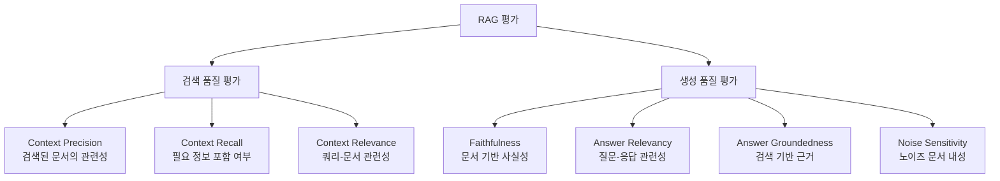
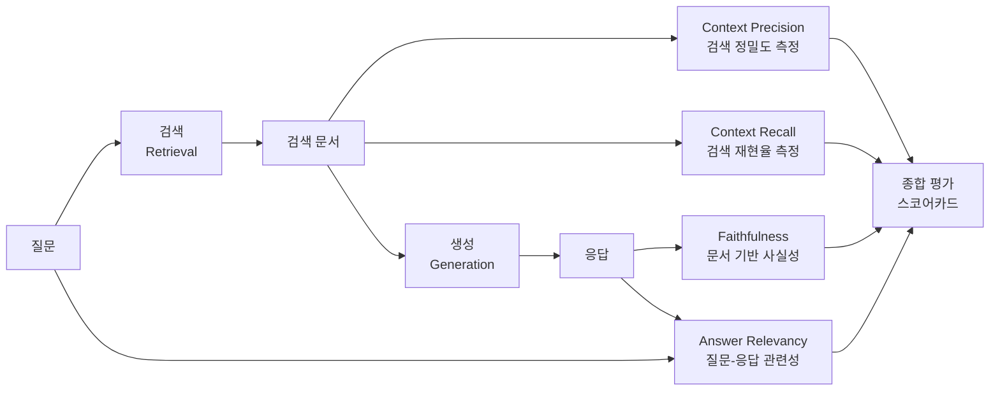

# RAG 평가 (RAG Evaluation)

## 개요

RAG(Retrieval-Augmented Generation) 시스템은 검색(retrieval)과 생성(generation)이라는 두 단계로 구성된다. 각 단계가 독립적으로 잘 작동해야 전체 파이프라인의 품질이 보장되므로, RAG 평가는 **검색 품질**과 **생성 품질**을 별도로, 그리고 통합적으로 측정해야 한다.

기존 NLP 평가 지표(BLEU, ROUGE)는 RAG의 핵심 문제인 "검색된 문서에 기반한 응답인가?"를 측정하지 못한다. 이 갭을 메우기 위해 RAGAS(RAG Assessment), TruLens, Giskard 등의 전문 평가 프레임워크가 등장했다.

## RAG 평가의 두 축



RAG 평가의 핵심 4대 지표(RAGAS 기준): **Faithfulness**, **Answer Relevancy**, **Context Precision**, **Context Recall**.

## RAGAS: RAG 평가 표준 프레임워크

RAGAS는 Es et al.(2023)이 제안한 RAG 전용 평가 프레임워크로, 레퍼런스 없이(reference-free) LLM 판사(LLM-as-Judge)를 활용하여 평가를 자동화한다.

### RAGAS 4대 핵심 지표

#### 1. Faithfulness (신뢰성/충실도)

**정의**: 생성된 응답이 검색된 문서(context)에 근거하는가?

응답을 명제(statement) 단위로 분해하고, 각 명제가 검색 문서에서 지지(supported)되는지 확인한다:

$$\text{Faithfulness} = \frac{|\text{검색 문서로 지지되는 명제 수}|}{|\text{응답의 전체 명제 수}|}$$

```python
from ragas import evaluate
from ragas.metrics import faithfulness
from datasets import Dataset

data = {
    "question": ["파이썬의 GIL이란?"],
    "answer": ["GIL은 Global Interpreter Lock으로, 파이썬에서 한 번에 하나의 스레드만 실행됩니다."],
    "contexts": [["파이썬 GIL(Global Interpreter Lock)은 CPython 인터프리터에서 한 번에 하나의 스레드만 Python 바이트코드를 실행하도록 하는 뮤텍스입니다."]],
    "ground_truth": ["GIL은 Python 스레드 실행을 제한하는 잠금 메커니즘입니다."]
}

dataset = Dataset.from_dict(data)
result = evaluate(dataset, metrics=[faithfulness])
# faithfulness: 0.0 ~ 1.0 (1.0 = 모든 명제가 문서 기반)
```

**낮은 점수의 원인**: 모델이 문서 외 지식을 사용하거나 hallucination 발생.

#### 2. Answer Relevancy (응답 관련성)

**정의**: 생성된 응답이 사용자 질문에 얼마나 관련 있는가?

응답으로부터 역으로 질문을 생성(역방향 생성)하고, 생성된 질문들과 원래 질문의 임베딩 유사도를 측정:

$$\text{Answer Relevancy} = \frac{1}{N} \sum_{i=1}^{N} \cos(\text{embed}(q_{\text{orig}}), \text{embed}(q_i^{\text{gen}}))$$

답변이 정확해도 질문과 무관한 정보를 포함하거나, 질문을 회피하는 경우 낮은 점수가 나온다.

```python
from ragas.metrics import answer_relevancy

# answer_relevancy는 LLM이 응답에서 역으로 질문을 생성하여 측정
result = evaluate(dataset, metrics=[answer_relevancy])
```

#### 3. Context Precision (컨텍스트 정밀도)

**정의**: 검색된 문서 중 실제로 응답 생성에 유용한 문서의 비율.

Ground truth 정답과 관련 있는 문서가 **상위 랭크**에 위치할수록 높다:

$$\text{Context Precision@K} = \frac{\sum_{k=1}^{K} \text{Precision@k} \times \text{rel}(k)}{|\text{관련 문서 수}|}$$

```python
from ragas.metrics import context_precision

# 상위 순위에 관련 문서가 위치할수록 높은 점수
result = evaluate(dataset, metrics=[context_precision])
```

RAG에서 상위 문서가 LLM에 더 많은 영향을 주므로, 관련 문서 순위가 중요하다.

#### 4. Context Recall (컨텍스트 재현율)

**정의**: Ground truth 정답에 포함된 정보를 검색된 문서가 얼마나 커버하는가?

Ground truth를 명제로 분해하고, 각 명제가 검색 문서에서 찾아지는지 확인:

$$\text{Context Recall} = \frac{|\text{검색 문서로 귀인 가능한 GT 명제}|}{|\text{GT 명제 총수}|}$$

```python
from ragas.metrics import context_recall

# context_recall은 ground_truth 레이블이 필요
result = evaluate(dataset, metrics=[context_recall])
```

### RAGAS 통합 스코어링

```python
from ragas.metrics import (
    faithfulness,
    answer_relevancy,
    context_precision,
    context_recall
)
from ragas import evaluate

# 4개 지표 통합 평가
result = evaluate(
    dataset,
    metrics=[
        faithfulness,
        answer_relevancy,
        context_precision,
        context_recall
    ]
)
print(result)
# {'faithfulness': 0.87, 'answer_relevancy': 0.91,
#  'context_precision': 0.76, 'context_recall': 0.83}
```

## LLM-as-Judge 패턴

RAGAS를 비롯한 현대 RAG 평가는 **LLM 자체를 평가자(judge)**로 사용한다. 인간 레이블링 없이 대규모 평가 자동화가 가능하지만, LLM의 편향이 평가에 영향을 준다.

### LLM-as-Judge 구현

```python
from langchain_openai import ChatOpenAI
from langchain_core.prompts import PromptTemplate

judge_llm = ChatOpenAI(model="gpt-4o", temperature=0)

faithfulness_prompt = PromptTemplate(
    input_variables=["context", "statement"],
    template="""주어진 컨텍스트(context)를 기반으로 다음 명제(statement)가 
    컨텍스트에서 지지되는지 판단하세요.

    컨텍스트: {context}
    명제: {statement}
    
    답변 형식: {{"verdict": 1}} (지지됨) 또는 {{"verdict": 0}} (지지 안됨)
    이유 없이 JSON만 반환하세요.
    """
)

def check_faithfulness(context, statement):
    prompt = faithfulness_prompt.format(context=context, statement=statement)
    response = judge_llm.invoke(prompt)
    import json
    return json.loads(response.content)['verdict']
```

### LLM Judge의 한계

| 문제 | 설명 | 완화 방법 |
|------|------|-----------|
| 위치 편향 (Position Bias) | 먼저 나온 응답을 선호 | 응답 순서 무작위화 |
| 자기편향 (Self-preference) | 자신이 생성한 텍스트를 선호 | 다른 LLM으로 평가 |
| 길이 편향 (Length Bias) | 긴 응답을 더 좋다고 판단 | 길이 정규화 |
| 헛점 공략 (Sycophancy) | 자신감 있는 틀린 응답을 선호 | 사실 검증 레이어 추가 |

## 신뢰도 및 근거성 평가 심화

### Groundedness (근거성)

[[groundedness-evaluation]]에서 다루는 더 광범위한 개념. 응답의 각 클레임(claim)이 검색 문서로 추적(traceable)되는지를 측정한다.

```python
def evaluate_groundedness(answer: str, contexts: list[str], llm) -> float:
    """응답의 각 문장이 컨텍스트에 근거하는지 평가"""
    # 1. 응답을 개별 클레임으로 분해
    claims = extract_claims(answer, llm)

    # 2. 각 클레임에 대한 근거 문서 확인
    grounded_count = 0
    for claim in claims:
        is_grounded = any(
            is_claim_supported_by(claim, ctx, llm)
            for ctx in contexts
        )
        if is_grounded:
            grounded_count += 1

    return grounded_count / len(claims) if claims else 0.0
```

### Faithfulness vs Groundedness

| 항목 | Faithfulness (RAGAS) | Groundedness |
|------|---------------------|--------------|
| 범위 | 응답 명제 vs 검색 문서 | 클레임 vs 문서 + 외부 지식 |
| 방향 | 응답 -> 문서 귀인 | 클레임 출처 추적 |
| 레퍼런스 | 불필요 (reference-free) | 불필요 |
| 세분화 | 명제 단위 | 클레임 단위 (더 세밀) |

## Attribution (귀인) 평가

[[faithfulness-attribution]]에서 다루는 개념. 응답의 특정 구절이 어떤 소스 문서에서 왔는지 추적하고 인용을 검증한다.

```python
class AttributionEvaluator:
    def __init__(self, llm):
        self.llm = llm

    def evaluate(self, answer: str, source_docs: list[dict]) -> dict:
        # 응답의 각 문장에 대해 소스 귀인
        sentences = split_sentences(answer)
        attributions = {}

        for sent in sentences:
            best_source = None
            best_score = 0

            for doc in source_docs:
                score = self.nli_score(premise=doc['content'], hypothesis=sent)
                if score > best_score:
                    best_score = score
                    best_source = doc['id']

            attributions[sent] = {
                'source': best_source,
                'confidence': best_score,
                'attributed': best_score > 0.7
            }

        attribution_rate = sum(1 for a in attributions.values() if a['attributed']) / len(sentences)
        return {'attribution_rate': attribution_rate, 'details': attributions}
```

## 노이즈 민감도 평가

검색된 문서 중 관련 없는 "노이즈" 문서가 포함됐을 때 모델의 강건성을 측정한다.

```python
def evaluate_noise_sensitivity(pipeline, question, relevant_docs, noise_docs, k_noise=2):
    """노이즈 문서가 섞였을 때 응답 품질 변화 측정"""
    # 클린 컨텍스트로 응답
    clean_response = pipeline(question, contexts=relevant_docs)
    clean_faith = evaluate_faithfulness(clean_response, relevant_docs)

    # 노이즈 문서 추가
    noisy_contexts = relevant_docs + noise_docs[:k_noise]
    noisy_response = pipeline(question, contexts=noisy_contexts)
    noisy_faith = evaluate_faithfulness(noisy_response, noisy_contexts)

    return {
        'noise_sensitivity': clean_faith - noisy_faith,  # 낮을수록 강건
        'clean_faithfulness': clean_faith,
        'noisy_faithfulness': noisy_faith
    }
```

## 전체 RAG 파이프라인 평가 흐름



위 다이어그램은 RAG 파이프라인의 각 단계에서 어떤 평가 지표가 측정되는지를 보여준다.

## TruLens: 대안 평가 프레임워크

TruLens는 Trulera가 개발한 LLM 앱 평가 및 모니터링 프레임워크로, RAG 트리아드(RAG Triad)를 중심으로 평가한다.

```python
from trulens_eval import Tru, TruChain, Feedback
from trulens_eval.feedback.provider import OpenAI

tru = Tru()
provider = OpenAI()

# RAG 트리아드 정의
f_qs_relevance = (
    Feedback(provider.qs_relevance, name="Context Relevance")
    .on_input()
    .on(Select.RecordCalls.retrieve.rets[:])
    .aggregate(np.mean)
)

f_groundedness = (
    Feedback(provider.groundedness_measure_with_cot_reasons, name="Groundedness")
    .on(Select.RecordCalls.retrieve.rets[:].collect())
    .on_output()
)

f_answer_relevance = (
    Feedback(provider.relevance, name="Answer Relevance")
    .on_input_output()
)

# 평가와 함께 앱 래핑
tru_rag = TruChain(
    rag_chain,
    app_id="RAG-v1",
    feedbacks=[f_qs_relevance, f_groundedness, f_answer_relevance]
)

# 평가 실행
with tru_rag as recording:
    response = rag_chain.invoke({"question": "RAG 평가 방법은?"})

# 대시보드로 결과 확인
tru.run_dashboard()
```

## 평가 지표 비교표

| 지표 | Ground Truth 필요 | 측정 대상 | 주요 프레임워크 |
|------|-------------------|-----------|----------------|
| Faithfulness | 불필요 | 문서-응답 일관성 | RAGAS, TruLens |
| Answer Relevancy | 불필요 | 질문-응답 관련성 | RAGAS, TruLens |
| Context Precision | 필요 (GT) | 검색 정밀도 | RAGAS |
| Context Recall | 필요 (GT) | 검색 재현율 | RAGAS |
| Groundedness | 불필요 | 클레임 출처 추적 | TruLens, 커스텀 |
| Attribution Rate | 불필요 | 인용 정확도 | 커스텀 |
| Noise Sensitivity | 필요 (노이즈 셋) | 노이즈 강건성 | 커스텀 |
| ROUGE-L | 필요 (GT) | 어휘 겹침 | 전통적 NLP |
| BERTScore | 필요 (GT) | 의미 유사성 | 전통적 NLP |

## 실무 평가 파이프라인 구축

### 테스트셋 구성

```python
def create_rag_test_dataset(documents, llm, n_questions=100):
    """문서 기반 평가 질문-정답 쌍 자동 생성 (RAGAS testset generator)"""
    from ragas.testset.generator import TestsetGenerator
    from ragas.testset.evolutions import simple, reasoning, multi_context

    generator = TestsetGenerator.with_openai()

    testset = generator.generate_with_langchain_docs(
        documents,
        test_size=n_questions,
        distributions={
            simple: 0.5,        # 단순 사실 질문
            reasoning: 0.25,    # 추론 필요 질문
            multi_context: 0.25 # 여러 문서 통합 필요
        }
    )
    return testset.to_pandas()
```

### CI/CD 연동

```python
def rag_evaluation_gate(pipeline, test_dataset, thresholds):
    """배포 전 평가 품질 게이트"""
    result = evaluate(
        Dataset.from_pandas(test_dataset),
        metrics=[faithfulness, answer_relevancy, context_precision, context_recall]
    )

    failures = []
    for metric, threshold in thresholds.items():
        if result[metric] < threshold:
            failures.append(f"{metric}: {result[metric]:.3f} < {threshold}")

    if failures:
        raise ValueError(f"RAG 품질 기준 미달:\n" + "\n".join(failures))

    return result

# 배포 기준
THRESHOLDS = {
    'faithfulness': 0.85,
    'answer_relevancy': 0.80,
    'context_precision': 0.75,
    'context_recall': 0.70
}
```

## 평가의 한계 및 주의사항

1. **LLM Judge 순환 참조**: 동일 LLM이 생성하고 평가하면 자기편향 발생. 서로 다른 LLM 조합 권장
2. **레퍼런스 없는 평가의 맹점**: Faithfulness 등은 GT 없이 작동하지만, "그럴듯한 오류"를 놓칠 수 있음
3. **도메인 특화 지표 부재**: 의료, 법률 등 전문 도메인에서는 범용 지표가 부족할 수 있음
4. **평가 비용**: LLM-as-Judge를 대규모로 실행하면 평가 자체에 상당한 API 비용 발생
5. **지표 간 트레이드오프**: Context Recall을 높이려면 더 많은 문서를 검색하지만, 이는 Context Precision을 낮출 수 있음

## 왜 중요한가

1. **RAG 시스템의 신뢰성 보장**: "검색된 문서에 근거하는가"를 정량화하지 않으면 hallucination을 제어하기 어렵다
2. **반복적 개선 루프**: 지표가 있어야 어떤 구성요소(청킹 전략, 임베딩 모델, 프롬프트)를 개선할지 결정할 수 있다
3. **프로덕션 모니터링**: 지식 기반이 변경되거나 사용자 쿼리 분포가 바뀔 때 품질 저하를 조기에 감지
4. **규제 대응**: 의료·법률·금융 분야에서 AI 응답의 출처 추적이 점점 의무화되는 추세

## 관련 문서

- [[rag]] - RAG 파이프라인 전반 구조와 구성 요소
- [[faithfulness-attribution]] - 응답 귀인(attribution)과 신뢰성 평가 심화
- [[groundedness-evaluation]] - 근거성 평가의 이론적 기반
