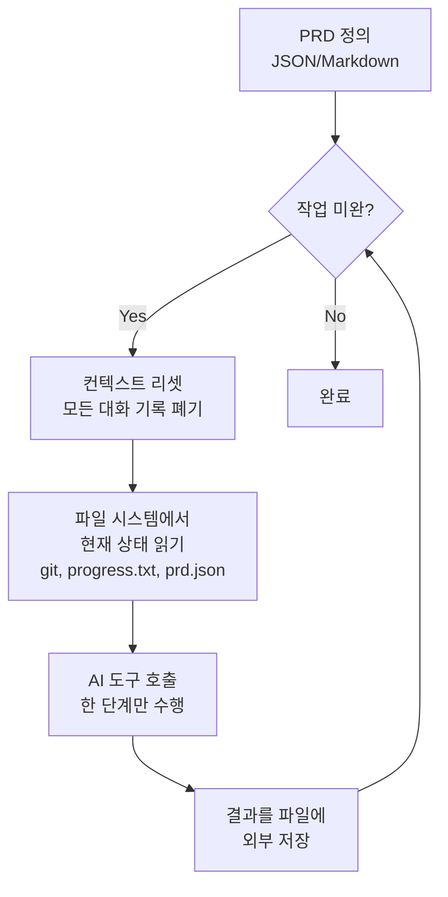
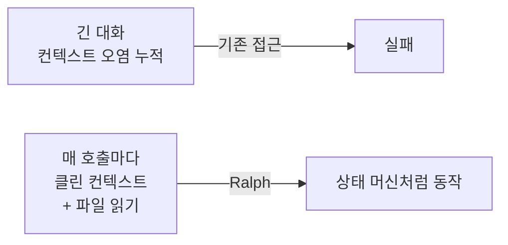

# Ralph Pattern (랠프 패턴)

## 정의

**Ralph Pattern**은 Geoffrey Huntley가 제시한 에이전트 실행 패턴이다. PRD(Product Requirements Document)가 완료될 때까지 **AI 코딩 도구를 반복 루프에서 실행하되, 매 이터레이션마다 컨텍스트를 완전히 초기화**하는 방식을 뜻한다.

원래 오픈소스: `github.com/snarktank/ralph` (공개 2개월 만에 GitHub 스타 12,000+)

## 핵심 원리

### 두 가지 불변식(invariants)

1. **컨텍스트 영속성은 파일시스템에 있다** — 대화 history가 아니라 **git commits, progress.txt, prd.json** 같은 외부 파일이 진실의 원천
2. **매 이터레이션 컨텍스트 리셋** — 이전 대화는 폐기. LLM은 깨끗한 상태에서 현재 파일을 읽고 다음 단계만 수행

## 왜 이 패턴이 필요한가

### [[context-engineering]] 시대의 문제

긴 대화가 누적되면 다음 문제가 발생한다:
- **[[lost-in-the-middle|lost-in-the-middle]]**: 컨텍스트 중간 정보 망각 (Liu et al., 2023)
- **컨텍스트 오염**: 초기 실수가 후속 결정을 오도
- **비용 폭증**: 매 호출마다 긴 history 전달
- **주의 분산**: 모델이 오래된 계획과 새 관찰 사이에서 표류

### Ralph의 해결책

에이전트를 **상태 머신**처럼 취급한다. 상태는 파일에, 로직은 LLM에. 이터레이션 간에 이 둘만 주고받는다.

## 실행 단계

1. **PRD 작성** — JSON 또는 Markdown으로 요구사항을 명시적 파일로 선언
2. **progress 파일 초기화** — `progress.txt` 같은 파일에 "시작" 상태 기록
3. **외부 루프 시작** — 셸 스크립트나 CI가 다음을 반복:
   - 클린 컨텍스트로 AI 도구(Claude Code, Amp 등) 호출
   - 프롬프트: "prd.json과 progress.txt를 읽고 다음 미완 단계 하나만 처리하라"
   - 에이전트가 한 단계 실행 후 progress.txt 갱신
   - git commit
4. **검증** — 단계 완료 조건이 프로그래밍적으로 검증 가능한지 확인 (테스트 통과, 린터 통과, 파일 존재 등)
5. **종료 조건** — 모든 PRD 항목이 완료되면 루프 탈출

## [[harness-engineering|하네스 엔지니어링]]에서의 위치

Ralph는 [[harness-quadrants|하네스 4사분면]]을 명시적으로 활용한다:

| 사분면 | Ralph의 활용 |
|---|---|
| **Guides** (좌상) | `prd.json`, PRD 문서 자체 |
| **System Prompts** (좌하) | 각 이터레이션에 주입되는 역할 정의 |
| **Computational** (우상) | 단계 완료 조건을 **기계적으로** 검증 |
| **Inferential** (우하) | 필요하면 LLM-as-judge를 별도 루프로 삽입 |

특히 **Computational** 사분면의 강제력이 핵심이다. "프로그래머블한 검증 가능성"이 높을수록 자동화 수준이 올라간다.

## 다른 에이전트 패턴과의 비교

| 패턴 | 컨텍스트 관리 | 상태 저장소 | 대표 구현 |
|------|-------------|-----------|----------|
| **단일 긴 대화** | 누적 | 대화 history | ChatGPT 초기 에이전트 |
| **Sliding window** | 앞부분 제거 | 대화 요약 | LangChain 기본 |
| **Sub-agent 위임** | 격리된 하위 컨텍스트 | 부모 요약 | [[subagents]] |
| **Ralph** | 매 이터레이션 클린 | 파일 시스템 | Ralph loop |

Ralph는 "컨텍스트는 한 번 쓰고 버리는 1회용 자원"이라는 철학을 가장 극단적으로 밀어붙인 패턴이다.

## 오남용 경계

- **프로그래밍 검증이 약한 작업**에는 맞지 않는다. 단계 완료를 기계적으로 체크할 수 없으면 무한 루프에 빠진다
- **단계 간 뉘앙스가 중요한 작업**에는 부적합. 매번 컨텍스트를 리셋하므로 누적 추론이 어렵다
- **인간 개입이 필수인 작업**에는 맞지 않는다. Lethal trifecta에 해당하는 작업([[lethal-trifecta]] 참조)은 human-in-the-loop로 처리해야 함

## 영향과 확산

- 공개 2개월 내 GitHub 스타 12,000+
- [[oh-my-claudecode]]에 "Ralph 모드"로 구현됨 ([[omc-ralph-mode]])
- OpenAI Codex 5개월 실험과 마찬가지로 "엔지니어가 코드 대신 루프 환경을 설계한다"는 철학의 대표 사례

## 관련 문서

- [[harness-engineering]] — Ralph가 속한 패러다임
- [[harness-quadrants]] — Ralph가 모든 사분면을 활용하는 방식
- [[context-engineering]] — Ralph가 해결하려 한 문제의 뿌리
- [[evolution-of-agentic-patterns]] — 이 패턴이 등장한 연대기 맥락
- [[subagents]] — 대안적인 컨텍스트 격리 전략
- [[omc-ralph-mode]] — OMC의 Ralph 패턴 구현체
