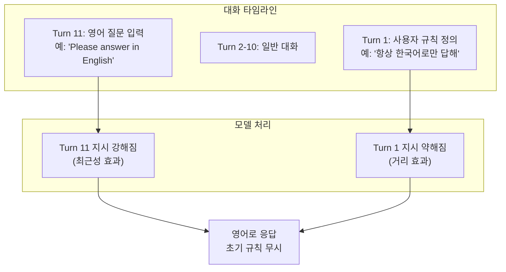
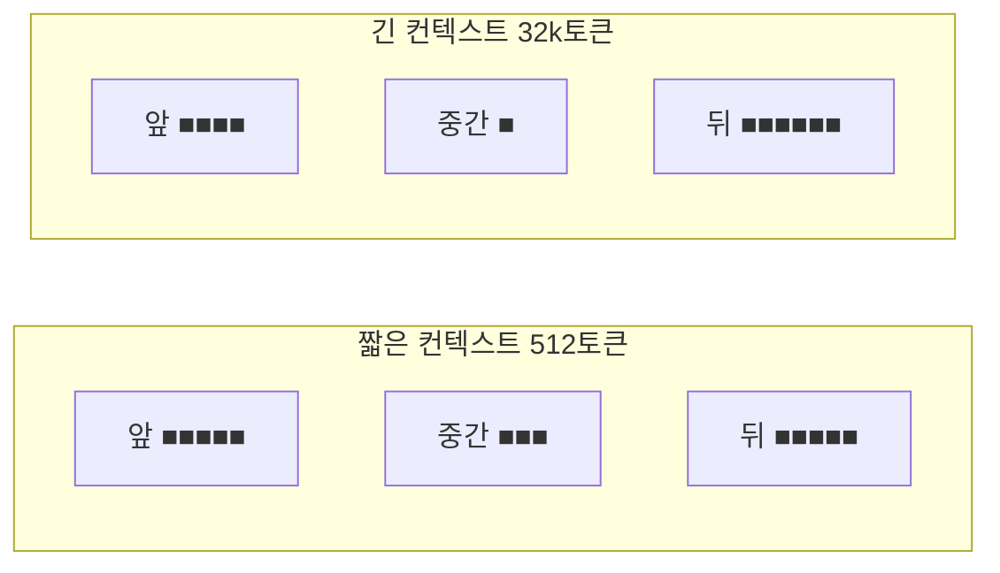
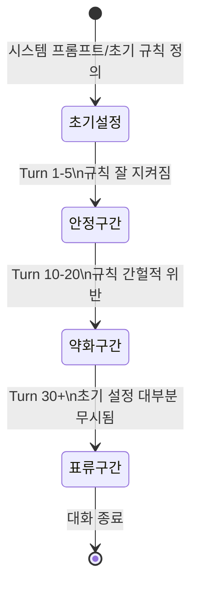
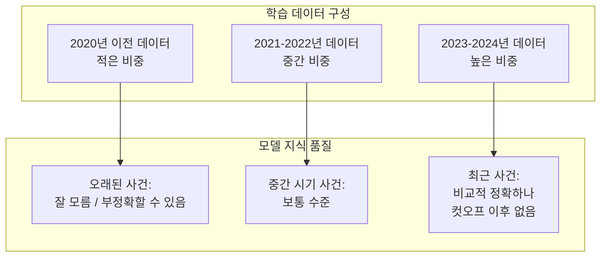
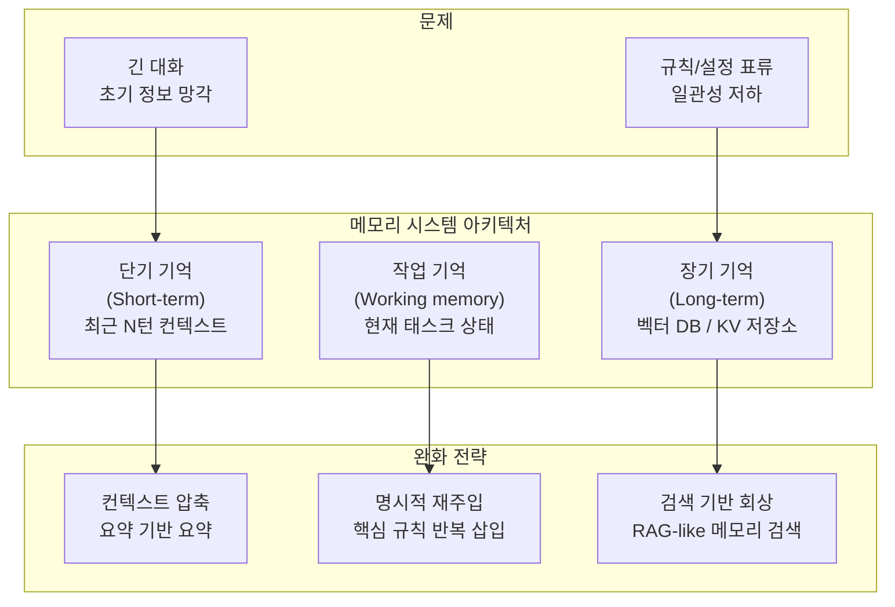
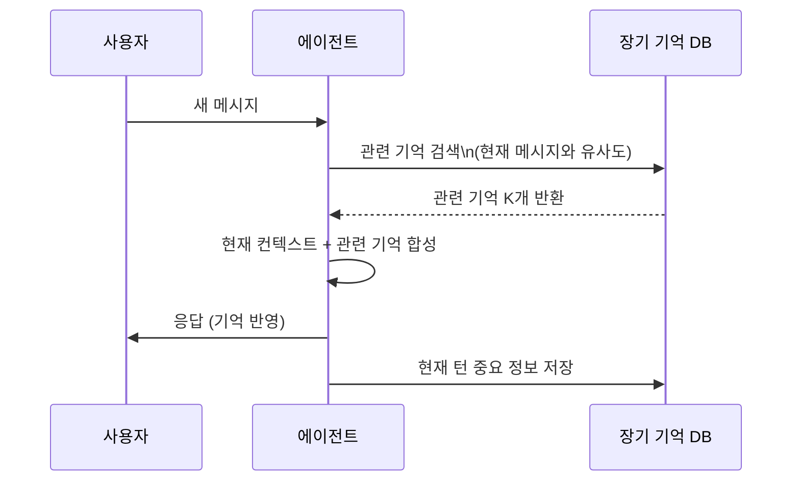

# LLM 최근성 편향 (Recency Bias in LLMs)

## 정의 / 본질

최근성 편향(recency bias)이란 LLM이 컨텍스트 창(context window) 내에서 **최근에 등장한 토큰에 불균형하게 높은 가중치를 부여**하는 경향을 말한다. 동일한 정보가 대화 초반에 제공된 경우보다 바로 직전에 제공된 경우에 더 강하게 반영된다.

이는 [[positional-bias-llm]]의 특수한 형태로, 특히 **끝 위치(recency zone)** 에서 나타나는 패턴이다. 위치 편향이 시작과 끝을 모두 포함하는 U자형 패턴을 보인다면, 최근성 편향은 그중 **끝 구간만의 과대평가**에 초점을 맞춘 개념이다.

### 최근성 편향의 두 가지 맥락

1. **지식 컷오프 최근성**: 학습 데이터에서 최근 시점의 데이터가 더 많이 포함되어 있어, 최신 사건에 대한 지식이 과거 사건보다 더 잘 반영되는 경향
2. **컨텍스트 내 최근성**: 현재 대화 또는 입력 프롬프트에서 최근에 등장한 내용이 더 강하게 영향을 미치는 경향

이 문서는 주로 **두 번째 맥락 - 컨텍스트 내 최근성 편향**을 다룬다.

---

## 핵심 아이디어

### 컨텍스트 내 최근성 편향 메커니즘



대화가 길어질수록 초반에 설정된 규칙이나 지시문이 점차 약해지고, 최근 입력이 모델 행동을 지배하게 된다.

### 어텐션 가중치 분포



컨텍스트가 길어질수록 끝 구간의 상대적 우위가 커지는 경향이 있다. 특히 KV 캐시(KV cache) 기반 추론에서 최근 토큰들은 더 생생한(fresh) 상태로 계산에 참여한다.

---

## 긴 대화에서의 일관성 문제

최근성 편향이 가장 심각하게 드러나는 시나리오는 **수십 턴 이상의 긴 대화**다.

### 일관성 저하 패턴



**실제 관찰되는 증상들:**
- 초반에 "한국어로만 답해"라고 지시했지만 30턴 후 영어로 섞어 답변
- "~라고 가정하고 역할극을 해줘"라는 초기 설정이 대화 후반에 잊혀짐
- 초기에 확립된 사실 관계(예: "나는 마케팅 담당자야")가 대화 후반에 반영 안 됨
- 이전 턴에서 사용자가 선호를 명시했지만 후속 응답에서 무시됨

---

## 지식 컷오프 최근성 편향

학습 데이터 관점의 최근성 편향도 실무에서 중요하다.



이 때문에 같은 유형의 질문이라도 최근 사건에 대해서는 더 자신감 있게(그리고 때로는 과도하게 자신감 있게) 답변하는 경향이 생긴다.

---

## 메모리 시스템의 필요성

최근성 편향은 단순히 "컨텍스트 창을 늘리면" 해결되지 않는다. 오히려 컨텍스트가 길어질수록 초반 정보가 더 희석된다. 이를 해결하기 위해 외부 메모리 시스템이 필요하다.



### 메모리 유형별 역할

| 메모리 유형 | 목적 | 구현 방법 |
|------------|------|-----------|
| 단기 기억 | 최근 N턴 대화 유지 | 슬라이딩 윈도우 + 요약 |
| 장기 기억 | 사용자 프로필, 선호, 사실 | 벡터 DB + 키워드 인덱스 |
| 작업 기억 | 현재 작업의 상태/계획 | 구조화 JSON, 스크래치패드 |
| 에피소딕 기억 | 과거 대화 요약 | 주기적 요약 생성 저장 |

---

## 완화 전략 비교

### 전략 1: 컨텍스트 요약(Summarization)

```python
from typing import Any

def compress_conversation(
    messages: list[dict[str, Any]],
    llm,
    keep_recent: int = 5,
) -> list[dict[str, Any]]:
    """오래된 메시지를 요약으로 압축.
    
    최근 keep_recent개 메시지는 원본 유지,
    그 이전 메시지들은 요약으로 대체한다.
    """
    if len(messages) <= keep_recent:
        return messages

    older = messages[:-keep_recent]
    recent = messages[-keep_recent:]

    older_text = "\n".join(
        f"{m['role']}: {m['content']}" for m in older
    )
    summary_prompt = f"다음 대화를 핵심만 3-5문장으로 요약해줘:\n\n{older_text}"
    summary = llm.invoke(summary_prompt).content

    summary_message = {
        "role": "system",
        "content": f"[이전 대화 요약]\n{summary}",
    }
    return [summary_message] + recent
```

### 전략 2: 핵심 정보 재주입

매 N턴마다 시스템 프롬프트의 핵심 규칙을 명시적으로 재삽입한다.

```python
CRITICAL_RULES = """
[핵심 규칙 - 항상 준수]
- 항상 한국어로만 응답
- 사용자 이름: {user_name}
- 역할: {role}
"""

def inject_rules_periodically(
    messages: list[dict[str, Any]],
    user_name: str,
    role: str,
    inject_every: int = 10,
) -> list[dict[str, Any]]:
    """N턴마다 핵심 규칙을 시스템 메시지로 재삽입."""
    if len(messages) % inject_every != 0:
        return messages

    rule_message = {
        "role": "system",
        "content": CRITICAL_RULES.format(
            user_name=user_name,
            role=role,
        ),
    }
    return messages + [rule_message]
```

### 전략 3: 검색 기반 장기 기억



---

## 최근성 편향 vs 위치 편향

두 개념은 밀접하게 관련되어 있지만 구별이 필요하다.

| 항목 | 최근성 편향 | 위치 편향 |
|------|------------|-----------|
| 초점 | 끝 위치 과대평가 | 시작 + 끝 과대평가, 중간 과소평가 |
| 주요 문제 | 대화 일관성, 초기 규칙 망각 | 정보 검색 정확도, 평가 신뢰성 |
| 주요 맥락 | 멀티턴 대화, 에이전트 루프 | RAG, 다문서 QA, LLM 평가 |
| 완화 방법 | 메모리 시스템, 규칙 재주입 | 위치 무작위화, 컨텍스트 재배열 |

---

## 한계 / 비판

### 1. 완전한 해결책 없음

현재까지 최근성 편향을 완전히 제거하는 방법은 없다. 요약과 재주입은 비용(토큰, 레이턴시)을 증가시키며, 요약 과정에서도 정보 손실이 발생한다.

### 2. 요약의 역설

오래된 정보를 요약하면 세부사항이 손실된다. 그러나 세부사항이 나중에 중요해질 경우 복구가 불가능하다. 무엇을 요약에 포함할지 결정하는 것 자체가 어려운 문제다.

### 3. 태스크 의존성

최근성 편향의 영향은 태스크 유형에 따라 다르다. 창의적 글쓰기처럼 최근 방향성이 중요한 태스크에서는 오히려 최근성이 바람직할 수 있다. 모든 상황에서 최근성을 억제하는 것이 정답은 아니다.

### 4. 모델별 차이

GPT-4, Claude, Gemini 등 모델마다 최근성 편향의 강도와 패턴이 다르다. 하나의 완화 전략이 모든 모델에 동등하게 효과적이지 않다.

---

## 관련 문서

- [[positional-bias-llm]] - 위치 편향 전반 (시작 + 끝 편향)
- [[agent-context-management]] - 에이전트에서 컨텍스트 관리 전략
- [[long-context]] - 긴 컨텍스트 처리 기법 전반
- [[lost-in-the-middle]] - 중간 컨텍스트 망각 현상
- [[hallucination]] - 기억 오류와 환각의 관계
