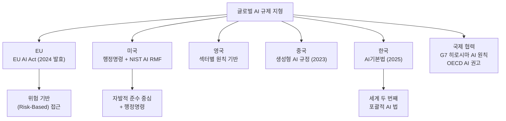
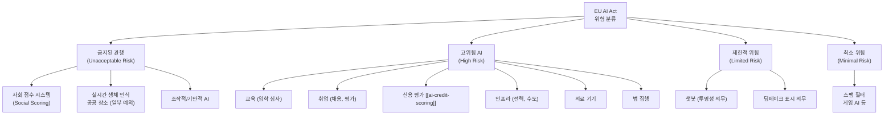
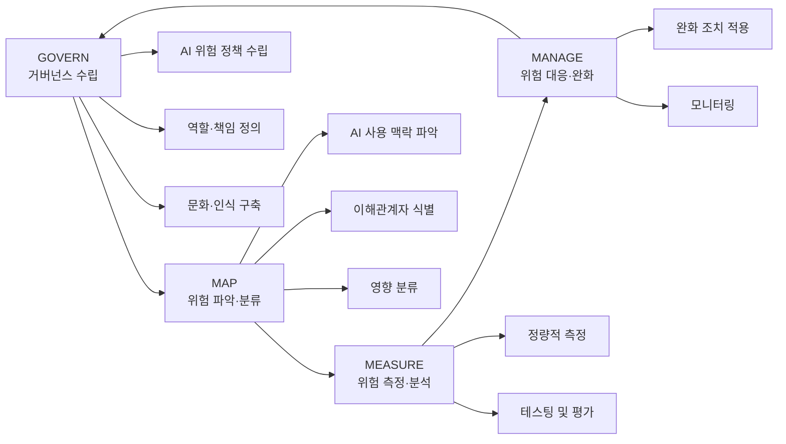
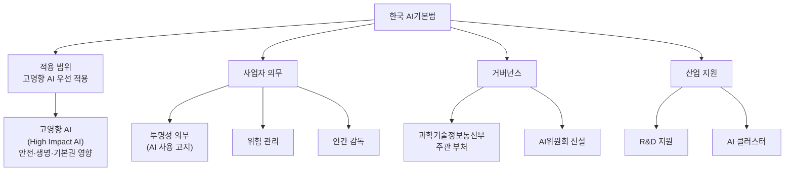
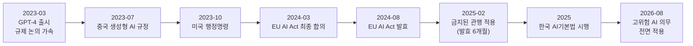

# AI 규제 (Regulatory AI)

AI 규제(Regulatory AI)는 인공지능 시스템의 개발, 배포, 운용에 관한 법적·정책적 요건 전반을 다룬다. 2023-2025년 사이 EU, 미국, 영국, 중국, 한국 등 주요국이 경쟁적으로 AI 규제 프레임워크를 수립하면서 AI 개발자와 서비스 제공자에게 실질적인 컴플라이언스(compliance) 의무가 생겨나고 있다.

---

## 글로벌 AI 규제 지형



---

## EU AI Act (EU 인공지능법)

2024년 8월 공식 발효된 세계 최초의 포괄적 AI 규제법. **위험 기반 분류 체계**가 핵심이다.

### 위험 등급 분류



### 고위험 AI 의무사항

고위험으로 분류된 AI 시스템에는 다음 요건이 적용된다:

| 의무 | 내용 |
|-----|------|
| 위험 관리 시스템 | 전 수명주기에 걸친 위험 식별·평가·완화 |
| 데이터 거버넌스 | 훈련 데이터 품질 기준, 편향 점검 |
| 기술 문서화 | 시스템 설계, 능력, 한계 문서화 |
| 기록 보존 | 자동 로깅으로 사후 감사 가능 |
| 투명성 | 사용자 정보 제공 의무 |
| 인간 감독 | 자동 결정에 인간 개입 가능 |
| 정확성·견고성 | 성능 기준 충족 |
| CE 마킹 | EU 시장 진입 전 인증 |

### GPAI (범용 AI) 추가 규정

GPT-4, Claude 등 FLOPS 기준 10^25 이상의 대형 모델에 추가 의무:
- 기술 문서화
- 저작권법 준수 증명
- 시스템 카드 공개

**시스템적 위험 GPAI** (추가 고강도 의무):
- 적대적 테스팅(adversarial testing)
- 심각한 사고 보고 의무
- 사이버보안 보호 조치

### 처벌 규모

| 위반 유형 | 최대 과징금 |
|---------|----------|
| 금지된 관행 위반 | 3,500만 유로 또는 전세계 매출 7% |
| 고위험 의무 위반 | 1,500만 유로 또는 전세계 매출 3% |
| 부정확한 정보 제공 | 750만 유로 또는 전세계 매출 1% |

---

## NIST AI Risk Management Framework (AI RMF)

미국 국립표준기술연구소(NIST)가 2023년 발표한 자발적 AI 위험 관리 프레임워크.



**AI RMF의 AI 특성 (Trustworthy AI 속성)**

| 속성 | 설명 |
|-----|------|
| 정확성 (Accuracy) | 기술적 성능 |
| 설명가능성 (Explainability) | 결정 근거 제공 |
| 해석가능성 (Interpretability) | 내부 작동 이해 |
| 개인정보 보호 (Privacy) | 데이터 보호 |
| 신뢰성 (Reliability) | 일관된 성능 |
| 안전성 (Safety) | 물리적/심리적 해 방지 |
| 보안성 (Security) | 사이버 공격 저항 |
| 공정성 (Fairness) | 편향 없는 처리 |

---

## 미국 AI 거버넌스

### Biden 행정명령 (2023.10)

- 안전성 테스트 결과 의무 보고 (FLOPS 10^26 이상 모델)
- 수출 통제 조율
- 연방 AI 사용 가이드라인
- FDA, EPA 등 각 기관 AI 규칙 수립 지시

### 미국 AI 개발 위원회 (ADC)

AI 규정 중 "ADC (American Data and Computing)"는 문서에서 확인하지 못했습니다. 미국에서는 **AISI (AI Safety Institute)**가 NIST 산하에 설립(2024)되어 AI 안전성 평가·표준화를 담당합니다.

---

## 한국 AI기본법

2025년 제정된 세계 두 번째 포괄적 AI 규제법. EU AI Act와 유사한 위험 기반 접근을 취하면서도 혁신 지원 균형을 강조한다.

### 주요 구조



**고영향 AI 해당 분야**
- 의료기기, 신체 안전
- 채용·해고, 신용 평가
- 교육 입학·평가
- 사법·행정 결정 지원
- 공공 인프라

---

## 산업별 규제 매트릭스

| 산업 | 주요 규제 | AI 적용 시 핵심 의무 |
|-----|---------|----------------|
| 금융 [[ai-credit-scoring]] | EU AI Act (고위험), GDPR | 설명가능성, 편향 탐지, 이의 제기 권리 |
| 의료 | EU MDR + AI Act, FDA AI/ML 가이던스 | 임상 검증, 사후 시장 감시 |
| 채용 | EEOC 가이던스, EU AI Act (고위험) | 차별 금지, 자동 결정 고지 |
| 자율주행 | 각국 교통법 + AI Act | 형식 안전 (Functional Safety) |
| 세무 [[ai-tax-compliance]] | 각국 세법 + AI Act (맥락별) | 감사 추적, 전문가 감독 |
| 교육 | EU AI Act (고위험), FERPA(미국) | 학생 동의, 편향 점검 |

---

## AI 프론티어 모델 포럼

주요 AI 기업들이 자발적으로 설립한 [[ai-frontier-model-forum]].

**참여 기업 (창립)**: Anthropic, Google DeepMind, Microsoft, OpenAI

**활동 영역**
- AI 안전 연구 조율
- 정부 정책 자문
- 안전 모범 사례 공유
- 레드팀 협력

---

## 컴플라이언스 실무 체크리스트

### EU AI Act 고위험 AI 체크리스트

```python
# AI 시스템 위험 분류 자동화 예시 구조
from dataclasses import dataclass
from enum import Enum

class RiskLevel(Enum):
    UNACCEPTABLE = "금지"
    HIGH = "고위험"
    LIMITED = "제한적"
    MINIMAL = "최소"

@dataclass
class AISystemProfile:
    name: str
    use_case: str
    sector: str
    affects_fundamental_rights: bool
    affects_safety_of_persons: bool
    fully_automated_decision: bool

def classify_risk(profile: AISystemProfile) -> RiskLevel:
    """
    EU AI Act 기준 위험 분류 (단순화 버전)
    실제 분류는 법률 전문가 검토 필요
    """
    high_risk_sectors = {
        "education", "employment", "credit_scoring",
        "law_enforcement", "critical_infrastructure",
        "migration", "justice"
    }

    if profile.sector in high_risk_sectors:
        return RiskLevel.HIGH
    if profile.affects_fundamental_rights or profile.affects_safety_of_persons:
        return RiskLevel.HIGH
    if profile.fully_automated_decision:
        return RiskLevel.LIMITED
    return RiskLevel.MINIMAL
```

### 위험 관리 문서화 템플릿

```python
risk_doc_template = {
    "system_id": "AI-SYS-001",
    "version": "1.0.0",
    "risk_level": "HIGH",
    "intended_purpose": "신용 평가 보조",
    "known_limitations": [
        "훈련 데이터 기간: 2020-2023",
        "특정 인구 그룹 성능 편차 ±3%",
    ],
    "bias_assessment": {
        "method": "Equalized Odds",
        "demographic_parity_diff": 0.02,
        "equal_opportunity_diff": 0.03,
        "last_audit": "2025-01-15",
    },
    "human_oversight": {
        "type": "human-in-the-loop",
        "review_threshold": "신용 점수 < 600 또는 > 850",
        "reviewer_role": "신용 심사 전문가",
    },
    "data_governance": {
        "training_data_sources": ["내부 대출 이력"],
        "pii_handling": "익명화 후 학습",
        "retention_period": "5년",
    },
}
```

---

## 규제 타임라인



---

## 규제 준수를 위한 기술적 접근

### 설명가능성 (Explainability)

고위험 AI는 결정 근거를 설명할 수 있어야 한다.

```python
import shap

def generate_explanation(model, input_data, feature_names):
    """
    SHAP 값으로 개별 예측 설명 생성
    """
    explainer = shap.Explainer(model)
    shap_values = explainer(input_data)

    explanation = {}
    for i, feature in enumerate(feature_names):
        explanation[feature] = {
            "value": float(input_data[0][i]),
            "shap_contribution": float(shap_values.values[0][i]),
        }

    # 상위 3개 기여 특성 반환
    sorted_features = sorted(
        explanation.items(),
        key=lambda x: abs(x[1]["shap_contribution"]),
        reverse=True
    )
    return sorted_features[:3]
```

### 편향 모니터링

```python
from fairlearn.metrics import MetricFrame, selection_rate, demographic_parity_difference

def audit_fairness(y_true, y_pred, sensitive_features):
    """
    인구 통계 그룹별 공정성 지표 계산
    """
    mf = MetricFrame(
        metrics={
            "정확도": lambda y, pred: (y == pred).mean(),
            "선택률": selection_rate,
        },
        y_true=y_true,
        y_pred=y_pred,
        sensitive_features=sensitive_features,
    )

    dpd = demographic_parity_difference(
        y_true, y_pred, sensitive_features=sensitive_features
    )

    return {
        "group_metrics": mf.by_group.to_dict(),
        "demographic_parity_difference": dpd,
        "compliant": abs(dpd) < 0.05,  # 임의 임계값, 업종별 다름
    }
```

---

## 관련 문서

- [[eu-ai-act-enforcement]] - EU AI Act 집행 메커니즘 상세
- [[ai-credit-scoring]] - 고위험 AI 금융 규제 사례
- [[ai-tax-compliance]] - AI 세무 분야 규제 적용
- [[ai-frontier-model-forum]] - 선도 AI 기업 자율 거버넌스
- [[ai-evaluation]] - 규제 준수를 위한 AI 평가
- [[explainability]] - 설명가능성 기술
- [[ai-fairness]] - 공정성 측정 방법론
