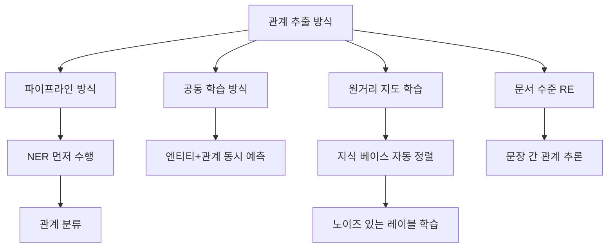

# 관계 추출 (Relation Extraction)

관계 추출(RE, Relation Extraction)은 텍스트에서 두 개 이상의 엔티티 사이에 존재하는 의미적 관계를 자동으로 식별하는 NLP 태스크다. [[named-entity-recognition]]으로 개체를 찾아낸 다음, 그 개체들 사이의 관계 유형을 분류하는 방식으로 작동하며, [[knowledge-graph]] 자동 구축의 핵심 단계다.

## 왜 중요한가

"일론 머스크는 스페이스X를 창립했다"라는 문장에서 NER은 "일론 머스크(PER)"와 "스페이스X(ORG)"를 식별하지만, 두 엔티티의 관계인 "창립자-기업(founder-of)"은 관계 추출이 담당한다. 이렇게 추출된 (주체, 관계, 객체) 트리플은:

- 지식 베이스(Wikidata, DBpedia 등) 자동 확장
- 질의응답 시스템의 추론 근거 제공
- 문서 요약 시 핵심 사실 관계 보존
- 의료 기록에서 약물-부작용, 유전자-질병 관계 추출

## 관계 추출 방식의 분류



### 1. 파이프라인 방식 (Pipeline)
NER로 엔티티 쌍을 추출한 후, 각 쌍에 대해 관계 유형을 분류하는 2단계 접근. 구현이 단순하나 오류가 누적된다.

### 2. 공동 학습 방식 (Joint Learning)
엔티티 인식과 관계 분류를 단일 모델로 동시에 학습. 스팬 기반 모델(SpERT 등)이 대표적이며 파이프라인의 오류 전파 문제를 완화한다.

### 3. 원거리 지도 학습 (Distant Supervision)
Wikidata 같은 지식 베이스의 관계 트리플을 코퍼스에 자동 정렬해 레이블을 생성. 대규모 데이터를 저비용으로 확보할 수 있으나 정렬 오류로 인한 노이즈가 크다.

### 4. 문서 수준 RE (Document-level RE)
단일 문장이 아닌 문서 전체에서 엔티티 간 관계를 추론. "A장에서 설립된 회사가 B장에서 파산했다"처럼 문장을 넘나드는 관계 파악이 필요하다.

## 핵심 입력 표현 기법

### 엔티티 마커 삽입 (Entity Marker)
모델에 엔티티 위치 정보를 명시적으로 알려주기 위해 특수 토큰을 삽입한다.

```text
원문: 일론 머스크는 스페이스X를 창립했다.
마커: [E1] 일론 머스크 [/E1] 는 [E2] 스페이스X [/E2] 를 창립했다.
```

BERT 계열 모델에서 `[E1]`, `[E2]` 토큰의 표현을 사용하거나, 두 엔티티 표현을 concat해 분류 헤드에 입력한다.

### 타입 마커 (Typed Entity Marker)
엔티티 마커에 타입 정보를 함께 인코딩:

```text
[PER] 일론 머스크 [/PER] 는 [ORG] 스페이스X [/ORG] 를 창립했다.
```

TACRED 데이터셋 기준으로 타입 마커 방식이 단순 마커 대비 F1 2-3% 향상을 보인다.

## 주요 데이터셋 및 벤치마크

| 데이터셋 | 도메인 | 관계 수 | 특징 |
|---------|-------|--------|------|
| TACRED | 뉴스·웹 | 42 | 대규모 일반 도메인 RE |
| DocRED | Wikipedia | 96 | 문서 수준 RE |
| Re-TACRED | 뉴스·웹 | 40 | TACRED 레이블 오류 수정판 |
| BC5CDR | 생의학 | 1 (화학-질병) | 고품질 바이오 RE |
| KLUE-RE | 한국어 | 30 | 한국어 RE 표준 |

## 트랜스포머 기반 관계 추출

```python
# KLUE-RE 파인튜닝 예시 구조
from transformers import AutoModelForSequenceClassification

# 엔티티 마커가 삽입된 문장을 입력으로 받아
# 관계 유형을 분류하는 시퀀스 분류 모델
model = AutoModelForSequenceClassification.from_pretrained(
    "klue/roberta-large",
    num_labels=30  # KLUE-RE 관계 유형 수
)
```

KLUE-RE에서 RoBERTa-large + 타입 마커 조합이 F1 85% 이상을 달성한다.

## 현대적 접근: LLM을 활용한 관계 추출

GPT-4, Claude 같은 대형 언어 모델을 활용하면 레이블 데이터 없이 제로샷/퓨샷 관계 추출이 가능하다.

```text
프롬프트: 다음 문장에서 엔티티 쌍과 관계를 JSON으로 추출하세요.
문장: "삼성전자는 2023년 인도 첸나이에 새 공장을 설립했다."
```

LLM 기반 방식은 새 관계 유형에 즉시 적용 가능하다는 장점이 있지만, 미세한 관계 유형 구분에서는 파인튜닝 모델에 비해 정밀도가 낮을 수 있다.

## 실무 적용 관점

- **관계 정의의 명확성**: "소속"과 "설립"처럼 유사해 보이는 관계의 경계를 어노테이션 가이드라인으로 명확히 정의해야 레이블 일관성이 확보된다.
- **불균형 레이블**: 실제 코퍼스에서 대부분의 엔티티 쌍은 관계가 없다(no_relation). 클래스 불균형 처리(focal loss, 오버샘플링)가 중요하다.
- **NA 클래스 처리**: 관계 없음(NA)을 잘못 학습하면 모델이 모든 것을 NA로 예측하는 함정에 빠진다. 임계값 조정과 주의 깊은 NA 샘플 선별이 필요하다.

## 관련 문서

- [[named-entity-recognition]] - 관계 추출의 선행 단계인 개체명 인식
- [[knowledge-graph]] - 관계 추출 결과로 구축하는 지식 그래프
- [[ner-named-entity-recognition]] - NER 상세 구현
- [[bert]] - 관계 추출 파인튜닝에 활용되는 BERT 계열 모델
- [[coreference-resolution]] - 동일 엔티티의 다른 표현 연결
