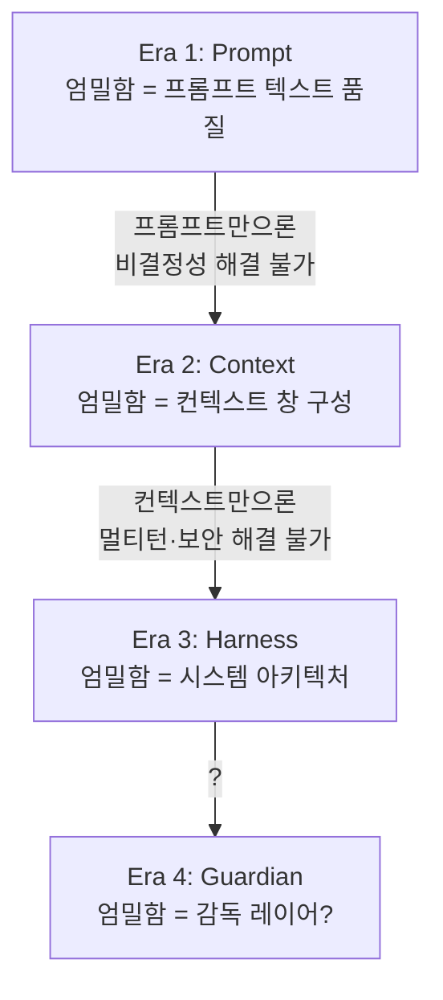

# Relocating Rigor (엄밀함의 이동)

## 정의

**Relocating Rigor**는 Chad Fowler가 제시한 엔지니어링 원칙이다:

> "엔지니어링의 엄밀함은 사라지지 않는다 — 이동할 뿐이다."
> ("Engineering rigor doesn't disappear—it relocates.")

새로운 도구나 추상화 계층이 도입될 때 그 "엄밀함"은 폐기되는 것이 아니라 다른 위치로 **이동**한다. 한 층에서 느슨해 보이는 것은 다른 층에서 엄밀함이 강화된 결과다.

## 왜 중요한가

이 원칙은 **AI 에이전틱 개발 4년의 패러다임 전환을 이해하는 메타 프레임**이다. 2022-2026 사이 AI 개발 패러다임은 세 번 이동했다:

1. [[prompt engineering]] (2022-2024): 엄밀함이 **프롬프트 텍스트**에 있었다
2. [[context engineering]] (2025): 엄밀함이 **컨텍스트 창 구성**으로 이동
3. [[harness engineering]] (2026+): 엄밀함이 **시스템 아키텍처**로 이동

각 전환은 전임자의 엄밀함을 "없애"지 않는다 — 한 층 위로 올린다.

## 엄밀함이 이동하는 방식

각 층은 이전 층의 "부족함"이 드러난 뒤에 출현한다. 그리고 이전 층을 폐기하는 것이 아니라 **포함**한다: 좋은 하네스는 여전히 좋은 프롬프트를 요구한다.

## 원본 출처

Chad Fowler의 [Relocating Rigor](https://www.honeycomb.io/blog/production-is-where-the-rigor-goes) (Honeycomb 블로그)에서 처음 제시된 개념. 원래 맥락은 "프로덕션이 새로운 엄밀함의 장소"라는 관찰 — 개발 단계의 엄격한 테스트가 줄어든 대신 프로덕션에서의 관측 가능성(observability)이 엄밀함의 새로운 축이 되었다는 것.

## 포함 관계 (Subsumption)

[[evolution of agentic patterns|3 에라 연대기]]에서 각 에라는 전임자를 **대체하지 않고 포함**한다:

- 좋은 하네스는 좋은 컨텍스트를 전제로 한다
- 좋은 컨텍스트는 좋은 프롬프트를 전제로 한다
- 진화는 **포기**가 아닌 **추상화 수준의 상승**이다

이 원칙은 "최신 패러다임만 배우면 된다"는 오해를 교정한다. 엄밀함은 사라지지 않으므로 하위 계층을 여전히 이해해야 한다.

## 실무 적용

- 새 도구/추상화가 "엔지니어링이 더 쉬워졌다"고 말할 때, **엄밀함이 어디로 이동했는지** 찾아라
- 옛 영역에서 엄밀함이 줄어들었다면 새 영역에서 반드시 늘어났다. 그곳을 놓치면 시스템이 깨진다
- 예: vibe coding의 "리뷰 없이 코드 수락"이 작동했을 때 — 엄밀함은 **테스트/타입 시스템/컴파일러**(즉 하네스의 feedback 사분면)로 이동했을 때만 작동한다

## 관련 문서

- [[evolution of agentic patterns]] — 이 원칙을 배경으로 삼은 3 에라 연대기
- [[prompt engineering]] — Era 1의 엄밀함 위치
- [[context engineering]] — Era 2의 엄밀함 위치
- [[harness engineering]] — Era 3의 엄밀함 위치
- [[vibe coding]] — 엄밀함이 이동하지 않은 "외양"의 사례
