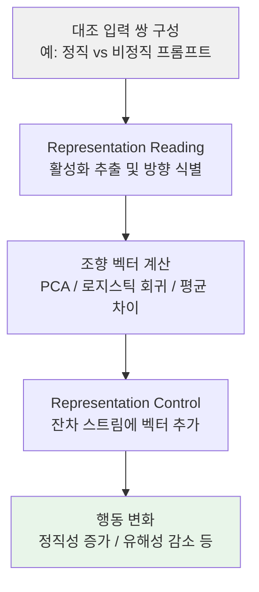

# Representation Engineering & Activation Steering

LLM의 잔차 스트림(residual stream)에 계산된 벡터를 추가하여, 재학습 없이 추론 시점에서 모델의 행동을 조향(steering)하는 기법이다. 정직성, 유해성 억제, 창의성 증폭 등 고수준 개념을 벡터 산술로 제어할 수 있다.

## 왜 지금 중요한가

파인튜닝은 비용이 크고 정적이며, 프롬프트 엔지니어링은 표면적이다. Representation Engineering은 모델 내부의 표현 공간에 직접 개입하여 행동을 제어하는 중간 지점을 제공한다. 2026년 현재 Conceptor, CAST, PID 기반 적응적 조향 등 방법론이 빠르게 발전하면서, [[ai-safety-alignment-2026|안전 정렬]]과 [[circuit-tracing|회로 추적]]을 보완하는 실용적 도구로 자리잡고 있다.

## 2단계 프레임워크

### 1단계: Representation Reading

대조 입력 쌍(예: 정직한 응답 vs 비정직한 응답)에 대한 활성화를 수집하고, 두 집합 사이의 방향(direction)을 식별한다. 이 방향이 곧 해당 개념의 조향 벡터가 된다.

### 2단계: Representation Control

식별된 벡터를 추론 시 잔차 스트림, 어텐션 헤드, MLP 레이어 등에 추가하여 모델 행동을 원하는 방향으로 조향한다.

## 주요 방법론

| 방법 | 핵심 접근 | 특징 |
|------|----------|------|
| **RepE** | PCA 기반 벡터 추출 | 개념 방향을 주성분 분석으로 식별 |
| **CAA** (Contrastive Activation Addition) | 대조 쌍의 활성화 평균 차이 | 단순하고 직관적 |
| **ITI** (Inference-Time Intervention) | 분류기 기반 방향 식별 | 정밀한 개입 지점 선택 |
| **Conceptor** | 타원체 영역으로 활성화 표현 | 다중 속성 동시 조향 시 부정적 상호작용 제거 |
| **CAST** | 최적화된 조향 벡터 생성 | 향상된 효율성 |
| **PID 적응적 조향** | 제어 이론 기반 동적 강도 조절 | 토큰별 개입 강도를 실시간 조정 |
| **Circuit Breakers** | 유해 출력 경로 차단 | 안전 특화 |
| **StTP** (Steer-to-Target-Projection) | 정렬되지 않은 토큰만 선택적 개입 | 능력 보존 우수 |
| **StMP** (Steer-to-Mirror-Projection) | 결정 경계 반사 + 보간 | 다회전 대화 안정성 |

## 파인튜닝과의 비교

| 항목 | 파인튜닝 | Activation Steering |
|------|----------|-------------------|
| 연산 비용 | 대규모 재학습 필요 | 추론 시 최소 연산 |
| 유연성 | 학습 후 정적 | 런타임에 강도 조절 가능 |
| 파라미터 변경 | 모델 가중치 수정 | 가중치 변경 없음 |
| 적용 속도 | 시간-일 단위 | 즉시 |
| 되돌리기 | 별도 모델 필요 | 벡터 제거로 원복 |
| 접근 요건 | 학습 인프라 | 화이트박스 접근(내부 활성화) |

## 실험 검증 결과

Llama-3.3-70B에서의 단일 턴 평가:

- 정직성(honesty) 회복: 84-88% 수준
- 공감성(compassion) 회복: 71-78% 수준
- 일관성(coherence) 유지: 90% 이상
- StTP/StMP는 MMLU, MT-Bench, AlpacaEval에서 능력 보존 우수

다회전 대화에서의 특성:

- SwFC(고정 계수 조향)는 대화가 길어질수록 반복 증폭 및 일관성 저하
- StTP/StMP는 5-10턴에 걸쳐 특성 발현이 유지되면서 텍스트 품질 저하가 적음
- Qwen3-32B에서도 교차 아키텍처 일반화 확인

## 한계와 위험

### 기술적 한계

- **중첩(Superposition)**: 네트워크가 차원보다 많은 특징을 인코딩하면, 한 속성에 대한 개입이 의도치 않은 속성에 영향
- **일반화 실패**: 학습 데이터 특정 패턴을 포착하는 경우, 다른 도메인으로 전이 불가
- **비선형성**: 강한 선형 표현 가설이 성립하지 않는 특징에는 비선형 개입 필요
- **다중 속성 충돌**: 서로 다른 개념의 조향 벡터를 결합하면 예측 불가능한 상호작용 발생

### 이중 용도(Dual-Use) 위험

안전성을 높이는 동일한 기법이 역으로 탈옥이나 안전 학습 우회에도 사용될 수 있다. 모델이 잊도록 학습된 정보를 추출하거나, 편향을 예측 불가능하게 증폭/억제할 위험이 있다.

## 대표 레퍼런스

- [A Comprehensive Survey on Representation Engineering -- arXiv](https://arxiv.org/html/2502.17601v1)
- [Steering LLMs using Conceptors -- arXiv](https://arxiv.org/abs/2410.16314)
- [PID-based Adaptive Activation Steering -- arXiv](https://arxiv.org/html/2604.08169v1)

## 관련 페이지

- [[circuit-tracing|Circuit Tracing & Attribution Graphs]]
- [[gemma-scope-2|Gemma Scope 2]]
- [[mechanistic-interpretability-2026|기계적 해석가능성 2026 돌파]]
- [[safety-alignment-depth-paper|Safety Alignment Depth (ICLR 2025)]]
- [[alignment-faking|Alignment Faking]]
- [[deliberative-alignment|Deliberative Alignment]]
