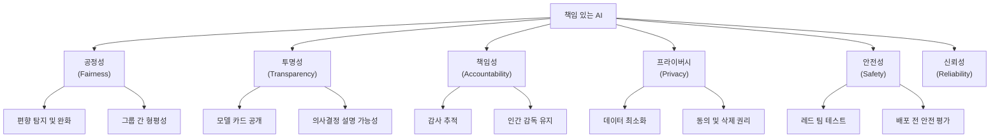

# 책임 있는 AI 실천

## 개요

**책임 있는 AI(Responsible AI)** 는 AI 시스템이 사회적으로 유익하고, 공정하며, 투명하고, 설명 가능하게 설계·배포·운영되도록 하는 일련의 원칙과 실천 방법이다. 단순한 기술적 문제를 넘어 윤리, 법, 사회 전반에 걸친 광범위한 고려를 요구한다.

## 핵심 원칙

### 공정성 (Fairness)

AI 시스템이 인종, 성별, 나이, 출신 등에 따라 불공평한 결과를 내지 않도록 하는 원칙.

**편향의 원천**:
- **데이터 편향**: 학습 데이터가 특정 집단을 과소 또는 과잉 대표
- **레이블 편향**: 인간 평가자의 주관적 편견이 레이블에 반영
- **피드백 루프**: 편향된 예측이 편향된 데이터를 생성하는 악순환

**편향 측정 지표**: 인구 통계적 균형(demographic parity), 균등화된 기회(equalized odds), 교정(calibration) 등.

### 투명성 (Transparency)

모델이 어떻게 만들어졌고 어떤 데이터로 학습됐는지 공개하는 원칙.

### 책임성 (Accountability)

AI 시스템의 결정으로 발생한 피해에 대해 책임질 수 있는 인간이 있어야 한다는 원칙. AI가 완전히 자율적으로 결정을 내리지 않도록 인간 감독(human oversight)을 유지한다.

## 모델 카드 (Model Cards)

Mitchell et al. (2019) "Model Cards for Model Reporting". Google AI에서 제안한 모델 문서화 표준.

모델 카드는 다음을 포함한다:
- 모델 세부사항: 아키텍처, 학습 데이터, 날짜
- 의도된 사용 사례와 사용 금지 사례
- 평가 결과: 전체 성능 및 인구 통계 별 성능
- 윤리적 고려사항
- 알려진 제한사항 및 편향

예시: Google의 Gemini 모델 카드, Hugging Face 모델 허브의 카드 템플릿.

## 데이터셋 문서 (Datasheets for Datasets)

Gebru et al. (2021) "Datasheets for Datasets". 학습 데이터에 대한 문서화 표준.

**포함 내용**:
- 데이터 수집 동기와 구성
- 데이터 수집 과정 (누가, 어떻게, 언제)
- 사전 처리/정제 과정
- 법적·윤리적 고려사항
- 유지보수 및 업데이트 계획

모델 카드와 데이터셋 문서는 AI 시스템의 **투명성 패키지**를 구성한다.

## AI 영향 평가 (AI Impact Assessment)

새로운 AI 시스템 배포 전에 잠재적 사회적 영향을 체계적으로 평가하는 과정.

- **대상**: 누가 시스템에 영향을 받는가? (직접 사용자, 간접 영향을 받는 집단)
- **리스크**: 잘못됐을 때 어떤 피해가 발생하는가?
- **완화책**: 리스크를 줄이기 위해 무엇을 할 수 있는가?
- **모니터링**: 배포 후 어떻게 추적할 것인가?

## 주요 기관의 프레임워크

### Anthropic: 책임 있는 스케일링 정책 (RSP)

Anthropic의 **Responsible Scaling Policy (RSP)** 는 모델 능력이 특정 임계값(ASL, AI Safety Level)을 넘으면 추가 안전 조치를 의무화하는 정책이다.

- ASL-1: 현재 모델 이하 능력
- ASL-2: 대량살상무기(CBRN) 관련 정보 제공 가능
- ASL-3: 더 심각한 위험 가능
- 각 레벨마다 평가, 완화, 배포 요건 명시

### OpenAI: Preparedness Framework

OpenAI의 **Preparedness Framework**는 프론티어 모델의 위험 평가 기준을 제시한다:

- 사이버 보안, CBRN, 모델 자율성, 설득/기만 등 4개 카테고리 평가
- 위험 수준: 낮음(low), 중간(medium), 높음(high), 심각(critical)
- 안전 점수가 중간 이하이면 배포 불가, 심각이면 개발 중단

### Google: AI 원칙

Google의 AI 원칙 (2018년 공개):
1. 사회적으로 유익해야 함
2. 불공평한 편향 생성 및 강화 방지
3. 안전을 위해 구축 및 테스트
4. 인간에 책임
5. 프라이버시 설계 원칙 통합
6. 과학적 탁월성 유지
7. 해당 원칙에 부합하는 용도에만 제공 가능

## 책임 있는 스케일링 (Responsible Scaling)

"책임 있는 스케일링"은 더 강력한 AI를 개발할수록 더 많은 안전 조치가 필요하다는 원칙이다. 단순히 더 큰 모델을 만드는 것이 아니라, 능력 향상에 비례해 위험 완화 연구도 발전시켜야 한다.

이 개념은 **안전과 능력이 트레이드오프가 아니라 함께 발전해야 한다**는 시각을 담고 있다.

## 편향 탐지 및 완화

| 단계 | 방법 | 도구 |
|------|------|------|
| 데이터 수집 | 대표성 있는 샘플링, 능동적 수집 | 데이터셋 통계 분석 |
| 학습 | 공정성 제약 추가, 재가중치 | Fairlearn, AI Fairness 360 |
| 평가 | 인구 통계 별 성능 분석 | Eval 분해 |
| 배포 후 | 지속적 모니터링, 피드백 루프 | 운영 지표 대시보드 |

## 관련 문서

- [[AI 거버넌스와 규제]] - 규제 환경과 법적 프레임워크
- [[정렬]] - AI가 인간 의도에 맞게 행동하도록 하는 기술적 접근
- [[AI 레드 팀과 적대적 테스트]] - 안전 평가의 실천적 방법론
- [[constitutional-ai|Constitutional AI]] - 원칙 기반 AI 안전 학습 방법
