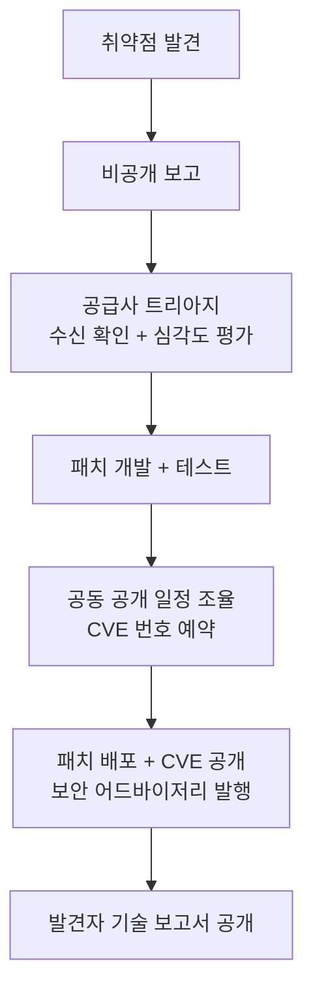

## 개요

**Responsible Disclosure**(책임 있는 공개)는 보안 연구자가 취약점을 발견했을 때, 즉시 공개하지 않고 공급사에게 먼저 비공개로 알린 뒤 패치할 시간을 준 후 공개적으로 공개하는 윤리·프로세스 규범이다. 소프트웨어 산업에서 수십 년에 걸쳐 정착한 관행이며, 최근에는 AI 모델 안전성 분야로도 그 원리가 확장되고 있다.

핵심 논리는 단순하다. 취약점을 공개하면 공격자도 정보를 얻는다. 방어자가 먼저 준비할 시간을 갖는 것이 사용자 보호에 훨씬 유리하다.

## 세 가지 공개 방식의 스펙트럼

보안 커뮤니티는 공개 방식을 크게 세 가지로 구분한다.

| 방식 | 내용 | 특징 |
|------|------|------|
| **Full Disclosure** | 발견 즉시 공개 | 벤더 대응 없이 공개. 패치 전 익스플로잇 위험 |
| **Responsible Disclosure** | 벤더에 먼저 알리고, 기한 내 패치 없으면 공개 | 발견자가 기한을 설정해 균형 유지 |
| **Coordinated Vulnerability Disclosure (CVD)** | 발견자·벤더·조정 기관이 협력해 공개 시점을 조율 | ISO/IEC 29147·30111로 표준화된 공식 프로세스 |

현재 업계 주류는 CVD다. 단순한 "먼저 알리기"를 넘어, CVE 발행 기관·CERT/CC 같은 중간 조정자를 두고 다자간 협력으로 공개 일정을 관리한다.

## 역사적 맥락

1990년대 초 인터넷 보안 커뮤니티에서 Full Disclosure 논쟁이 불거졌다. 취약점을 공개하면 벤더가 패치를 서두른다는 주장과, 공개가 공격을 유발한다는 주장이 충돌했다.

- 1990년대 중반, **BugTraq** 메일링 리스트가 취약점 정보 공유의 중심지로 부상했다. 완전 공개 지향이었으나 점차 책임 있는 공개 방향으로 논의가 전환됐다.
- 2000년대 초반, **Rain Forest Puppy**가 RFC(Request for Comments) 스타일의 취약점 공개 정책("RFPolicy")을 제안해 공급사 응답 기한 설정과 단계적 공개 절차를 제도화했다.
- 2010년대 초반, **Google Project Zero**가 90일 공개 기한 정책을 도입하면서 업계 표준에 영향을 줬다. 벤더가 90일 안에 패치하지 않으면 기한 후 공개한다는 원칙이다. [교차검증 필요: Google Project Zero의 정확한 정책 시작 연도는 공식 블로그에서 직접 확인 권장]
- **CERT/CC**(카네기 멜런 대학)와 **MITRE CVE**(Common Vulnerabilities and Exposures) 프로그램이 취약점 식별 체계를 표준화했다.
- **ISO/IEC 29147**(취약점 공개)과 **ISO/IEC 30111**(취약점 처리 프로세스)이 국제 표준으로 공식화됐다.

## 핵심 프로세스 구성 요소

보안 연구자가 취약점을 발견한 시점부터 공개까지의 일반적인 흐름이다.

### 보고 채널

- **보안 이메일**: `security@<vendor>.com` 형태의 전용 수신함. PGP 암호화 권장
- **Bug Bounty 플랫폼**: HackerOne, Bugcrowd 등. 보상 구조와 명확한 수용 범위(scope) 제공
- **직접 연락**: 중소 프로젝트는 개발자 직접 연락

### 타임라인 (일반적 기준)

- **90일**: Google Project Zero가 채택해 업계 표준이 된 기한
- **90-180일**: 복잡한 취약점이나 다수 벤더가 관여하는 경우 확장
- **타임라인 초과**: 발견자가 기한을 공개적으로 알리고, 미패치 상태에서 공개하는 것이 통상 허용됨

### Legal Safe Harbor

연구자가 취약점 분석 과정에서 시스템에 접근하거나 역공학을 수행할 때 법적 위험이 생길 수 있다. 성숙한 Bug Bounty 프로그램은 **Safe Harbor 조항**을 통해 선의의 보안 연구 행위를 소송으로부터 보호한다. 미국의 경우 DMCA(Digital Millennium Copyright Act) 1201조 예외 조항이 보안 연구를 일부 보호하지만 적용 범위에 한계가 있다.

## AI 분야로의 확장

Responsible Disclosure의 원리는 AI 시스템의 위험 능력(dangerous capabilities) 관리에도 적용되기 시작했다. 형태는 다르지만 논리 구조는 동일하다: **방어자가 먼저 준비할 시간을 확보한 뒤 공개.**

| 차원 | 소프트웨어 Responsible Disclosure | AI 안전성 적용 |
|------|----------------------------------|----------------|
| 공개 대상 | 소프트웨어 취약점 | 모델의 위험 능력 또는 red-team 결과 |
| 발견 주체 | 외부 보안 연구자 | 내부 red-team 또는 외부 안전 연구자 |
| 준비 주체 | 벤더(패치 개발) | AI 기업 + 파트너(방어 배포) |
| 공개 기한 | 90-180일 | 아직 표준 없음 (연구 진행 중) |
| 공개 형태 | CVE + 어드바이저리 | 안전 보고서, 능력 평가 공개 |

주요 AI 기업들은 모델 출시 전 red-team 결과를 안전 학습에 반영하고 일부 요약을 공개하는 방식을 채택하고 있다. 이것이 소프트웨어 CVD의 구조와 유사한 흐름이다.

[[capability-gated-release]]는 Responsible Disclosure를 더 직접적으로 모방한 변형이다. "취약점" 대신 "위험 능력 전체"를 대상으로, 모델이 아닌 개발사 자신이 발견자 역할을 맡아 파트너에게 먼저 능력을 제공하고 방어 준비 후 일반 공개 여부를 결정하는 구조다.

## 실무 관점: 왜 중요한가

보안 커뮤니티에서 Responsible Disclosure가 정착한 이유는 게임 이론적으로도 타당하다.

- **완전 공개**는 벤더를 압박하지만 패치 전 대규모 공격 노출 위험을 감수한다
- **비공개 유지**는 벤더 편의를 극대화하지만 연구자 인센티브를 제거하고 은폐를 장려한다
- **Responsible Disclosure/CVD**는 양쪽의 인센티브를 균형 있게 조율한다

AI 안전성 문맥에서도 이 균형 논리가 그대로 적용된다. 모델의 위험 능력을 즉시 공개하면 악용이 선행되고, 영구 비공개하면 방어 인프라가 준비될 기회가 없다. 조율된 공개(coordinated disclosure) 원칙이 AI 거버넌스의 출발점이 될 수 있다.

## 관련 문서

- [[capability-gated-release]] - Responsible Disclosure를 AI 능력 출시 정책에 적용한 변형 개념
- [[project-glasswing-case-study]] - Capability-Gated Release의 첫 대형 사례. Project Glasswing 구조에서 CVD와의 유사성 확인 가능
- [[red-teaming-ai]] - AI 시스템에서 취약점/위험 능력을 발견하는 방법론
- [[ai-cybersecurity-defensive]] - AI 기반 방어 보안 전반 맥락
- [[llm-security-owasp]] - LLM 보안 위협과 방어 체계
