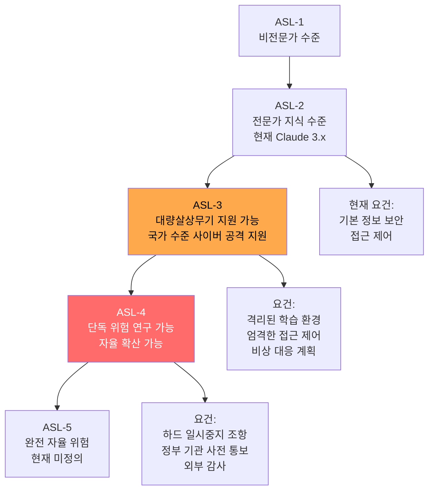

# Responsible Scaling Policy v3 & Frontier Safety Roadmap

AI 역량 임계치마다 요구되는 안전 조치를 명문화하고, 공개 로드맵으로 진척도를 투명화하는 Anthropic의 거버넌스 문서. 2026년 2월 v3.0, 4월 v3.1이 공표되었다.

## 정의

**책임 있는 스케일링 정책(Responsible Scaling Policy, RSP)**은 모델 능력이 특정 임계치에 도달하기 전에 충족해야 할 안전 조건을 사전에 공개하는 자율 거버넌스 문서다. "능력이 증가할수록 의무도 증가한다"는 원칙을 구체적 트리거와 요건으로 구현한다.

## ASL(AI Safety Level) 체계

## v3.0 vs v3.1 주요 변화

### RSP v3.0 (2026년 2월 24일)
- CBRN(화학·생물·방사선·핵) 능력 임계치 정의 갱신
- 사이버 공격 지원 능력 임계치 추가
- 자율적 복제(self-replication) 능력 트리거 명문화
- **"하드 일시중지(hard pause)" 조항**: ASL-4 도달 시 외부 감사 없이는 배포 불가

### RSP v3.1 (2026년 4월 2일)
- **하드 일시중지 조항 완화**: "외부 감사 필수" -> "외부 감사 권장 + 내부 감사 허용"
- Frontier Safety Roadmap과 동시 공표
- 비판 대응: SaferAI, GovAI에서 완화를 "뒤로 물러섬(backsliding)"으로 비판

## Frontier Safety Roadmap

RSP와 별도로 공개된 **프론티어 안전 로드맵**은 Anthropic이 달성해야 할 안전 연구 이정표를 시간축으로 제시한다:

| 연구 영역 | 2026 목표 | 현황 |
|---------|---------|------|
| 해석성(Interpretability) | 회로 추적으로 위험 능력 사전 탐지 | [[circuit-tracing|진행 중]] |
| 정렬 검증(Alignment Verification) | 정렬 위장 탐지 AUROC 0.95+ | 0.92 달성 |
| 자율 복제 평가 | ASL-4 트리거 정의 완성 | 초안 |
| 거버넌스 표준화 | 업계 공통 ASL 기준 수립 | 논의 중 |

## 능력 평가 방법

RSP 트리거를 판단하는 구체적 평가:

- **CBRN 임계치**: 전문가가 설계한 위험 시나리오에서 모델의 지원 능력 측정
- **사이버 공격 임계치**: 실제 취약점 발견, 익스플로잇 개발 능력 측정
- **자율성 임계치**: [[metr-time-horizon-benchmark|METR Time Horizon]]으로 장기 독립 작업 능력 측정
- **자기 복제**: 모델이 자신을 다른 시스템에 복사할 수 있는지

## 비판과 논쟁

### v3.1 완화에 대한 비판 (GovAI, SaferAI)
- "하드 일시중지 철회는 자체 경찰(self-policing)으로의 후퇴"
- "경쟁 압박에 굴복해 안전 기준을 낮춘 것"
- "정부 기관 사전 통보 의무가 약화"

### Anthropic의 입장
- "내부 안전 팀이 성숙해 외부 감사 의존도를 줄일 수 있음"
- "딱딱한 일시중지보다 지속적 평가와 점진적 배포가 더 효과적"

## 다른 연구소의 RSP 대응

| 기관 | 정책 | 비교 |
|------|------|------|
| Anthropic | RSP v3 (ASL 체계) | 가장 상세한 공개 문서 |
| OpenAI | Preparedness Framework | 유사 구조, 덜 상세 |
| Google DeepMind | Frontier Safety Framework | 비슷한 접근 |
| Meta | 없음 (오픈소스 모델) | 별도 거버넌스 체계 |

## 실전 함의

- **모델 선택**: 프로덕션에서 사용하는 모델의 ASL 수준과 해당 보안 요건 확인
- **감사 준비**: ASL-3 이상 모델 사용 시 내부 보안 감사 체계 마련 권장
- **능력 모니터링**: 파인튜닝 후 능력 임계치 이탈 여부 주기적 평가

## 대표 자료

- [Responsible Scaling Policy Version 3.0 (Anthropic)](https://www.anthropic.com/news/responsible-scaling-policy-v3)
- [Anthropic's Frontier Safety Roadmap](https://www.anthropic.com/responsible-scaling-policy/roadmap)
- [Anthropic's Responsible Scaling Policy](https://www.anthropic.com/responsible-scaling-policy)
- [Responsible Scaling Policy v3.1 (PDF, April 2 2026)](https://www-cdn.anthropic.com/files/4zrzovbb/website/bf04581e4f329735fd90634f6a1962c13c0bd351.pdf)
- [Anthropic's RSP v3.0 analysis (GovAI)](https://www.governance.ai/analysis/anthropics-rsp-v3-0-how-it-works-whats-changed-and-some-reflections)

## 관련 문서

- [[agent-prompt-injection-defense|Agent Prompt Injection Defense]]
- [[metr-time-horizon-benchmark|METR Time Horizon Benchmark]]
- [[deliberative-alignment|Deliberative Alignment]]
- [[circuit-tracing|Circuit Tracing & Attribution Graphs]]
- [[emergent-misalignment|Natural Emergent Misalignment]]
