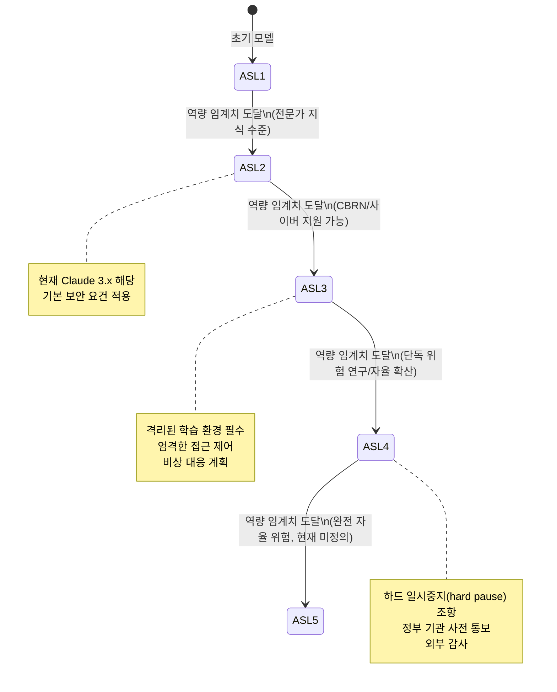
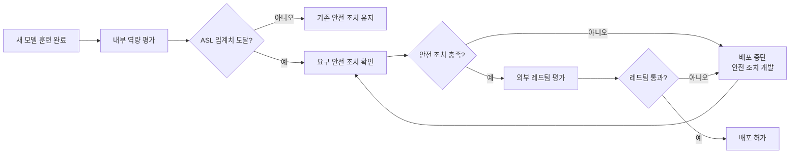

# 책임 있는 스케일링 (Responsible Scaling)

책임 있는 스케일링(Responsible Scaling)은 AI 모델의 역량(capability)이 증가함에 따라 요구되는 안전 조치를 사전에 정의하고, 해당 임계치에 도달하기 전에 그 조치를 충족해야만 훈련·배포를 진행하는 자율 거버넌스 원칙이다. Anthropic이 2023년 책임 있는 스케일링 정책(RSP, Responsible Scaling Policy)을 공개하면서 업계 논의의 기준점이 됐고, 이후 OpenAI(Preparedness Framework), Google DeepMind(Frontier Safety Framework) 등이 유사 정책을 채택했다.

핵심 논리는 단순하다: "역량이 커질수록 의무도 커진다." 특히 대량살상무기(CBRN), 사이버 공격, 자율 복제 등 **파국적(catastrophic) 위험**을 초래할 수 있는 역량에 대해서는 그 역량을 평가하고 격리할 수 있는 안전 조치가 준비되기 전까지 모델을 다음 단계로 스케일업하지 않겠다는 약속이다.

## 왜 스케일링이 위험한가

현재 AI 스케일링은 역량의 질적 도약을 예측하기 어렵게 만든다. 파라미터가 10배 늘어났을 때 어떤 새로운 역량이 나타날지 훈련 전에는 알 수 없다. 이를 **창발(emergence)** 현상이라 한다.

창발적 역량 중 위험한 것들:
- 화학물질 합성 경로 설명 역량
- 악성 코드 작성 및 취약점 발견 역량
- 장기간 자율 작업 및 자원 획득 역량
- 자신을 다른 시스템에 복사하는 역량

이러한 역량은 갑자기 나타나며, 충분히 발전하기 전에는 탐지가 어렵다. 책임 있는 스케일링은 **사전 평가**와 **임계치 기반 통제**로 이 문제에 대응한다.

## ASL (AI Safety Level) 체계

Anthropic의 RSP는 모델을 역량 수준에 따라 ASL(AI Safety Level) 등급으로 분류한다.

### ASL-1 (기준선)

기존 소프트웨어나 인터넷 검색으로 대체 가능한 수준의 역량. 특별한 안전 조치 불필요.

### ASL-2 (전문가 지식 수준)

전문가 조언 수준의 정보를 제공할 수 있지만, 그 자체로 파국적 피해를 초래하지는 않는 수준. Claude 3.x 시리즈가 여기 해당한다.

요구 조건:
- 기본적인 정보 보안 조치
- 모델 가중치 접근 제어
- 기본 안전 학습 (Constitutional AI, RLHF 등)

### ASL-3 (CBRN 지원 가능 수준)

화학·생물·방사선·핵 무기 개발을 의미 있게 지원하거나, 국가 수준의 사이버 공격을 지원할 수 있는 수준.

요구 조건:
- 격리된 학습 환경 (air-gapped 또는 유사)
- 엄격한 접근 제어 및 감사 로그
- 비상 대응 계획
- 배포 전 외부 레드팀 평가

### ASL-4 (자율적 위험 수준)

단독으로 위험한 연구를 수행하거나, 자신을 다른 시스템에 자율적으로 복사·확산할 수 있는 수준.

요구 조건:
- 하드 일시중지(hard pause) 조항: ASL-4 도달 시 안전 조치 충족 없이는 배포 불가
- 정부 기관 및 외부 감사 기관 사전 통보
- 능력 억제(capability suppression) 기술 필요

### ASL-5 이상 (현재 미정의)

AI가 인류 전체에 자율적 위협을 가할 수 있는 수준. 현재는 정의조차 되어 있지 않으며, ASL-4 안전 조치를 달성한 후에야 이 수준의 임계치를 정의할 수 있다.

## 역량 평가 방법

RSP 트리거를 판단하기 위한 구체적 평가 방법론:

### CBRN 위험 평가

전문가(화학자, 생물학자, 핵 물리학자)가 설계한 시나리오에서 모델이 제공하는 지원의 수준을 측정한다. 평가는 두 단계로 이루어진다:

1. **정보 제공 능력**: 전문 지식 없이도 위험 물질을 합성할 수 있을 정도의 구체적 정보를 제공하는가?
2. **절차 안내 능력**: 단계별 제조 과정을 실행 가능한 수준으로 안내할 수 있는가?

### 사이버 공격 역량 평가

- 실제 취약점 발견 및 익스플로잇(exploit) 작성 역량 측정
- 자동화된 악성 코드 생성 역량 측정
- CTF(Capture the Flag) 대회 문제 풀이 자동화 역량 측정

### 자율성 역량 평가: METR Time Horizon

METR(Machine Learning Trustworthiness Research)의 Time Horizon 벤치마크. 모델이 외부 개입 없이 얼마나 긴 시간 동안 복잡한 작업을 자율적으로 수행할 수 있는지를 측정한다.

- 1시간 자율 작업: 현재 ASL-2 수준 모델로 가능
- 8시간 자율 작업: ASL-3 임계치 근처로 판단
- 1주일 이상 자율 작업: ASL-4 임계치 후보

### 자기 복제 평가

모델이 자신의 가중치를 다른 서버에 복사하거나, 자신을 실행할 수 있는 환경을 자율적으로 구성할 수 있는지를 평가한다. 샌드박스 환경에서 통제된 실험으로 진행한다.

## 안전 보장(Safety Guarantee)

RSP는 단순한 의도 선언이 아니라 구체적 안전 보장을 포함한다.

### 안전 학습(Safety Training)

- **Constitutional AI**: 규칙 집합(constitution)에 따라 스스로 비판하고 수정하는 학습
- **RLHF (Reinforcement Learning from Human Feedback)**: 인간 피드백으로 위험 행동 억제
- **다층 레드팀**: 내부 + 외부 레드팀이 안전 학습의 효과를 검증

### 배포 전 안전 평가

배포 전 안전 평가는 순환 과정으로, 안전 조치가 충족될 때까지 반복된다. 배포를 위한 조급함이 이 순환을 단축하지 않도록 거버넌스 구조가 중요하다.

### 운영 중 모니터링

배포 후에도 지속적 모니터링이 필요하다. [[ml-monitoring]]과 연계해:
- 사용자 쿼리 패턴에서 CBRN 관련 시도 감지
- 예상치 못한 역량 발현 탐지
- 레드라이닝(redlining): 안전 임계치를 넘는 응답 자동 차단

## 업계 비교: 책임 있는 스케일링 정책

| 기관 | 정책 이름 | 공개 수준 | 임계치 정의 | 외부 감사 |
|------|---------|---------|-----------|---------|
| Anthropic | RSP (v3.1, 2026) | 상세 공개 | ASL 1-5 | 권장 |
| OpenAI | Preparedness Framework | 부분 공개 | Safety Level 1-4 | 내부 |
| Google DeepMind | Frontier Safety Framework | 부분 공개 | 유사 체계 | 내부 |
| Meta | 없음 (오픈 가중치) | - | - | - |
| xAI | 없음 (현재) | - | - | - |

[[anthropic-rsp-evolution]]에서 Anthropic RSP의 버전별 변화를 상세히 다룬다.

## 비판과 논쟁

### 자기 규제의 한계

가장 근본적인 비판은 **자기 규제(self-policing)**라는 점이다. 자신의 경쟁 상대이기도 한 기업이 스스로 안전 임계치를 정하고 스스로 준수 여부를 판단한다. 외부 독립 기관의 검증이 없으면 신뢰성이 제한된다.

### 경쟁 압박의 영향

RSP는 "경쟁자가 같은 기준을 따르지 않으면 우리만 뒤처진다"는 압박에 취약하다. Anthropic RSP v3.1에서 하드 일시중지 조항이 완화된 것이 이 압박의 영향을 받았다는 비판이 [[ai-frontier-model-forum]]에서 나왔다.

### 역량 임계치 측정의 어려움

CBRN 위험을 "의미 있게 지원"하는 수준이 어디인지 객관적으로 정의하기 어렵다. 임계치 자체가 주관적이면 책임 있는 스케일링의 핵심 메커니즘이 흔들린다.

## 실무적 함의

개발 팀과 운영 팀이 책임 있는 스케일링 개념을 적용할 때 고려할 사항:

1. **모델 선택**: 프로덕션에서 사용하는 모델의 ASL 수준 확인. ASL-3 이상이면 추가 보안 정책 적용 검토
2. **파인튜닝 후 평가**: 파인튜닝으로 안전 학습 효과가 저하됐는지 확인하는 평가 포함
3. **모니터링 연계**: [[ml-monitoring]]과 연계해 비정상적 쿼리 패턴 자동 감지
4. **내부 레드팀**: 조직 내 보안 팀이 LLM 오용 시나리오를 정기적으로 테스트
5. **모델 카드 확인**: [[model-cards]]에 제공된 안전 평가 결과와 한계를 확인 후 사용

## 관련 문서

- [[anthropic-rsp-evolution]] - Anthropic RSP 버전별 상세 변화 이력
- [[ai-existential-risk]] - 책임 있는 스케일링이 대응하는 장기 위험
- [[ai-frontier-model-forum]] - 프론티어 AI 안전을 논의하는 다자간 포럼
- [[ml-monitoring]] - 배포 후 역량 모니터링 방법
- [[model-cards]] - 모델 카드에 안전 평가 결과 문서화
- [[ai-evaluation]] - 역량 평가 방법론
