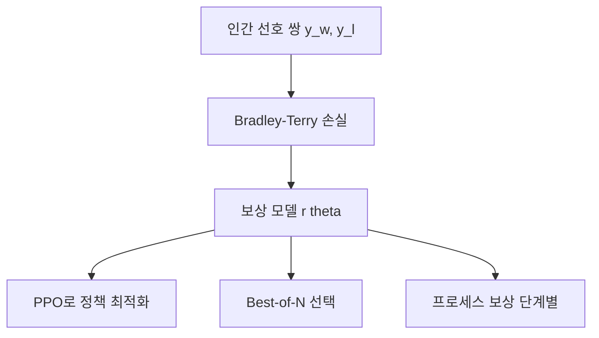

# 보상 모델 이론

[[rlhf-pipeline|RLHF]]에서 인간 선호도 데이터를 학습하여 응답 품질을 점수화하는 **보상 모델(Reward Model)**의 이론적 기반. Bradley-Terry 모델을 핵심으로 하며, [[reward-hacking-overoptimization|보상 해킹]] 문제와 깊이 연결된다.

## Bradley-Terry 모델

두 응답 $y_w$(선호)와 $y_l$(비선호) 간 선호 확률:

$$P(y_w \succ y_l) = \sigma(r(x, y_w) - r(x, y_l))$$

여기서 $r(x, y)$는 보상 모델의 출력, $\sigma$는 시그모이드. 이 공식이 [[direct-preference-optimization|DPO]]의 출발점이기도 하다.

## 보상 모델 유형

| 유형 | 평가 대상 | 대표 |
|------|----------|------|
| **ORM** (Outcome RM) | 최종 답변 전체 | 표준 RLHF RM |
| **PRM** (Process RM) | 추론 각 단계 | [[process-reward-model-detail|PRM]] |
| **GRM** (Generative RM) | 텍스트 비평 생성 | [[generative-reward-model|GRM]] |

## 핵심 이슈: 보상 해킹

보상 모델은 인간 선호의 **근사**일 뿐이다. 정책이 보상을 과도하게 최적화하면 보상 모델의 약점을 악용하는 [[goodharts-law-ml|굿하트의 법칙]]이 발동한다:

- 장황한 응답이 높은 점수를 받으면 -> 불필요하게 긴 답변 생성
- 형식적 구조가 높은 점수를 받으면 -> 내용 무관하게 구조만 갖춤

## 관련 문서
- [[process-supervision-vs-outcome]] -- 프로세스 감독 vs 결과 감독 (PRM vs ORM)

- [[reward-model-training]] -- 보상 모델 학습
- [[rlhf-pipeline]] -- RLHF 파이프라인
- [[process-reward-model-detail]] -- PRM 상세
- [[goodharts-law-ml]] -- 굿하트의 법칙
- [[direct-preference-optimization]] -- DPO
