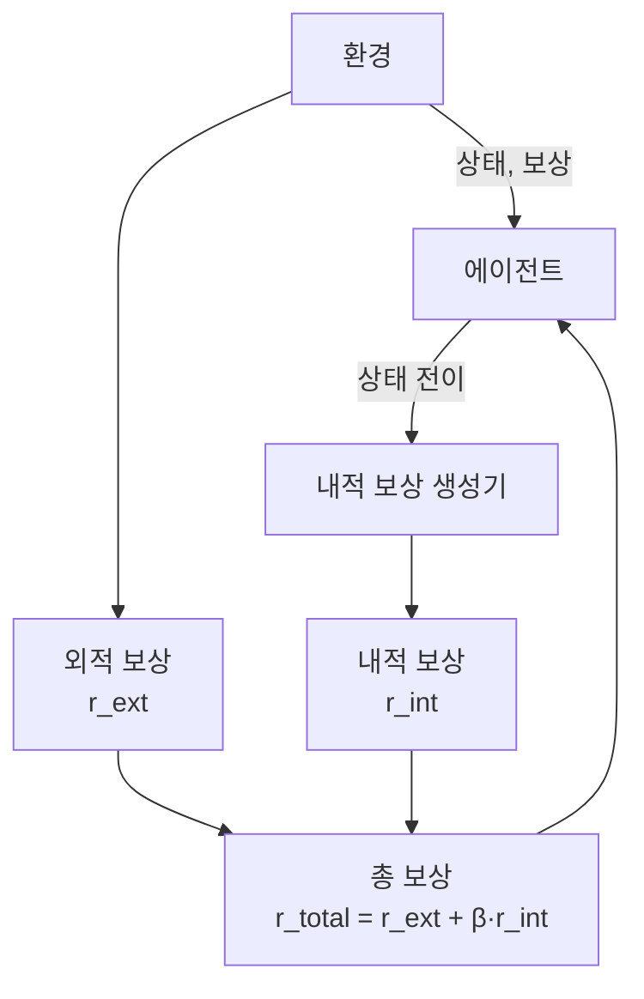
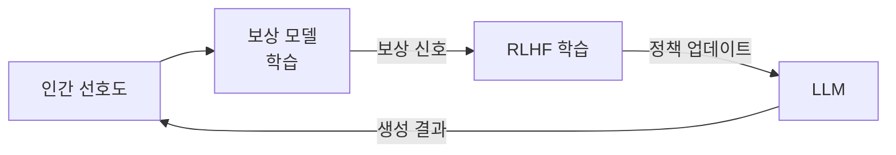

# 보상 형성과 탐색 (Reward Shaping & Exploration)

강화학습에서 **보상 형성(reward shaping)**은 에이전트가 환경으로부터 받는 보상 신호를 설계하거나 보강하는 기술이다. **탐색(exploration)**은 에이전트가 아직 방문하지 않은 상태를 체계적으로 탐색하도록 동기부여하는 메커니즘이다. 두 개념은 밀접하게 연관되어 있으며, 특히 **희소 보상(sparse reward)** 환경에서 학습을 가능하게 하는 핵심 기술이다.

## 보상 형성의 필요성

희소 보상 문제의 예: 체스에서 승리만이 보상(+1)이고, 모든 중간 행동의 보상은 0이다. 이 경우:

- 에이전트가 수백만 번 무작위 탐색해도 첫 승리를 거두기 매우 어려움
- 학습 신호(보상)가 거의 없어 Q값이 의미 있게 업데이트되지 않음
- 결국 학습이 거의 불가능한 수준으로 느려짐

보상 형성은 이 문제를 해결하기 위해 **추가적인 중간 보상(potential-based shaping)**이나 **내적 동기(intrinsic motivation)** 신호를 도입한다.

## 포텐셜 기반 보상 형성 (Potential-Based Shaping)

Andrew Ng 등이 제안한 이론적으로 안전한 보상 형성 방법:

$$F(s, a, s') = \gamma \Phi(s') - \Phi(s)$$

여기서 $\Phi: S \to \mathbb{R}$는 상태의 "좋음"을 나타내는 포텐셜 함수다. 이 형태의 보상을 추가해도 **최적 정책이 변하지 않는다**는 것이 이론적으로 보장된다.

포텐셜 함수 예시:
- 목표까지의 거리의 음수 (가까울수록 높은 포텐셜)
- 도달한 체크포인트 수
- 작업 완료 하위 단계 수

## 내적 동기 (Intrinsic Motivation)

내적 동기는 환경으로부터 받는 외적 보상(extrinsic reward) 외에, **에이전트 내부에서 생성되는 탐색 보너스**를 추가한다:

$$r_t^{\text{total}} = r_t^{\text{ext}} + \beta \cdot r_t^{\text{int}}$$

$r_t^{\text{int}}$는 다양한 방식으로 정의된다.



### 호기심 기반 탐색 (Curiosity-Driven Exploration)

Pathak 등이 2017년 발표한 ICM(Intrinsic Curiosity Module)은 가장 유명한 호기심 기반 방법이다:

- **순방향 모델(forward model)**: 현재 상태와 행동에서 다음 상태 예측
- **역방향 모델(inverse model)**: 두 연속 상태에서 행동 추론 (관련 없는 특징 필터링)
- **내적 보상**: 순방향 모델의 예측 오류 크기

$$r_t^{\text{int}} = \frac{\eta}{2} \| \hat{s}_{t+1} - s_{t+1} \|^2$$

예측이 틀릴수록(= 아직 모르는 상태) 높은 내적 보상을 받아 탐색이 유도된다.

### RND (Random Network Distillation)

Burda 등이 2018년 발표한 OpenAI의 RND는 더 단순하고 안정적인 방법이다:

```mermaid
flowchart LR
    State[상태 s_t]
    Fixed["고정 랜덤 네트워크\n(target network)"]
    Trained["학습 가능 예측 네트워크\n(predictor)"]
    State --> Fixed
    State --> Trained
    Fixed -->|임베딩 f(s)| Diff["차이 계산"]
    Trained -->|임베딩 ĝ(s)| Diff
    Diff -->|예측 오류 크기| IntR["내적 보상 r_int"]
```

핵심 아이디어:
1. **고정 랜덤 네트워크(target)**: 상태를 임의의 임베딩으로 변환, 학습하지 않음
2. **학습 가능 예측 네트워크(predictor)**: target의 출력을 예측하도록 학습
3. **내적 보상**: 두 네트워크 출력 차이 (자주 방문한 상태는 예측 오류가 작아짐)

RND의 장점:
- 순방향 모델 불필요 → 구현 단순
- 비정상적(non-stationary) 환경에서도 안정적
- Montezuma's Revenge 같은 극히 희소한 보상 게임에서 당시 최고 성능

### Count-Based 탐색

방문 횟수를 직접 세는 방법:

$$r_t^{\text{int}} = \frac{1}{\sqrt{N(s_t)}}$$

이산(discrete) 상태 공간에서는 정확히 세고, 연속 공간에서는 의사 카운트(pseudo-count) 또는 해시 기반 근사를 사용한다.

## 탐색-활용 트레이드오프 (Exploration-Exploitation Tradeoff)

모든 탐색 방법은 근본적으로 이 트레이드오프를 다룬다:

| 전략 | 설명 | [[q-learning-dqn]] 적용 |
|------|------|------------------------|
| $\epsilon$-greedy | 확률 $\epsilon$으로 무작위 행동 | 가장 단순, 폭넓게 사용 |
| Boltzmann/Softmax | Q값에 비례한 확률 행동 선택 | 온도 파라미터로 조절 |
| UCB (Upper Confidence Bound) | 불확실성 높은 행동 우선 탐색 | 밴딧 문제 기반 |
| Thompson Sampling | 사후 분포에서 샘플링 | 베이지안 탐색 |
| 내적 보상 (ICM/RND) | 신기함에 보너스 부여 | 딥RL에서 강력 |

## [[reward-model-theory]]와의 관계

LLM 정렬에서의 보상 형성:

- RLHF(인간 피드백 강화학습)에서 [[reward-model-theory]]가 정의하는 보상 신호는 일종의 외적 보상
- 보상 해킹(reward hacking): 에이전트가 보상 함수의 허점을 이용해 의도치 않은 행동 최적화
- 보상 형성 원칙이 LLM 보상 모델 설계에도 적용 가능



## 실무 권장사항

- **희소 보상 환경**: ICM 또는 RND 내적 보상 추가를 먼저 시도
- **연속 제어 로봇**: 포텐셜 기반 보상 형성(목표 거리 기반)이 안정적
- **LLM 정렬**: 보상 해킹 방지를 위한 KL 페널티 추가 (PPO-KL)
- **과도한 탐색 방지**: 내적 보상 계수 $\beta$를 점진적으로 감소(annealing)

## 관련 문서

- [[q-learning-dqn]] - 탐색 전략이 직접 적용되는 Q-learning 알고리즘
- [[reward-model-theory]] - LLM 정렬에서의 보상 설계와 연계
- [[hierarchical-rl]] - 서브골을 통한 내적 동기 생성의 계층적 접근
- [[dreamer-world-model]] - 세계 모델 내 상상 기반 탐색과의 연계
- [[conservative-q-learning-cql]] - 오프라인 RL에서 탐색 없이 학습하는 대안적 접근
