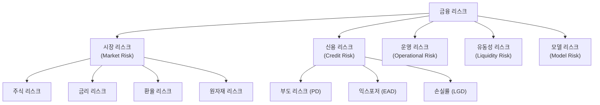
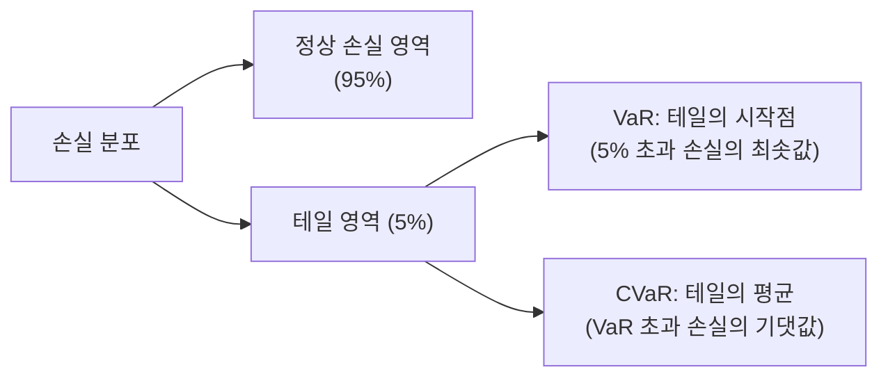
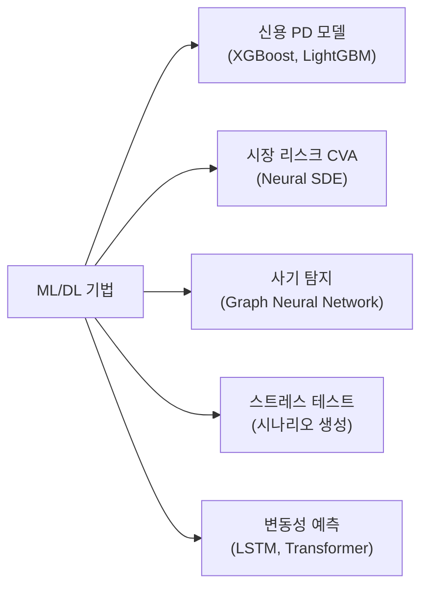

# 리스크 모델링 (Risk Modeling)

리스크 모델링(Risk Modeling)은 금융 자산, 포트폴리오, 기업, 또는 시스템이 직면하는 불확실한 손실 가능성을 수량화하고 예측하는 방법론의 총칭이다. 전통적인 통계·계량 모델에서 출발해 최근에는 머신러닝과 딥러닝이 접목되며 새로운 패러다임이 형성되고 있다. 리스크 모델링은 [[ai-portfolio-management]], [[ai-credit-scoring]], [[time-series-forecasting]] 등 다양한 AI 금융 애플리케이션의 핵심 기반이다.

## 왜 중요한가

- **규제 요건**: 바젤 III/IV, Solvency II 등 글로벌 금융 규제는 리스크 수량화를 명시적으로 요구
- **자본 배분**: 은행·보험사·자산운용사가 손실 대비 충분한 자본을 유지하려면 리스크를 측정해야 함
- **의사결정**: 투자, 대출 승인, 파생상품 가격 결정 등 모든 금융 의사결정의 근거
- **AI 시대**: 전통 통계 모델이 포착 못하는 비선형 패턴을 ML이 발견 가능

## 리스크 유형 분류



리스크는 크게 **시장**, **신용**, **운영** 세 카테고리로 분류되며, 각각 측정 방법론이 다르다.

## 핵심 리스크 지표

### VaR (Value at Risk, 위험가치)

VaR은 특정 신뢰수준(보통 95%, 99%)에서 일정 기간 동안 발생할 수 있는 **최대 손실액**을 나타낸다.

$$\text{VaR}_\alpha = -\inf\{x \in \mathbb{R} : P(L > x) \leq 1 - \alpha\}$$

- **신뢰수준 95%의 1일 VaR = 1억원**: 정상적인 시장 조건에서 하루 손실이 1억원을 초과할 확률이 5%
- **장점**: 직관적이고 단일 숫자로 요약 가능
- **단점**: 테일 리스크(tail risk)를 과소평가, 정합성(coherence) 불만족

### CVaR (Conditional Value at Risk, 조건부 위험가치)

CVaR은 VaR을 초과하는 손실이 발생했을 때의 **기대 손실액**이다. Expected Shortfall(ES) 또는 Tail VaR이라고도 한다.

$$\text{CVaR}_\alpha = E[L \mid L > \text{VaR}_\alpha]$$

- VaR보다 정합적(coherent) 리스크 척도
- 바젤 IV에서 VaR을 대체해 ES 사용 의무화 (2024년)
- 극단적 손실 시나리오의 평균을 반영

### VaR vs CVaR 시각화



### 기타 핵심 지표

| 지표 | 설명 | 수식/정의 |
|------|------|----------|
| Sharpe Ratio | 위험 대비 초과 수익 | $(R_p - R_f) / \sigma_p$ |
| Maximum Drawdown | 최고점 대비 최대 하락률 | $\max_{t \leq s}(V_t - V_s) / V_t$ |
| Beta ($\beta$) | 시장 대비 민감도 | $\text{Cov}(R_i, R_m) / \text{Var}(R_m)$ |
| PD | 부도 확률 (Probability of Default) | 로지스틱/생존 모형 |
| LGD | 부도 시 손실률 (Loss Given Default) | $1 - \text{회수율}$ |
| EAD | 부도 시 익스포저 (Exposure at Default) | 잔여 부채 금액 |

## 시장 리스크 모델링

### 역사적 시뮬레이션 (Historical Simulation)

과거 실제 수익률 분포를 사용해 VaR/CVaR을 계산하는 가장 단순한 방법.

```python
import numpy as np


def historical_var_cvar(returns: np.ndarray, confidence: float = 0.95) -> tuple[float, float]:
    """
    역사적 시뮬레이션 기반 VaR, CVaR 계산.

    Args:
        returns: 일별 수익률 배열 (음수 = 손실)
        confidence: 신뢰수준 (예: 0.95)

    Returns:
        (var, cvar) 손실 금액
    """
    losses = -returns  # 수익률을 손실로 전환
    var = np.percentile(losses, confidence * 100)
    cvar = losses[losses > var].mean()
    return float(var), float(cvar)
```

- **장점**: 분포 가정 불필요, 비선형 상관관계 반영
- **단점**: 과거가 미래를 대표한다고 가정, 데이터 부족 시 불안정

### 파라메트릭 VaR (정규분포 가정)

$$\text{VaR}_\alpha = \mu + z_\alpha \cdot \sigma$$

- $z_\alpha$: 신뢰수준에 해당하는 정규분포 z-점수 (95% → 1.645, 99% → 2.326)
- 빠르고 해석 가능하지만 **팻꼬리(fat tail)** 를 과소평가하는 심각한 문제

### 몬테카를로 시뮬레이션

```python
import numpy as np


def monte_carlo_var(
    current_value: float,
    mu: float,
    sigma: float,
    horizon: int = 1,
    n_simulations: int = 100_000,
    confidence: float = 0.95,
) -> tuple[float, float]:
    """GBM 기반 몬테카를로 VaR/CVaR."""
    dt = horizon / 252  # 연율화
    z = np.random.standard_normal(n_simulations)
    future_values = current_value * np.exp((mu - 0.5 * sigma**2) * dt + sigma * np.sqrt(dt) * z)
    losses = current_value - future_values
    var = np.percentile(losses, confidence * 100)
    cvar = losses[losses > var].mean()
    return float(var), float(cvar)
```

## 신용 리스크 모델링

신용 리스크는 차주(borrower)가 의무를 이행하지 못할 가능성이다. 핵심 모수는 **PD × LGD × EAD**의 곱이다.

$$\text{Expected Loss (EL)} = PD \times LGD \times EAD$$

### 전통적 신용 평가 모델

**Altman Z-Score (1968)**: 재무 비율 기반 부도 예측

$$Z = 1.2X_1 + 1.4X_2 + 3.3X_3 + 0.6X_4 + 1.0X_5$$

- $X_1$: 운전자본/총자산
- $X_2$: 이익잉여금/총자산
- $X_3$: 이자 전 이익/총자산
- $X_4$: 시가총액/총부채
- $X_5$: 매출액/총자산

Z > 2.99 → 안전, 1.81 ~ 2.99 → 회색지대, Z < 1.81 → 부도 위험

### ML 기반 신용 리스크

```python
from sklearn.ensemble import GradientBoostingClassifier
from sklearn.model_selection import cross_val_score
import numpy as np


def train_pd_model(X_train, y_train):
    """PD(부도 확률) 예측 모델 학습."""
    model = GradientBoostingClassifier(
        n_estimators=200,
        max_depth=4,
        learning_rate=0.05,
        subsample=0.8,
    )
    cv_scores = cross_val_score(model, X_train, y_train, cv=5, scoring="roc_auc")
    model.fit(X_train, y_train)
    return model, cv_scores.mean()
```

ML 모델은 전통 모델 대비 정확도가 높지만 **해석 가능성(explainability)** 이 낮아 규제 승인이 어려울 수 있다. SHAP 값 활용이 필수적이다.

## 운영 리스크 모델링

운영 리스크는 부적절한 내부 프로세스, 사람, 시스템 오류, 또는 외부 사건으로 인한 손실이다.

- **LDA (Loss Distribution Approach)**: 손실 빈도(Frequency)와 심각도(Severity) 분포를 별도로 추정한 뒤 합산
- **AMA (Advanced Measurement Approach)**: 내부 데이터 + 외부 데이터 + 시나리오 분석을 통합
- **머신러닝**: 사기 탐지, 사이버 위협 감지 등에 적용

## 머신러닝과 딥러닝 적용

### 적용 영역



### 주요 ML 기법

| 기법 | 적용 리스크 | 특징 |
|------|-----------|------|
| XGBoost/LightGBM | 신용 PD | 표형 데이터에 강력, SHAP 해석 가능 |
| LSTM/Transformer | 시장 리스크, 변동성 | 시계열 패턴 포착 |
| Graph Neural Network | 신용 전이 리스크, 사기 | 상호연결성 모델링 |
| VAE/GAN | 시나리오 생성 | 극단적 시나리오 합성 |
| Neural SDE | 파생상품 리스크 | 연속 시간 모델링 |

### 딥러닝 기반 변동성 모델

전통적인 GARCH 대비 LSTM 기반 변동성 예측:

```python
import torch
import torch.nn as nn


class VolatilityLSTM(nn.Module):
    """LSTM 기반 실현 변동성 예측 모델."""

    def __init__(self, input_size: int = 10, hidden_size: int = 64, num_layers: int = 2):
        super().__init__()
        self.lstm = nn.LSTM(
            input_size=input_size,
            hidden_size=hidden_size,
            num_layers=num_layers,
            batch_first=True,
            dropout=0.2,
        )
        self.fc = nn.Linear(hidden_size, 1)
        self.activation = nn.Softplus()  # 변동성은 양수여야 함

    def forward(self, x: torch.Tensor) -> torch.Tensor:
        lstm_out, _ = self.lstm(x)
        last_hidden = lstm_out[:, -1, :]
        return self.activation(self.fc(last_hidden))
```

## 스트레스 테스트 및 시나리오 분석

스트레스 테스트는 극단적 시나리오에서 포트폴리오 손실을 추정하는 기법으로, 바젤 III 이후 규제 요건이 됐다.

### 시나리오 유형

1. **역사적 시나리오**: 2008년 금융위기, 2020년 코로나 충격 등 과거 사건 재현
2. **가상 시나리오**: "금리가 200bps 상승하면?" 같은 가정적 충격
3. **역 스트레스 테스트**: 일정 손실이 발생하는 시나리오를 역으로 탐색

### LLM을 활용한 시나리오 생성

최근에는 LLM을 사용해 경제 내러티브 기반 스트레스 시나리오를 자동 생성하는 연구가 늘고 있다. LLM이 "지정학적 긴장 고조" 같은 텍스트 시나리오를 수치 충격으로 변환하는 역할을 수행한다.

## 규제 프레임워크

| 규제 | 핵심 요구사항 | 리스크 측정 방법 |
|------|-------------|----------------|
| 바젤 III | 최소 자본 요건, 레버리지 비율 | VaR → ES(CVaR) 전환 |
| 바젤 IV (2025-) | 표준화 접근법 강화 | SA, IMA 개정 |
| Solvency II | 보험사 자본 요건 | SCR (Solvency Capital Requirement) |
| FRTB | 시장 리스크 자본 개혁 | ES, NMRF 추가 |

## 한계와 주의점

- **모델 위험(Model Risk)**: 어떤 모델도 현실을 완벽히 반영하지 못함. 모델 검증(backtesting, benchmarking) 필수
- **팻꼬리 문제**: 정규분포 가정이 극단적 사건을 과소평가. 코페라(Copula), EVT(극가치이론) 활용
- **데이터 부족**: 신용 부도, 운영 손실 사건은 드물어 모델 학습 데이터 부족 문제
- **설명 가능성**: ML 모델의 규제 승인을 위해 SHAP, LIME 등 해석 기법 필수

## 관련 개념 링크

- [[ai-portfolio-management]]: 포트폴리오 최적화와 리스크 관리의 통합
- [[ai-credit-scoring]]: ML 기반 신용 점수 모델
- [[time-series-forecasting]]: 변동성, 수익률 시계열 예측

## 관련 문서

- [[ai-portfolio-management]]: 포트폴리오 단위 리스크 관리
- [[ai-credit-scoring]]: 신용 리스크의 ML 적용 심화
- [[time-series-forecasting]]: 금융 시계열과 변동성 예측 모델
